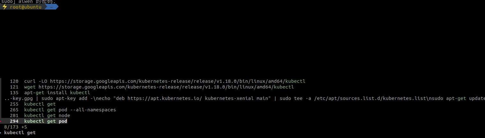

<!-- TOC -->

- [fzf 模糊匹配工具安装和使用](#fzf-模糊匹配工具安装和使用)
- [1. 背景](#1-背景)
- [2. 安装](#2-安装)
- [3. 使用](#3-使用)

<!-- /TOC -->
# fzf 模糊匹配工具安装和使用
# 1. 背景
ctrl+r 只能匹配到最近一行，希望找到能模糊匹配到多种的工具。fzf 可以满足我们要求。

# 2. 安装
oh my zsh的plugins文件夹中已经有了fzf文件夹，不过里面只有README和.zsh脚本，实际上这个fzf文件夹只是用来快速适配oh my zsh的，里面并没有fzf的源码。

安装过程如下:
* oh my zsh的plugins文件夹中已经有了fzf文件夹，不过里面只有README和.zsh脚本，实际上这个fzf文件夹只是用来快速适配oh my zsh的，里面并没有fzf的源码。
* 下载后将源码解压到任意目录，当然，可以最好直接放到oh my zsh 的fzf文件夹里
* install: ./fzf/install
* 在.zshrc脚本中加入如下内容（FZF_BASE即使步骤2的路径）
```
    FZF_BASE=/path/to/fzf/install/dir
	plugins=(
 	 ...
  	fzf
	)
```
* 重启zsh

# 3. 使用
Ctlr+R 就会匹配多行
