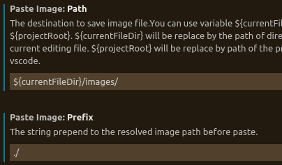

# default
* ctrl+shift+p run: pugin command
* envrioment: ubuntu
# 1. Install markdown pugin
* install Markdown Preview Enhanced

# 2. Use AutoGit automatic synchronize github  respositories

* install Auto-git(by:auto-git doc in vscode)
```
git init
git remote add origin <url>
git fetch origin
git pull origin master(must success)
git branch --set-upstream-to=origin/master
git config --global credential.helper cache
git config --global user.name "Your Full Name"
git config --global user.email "your@email.com"

Auto-Git: Version // Shows current installed version in a notification box
Auto-Git: Start // Starts the interval and routine
Auto-Git: Stop // Stops the interval and routine
Auto-Git: Restart // Reloads configuration + Stop + Start
```

# 2. Paste image
* apt-get install xclip
* install Paste image
* "ctrl+alt+v" paste image(tip:ctrl+shift+p->paste image)

## 2.1 设置Markdown存储images路径
```
    "pasteImage.path": "${currentFileDir}/images/",
    "pasteImage.forceUnixStyleSeparator": true,
    "pasteImage.prefix": "./",
    "pasteImage.insertPattern": "![${imageFileName}](${imageFilePath}${imageSyntaxSuffix}",
```
但是在Ubuntu中，没有发现setting json入口，因此本人只通过修改窗口中赋值对应的值。

file->preferences->settings->extensions->Paste Image



