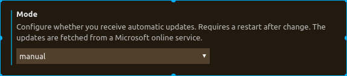

<!-- TOC -->

- [1. Install markdown pugin](#1-install-markdown-pugin)
- [2. Use AutoGit automatic synchronize github  respositories](#2-use-autogit-automatic-synchronize-github--respositories)
- [3. Paste image](#3-paste-image)
    - [3.1 设置Markdown存储images路径](#31-设置markdown存储images路径)
- [4. 自动保存](#4-自动保存)
- [5. 设置markdown目录](#5-设置markdown目录)
    - [5.1 设置vscode回车换行格式](#51-设置vscode回车换行格式)
    - [5.2 安装插件](#52-安装插件)

<!-- /TOC -->
# 1. Install markdown pugin
* install Markdown Preview Enhanced

# 2. Use AutoGit automatic synchronize github  respositories

* install Auto-git(by:auto-git doc in vscode)
```
git init
git remote add origin <url>
git fetch origin
git pull origin master(must success)
git branch --set-upstream-to=origin/master
git config --global credential.helper cache
git config --global user.name "Your Full Name"
git config --global user.email "your@email.com"

Auto-Git: Version // Shows current installed version in a notification box
Auto-Git: Start // Starts the interval and routine
Auto-Git: Stop // Stops the interval and routine
Auto-Git: Restart // Reloads configuration + Stop + Start
```

# 3. Paste image
* apt-get install xclip
* install Paste image
* "ctrl+alt+v" paste image(tip:ctrl+shift+p->paste image)

## 3.1 设置Markdown存储images路径
```
    "pasteImage.path": "${currentFileDir}/images/",
    "pasteImage.forceUnixStyleSeparator": true,
    "pasteImage.prefix": "./",
    "pasteImage.insertPattern": "


# 4. 自动保存
之前没有设置自动保存，笔记写多了之后就很容易忘记保存，因此还是添加上自动保存功能。

点击左下角设置->点击 settings->点击user的application->点击update做如下设置



# 5. 设置markdown目录
* 最开始在vscode顶部手动输入[toc]是能显示到目录的，但是push 到github网页后显示不了
## 5.1 设置vscode回车换行格式
* 设置vscode回车换行的格式，默认是auto格式，但是TOC插件是被不了
打开vscode settings 界面->选择user->输入EOL->设置成'\n'

## 5.2 安装插件
* 然后安装插件TOC
    * 点击执行安装插件
    * 然后右键点击生成TOC即可
    