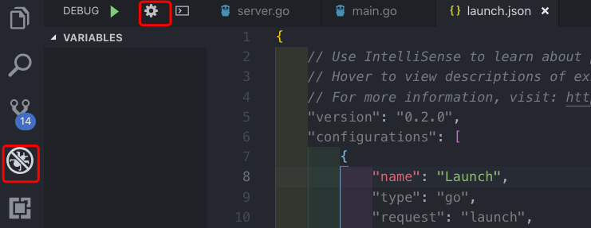

<!-- TOC -->

- [1. 背景](#1-背景)
- [2. 本地调试Controller过程](#2-本地调试controller过程)
    - [2.1 配置文件](#21-配置文件)
    - [2.2 调试](#22-调试)

<!-- /TOC -->
# 1. 背景
* 起源于本地调试k8s Controller代码。这样本地运行Controller，能作用到远程k8s集群

# 2. 本地调试Controller过程
## 2.1 配置文件



* 配置信息如下
    * env:相当于是path变量，这样在vscode中生效。尝试过在shell中设置path无效
    * args 是运行command中时添加的参数
```
{
    // Use IntelliSense to learn about possible attributes.
    // Hover to view descriptions of existing attributes.
    // For more information, visit: https://go.microsoft.com/fwlink/?linkid=830387
    "version": "0.2.0",
    "configurations": [
        {
            "name": "Launch",
            "type": "go",
            "request": "launch",
            "mode": "auto",
            "program": "${fileDirname}",
            "env": {"KUBECONFIG":"/Users/wanlei/.kube/config","KUBEFLOW_NAMESPACE":"kubeflow"},
            "args": ["--kubeconfig=/Users/wanlei/.kube/config","--enable-gang-scheduling=true","--alsologtostderr","-v=1"]
        }
    ]
}
```

## 2.2 调试
* 下断点
如图，下断点是在行号前面下断点，双击改行没用


* watch变量
关注某些变量的值
    * 输入变量的名称即可
