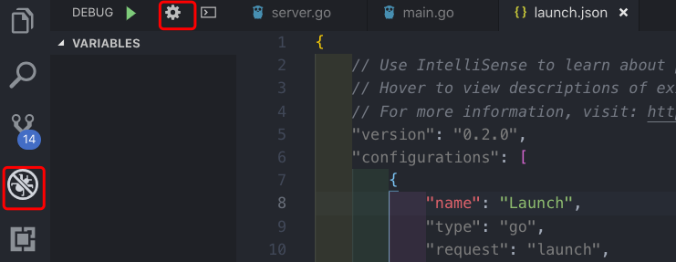

<!-- TOC -->

- [1. 背景](#1-背景)
- [2. 安装vscode并进行配置（Ubuntu）](#2-安装vscode并进行配置ubuntu)
    - [2.1 vscode setting 配置](#21-vscode-setting-配置)
    - [2.2 安装插件](#22-安装插件)
        - [2.2.1 vscode 安装插件支持](#221-vscode-安装插件支持)
        - [2.2.2 安装各种库](#222-安装各种库)
- [3. 本地调试Controller过程](#3-本地调试controller过程)
    - [3.1 配置文件](#31-配置文件)
    - [3.2 调试](#32-调试)

<!-- /TOC -->
# 1. 背景
* 起源于本地调试k8s Controller代码。这样本地运行Controller，能作用到远程k8s集群

# 2. 安装vscode并进行配置（Ubuntu）
* 前提是已经安装好go环境，并配置完毕goRoot和goPath
## 2.1 vscode setting 配置
* 工作区设置 setting.json (.vscode\settings.json)
```
{
    "workbench.colorTheme": "Visual Studio Dark",
    "files.autoSave": "onFocusChange",
    "go.buildOnSave": "off",
    "go.lintOnSave" :"off",
    "go.vetOnSave":"off",
    "go.buildTags": "",
    "go.buildFlags": [],
    "go.lintFlags": [],
    "go.vetFlags": [],
    "go.coverOnSave": false,
    "go.useCodeSnippetsOnFunctionSuggest":true,
    "go.formatTool": "goreturns",
    "go.goroot": "/usr/local/go",
    "go.gopath": "/home/wanlei/go",
    "go.gocodeAutoBuild": false
}
```

## 2.2 安装插件
### 2.2.1 vscode 安装插件支持
* 商店搜索golang
* 安装第一个


### 2.2.2 安装各种库
* 这些库默认安装路径需要外网才能安装，如果没有外网只能通过github上下载
    * 在src下创建文件夹golang.org/x/
        ```
        git clone https://github.com/golang/tools.git
        git clone https://github.com/golang/lint.git
        ```
    * 退回src下
        ```
        go install golang.org/x/tools/cmd/goimports
        ```
* "golang.org/x" 下的包在 "github.com/golang"有镜像库。
    所以我们可以从 github.com 上将对应包下载下来放到对应的目录即可。


# 3. 本地调试Controller过程
## 3.1 配置文件



* 配置信息如下
    * env:相当于是path变量，这样在vscode中生效。尝试过在shell中设置path无效
    * args 是运行command中时添加的参数
```
{
    // Use IntelliSense to learn about possible attributes.
    // Hover to view descriptions of existing attributes.
    // For more information, visit: https://go.microsoft.com/fwlink/?linkid=830387
    "version": "0.2.0",
    "configurations": [
        {
            "name": "Launch",
            "type": "go",
            "request": "launch",
            "mode": "auto",
            "program": "${fileDirname}",
            "env": {"KUBECONFIG":"/Users/wanlei/.kube/config","KUBEFLOW_NAMESPACE":"kubeflow"},
            "args": ["--kubeconfig=/Users/wanlei/.kube/config","--enable-gang-scheduling=true","--alsologtostderr","-v=1"]
        }
    ]
}
```

## 3.2 调试
* 下断点
如图，下断点是在行号前面下断点，双击改行没用


* watch变量
关注某些变量的值
    * 输入变量的名称即可
