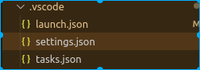

# 1. 安装插件

vscode搜索C/C++,第一个安装

# 2. 设置配置文件
在本工程下.vscode目录下有三个配置文件，修改launch.json,tasks.json

* launch.json
```
{
    // Use IntelliSense to learn about possible attributes.
    // Hover to view descriptions of existing attributes.
    // For more information, visit: https://go.microsoft.com/fwlink/?linkid=830387
    "version": "0.2.0",
    "configurations": [


        {
            "name": "(gdb) Launch",
            "type": "cppdbg",
            "request": "launch",
            "program": "${fileDirname}/${fileBasenameNoExtension}.out",//changed
            "args": [],
            "stopAtEntry": false,
            "cwd": "${workspaceFolder}",
            "environment": [],
            "externalConsole": false,//changed
            "MIMode": "gdb",
            "preLaunchTask": "build",//changed
            // "setupCommands": [
            //     {
            //         "description": "Enable pretty-printing for gdb",
            //         "text": "-enable-pretty-printing",
            //         "ignoreFailures": true
            //     }
            // ]
        }
    ]
}
```
* tasks.json
```
{
    // See https://go.microsoft.com/fwlink/?LinkId=733558 
    // for the documentation about the tasks.json format
    "version": "2.0.0",
    "tasks": [
        {
            "type": "shell",
            "label": "build",
            "command": "g++",
            "args": [
                "-g",
                "${file}",
                "-o",
                "${fileDirname}/${fileBasenameNoExtension}.out"
            ],
            // "options": {
            //     "cwd": "/usr/bin"
            // },
            // "problemMatcher": [
            //     "$gcc"
            // ]
        },
        
    ]
}
```