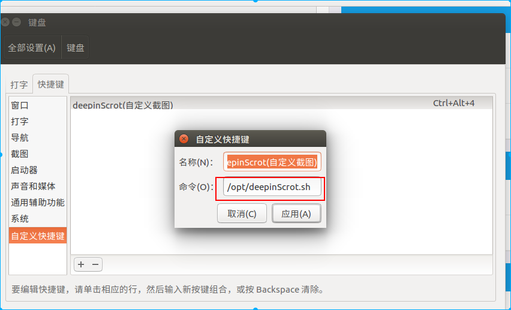

# 1. 背景
想在Ubuntu中使用类似QQ剪切工具

# 2. 解决
## 2.1 使用系统截图（后来发现很难用，没有标红功能）
直接使用系统的剪切工具就很方便，并且可以设置成自己熟悉的快捷键。

系统设置->键盘->快捷键->截图
* 设置结果如下


## 2.2 使用deepinScrot（QQ类似）
* 最开始使用的是flameshot，但是Ubuntu16安装失败，不推荐
* DeepinScrot 2012年工具了，很多教程是使用deb包安装，但是链接已经失效了，这里我们使用的是源码安装，并设置快捷键。

### 2.2.1 下载源码并运行
* https://github.com/linuxdeepin-packages/deepin-scrot/releases
* First generate mo files.Swith `deepin-scrot` directory to execute updateTranslate.sh like below:
  ./updateTranslate.sh
* sudo apt-get install python-xlib
* sudo apt-get install python-gtk2
* cd ./src && ./deepinScrot.py

以上运行成功
### 2.2.2 设置快捷键 
由于直接运行 ./deepin-scrot/src/deepinScrot.py 会报错（IOError: [Errno 2] No translation file found for domain: 'deepin-scrot'），网上balabala也没找到什么原因，所以只能先生成一个脚本文件

* sudo vi /opt/deepinSctot.sh
```
    cd /home/wusong/下载/deepin-scrot/src && ./deepinScrot.py
```

* 和之前设置快捷键方式一致
