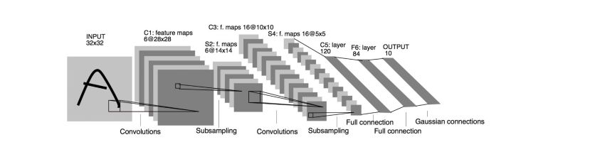

## 全连接简介

## 一、目的
为什么我们需要全连接？
我们需要解决的问题是如何将3x3x5的输出，转换成1x4096的形式？

## 二、全连接结构

很简单,可以理解为在中间做了一个卷积

从上图我们可以看出，我们用一个3x3x5的filter 去卷积激活函数的输出，得到的结果就是一个fully connected layer 的一个神经元的输出，这个输出就是一个值

因为我们有4096个神经元

我们实际就是用一个3x3x5x4096的卷积层去卷积激活函数的输出

## 三、为什么要这样设计

我们可以看到，全连接层本质是就是卷积，那么这样子为什么要叫全连接呢？我们是从功能的角度区分的。

功能：把分布式特征representation映射到样本标记空间。就是它把特征representation整合到一起，输出为一个值。这样做,有一个什么好处？就是大大减少特征位置对分类带来的影响。
来，让我来举个简单的例子。

从上图我们可以看出，猫在不同的位置，输出的feature值相同，但是位置不同，对于电脑来说，特征值相同，但是特征值位置不同，那分类结果也可能不一样，而这时全连接层filter的作用就相当于，喵在哪我不管，我只要喵，于是我让filter去把这个喵找到，实际就是把feature map 整合成一个值，鲁棒性有大大增强了有没有。

## 为什么全连接层一般是两层及两层以上

主要是解决非线性拟合。

泰勒公式都知道吧

意思就是用多项式函数去拟合光滑函数

我们这里的全连接层中一层的一个神经元就可以看成一个多项式

我们用许多神经元去拟合数据分布，但是只用一层fully connected layer 有时候没法解决非线性问题，而如果有两层或以上fully connected layer就可以很好地解决非线性问题了。
我们都知道，全连接层之前的作用是提取特征，全理解层的作用是分类。
我们现在的任务是去区别一图片是不是猫。

假设这个神经网络模型已经训练完了，全连接层已经知道。

当我们得到以上特征，我就可以判断这个东东是猫了，因为全连接层的作用主要就是实现分类（Classification），从下图，我们可以看出。

红色的神经元表示这个特征被找到了（激活了），同一层的其他神经元，要么猫的特征不明显，要么没找到，当我们把这些找到的特征组合在一起，发现最符合要求的是猫，ok，我认为这是猫了。
那我们现在往前走一层，那们现在要对子特征分类，也就是对猫头，猫尾巴，猫腿等进行分类，比如我们现在要把猫头找出来。

猫头有这么些个特征，于是我们下一步的任务，就是把猫头的这么些子特征找到，比如眼睛啊，耳朵啊。

道理和区别猫一样，当我们找到这些特征，神经元就被激活了（上图红色圆圈），这细节特征又是怎么来的？就是从前面的卷积层，下采样层来的。

全连接层参数特多（可占整个网络参数80%左右），近期一些性能优异的网络模型如ResNet和GoogLeNet等均用全局平均池化（global average pooling，GAP）取代全连接层来融合学到的深度特征，需要指出的是，用GAP替代FC的网络通常有较好的预测性能，于是还出现https://arxiv.org/abs/1411.4038

