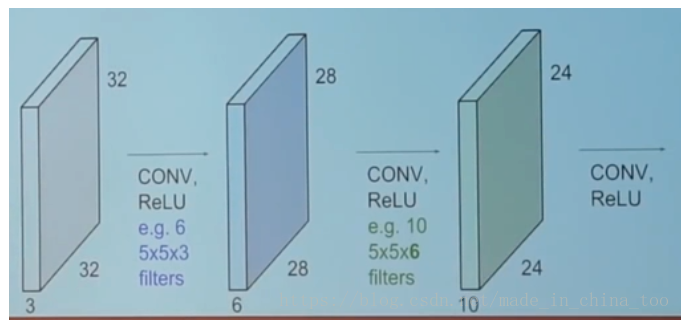

## CNN 网络中的参数设置

## 一、卷积操作的参数设定

如上图所示，假设我们有32*32的RBG图片，也就是神经网络的 input 是 32*32*3，表示输入是一个有3个图层的32*32的图片。 
  假设现在有一个 5*5的 filter处理一个32*32的图层，那么处理后的输出就是一个28*28的图层。现在总共有3个图层，filter需要覆盖这三个图层，因此对于32*32*3的input，filter需要设置为 5*5*3，表示是一个深度为3，长和宽都为5的卷积核。 
  需要注意的是，使用1个5*5*3的filter处理1个32*32*3的input，输出还是 28*28*1的大小（表示大小为28*28，深度为1的图层）。 
  在实验中，一个filter对应用来提取 1 种特征，因此一般需要设置多个卷积核提取多个特征。比如上图的第一个CONV层 就是 6 个 5*5*3 的卷积核 ，用于提取 6 种特征。上文已经说过，使用1个filter，则output是一个深度为1的图层。那么这里使用6个filter，则output是一个深度为6的图层。 
  因此对应上图的第一个CONV层，Input是32*32*3，使用6个5*5*3的filter，output是 28*28*6。

note:上面卷积核的深度只和输入数据的通道一致。通道是由卷积核的个数决定的。