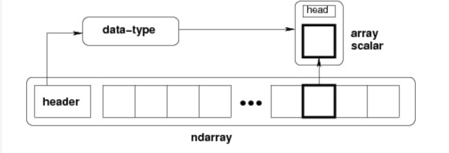

# 一、ndarray
## ndarray 简介

NumPy 最重要的一个特点是其 N 维数组对象 ndarray，它是一系列同类型数据的集合，以 0 下标为开始进行集合中元素的索引。
ndarray 结构如下



（1）一个指向数据（内存或内存映射文件中的一块数据）的指针。
（2）数据类型或 dtype，描述在数组中的固定大小值的格子。
（3）一个表示数组形状（shape）的元组，表示各维度大小的元组。
（4）一个跨度元组（stride），其中的整数指的是为了前进到当前维度下一个元素需要"跨过"的字节数。

## ndarray构造函数

```
numpy.array(object, dtype = None, copy = True, order = None, subok = False, ndmin = 0)
```


名称	描述
object	数组或嵌套的数列
dtype	数组元素的数据类型，可选
copy	对象是否需要复制，可选
order	创建数组的样式，C为行方向，F为列方向，A为任意方向（默认）
subok	默认返回一个与基类类型一致的数组
ndmin	指定生成数组的最小维度

eg:
```
# 多于一个维度  
import numpy as np 
a = np.array([[1,  2],  [3,  4]])  
print (a)
```
输出
```
[[1, 2] 
 [3, 4]]
```


# 二、numpy支持的数据类型

numpy 支持的数据类型比 Python 内置的类型要多很多，基本上可以和 C 语言的数据类型对应上，其中部分类型对应为 Python 内置的类型。下表列举了常用 NumPy 基本类型。

## 数值类型

名称			描述
bool_			布尔型数据类型（True 或者 False）
int_			默认的整数类型（类似于 C 语言中的 long，int32 或 int64）
intc			与 C 的 int 类型一样，一般是 int32 或 int 64
intp			用于索引的整数类型（类似于 C 的 ssize_t，一般情况下仍然是 int32 或 int64）
int8			字节（-128 to 127）
int16			整数（-32768 to 32767）
int32			整数（-2147483648 to 2147483647）
int64			整数（-9223372036854775808 to 9223372036854775807）
uint8			无符号整数（0 to 255）
uint16			无符号整数（0 to 65535）
uint32			无符号整数（0 to 4294967295）
uint64			无符号整数（0 to 18446744073709551615）
float_			float64 类型的简写
float16			半精度浮点数，包括：1 个符号位，5 个指数位，10 个尾数位
float32			单精度浮点数，包括：1 个符号位，8 个指数位，23 个尾数位
float64			双精度浮点数，包括：1 个符号位，11 个指数位，52 个尾数位
complex_		complex128 类型的简写，即 128 位复数
complex64		复数，表示双 32 位浮点数（实数部分和虚数部分）
complex128		复数，表示双 64 位浮点数（实数部分和虚数部分）