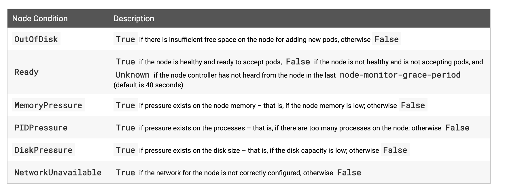
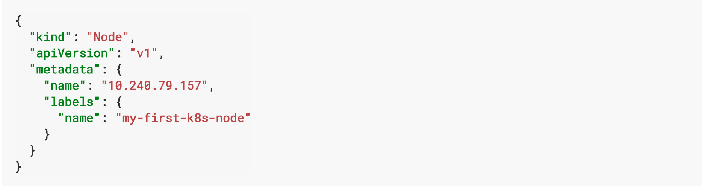
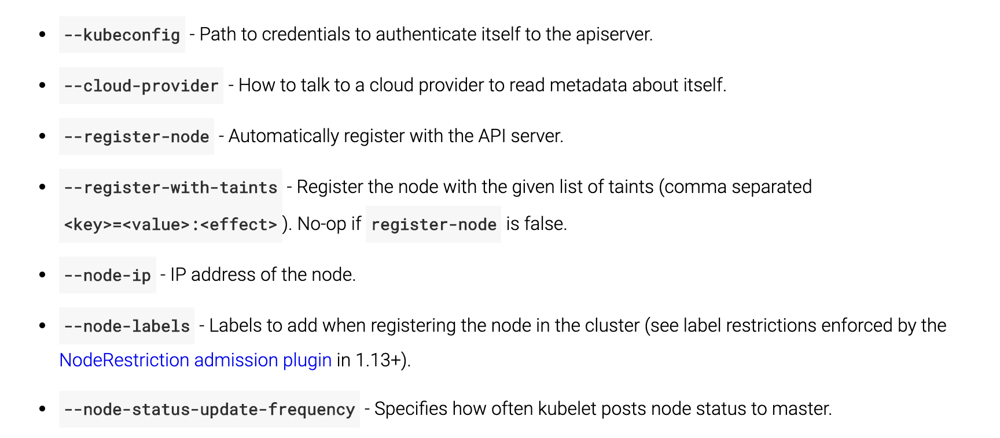

# 一、简介
Node 节点可以是VM虚拟节点或者真实物理节点（我们的k8s node是在OpenStack的虚拟节点上）

Node 节点包括container runtime（如docker deriver）, kubelet and kube-proxy

# 二、Node status
Node 状态信息包含Addresses，Condition，Capacity，Info


## Addresses

HostName：默认是node kernel提供，kubelet 可以通过--hostname-override参数覆盖
ExternalIP：外部IP
InternalIP：内部IP

## Condition
指标信息描述 正在运行的Node节点 信息

## Condition



## Capacity

描述Node节点上存在的 资源信息：CPU，存储，最大可被调度的pod数

## info
关于Node 节点常用信息：kernel version，k8s version（kubelet and kube-proxy version），docker version（if used），os  name。


# 三、Management

不像pod和service是由k8s系统创建。
Node 是由Cloud provider，真实节点，vm虚拟节点提供，kubenetes创建的Node Object只是用来表示真实的Node节点信息，当创建一个Node节点时，k8s会创建Node节点是否有效。

eg：创建node节



通常与Node节点交互有三种方式，node controller，kubelet，kubectl。

## Node Controller
Node controller是Master节点的组成部分。

Node controller在Node节点生命周期有众多功能。

第一：当CIDR被开启，Node controller 赋予CIDR block到Node节点。

第二：与Node controller交互的Node节点机器保持health状态，如果Node 节点不正常，Node controller要求Cloud 提供新的Node 节点，如果Cloud 不能提供新的节点信息，Node controller删除该节点信息。

第三：Node controller  监控Node 节点信息。

## Self-Registration of Nodes
当kubelet标签 --register-node is true，kubelet会注册自己到API service中。

对Self-Registration，kubelet提供一下注册标签



当Node authorization mode and NodeRestriction admission plugin 被允许，kubelet只允许Node create/modify操作。


## Manual Node Administration
集群管理员可以修改Node节点。

如果管理员希望手动创建Node 节点，设置--register-node=false

管理员可以设置Node节点为不可调度的。
```
kubectl cordon $NODENAME
```


Labels on nodes can be used in conjunction with node selectors on pods to control scheduling, e.g. to constrain a pod to only be eligible to run on a subset of the nodes.
