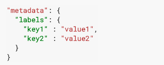

# 一、Spec and status

每一个Object必须要嵌套 Spec 和 Status。

spec：描述你期望Object表现的状态。
Status ：描述现在 object的状态


```
apiVersion: apps/v1 # for versions before 1.9.0 use apps/v1beta2
kind: Deployment
metadata:
  name: nginx-deployment
spec:
  selector:
    matchLabels:
      app: nginx
  replicas: 2 # tells deployment to run 2 pods matching the template
  template:
    metadata:
      labels:
        app: nginx
    spec:
      containers:
      - name: nginx
        image: nginx:1.7.9
        ports:
        - containerPort: 80
```
## apiVersion  
Which version of the Kubernetes API you’re using to create this object

## kind 
What kind of object you want to create

## metadata 
Data that helps uniquely identify the object, including a name string, UID, and optional namespace

# 二、names and uids
Kubernetes REST API中的所有对象都由Name和UID明确标识。对于非唯一的用户提供的属性，Kubernetes提供标签和注释。

## names
name是Resource URL组成部分，eg：
```
/api/v1/pods/some-name
```

只有给定类型对象一次可以给定一个名称。当对象被删除时，新创建对象可以给定同一名称。

name有小写字母，“-”,","组成，确定资源的name会有更加严格的限制。


## uids

同一类对象的不同版本，yong uid区分。


# 三、namespaces

k8s通过namespace支持虚拟集群。

获取namespaces
```
kubectl get namespaces
NAME          STATUS    AGE
default       Active    1d
kube-system   Active    1d
kube-public   Active    1d
```
系统初始化包含的三个命名空间:

default: 默认namespace，当没有指明namespaces时，就采用default

kube-system: 包含k8s system 创建的object

kube-public: 所有用户都可以访问object，包括未被验证的用户。

## 设置namespace

临时设置namespaces
```
kubectl --namespace=<insert-namespace-name-here> run nginx --image=nginx
kubectl --namespace=<insert-namespace-name-here> get pods
```

持久化设置namespaces

```
kubectl config set-context $(kubectl config current-context) --namespace=<insert-namespace-name-here>
# Validate it
kubectl config view | grep namespace:
```

## namespaces for DNS
当创建service时，会创建默认的DNS 入口。
```
<service-name>.<namespace-name>.svc.cluster.local
```

## not all objects in namespaces

大部分resource在namespace中（如pod，service，controllers），但是有些底层的资源可以不再namespace中（如volume，node）。

查看在和不再namespace中的资源。
```
# In a namespace
kubectl api-resources --namespaced=true

# Not in a namespace
kubectl api-resources --namespaced=false
```


# 四、Labels and Selectors



labels被标记在object中。

labels被service使用来找到object。

## Motivation

service同一版本可能有多重维度。


```
Example labels:

"release" : "stable", "release" : "canary"
"environment" : "dev", "environment" : "qa", "environment" : "production"
"tier" : "frontend", "tier" : "backend", "tier" : "cache"
"partition" : "customerA", "partition" : "customerB"
"track" : "daily", "track" : "weekly"
```


## Label selectors
和namespaces和uid不一样，labels不要求唯一确定一个object，通过labels过滤，往往得到的是一组object。

### 基于Equality-based 过滤（等于）
```
environment = production
```
选择 environment为production的object集合

```
tier != frontend
```
选择tier不为frontend集合，或者 没有tier表情集合。

```
environment=production,tier!=frontend
```
上面的两组选择同时满足


### 基于Set-based 过滤（集合）
```
environment in (production, qa)
```
过滤 key包含environment，并且值为production或者qa的Object。

```
tier notin (frontend, backend)
```
过滤key包含tier但value不为frontend和backend的Object，或者key不包含tier的Object。

```
partition
```
过滤key包含partition的Object集合，不对value进行验证。

```
!partition
```
过滤key不包含partition的Object的集合


```
partition in (customerA, customerB),environment!=qa
```
多个条件同时满足


## API 使用labels过滤

### 通过url
```
?labelSelector=environment%3Dproduction,tier%3Dfrontend
```
equal

```
?labelSelector=environment+in+%28production%2Cqa%29%2Ctier+in+%28frontend%29
```
set

### 通过 kubectl

```
kubectl get pods -l environment=production,tier=frontend
```
equal

```
kubectl get pods -l 'environment,environment notin (frontend)'
```

### service 和 ReplicationController也可以使用label过滤
上面两种对象支持yml文件和json形式。查询只支持等于查询，不支持集合查询。

```
"selector": {
    "component" : "redis",
}
```
json 形式

```
selector:
    component: redis
```
yml形式

### 特殊资源支持集合查询
特殊资源包括，Job, Deployment, Replica Set, and Daemon Set。

```
selector:
  matchLabels:
    component: redis
  matchExpressions:
    - {key: tier, operator: In, values: [cache]}
    - {key: environment, operator: NotIn, values: [dev]}
```


## Field Selectors
```
metadata.name=my-service
metadata.namespace!=default
```


use kubectl
```
kubectl get pods --field-selector status.phase=Running
```

### 支持的操作符

支持=, ==, and !=。其中=, ==是一样的意思。

```
kubectl get services --field-selector metadata.namespace!=default
kubectl get pods --field-selector=status.phase!=Running,spec.restartPolicy=Always
```

