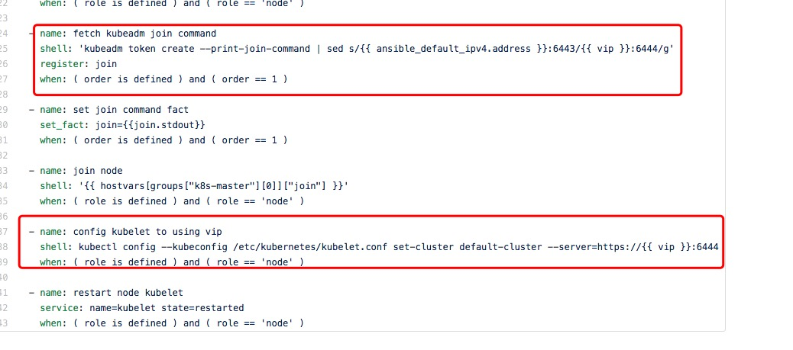
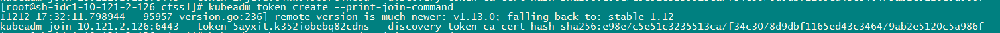

## 一、搭建基础环境平台，下载安装包：http://gitlab.bj.sensetime.com/platform/SuperComputer/kube-baremetal

1、关闭防火墙、networkmanager、selinux置为disabled

2、所以K8S节点关闭swap（搭建k8s集群基本配置）

注释掉 /etc/fstab中 swap一行，然后重启服务器，永久关闭。

（swapoff -a 立刻关闭swap，重启后失效。）

3、修改 hosts文件(修改的是安装包的host文件)

[baremetals]
10.121.2.122
10.121.2.123
10.121.2.125
10.121.2.126

4、执行ansible-playbook -i hosts deploy.yml

## 二、部署K8S


找台宿主机如你的PC，或者一台服务器，把下载好的离线包拷贝到/data目录

对宿主机与待安装节点启动docker服务

systemctl start docker

启动sealos容器，把离线包挂载进去：

docker run --rm -v /data/kube1.12.2.tar.gz:/data/kube1.12.2.tar.gz -it -w /etc/ansible fanux/sealos:v1.12.0-beta bash

配置免密访问

在宿主机执行

mkdir ~/.ssh
cd ~/.ssh
ssh-keygen -t rsa
cat ~/.ssh/id_rsa.pub

容器密码是12345678

在待安装节点执行：

echo '上述命令的公钥' >>~/.ssh/authorized_keys

这样公钥分发工作完成了，所有的机器直接ssh无需输入密码即可登录

在宿主机执行：

yum -y install vim
vim /etc/ansible/hosts
```

[k8s-master]
10.121.2.122 name=node01 order=1 role=master lb=MASTER lbname=lbmaster priority=100
10.121.2.123 name=node02 order=2 role=master lb=BACKUP lbname=lbbackup priority=80
#10.1.86.203 name=node03  order=3
10.121.2.125 name=node03 order=3 role=master
 
[k8s-node]
10.121.2.126 name=node04 role=node
 
[k8s-all:children]
k8s-master
k8s-node
 
[all:vars]
vip=10.121.2.186
k8s_version=1.12.2
ip_interface=eth0  #确保每个主机都有eth0,不同主机之间docker可通信
etcd_crts=["ca-key.pem","ca.pem","client-key.pem","client.pem","member1-key.pem","member1.pem","server-key.pem","server.pem","ca.csr","client.csr","member1.csr","server.csr"]
k8s_crts=["apiserver.crt","apiserver-kubelet-client.crt","ca.crt", "front-proxy-ca.key","front-proxy-client.key","sa.pub", "apiserver.key","apiserver-kubelet-client.key",  "ca.key",  "front-proxy-ca.crt",  "front-proxy-client.crt" , "sa.key"]
```

注意role=master的会装etcd与kubernetes控制节点，role=node即k8s node节点，配置比较简单，除了改IP和版本，其它基本不用动。


启动安装
```
 ansible-playbook roles/install-all.yaml
```


补充nv device支持

```
kubectl create -f https://raw.githubusercontent.com/NVIDIA/k8s-device-plugin/v1.12/nvidia-device-plugin.yml
```


修改master节点taints：

```
kubectl taint nodes --all node-role.kubernetes.io/master-
```


uninstall all
```
ansible-playbook roles/uninstall-all.yaml
```


删除nvidia-device-plugin

```
kubectl delete -f https://raw.githubusercontent.com/NVIDIA/k8s-device-plugin/v1.12/nvidia-device-plugin.yml
```


在线增加节点：

1、先安装 kube-bin nvidia-docker docker 环境 ，见第一步：“1. 搭建基础环境，docker/nvidia-docker/kube-bin ”

2、见第二步：修改hosts文件，master节点不动，旧的node节点删除，新的node节点添加，然后执行下面的命令。注意，playbook变了。

ansible-playbook roles/install-kubenode.yaml

参考：




在线删除节点：

在master节点执行：

kubectl delete node node名


手动添加node

1、在node节点执行：

      kubeadm reset -f

2、在master节点执行：

      kubeadm token create --print-join-command #查看添加命令，将IP改为VIP



3、在node节点执行上面得到的命令

例子：kubeadm join 10.121.2.186:6443 --token 5ayxit.k352iobebq82cdns --discovery-token-ca-cert-hash sha256:e98e7c5e51c3235513ca7f34c3078d9dbf1165ed43c346479ab2e5120c5a986f

4、将master节点的文件：/etc/kubernetes/pki/cfssl  拷贝到新添加的node节点，node节点的cfssl文件夹需要建

       


K8S基本命令：
kubectl cluster-info 查看集群信息
kubectl cluster-info dump 查看更详细信息
kubectl get nodes 查看节点
kubectl get rc,namespace 查看rc和namespace
kubectl get pods,svc 查看pod和svc(和service一样)
kubectl get -h 查看帮助
kubectl create -f filename 创建文件内定义的resource
kubectl replace -f filename 用于对已有资源进行更新、替换

如果一个容器已经在运行，这时需要对一些容器属性进行修改，又不想删除容器，或不方便通过replace的方式进行更新。kubernetes还提供了一种在容器运行时，直接对容器进行修改的方式，就是patch命令。
如前面创建pod的label是app=nginx-2，如果在运行过程中，需要把其label改为app=nginx-3。
kubectl patch pod rc-nginx-2-kpiqt -p '{"metadata":{"labels":{"app":"nginx-3"}}}'