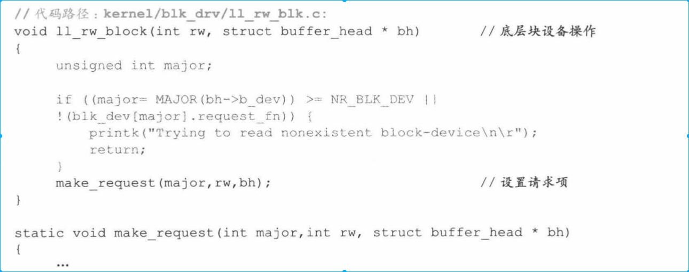
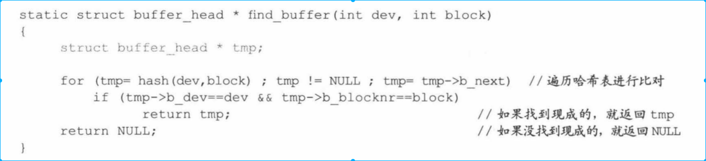
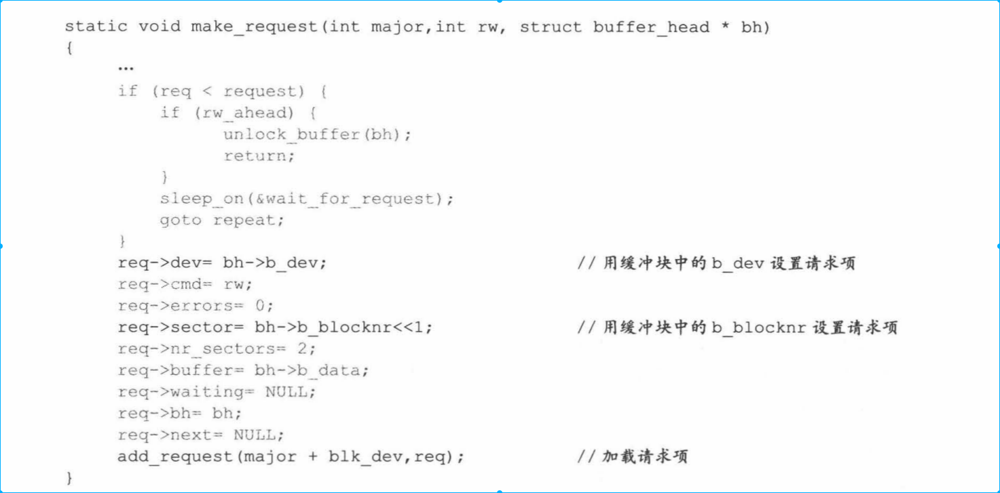
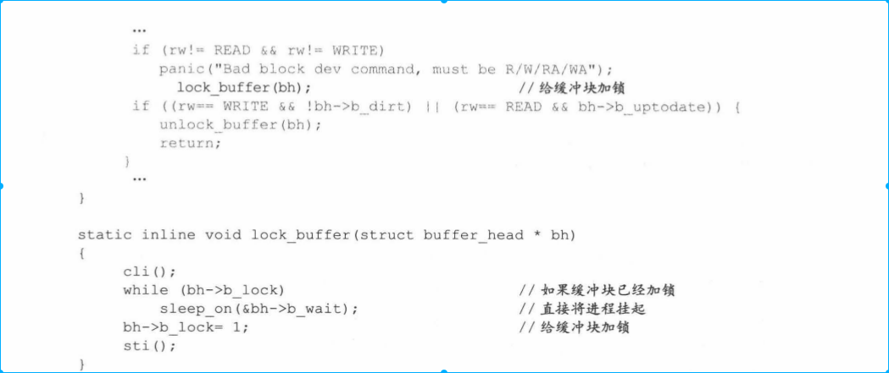
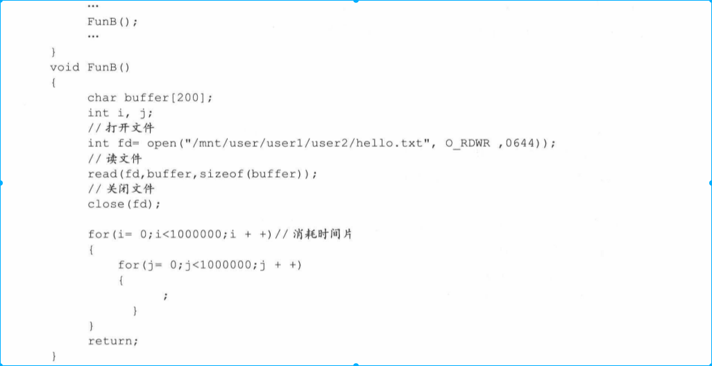
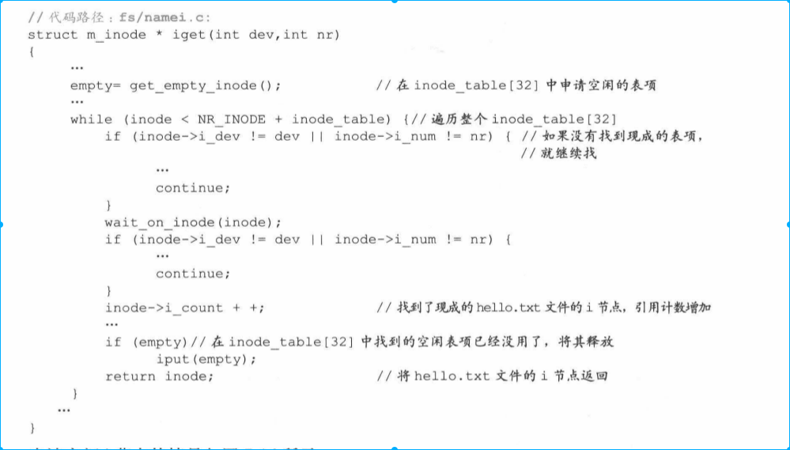

<!-- TOC -->

- [1. 背景](#1-背景)
- [2. 缓冲区作用](#2-缓冲区作用)
- [3. 缓冲区的总体结构图](#3-缓冲区的总体结构图)
- [4. b_dev、b_blocknr、request作用](#4-b_devb_blocknrrequest作用)
    - [4.1 保证数据进程和缓冲区交互正确性（设备号和块号关键）](#41-保证数据进程和缓冲区交互正确性设备号和块号关键)
        - [4.1.1 b_dev、b_blocknr（进程到缓冲区）](#411-b_devb_blocknr进程到缓冲区)
        - [4.1.2 request作用](#412-request作用)
    - [4.2 让数据在缓冲区中停留竟可能长的时间](#42-让数据在缓冲区中停留竟可能长的时间)
        - [4.2.1 在缓冲区中寻找设备号和块号对应的项](#421-在缓冲区中寻找设备号和块号对应的项)
    - [4.3 request设计思路](#43-request设计思路)
- [5. uptodate和dirt作用](#5-uptodate和dirt作用)
    - [5.1 b_uptodate的作用](#51-b_uptodate的作用)
    - [5.2 b_dirt作用](#52-b_dirt作用)
    - [5.3 读写操作在request占用空间设置](#53-读写操作在request占用空间设置)
    - [5.4 i_uptodate、i_dirt、s_dirt作用](#54-i_uptodatei_dirts_dirt作用)
    - [5.5 b_lock和*b_wait作用](#55-b_lock和b_wait作用)
        - [5.5.1 初始化缓冲区块](#551-初始化缓冲区块)
        - [5.6.2 缓冲区申请后设置b_lock为1](#562-缓冲区申请后设置b_lock为1)
        - [5.6.3 判断缓冲区状态（b_lock和*b_wait联用）](#563-判断缓冲区状态b_lock和b_wait联用)
        - [5.6.4 缓冲区解锁唤醒（b_lock和*b_wait联用）](#564-缓冲区解锁唤醒b_lock和b_wait联用)
    - [5.7 i_lock,i_wait,s_lock,*s_wait](#57-i_locki_waits_locks_wait)
    - [5.8 request其它作用](#58-request其它作用)
    - [5.9 实例1：关于缓冲块的进程等待队列](#59-实例1关于缓冲块的进程等待队列)
        - [5.9.1 例子场景](#591-例子场景)
        - [5.9.2 进程A读文件后被挂起](#592-进程a读文件后被挂起)
        - [5.9.3 进程B读取文件后被挂起](#593-进程b读取文件后被挂起)
        - [5.9.4 进程C写文件被挂起](#594-进程c写文件被挂起)
            - [5.9.4.1 进程C打开文件](#5941-进程c打开文件)
            - [5.9.4.2 进程C尝试读取hello.txt文件](#5942-进程c尝试读取hellotxt文件)
            - [5.9.4.2 进程C因为等待缓冲区解锁挂起](#5942-进程c因为等待缓冲区解锁挂起)
        - [5.9.5 三个进程以相反的方向被唤醒](#595-三个进程以相反的方向被唤醒)
            - [5.9.5.1 缓冲区块解锁](#5951-缓冲区块解锁)
            - [5.9.5.2 进程Ｃ唤醒](#5952-进程ｃ唤醒)
            - [5.9.5.3 切换到进程Ｃ并唤醒进程Ｃ内核栈挂起的进程指针指向的进程](#5953-切换到进程ｃ并唤醒进程ｃ内核栈挂起的进程指针指向的进程)
            - [5.9.5.4 进程Ｃ的源程序指定的str1数组数据写入hello.txt对应的缓冲区块](#5954-进程ｃ的源程序指定的str1数组数据写入hellotxt对应的缓冲区块)
            - [5.9.5.5 切换到进程Ｂ并唤醒进程Ａ](#5955-切换到进程ｂ并唤醒进程ａ)
    - [5.10 总体来看缓冲块和请求项](#510-总体来看缓冲块和请求项)
        - [5.10.1 获取现有缓冲区块](#5101-获取现有缓冲区块)
        - [5.10.2 申请新的缓冲区块](#5102-申请新的缓冲区块)

<!-- /TOC -->
# 1. 背景
* 进程、文件系统、内存之间的操作都离不开缓冲区，理解缓冲区真正作用对理解操作系统非常重要。

# 2. 缓冲区作用
缓冲区作用体现在两方面
* 操作系统和各种设备解耦：设备挂载和操作系统设计都更加灵活
* 对设备文件操作运行效率更高

按理来说，设备和内存之间添加一个缓冲区，只会提高复制缓冲区开销，不可能提高效率的。快的原因是缓冲区的共享。
* 多个进程操作同一个文件共享，提高效率。
* 一段时间，一个进程多次操作一个文件共享。（概率是非常高的）

因此缓冲区的设计是围绕如何保证数据交互的正确性和如何让数据停留在缓冲区中竟可能长来设计的。

# 3. 缓冲区的总体结构图

* 缓冲区中有两个非常重要的结构
    * buffer_head:负责进程和缓冲区数据交互，确保数据交互正确的前提下，让数据在缓冲区中停留更长时间。
    * request主要负责缓冲区和设备数据交互，确保正确交互前提下，及时的将设备数据同步到缓冲区中

下面主要内容是讲解上面两个结构体。

# 4. b_dev、b_blocknr、request作用
b_dev、b_blocknr两个字段是buffer_head结构中非常重要的两个字段，是缓冲区支持多进程文件基础。
* 确定正确性和经过能让缓冲区停留在内存基础。

## 4.1 保证数据进程和缓冲区交互正确性（设备号和块号关键）
* 进程和缓冲区交互不是以文件为单位，而是块为单位。一次交互不足一个块，任然占用一个缓冲块。

### 4.1.1 b_dev、b_blocknr（进程到缓冲区）
* 缓冲区块大小和硬盘块大小一致。保证数据交互正确性，首先是磁盘数据块和缓冲区中数据块严格对应。
* 因为磁盘设备号和块号能唯一确定一个磁盘块。同时每一个缓冲区块都有一个buffer_head管理。内核通过缓冲区块buffer_blocknr和b_dev两个字段，把缓冲区和硬盘数据块绑定。确保数据交互的唯一性。

文件读写都是通过设备号和块号到缓冲区为止。

### 4.1.2 request作用
内核通过request结构保证硬盘和缓冲区之间的数据交互。

request 字段本质上还是主要靠设备号和块号来实现和和磁盘的交互。

## 4.2 让数据在缓冲区中停留竟可能长的时间
b_dev和blocknr不仅是保证数据正确性的基础，也是尽可能让数据保存在缓冲区中的基础。

数据停留在缓冲区的标志是缓冲区块和设备块是否还存在绑定关系。

### 4.2.1 在缓冲区中寻找设备号和块号对应的项

* 很显然更，设备号和块号使用的是散列hash
* 如果在缓冲中读取到，就节省了两个数量级的时间。
* 如果缓冲区中寻找了一遍，缓冲区块中都和已有的设备绑定关系。实在找不到，就只能找一个暂时没有进程使用。就只能找一个暂时没有进程使用(b_count=0)的空闲块，废除已经存在的绑定关系，用新的绑定关系取代。

上面代码意思是申请一个缓冲区块和已有数据建立绑定关系。申请缓冲区块存在两种情况:
* 一种是系统刚运行，有空闲的缓冲区块申请
* 一种是运行很长时间，没有空闲的缓冲区申请，只能废除原有缓冲区和数据块关系。

* 内核中没有任何代码主动解绑缓冲区块和磁盘数据块关系的代码，只有通过b_dev、blocknr申请不到缓冲区块才进行解绑。

## 4.3 request设计思路
request设计思路和缓冲区正好相反，尽可能快让缓冲块和硬盘进行数据交互。

* request也有b_dev、和b_blocknr类似字段，就是设备号dev和首扇区号sector。他们除了保证缓冲区块和硬盘数据交互的正确性外，更多的是尽快的让缓冲区块和数据块交互。

* 下面代码是将设备添加到request请求队列中，插入到期请求队列存在两种情况
    * 一种是硬盘是空闲的，让硬盘处理当前请求
    * 一种是硬盘非空闲，就把这些请求插入到请求队列中。

* 下面是针对请求队列的读写操作。无论是读操作还是写操作，最后都需要调用end_request()和do_hd_quest()函数。这样就形成了处理请求项队列中的请求项的循环操作。
    * do_hd_quest()中的INIT_REQUEST这个宏用于判断循环是否结束。如果当前请求项不为空，标识队列中还有请求项对应的缓冲区块需要交互，就继续下达交互命令。直到把所有请求项队列中的任务都执行完。

* request项是32，也就是request[32],为什么要设置32个request项，而不是64或者16呢。
    * 内存和磁盘读写速度差2个两级。缓冲区块最多是3000多块，对应request项也就是32项左右
    * 如果request项太多，磁盘来不及处理，request项会闲置，浪费request占用内存
    * request项太少，由于没有足够的请求项，导致新的读写任务无法下达，硬盘空闲，进程无合适的缓冲区块可用，被频繁挂起，导致系统效率降低。

# 5. uptodate和dirt作用
* b_dev和blocknr两个字段是进程能共享缓冲区块的基础，是缓冲区块数据是否任然停留的标志。停留就是要被共享。

* 共享分两个方向
    * 一个是进程方向，进程能共享那些缓冲区，不能共享那些。
    * 一个是硬盘方向，那些需要同步到硬盘上，那些不需要同步。
    * 这两个方向的核心任务是确保缓冲块和数据块数据的正确性。

* buffer_head中的b_uptodate和b_dirt两个字段都是为了解决缓冲区块和数据块正确性存在的
    * b_uptodate针对进程方向，他告诉内核，只要b_uptodate被设置为1，缓冲区块的数据已经是数据块中最新的数据。可以方向的共享数据。反之，告诉内核缓冲区块并没有用绑定的数据块中的数据更新，不支持进程共享数据块。
    * b_dirt是针对磁盘方向，只要缓冲区块b_dirt字段被设置成1，就是告诉内核，这个缓冲区块中的内容已经被进程方向的数据改写了，需要最终同步到磁盘上。反之不需要同步。

## 5.1 b_uptodate的作用
* 假设我们没有b_uptodate字段
    * 进程读数据:假设磁盘申请了一个缓冲区块（申请缓冲区块和同步数据到磁盘是异步的），此时进程读取该缓冲区数据很有可能是垃圾数据。
    * 写数据：如果写入缓冲区块中的数据小于一个块，缓冲区残留着垃圾数据。当同步缓冲区数据到磁盘中时，就是同步的垃圾数据。

* 为此，在磁盘中断服务程序执行时，在数据从磁盘读入缓冲区后或者缓冲区数据同步到磁盘后，都会将b_uptodate字段设置为1.

* 值得注意的是，b_uptodate被设置成1，就是告诉内核，缓冲区块中数据已经用数据块中的内容更新了。但是并不代表缓冲区数据和磁盘中数据一致（磁盘中可能存在脏数据）。比如，新建一个文件，清除缓冲区数据后就设置b_uptodate被设置成1，没有同步数据到磁盘操作，因此数据不一致。但是这不影响数据的正确同步。

* 如果b_uptodate为0，内核会阻拦进程，不让进程共享缓冲区数据。不论读写。

## 5.2 b_dirt作用
进程往缓冲区中写数据后，就要将b_dirt设置为1.    

## 5.3 读写操作在request占用空间设置
相比写操作，读操作对用户进程更加紧迫。因此请求项对这两种操作设定了不同的大小空间。

* 请求项中只有2/3空间用来写操作，而全部空间用来读操作。因此，在同等条件下，读操作机会更多。

## 5.4 i_uptodate、i_dirt、s_dirt作用
* b_uptodate,b_dirt保证缓冲区与硬盘数据正确性
* 文件管理信息中也有类似字段
    * 比如inode_table[32]也有类似字段，比如i_uptodate(没有实际使用)和i_dirt。
        * i_dirt比较容易理解。当改变文件大小后，inode_table信息会发生变化，和磁盘数据不一致。因此i_dirt用来同步i_dirt和inode_table[32]

    
    

    * super_block[8] 不存在是否空闲的问题.因此不需要count这样字段来记录超级快的引用次数。
    

    * 除了i节点和超级块外，还有i节点位图和逻辑块位图。
    
    
    
    从以上代码中可以看出, i 节点位图、超级块位图载入缓冲块后,这些缓冲块的 b_count被设置为1 ,之后并没有将其释放过,这样这些缓冲块的引用计数就无法还原为 0 了。所以任何进程申请新缓冲块的时候,都无能申请到它们,所以这些缓冲块成为专用。

## 5.5 b_lock和*b_wait作用
* b_lock:当缓冲区正在和数据块同步时，内核会拦截进程对缓冲区操作。因此可以把b_lock设置为1.当同步完成后，设置为0，进程就可以操作缓冲区了。
* 当b_lock设置为1，所有进程操作该缓冲区都会被挂起。这时需要记录那些进程因为等待这个缓冲区块而被挂起，因为这时一个进程对待队列数据结构，可以通过*b_wait字段解决问题。

### 5.5.1 初始化缓冲区块
怠速进程初始化缓冲区块时，b_block全部设成0，*b_wait全部设成NULL。

### 5.6.2 缓冲区申请后设置b_lock为1
缓冲块被申请后,开始底层块操作前,就要先把该块加锁,即把 b_lock 设置为 l ,然后进行底层操作。

缓冲块 与 硬盘数据块开始交互数据时, lock_buffer()函数先判断缓冲块是否加锁。如果加锁了(很有可能该缓冲块早就被别的进程申请了,现在正 与 硬盘交 互数据),就直接调用 sleep_on()函数将进程挂起,井切换到其他进程去执行。 等到将来切换回 当 前进程后,再将缓 冲块继续加锁。如果没加锁,就将其加锁,以防其他进程误操作。
    
### 5.6.3 判断缓冲区状态（b_lock和*b_wait联用）

### 5.6.4 缓冲区解锁唤醒（b_lock和*b_wait联用）

读盘或写盘结束后,中断服务程序执行,会给缓冲块解锁,随后也将原来等待该缓冲块
的进程唤醒 。代码如下

## 5.7 i_lock,i_wait,s_lock,*s_wait
文件管理结构也和b_lock和*b_wait有着类似结构。比如inode_table[32]和super_block[8].

* 使用的时候也是连对使用

## 5.8 request其它作用
缓存块、i节点、超级块等结构，为进程共享缓存块建立了基础。解决了共享还是不能共享的问题。下面主要介绍如何更加高效的使用缓存块。

上面介绍了缓存块到进程方向的延伸，下面介绍缓存在磁盘方向的延伸。

* 下面是request数据结构

    * cmd:和硬盘是读交互还是写交互
    * bh和*buffer:和那个缓冲块交互
    * sector和nr_sector:数据块和扇区
    * error:交互出错次数

* 缓存块和磁盘完全是一一对应，因此没有共享问题，所以没有count字段。只存在忙或者空闲状态。dev字段不仅代表设备号，还可以通过它判断设备是否被请求项使用。

* 另外request 设置成32个是为了竟可能达到缓存和磁盘平衡状态，但并不是完全平衡的。比如读写非常频繁，导致请求项不断积压，最终导致请求项不够用了。由于内核申请到了缓存块而没有请求项可以申请，进程只能被挂起。这时同样需要一个字段来确定那些字段被挂起了*waiting 用来记录被挂起进程。

* 有了空闲的request项，就唤醒

* 多个进程由于等待请求项被挂起，一个*waiting字段是不能记录的，因此*waiting设计成队列形式。和前面的*b_wait一样。

## 5.9 实例1：关于缓冲块的进程等待队列
下面是一个多进程操作文件例子，一方面体现进程共享问题，一方面将进程等待队列的原理讲清楚。

### 5.9.1 例子场景
假设硬盘中存在hello.txt文件，700B，3个进程同时操作文件，这样就会产生等待队列。
* 进程A将hello.txt的100字节读入buffer[100]

* 进程A将hello.txt的200字节读入buffer[200]

* 进程C往hello.txt写入”ABCDE“

三个进程是A、B、C先后执行。三个进程没有父子进程。

### 5.9.2 进程A读文件后被挂起
进程A启动，执行open函数，映射到sys_open,调用open_namei函数获取文件i节点。

之后执行read函数，映射到sys_read,调用file_read函数读取文件内容，file_read调用bread从硬盘中读取内容。

* bread()函数过程如下

* 进程A挂起是在wait_on_buffer()函数中完成的。执行代码如下：

* ll_rw_lock()过程
ll_rw_block()在执行过程中，缓冲块已经加锁。所以while(bh->b_lock)条件为真，之后调用sleep_on函数，传递参数是&bh->b_wait(标识解锁等待该缓冲区被挂起的进程指针)。由于系统初始化时，已经将所有的b_wait设置成NULL，此缓冲区又是新申请的，从来没有被其它进程使用过，因此此时传递的&bh->b_wait是NULL。

* sleep_on()过程
参数*p指向的是bh->b_wait.*p 保存进程A指针，意味着A此时正在等待bh这个缓冲块解锁。进程A被挂起，调用schedule函数，切换到进程B执行。

与此同时，硬盘也正在向数据寄存器端口中传递数据。
同时tmp存储在进程A的内核栈中，存储值是NULL。bh->b_wait存储的是进程A指针。

### 5.9.3 进程B读取文件后被挂起
进程B执行open，映射到sys_open,在file_table[64]申请一块空闲位置和进程Bfilp[20]挂接。虽然进程A、B操作的是两个文件，但是申请的是两份账本。

* 此时硬盘还在不停的读出数据，刚才进程A的读盘请求还没有完成。
之后调用open_namei()函数，获取hello.txt的i节点。

* 进程B使用进程Ahello.txt使用的i节点

* 进程B读read映射到sys_read,然后调用file_read函数来读取文件内容，file_read函数调用bread函数从磁盘上读取数据。

* 进程B进入bread()

* getblk()后由于hello.txt已经被载入缓冲区，直接返回

* ll_rw_block()由于缓冲区已经被加锁，进程B将因为等待缓冲区块解锁被挂起。

* sleep_on()因为此时&bh->b_wait指向的是进程A的task_struct,所以进程B执行sleep_on和进程A有很大不同
    * tmp存储在进程B内核中，存储的是进程A的指针。此时bh->b_wait存储的是进程B指针
    * 调用schedule切换到进程C

### 5.9.4 进程C写文件被挂起
#### 5.9.4.1 进程C打开文件
进程C同样操作hello.txt文件。打开文件open映射到sys_open,在file_table[64]申请一张空闲项同时和filp[20]关联。之后调用sys_open函数调用open_namei()获取hello.txt i节点。

#### 5.9.4.2 进程C尝试读取hello.txt文件
write()函数映射到sys_write(),sys_write()调用file_write()函数读取文件内容，file_write()函数调用bread()函数从硬盘上读取数据。

#### 5.9.4.2 进程C因为等待缓冲区解锁挂起
* 进程C进入bread()过程和进程B一致

* 进入getblk()函数之后，由于hello.txt文件对应的数据块已经载入缓冲区，直接返回，代码如下：

* 执行ll_rw_block函数，由于缓冲块已经加锁，所以进程C也将因为等待该缓冲块解锁而被系统挂起。

* 接下来执行的是sleep_on(),bh->b_wait指向是进程B指针。
    * 进程Ｃ的内核栈之中，存储的是进程Ｂ的task_struct.

### 5.9.5 三个进程以相反的方向被唤醒
每个进程内核栈之中都保留着上一个因为等待缓冲区解锁被挂起的进程指针。当缓冲区解锁时，操作系统可以根据每个进程中的内核栈依次唤醒之前被挂起进程。唤醒次序是后进先出。

#### 5.9.5.1 缓冲区块解锁
Ａ、Ｂ、Ｃ进程都被挂起，系统切换到其它进程区执行。当硬盘数据读取到缓冲区完毕后，硬盘产生中断，中断服务程序开始工作后，将bh缓冲区块解锁，并调用wake_up(),将bh->b_wait对应的字段唤醒。

#### 5.9.5.2 进程Ｃ唤醒
上面调用wake_up函数传入的参数是&bh->b_wait指向的是进程Ｃ的指针。所以唤醒的是进程Ｃ。

#### 5.9.5.3 切换到进程Ｃ并唤醒进程Ｃ内核栈挂起的进程指针指向的进程
前面唤醒进程Ｃ本质上就是将进程Ｃ设置为就绪态。当进行进程调度时，就切换到进程Ｃ。

进程Ｃ再次执行到sleep_on函数，唤醒Ｂ进程。

#### 5.9.5.4 进程Ｃ的源程序指定的str1数组数据写入hello.txt对应的缓冲区块

#### 5.9.5.5 切换到进程Ｂ并唤醒进程Ａ
这个过程和进程Ｃ唤醒后执行过程一致。

## 5.10 总体来看缓冲块和请求项
### 5.10.1 获取现有缓冲区块
ｂ_dev和b_blocknr是缓冲区中数据停留的标志，和设备绑定。内核没有刻意的清楚这些字段，因此很快所有的缓冲块会和设备绑定，这时再申请缓冲块只能解除旧有的绑定关系。体现了让缓冲区中数据在缓冲区中停留尽可能时间。

### 5.10.2 申请新的缓冲区块
从以上代码发现，如果找不到现有的缓冲区块，就申请新的缓冲区块

* 下面申请新的缓冲区块

