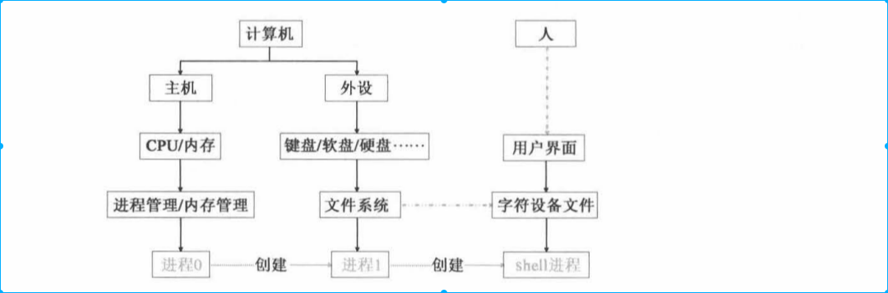

<!-- TOC -->

- [1. 背景](#1-背景)
- [2. 运行最简单程序，操作系统做什么工作](#2-运行最简单程序操作系统做什么工作)
- [3. 操作系统设计的指导思想--主奴机制](#3-操作系统设计的指导思想--主奴机制)
    - [3.1 主奴机制中的进程以及进程的创建机制](#31-主奴机制中的进程以及进程的创建机制)
        - [3.1.1 程序边界和进程](#311-程序边界和进程)
        - [3.1.2 进程的创建](#312-进程的创建)
    - [3.2 操作系统的设计如何体现主奴机制](#32-操作系统的设计如何体现主奴机制)
        - [3.2.1 进程调度体现主奴机制](#321-进程调度体现主奴机制)
        - [3.2.2 内存管理体现主奴机制](#322-内存管理体现主奴机制)
        - [3.2.3 文件管理体现主奴机制](#323-文件管理体现主奴机制)
- [4. 实现主奴机制的三种技术](#4-实现主奴机制的三种技术)
    - [4.1 保护分页](#41-保护分页)
    - [4.2 特权级](#42-特权级)
    - [4.3 中断](#43-中断)
- [4. 建立主奴机制的决定性因素--先机](#4-建立主奴机制的决定性因素--先机)
- [5. 软件和硬件关系](#5-软件和硬件关系)
    - [5.1 非用户进程0、进程1、shell进程](#51-非用户进程0进程1shell进程)
    - [5.2  文件和数据存储](#52--文件和数据存储)
        - [5.2.1 内存、硬盘、缓冲区](#521-内存硬盘缓冲区)
        - [5.2.2 缓冲区](#522-缓冲区)
        - [5.2.3 文件系统实现进程通信－－管道](#523-文件系统实现进程通信管道)
- [6.父子进程共享页面](#6父子进程共享页面)
- [7.操作系统的全局中断和局部中断－－信号](#7操作系统的全局中断和局部中断信号)

<!-- /TOC -->
# 1. 背景
前面都是讲解的操作系统机制，这章主要从操作系统设计者角度探讨操作系统设计的指导思想。

# 2. 运行最简单程序，操作系统做什么工作
* hello world 程序如下

上面代码非常简单，但是执行过程涉及操作系统代码在一万行以上。

执行过程如下(假设编译后的文件是hello)
* 第一步是，shell输入./hello进程被唤醒，对命令进行解析
    * 用户敲击键盘内容记录在设备终端文件tty0上。
        * 系统通过文件形式操作设备，就需要一套文件系统。文件系统包括超级块、逻辑块位图、i节点位图、文件i节点、数据块等。
        * 其次, i王妥根据丈件的不同功能对数据进行分类,包括普通文件、设备文件、目录丈件等 。 ttyO 就属于议各文件 。 有了这些准备才有可能对终祸设备丈件 ttyO 进行操作 。

    * 键盘敲击完毕后，还需要产生键盘终端信号，系统还需要对终端信号处理。
        * 这个中断信号信号会通过中断可编程中断控制器9259A，所以要对8259A进行设置。
        * 然后中断信号会传递给CPU，CPU要通过中断描述符寄存器(IDTR)找到中断描述符表，通过中断描述符表找到键盘中断处理程序，并执行操作。
        * 这需要一套中断服务体系，其中包括IDTR、中断描述符表，中断描述符表和中断服务程序挂接。然后还需要编写具体的中断服务程序。

    * 中断服务程序开始执行后，开始唤醒shell进程，通过进程调度机制，从0号进程切换到shell进程。

        * 这需要一套进程管理机制，就shell来说，需要创建和管理shell进程，才能实现人机交互界面。
        * 需要一个0号进程作为怠速进程
        * 还需要一套进程轮训机制，产生时钟中断，导致进程切换。这套轮训机制有很多需要考虑，比如时钟中断服务程和82533定时器设置。

    * shell进程通过执行自身程序，开始从tty0终端文件读取用户键入的指令信息。开始解析该指令，并进行相应的处理。这条指令不是敲击一次键盘就能输入的，每次敲击键盘都会重复上面动作，然后shell进程再次睡眠，并等待下一次键盘中断产生。

* 第二步，shell解析出命令，开始fork用户进程，以便对hell文件进行操作
    * 这里至少需要为进程创建一套进程管理结构，以便控制将来加载程序。包括时间片、优先级、进程状态、进程对应的丈件、进程的任务状态描述符农( TSS ),以及进程的局部数据描述符表(LDT),等等.
    * 另外由于每个进程都有LDT和TSS，为了方便管理LDT和TSS，系统设计了另外一套数据结构GDT。
    * 系统启动之处是实模式，各个段寄存器都是实际地址值，知道进入保护模式，段寄存器中的数值才变成段选择符（GDT开始起作用）
    * 创建进程肯定需要页表，内存管理策略也是操作系统最复杂的策略之一。

* 第三步，创建进程完毕，开始加载hello文件
    * 完成这一步需要两个方面准备，一个是文件方面，一个内存方面
    * 文件存储在磁盘上，加载之前检测文件是否可用，表现在i节点检测和文件头检测。
        * i 节点是丈件的管理信息 。 只要涉及 i 节点,就一定离不开对 i 节点的查找,是就要解析文件路径、操作目录文件和目录项、操作 i 节点表等,一件事情都不能少做 。
        * 文件头存储在数据块中,妥操作数据块又离不开逻辑块位图的支持,这样一来,整个文件系统中涉及的全部内容都要用到了 。
    * 文件条件具备后，需要将文件加载在内存中。
        * 这样系统就要解决所有与内存相关的问题,包括要与原来进程共享的页面解除关系,这就涉及页面引用计数、页面三级管理机制(页目录表、页表、页面〉、页函数据(只读 /可读可 写)等一系列问题,系统就要为此建立页写保护等机制来解决这些问题。
        * 程序的加载也是很讲究策咯的,其中最重要的就是缺页中断机制。
 
* 第四步，执行hello程序
    * 系统也要为此做很多的工作 。 其中最主要的就是关于显示方面的工作,比如,显卡属性如何确定,显卡是单色还是彩色: 显存位置如何确定,显示在屏幕上的位置又如何确定,如果字符数量过多,要不要滚动显示,如何滚动显示,等等 。 这些问题都妥操作系统来做 , 而且直接与显示器的底层交互 。

经过综合分析,我们归纳出,操作系统的 一 部分任务是为应用程序的运行提供使用硬盘、显示器、键盘等外设的基础程序,或者说操作系统为应用程序的运行提供了对外设的支持。如果操作系统不写这些支持程序,应用程序就必须写这些程序,而且所有应用程序都要写的这部分程序的内容也都差不多。所以,我们也可以把操作系统看成所有应用程序共有的部分。
像 Linux 这样的现代操作系统,不仅为应用程序提供了对外设的支持,还支持多个程序同时运行。这就要求操作系统不但要支持外设,还必须对运行的多个程序进行有效的组织、管理和协调,防止某个程序独占 CPU 、内存、外设等资橱,使得其他程序无怯正常运行。此外,还要防止正在运行的程序之间相互读写和相互覆盖,确保所有程序正确运行。最关键的是,操作系统不能被应用程序直接读写,更不能被应用程序覆盖。

# 3. 操作系统设计的指导思想--主奴机制
主奴机制：操作系统能对应用程序进行组织、管理、协调同时自身又不受损害。
* 操作系统和应用程序、应用程序和应用程序隔离
* 操作系统可以操作任意的应用程序，应用程序无法操作操作系统
* 应用程序申请的所有资源都需要经过操作系统的同意

这样：操作系统是主子，应用程序是奴才

## 3.1 主奴机制中的进程以及进程的创建机制
### 3.1.1 程序边界和进程
需要操作系统和应用程序、应用程序和应用程序之间实现隔离。task_struct实现明确的边界划分作用。

### 3.1.2 进程的创建
* linux中进程的创建是由父进程创建（0进程除外），本质上是复制task_struct
* 0进程的task_struct由操作系统设计者手工编写

## 3.2 操作系统的设计如何体现主奴机制
三个方便体现操作系统设计的主奴机制
* 进程调度
* 内存管理
* 文件管理

### 3.2.1 进程调度体现主奴机制
* 调度权利完全掌握在内核中，可以随意中断用户进程的执行
* 如果设计成用户自行上交CPU权利，很显然会出现很多问题

### 3.2.2 内存管理体现主奴机制
* task_sturct为进程在内存中分界
* 内存管理区域分为2部分，一个在内核区、一个在用户区。内核程序可以访问所有的内存空间。
* 用户使用的是逻辑线性地址

### 3.2.3 文件管理体现主奴机制
* 用户需要的文件资源都需要通过内核申请

# 4. 实现主奴机制的三种技术
实现操作主奴最重要的三个机制是
* 保护分页
* 特权级
* 中断

这三个共同点都是需要依赖硬件
## 4.1 保护分页
linux打开PE和PG，即打开保护模式和分页机制。

打开保护模式后
* 寻址模式发生明显变化，实模式是CS:IP,保护模式IP编程CIP，CS由段基址变成段选择符。
* 保护模式使用段限长。因为实模式只有段首寄存器没有断尾寄存器，为了兼容实模式，保护模式引入段限长来做段保护
* 特权级（下面描述）

## 4.2 特权级
* 对主奴机制影响深远的是特权级机制

* linux禁止低特权级使用一些关键性指令，LGDT、LLDT、LTR、LIDT，另外操作系统还禁止用户程序使用一些全局性指令CLI、STI等

* 内核其实地址是0，因此使用的线性地址和物理地址一致。但是用户空间的地址需要经过地址转化才能映射到物理地址上。

## 4.3 中断
* 中断和普通call有很大不同，call是平滑的切换EIP到另外一个位置，中断比较复杂。
* 时钟中断是切换进程进行进程调度的利器。

# 4. 建立主奴机制的决定性因素--先机
为什么内核程序能获得高级特权，用户程序不能呢？
答案是先机。系统最开始是实模式，当开始打开PE模式时，此时系统一定是特权级，因为如果不是特权级很多指令执行不了。有了特权级后，可以做足够事情。而后面的用户级就再也无法获得内核级。除非利用系统漏洞提权。

# 5. 软件和硬件关系

## 5.1 非用户进程0、进程1、shell进程
* shell进程是用户交互进程。
* shell进程一直存在

三个进程启动过程中所完成的功能，设计的非常好

## 5.2  文件和数据存储
文件系统代码量涉及到操作系统代码一半。

设计者提出超级快、i节点、逻辑块位图、i节点位图等一套管理结构。而且这些结构还涉及到进程，导致文件系统变的非常复杂。

### 5.2.1 内存、硬盘、缓冲区
通常我们理解内存和磁盘只是速度上区别。但是问题是为什么两个数据结构差别非常大
* 内存是：进程、分页、特权级、表
* 磁盘：文件、i节点、位图、块
内存又叫做计算级存储，CPU计算离不开内存，比如简单四则运算需要在内存中存储成逆波兰式，并用堆栈存储。但是磁盘又叫存储级存储，只是存储功能。

* 全运算存储：用户进程内存中所做的计算
* 半运算存储：内核在内存中为文件系统所做计算的内存
* 无运算存储：内存中完全模拟外设，没有计算功能

这样我们就能理解缓冲区：缓冲区是一个半运算存储，介于全运算和无运算之间。操作文件过程中，在目录中查找某个目录项，这里面可定时有字符串比对，因此参与运算。但是有不是用户程序的运算，所以叫做半运算存储。

###　5.2.2 缓冲区
* 内存和磁盘差２－３量级，所以需要缓冲区。
* 缓冲区设计时：数据有序、数据停留在缓冲区中的时间竟可能长

* b_dev、ｂ_blocknr在hash_table中找到对应的磁盘块
* b_uptodate 说明缓冲区中数据有效
* b_dirt说明缓冲区数据和磁盘数据不同步
* b_wait因为缓冲区挂起的进程队列
* b_count缓冲区的引用数

###　5.2.3 文件系统实现进程通信－－管道
* 不可能真的用磁盘中的文件实现进程通信，太慢。因此在内存页中虚拟出。
* 管道的管理方式和文件类似。

# 6.父子进程共享页面
* 子进程如果步共享父进程代码，子进程连加载自身代码都无法完成
* 为了避免父子进程操作页面造成的混乱，提出了页写保护机制。

# 7.操作系统的全局中断和局部中断－－信号
* 对比分析中断和信号,可以看出信号明显是在模仿中断的技术路线,使进程间的沟通由主动轮i句变为被动响应,同样大幅度减少了进程间沟通引起的操作系统的消耗,提 高了整体运行效率。
* 可以发现,两者的对称性很强,有很强的可比性。两者的区别在于中断是针对整个操作系统的,而信号是针对进程的。我们甚至可以把通常的中断看成整个操作系统的“全局中断”,信号是进程 的“局部中断”。

