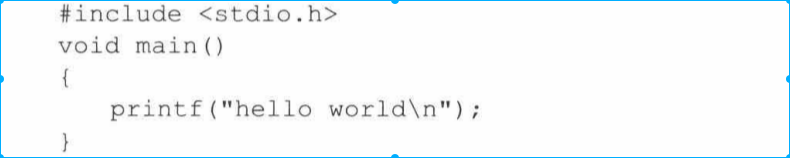

<!-- TOC -->

- [1. 背景](#1-背景)
- [2. 运行最简单程序，操作系统做什么工作](#2-运行最简单程序操作系统做什么工作)

<!-- /TOC -->
# 1. 背景
前面都是讲解的操作系统机制，这章主要从操作系统设计者角度探讨操作系统设计的指导思想。

# 2. 运行最简单程序，操作系统做什么工作
* hello world 程序如下

上面代码非常简单，但是执行过程涉及操作系统代码在一万行以上。

执行过程如下(假设编译后的文件是hello)
* 第一步是，shell输入./hello进程被唤醒，对命令进行解析
    * 用户敲击键盘内容记录在设备终端文件tty0上。
        * 系统通过文件形式操作设备，就需要一套文件系统。文件系统包括超级块、逻辑块位图、i节点位图、文件i节点、数据块等。
        * 其次, i王妥根据丈件的不同功能对数据进行分类,包括普通文件、设备文件、目录丈件等 。 ttyO 就属于议各文件 。 有了这些准备才有可能对终祸设备丈件 ttyO 进行操作 。

    * 键盘敲击完毕后，还需要产生键盘终端信号，系统还需要对终端信号处理。
        * 这个中断信号信号会通过中断可编程中断控制器9259A，所以要对8259A进行设置。
        * 然后中断信号会传递给CPU，CPU要通过中断描述符寄存器(IDTR)找到中断描述符表，通过中断描述符表找到键盘中断处理程序，并执行操作。
        * 这需要一套中断服务体系，其中包括IDTR、中断描述符表，中断描述符表和中断服务程序挂接。然后还需要编写具体的中断服务程序。

    * 中断服务程序开始执行后，开始唤醒shell进程，通过进程调度机制，从0号进程切换到shell进程。

        * 这需要一套进程管理机制，就shell来说，需要创建和管理shell进程，才能实现人机交互界面。
        * 需要一个0号进程作为怠速进程
        * 还需要一套进程轮训机制，产生时钟中断，导致进程切换。这套轮训机制有很多需要考虑，比如时钟中断服务程和82533定时器设置。

    * shell进程通过执行自身程序，开始从tty0终端文件读取用户键入的指令信息。开始解析该指令，并进行相应的处理。这条指令不是敲击一次键盘就能输入的，每次敲击键盘都会重复上面动作，然后shell进程再次睡眠，并等待下一次键盘中断产生。

* 第二步，shell解析出命令，开始fork用户进程，以便对hell文件进行操作
    * 这里至少需要为进程创建一套进程管理结构，以便控制将来加载程序。包括时间片、优先级、进程状态、进程对应的丈件、进程的任务状态描述符农( TSS ),以及进程的局部数据描述符表(LDT),等等.
    * 另外由于每个进程都有LDT和TSS，为了方便管理LDT和TSS，系统设计了另外一套数据结构GDT。
    * 系统启动之处是实模式，各个段寄存器都是实际地址值，知道进入保护模式，段寄存器中的数值才变成段选择符（GDT开始起作用）
    * 创建进程肯定需要页表，内存管理策略也是操作系统最复杂的策略之一。

* 第三步，创建进程完毕，开始加载hello文件
    * 完成这一步需要两个方面准备，一个是文件方面，一个内存方面
    * 文件存储在磁盘上，加载之前检测文件是否可用，表现在i节点检测和文件头检测。
        * i 节点是丈件的管理信息 。 只要涉及 i 节点,就一定离不开对 i 节点的查找,是就要解析文件路径、操作目录文件和目录项、操作 i 节点表等,一件事情都不能少做 。
        * 文件头存储在数据块中,妥操作数据块又离不开逻辑块位图的支持,这样一来,整个文件系统中涉及的全部内容都要用到了 。
    * 文件条件具备后，需要将文件加载在内存中。
        * 这样系统就要解决所有与内存相关的问题,包括要与原来进程共享的页面解除关系,这就涉及页面引用计数、页面三级管理机制(页目录表、页表、页面〉、页函数据(只读 /可读可 写)等一系列问题,系统就要为此建立页写保护等机制来解决这些问题。
        * 程序的加载也是很讲究策咯的,其中最重要的就是缺页中断机制。
 
* 第四步，执行hello程序
    * 系统也要为此做很多的工作 。 其中最主要的就是关于显示方面的工作,比如,显卡属性如何确定,显卡是单色还是彩色: 显存位置如何确定,显示在屏幕上的位置又如何确定,如果字符数量过多,要不要滚动显示,如何滚动显示,等等 。 这些问题都妥操作系统来做 , 而且直接与显示器的底层交互 。

经过综合分析,我们归纳出,操作系统的 一 部分任务是为应用程序的运行提供使用硬盘、显示器、键盘等外设的基础程序,或者说操作系统为应用程序的运行提供了对外设的支持。如果操作系统不写这些支持程序,应用程序就必须写这些程序,而且所有应用程序都要写的这部分程序的内容也都差不多。所以,我们也可以把操作系统看成所有应用程序共有的部分。
像 Linux 这样的现代操作系统,不仅为应用程序提供了对外设的支持,还支持多个程序同时运行。这就要求操作系统不但要支持外设,还必须对运行的多个程序进行有效的组织、管理和协调,防止某个程序独占 CPU 、内存、外设等资橱,使得其他程序无怯正常运行。此外,还要防止正在运行的程序之间相互读写和相互覆盖,确保所有程序正确运行。最关键的是,操作系统不能被应用程序直接读写,更不能被应用程序覆盖。