<!-- TOC -->

- [1. 背景](#1-背景)
- [2. 安装文件系统](#2-安装文件系统)
    - [2.1 获取外设超级块](#21-获取外设超级块)
    - [2.2 确定根文件系统挂载点](#22-确定根文件系统挂载点)
    - [2.3 超级块和根文件系统挂接](#23-超级块和根文件系统挂接)
- [3. 实例1--用户打开一个在硬盘中已经存在的文件，并读取文件内容](#3-实例1--用户打开一个在硬盘中已经存在的文件并读取文件内容)
    - [3.1 打开文件](#31-打开文件)
        - [3.1.1 filp[20],file_table[64],i节点三者之间关系](#311-filp20file_table64i节点三者之间关系)
    - [3.2 filp[20]file_table[64]挂接](#32-filp20file_table64挂接)
    - [3.3 获取文件i节点](#33-获取文件i节点)
        - [3.3.1 获取目录文件i节点](#331-获取目录文件i节点)
            - [3.3.1.1 进入open_namei()](#3311-进入open_namei)
            - [3.3.1.2 open_namei()->dir_namei()](#3312-open_namei-dir_namei)
            - [3.3.1.3 open_name()->dir_namei()->get_dir()](#3313-open_name-dir_namei-get_dir)
            - [3.3.1.4 open_name()->dir_namei()->get_dir()->find_entry()](#3314-open_name-dir_namei-get_dir-find_entry)
            - [3.3.1.5 open_name->dir_namei()->get_dir()->iget()](#3315-open_name-dir_namei-get_dir-iget)
        - [3.3.2 获取目标文件i节点](#332-获取目标文件i节点)
        - [3.3.3 将i节点与file_table[64]挂接](#333-将i节点与file_table64挂接)
    - [3.4 读文件](#34-读文件)
        - [3.4.1  确定数据块在外设中位置](#341--确定数据块在外设中位置)
            - [3.4.1.1 file_read()->bmap()](#3411-file_read-bmap)
            - [3.4.1.2 i节点是如何管理文件的](#3412-i节点是如何管理文件的)
        - [3.4.2 将数据块读入缓冲块 file_read()->bread()](#342-将数据块读入缓冲块-file_read-bread)
        - [3.4.3 将缓冲区块中的文件复制到进程空间](#343-将缓冲区块中的文件复制到进程空间)

<!-- /TOC -->
# 1. 背景
文件系统概念和操作。

# 2. 安装文件系统
* 操作系统加载了根文件系统，使操作系统能够以文件形式和根设备交互。
* 安装磁盘文件系统，就是将磁盘文件系统挂在根设备文件系统上。

安装文件系统分一下三步:
* 将磁盘中超级快读出来，并载入super_block[8]中
* 将虚拟盘指定i节点读出，并将此节点加载在系统中的inode_table[32]中
* 将系统中超级块挂接到inode_table[32]中指定的i节点上

我们常使用挂在文件系统命令是"mount /dev/hd1 /mnt"，意思试讲/dev/hd1设备挂在在/mnt目录下。
* 系统会启动mount()进程，并最终执行sys_mount()系统调用
* 磁盘是可以分区的，一个分区就是一个设备。这里我们将整个设备作为一个分区，具体后面讲述。


## 2.1 获取外设超级块
read_super()读取设备数据主要分为下面三步:
* super_block中选定一个空闲项来存储超级块
* 将超级块载入上面空闲项
* 根据超级块提供的的信息，载入i节点位图和逻辑块位图

加载超级快表项时需要加锁。


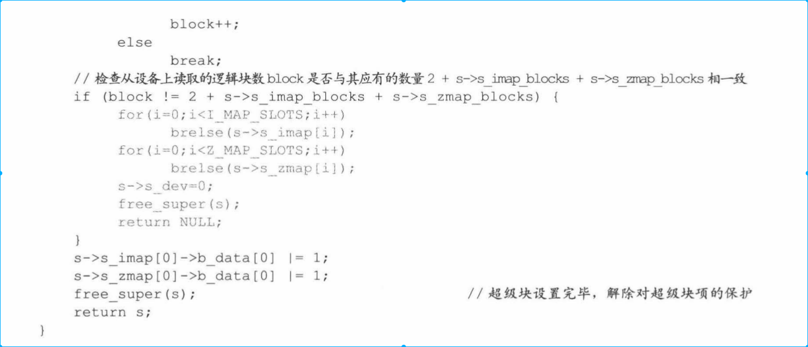

## 2.2 确定根文件系统挂载点
再次调用namei()函数，根据/mnt路径名，获取mnt目录文件的i节点后，分析i节点属性，判断i节点是否可以用来挂载文件系统。

代码分析见上面

## 2.3 超级块和根文件系统挂接
挂接前确保挂接点和被挂接点都是“干净的”
    * hdl设备的文件系统没有被安装过
    * mnt 目录文件上也没有安装其它文件系统
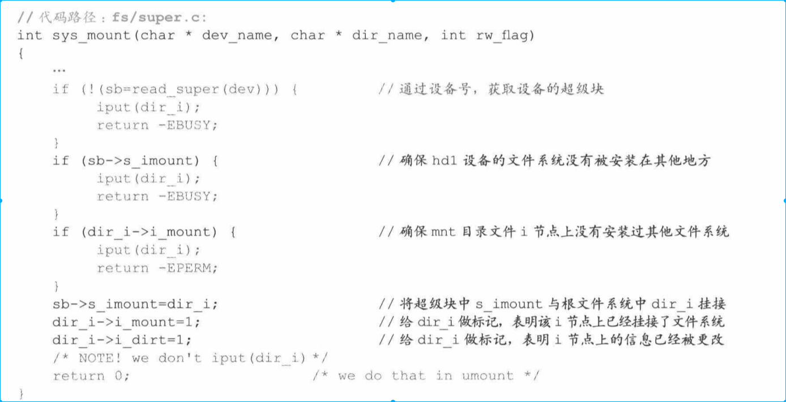

# 3. 实例1--用户打开一个在硬盘中已经存在的文件，并读取文件内容
主要分为两部分，打开文件和读文件


## 3.1 打开文件
打开进程本质是某个进程操作文件，需要如下两步:
* 将用户进程中的task_struct中的filp[20]和内核中的file_table[64]进行登记
* 用户需要打开的i节点在file_table[64]进行登记

### 3.1.1 filp[20],file_table[64],i节点三者之间关系
* filp[20]记录进程打开的文件数，一个进程可以打开多个文件，也可以打开同一文件多次。没打开一次，filp[20]就记录一项，因此一个进程最多能同时打开文件20次

* file_table[64]是记录所有进程打开文件的数据结构，和filp[20]一样也是记录打开文件次数。系统最多能同时打开文件次数64次。

* i节点是记录文件属性最关键结构，操作系统中i节点和文件是一一对应的，找到i节点就能找到唯一文件。内核通过inode_table[32]掌握正在使用的文件i节点数，每个被使用的i节点都要记录其中。

打开文件其实就是建立三者数据结构之间关系。open()函数映射到sys_open()系统调用实现上面关系建立。
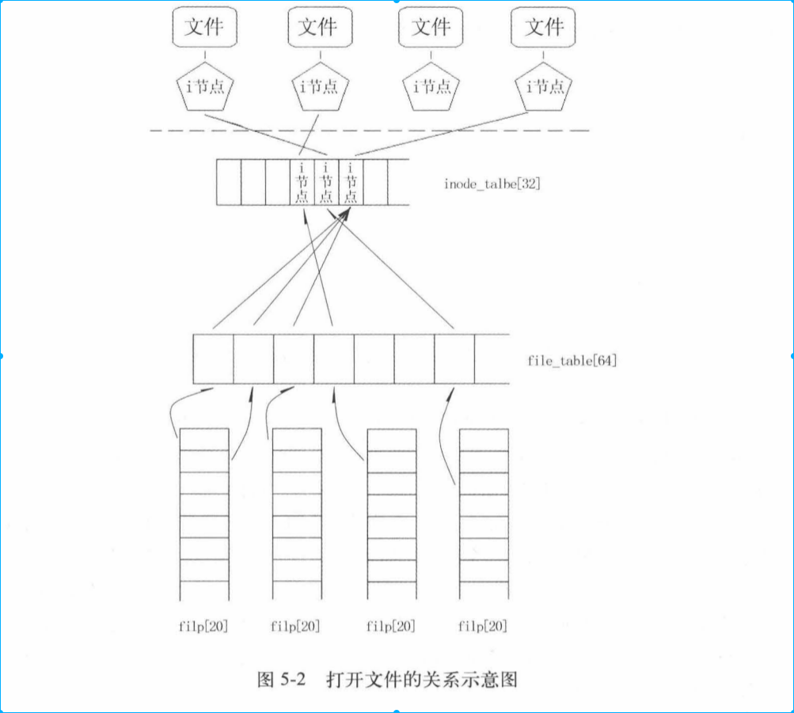

## 3.2 filp[20]file_table[64]挂接

sys_open()中实现挂接。

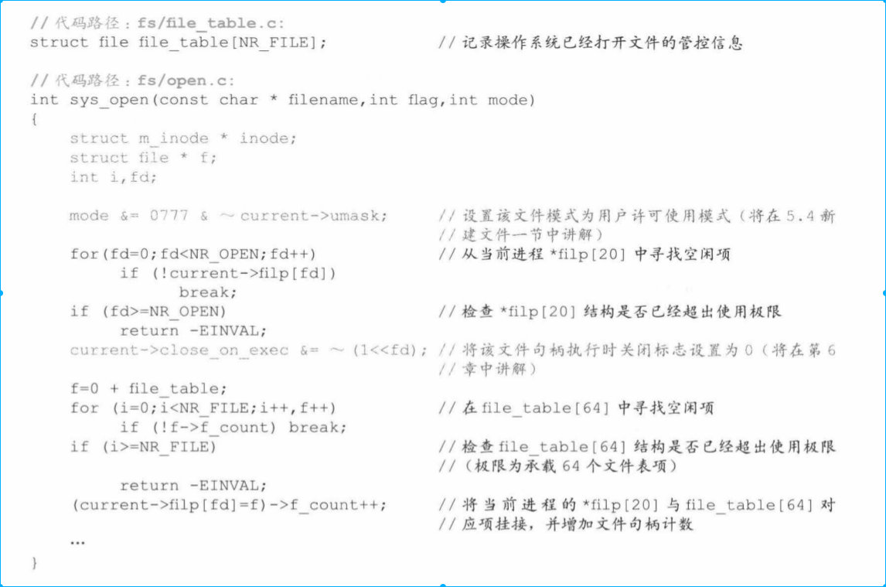

## 3.3 获取文件i节点

主要根据文件路径名找到文件i节点。
这次找i节点和前面找i节点过程不一致，因为这次文件是存储在硬盘中。查找过程如下：
寻找i节点->通过i节点找到目录文件->
通过目录文件找到目录项->通过目录项找到目录文件i节点号->
通过目录文件找到目录项->通过目录项找到目录文件i节点号->
...
循环下去，最终找到hello.txt文件
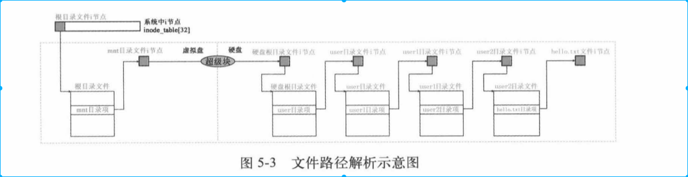

### 3.3.1 获取目录文件i节点
#### 3.3.1.1 进入open_namei()
* 进入open_namei()函数后，先对用户所要打开文件设置参数mode、flag，执行代码如下。

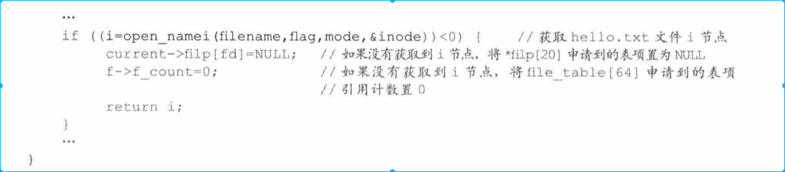
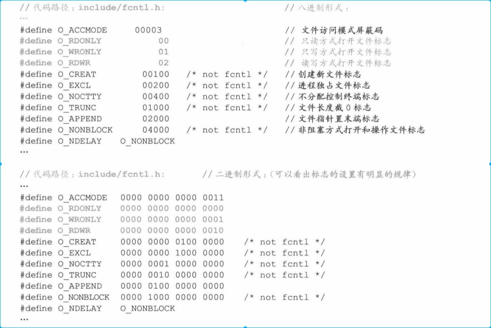


* dir_namei()函数分析用户给出路径，获取最后一个目录文件的i节点（树梢i节点）

#### 3.3.1.2 open_namei()->dir_namei()
* 上面get_dir()函数主要是为了获取树梢i节点
* 下面的通过指向路径的字符串指针，获取文件名和文件名长度


#### 3.3.1.3 open_name()->dir_namei()->get_dir()
get_dir()函数之前描述过，原理是不断通过i节点找到目录项，再通过目录项获取i节点过程。
* find_entry()获取目录项
* iget() 通过目录项获取i节点

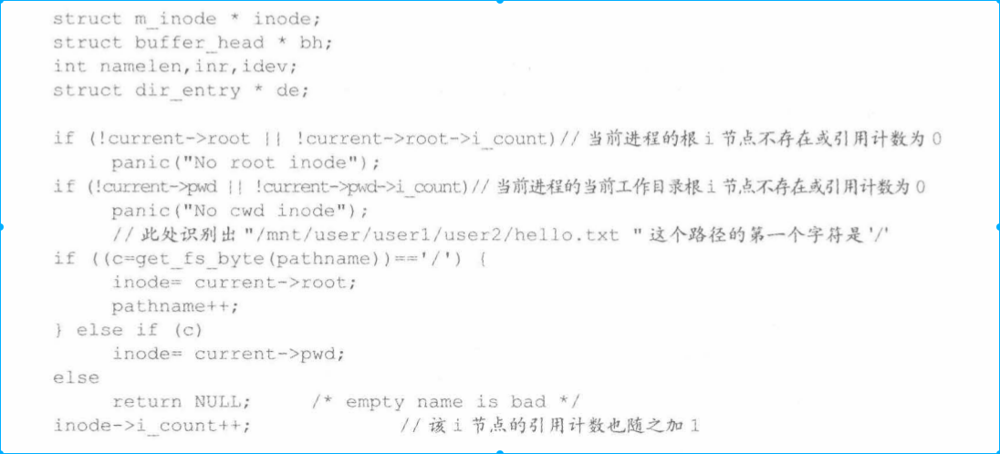
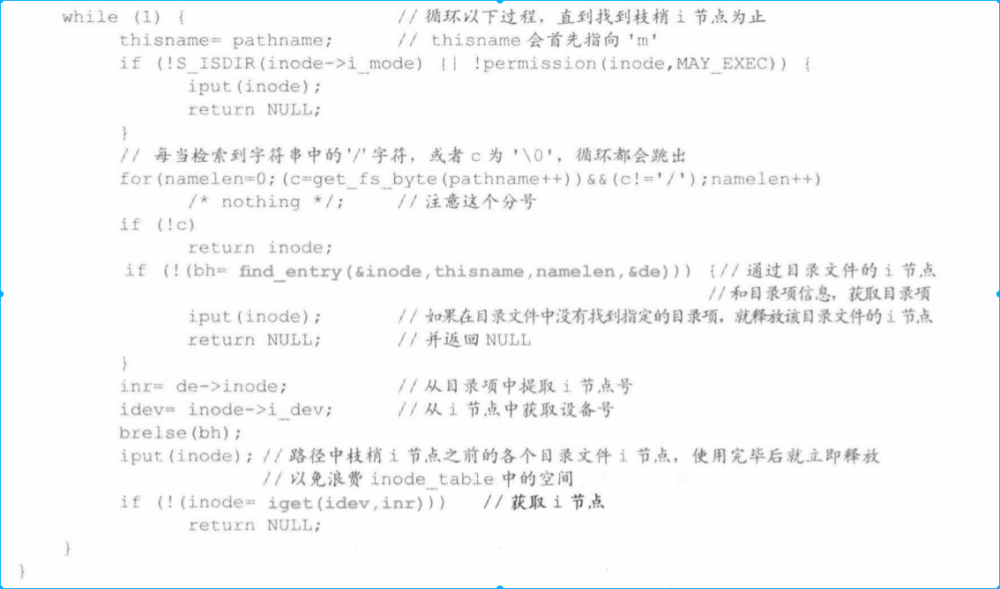

#### 3.3.1.4 open_name()->dir_namei()->get_dir()->find_entry()
find_entry()首先通过目录文件i节点确定目录文件中有多少个i节点，确定目录文件中有多少个目录项，之后从目录文件第一个逻辑块开始，不断将该文件逻辑块内容读到缓冲区，并从中查找指定的目录项，直到找到为止。


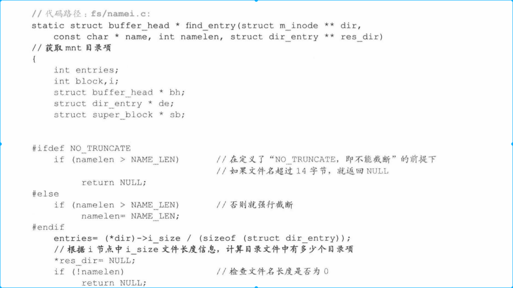


#### 3.3.1.5 open_name->dir_namei()->get_dir()->iget()
iget函数是根据目录项中提供的i节点号和设备块号来获取i节点。
* 现在inode_table[32]寻找是否有i节点，如果有就直接使用,如果找不到就加载。
* 如果发现i节点已经装上文件系统，将该文件系统根i节点载入，这个根i节点就成为在另一个文件系统查找起点。

下面代码是获取mnt的i节点（挂载的文件系统）
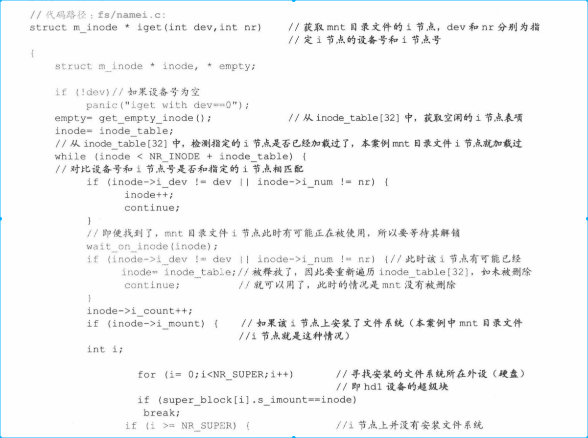
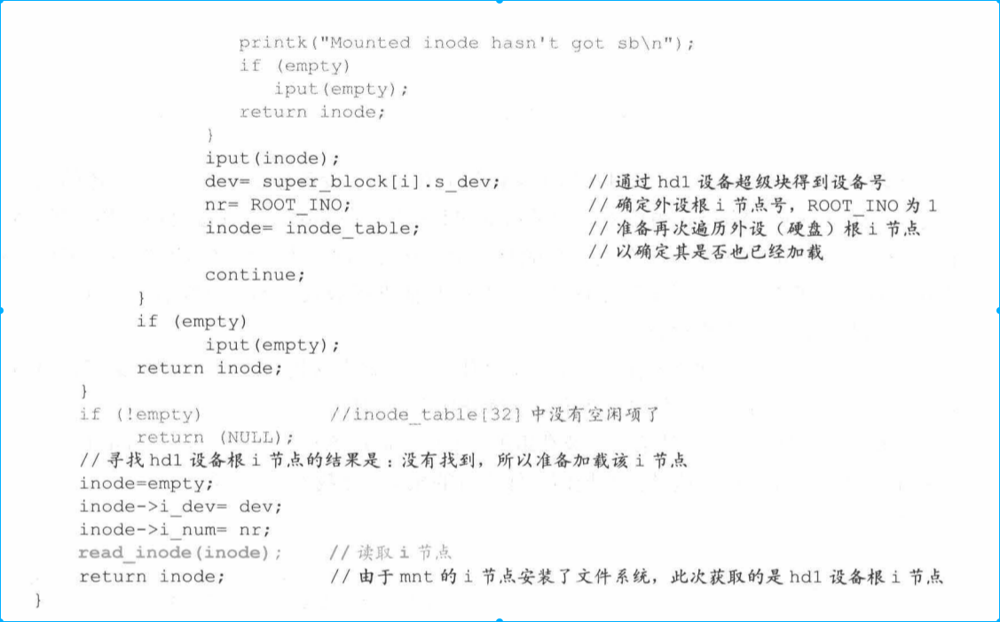

通过read_inode()函数，从外设上（硬盘）读取i节点，载入inode_table[32]中。
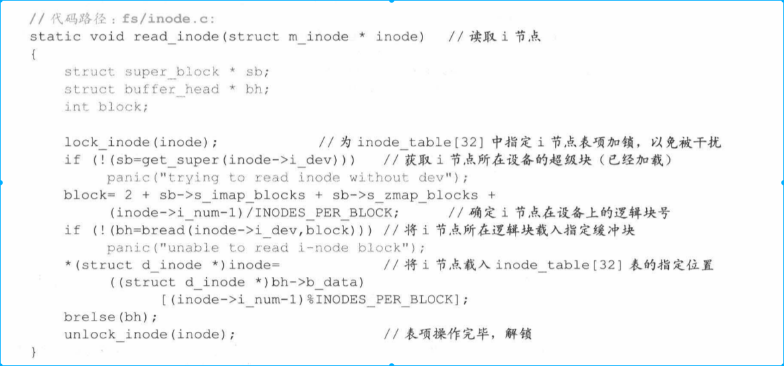
获取磁盘文件系统根i节点后，get_dir()将不断调用find_entry()函数，iget()函数，最终到到树梢i节点。
最终函数返回到open_namei()，获取树梢i节点和文件名及长度。

### 3.3.2 获取目标文件i节点
获取文件i节点和之前获取目录文件方式基本一致，也是调用find_entry()和iget()获取目录文件i节点。
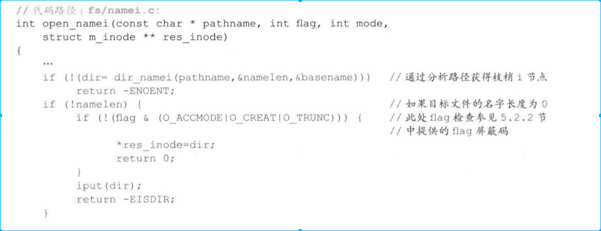
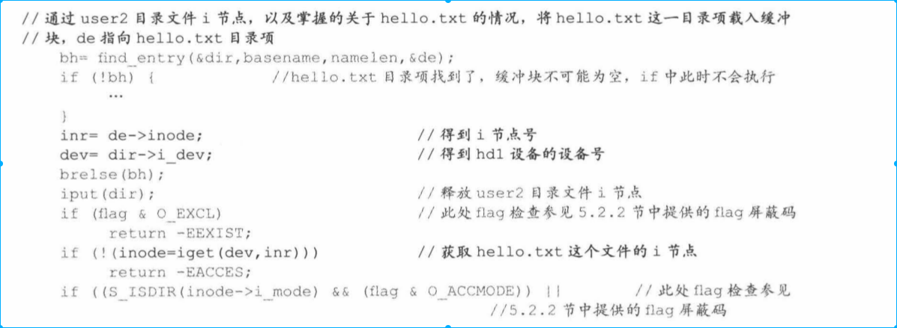
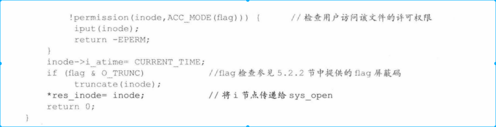

这里已经获取到目标文件i节点，下面将i节点和目标file_table[64]挂接

### 3.3.3 将i节点与file_table[64]挂接
* 现在我们已经将目标文件i节点已经载入到inode_table[32]中，现在要将indoe[32]和file_table[64]挂接。
* 此外，操作系统还对文件的属性、引用计数、读写指针偏移进行设置。
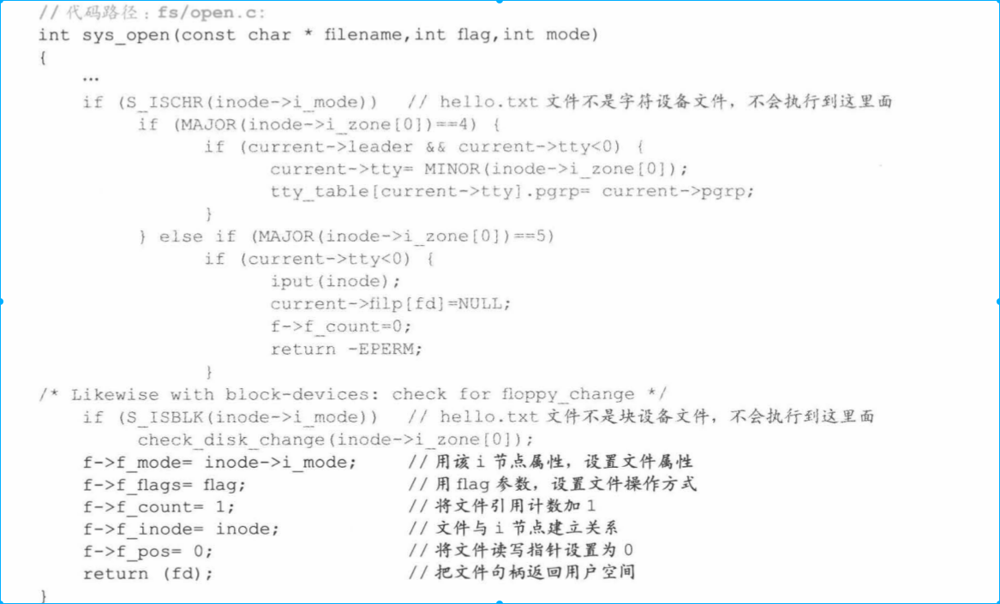

到此，file_table[64]一边和filp[32]进行绑定，一边和indoe_table[32]绑定。
建立绑定关系后，操作系统把fd返回给用户进程，fd是file_table[64]偏移量，即文件句柄。

至此，打开文件结束。

## 3.4 读文件
由read完成读文件操作。read()函数映射到sys_read()中执行，在执行文件之前，先对操作可行性进行检查，包括用户传进来的文件句柄，读取文件大小，和用户进程是否有足够空间写入。如果检查都通过，再执行file_read()主体函数。
```
int size= read ( fd , buffer , sizeof(buffer ))；
```

### 3.4.1  确定数据块在外设中位置
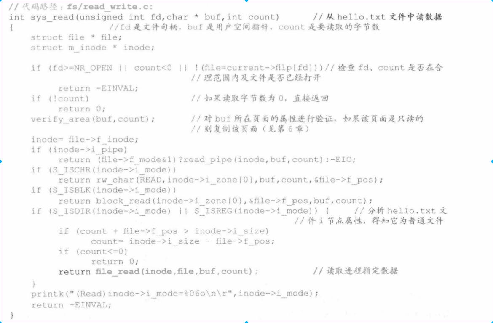
#### 3.4.1.1 file_read()->bmap()
file_read()通过调用dmap()函数来确定指定文件数据在块设备上的逻辑块号。执行代码如下：
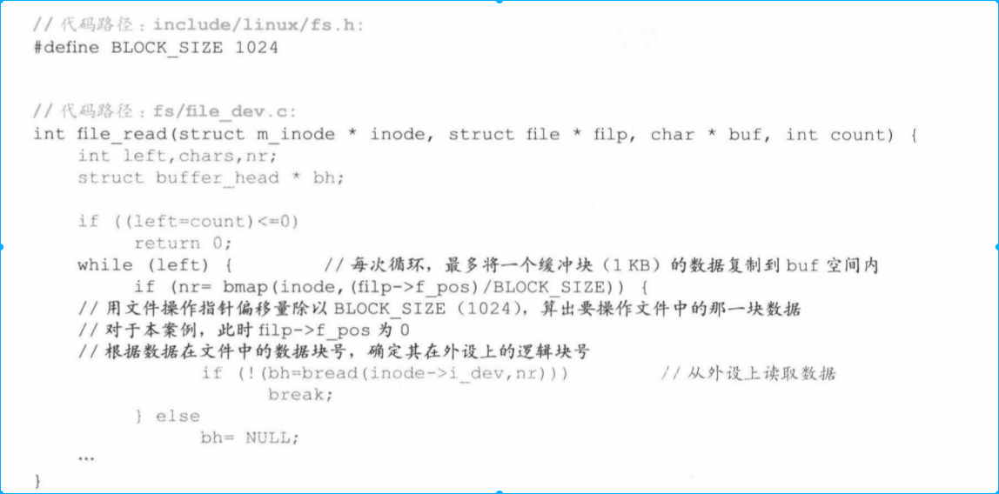

bmap()函数会调用_bmap()函数，其中增加了一个参数。
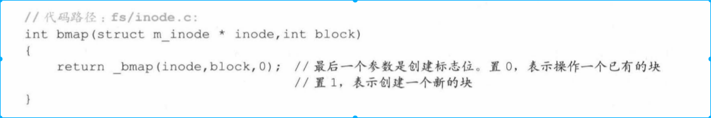

#### 3.4.1.2 i节点是如何管理文件的
i节点是通过i_zone结构体来管理数据块文件。
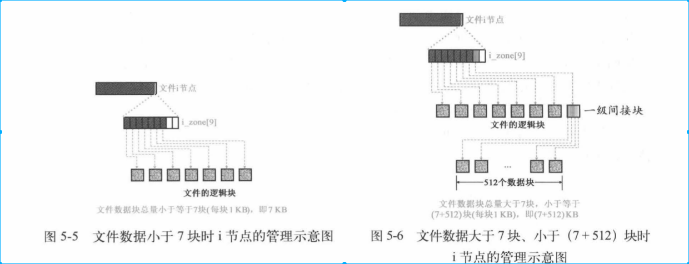
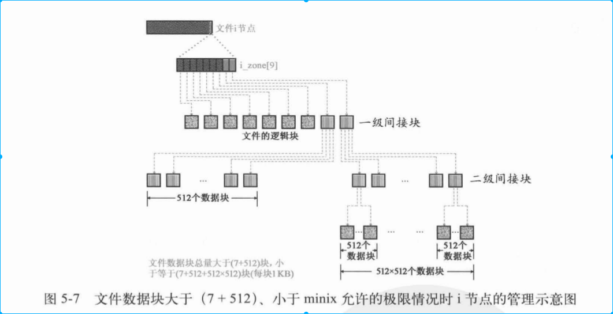
* 块数分为3种类型，7块，7+512,7+512+512*512，三种类型等级（1块是1K）

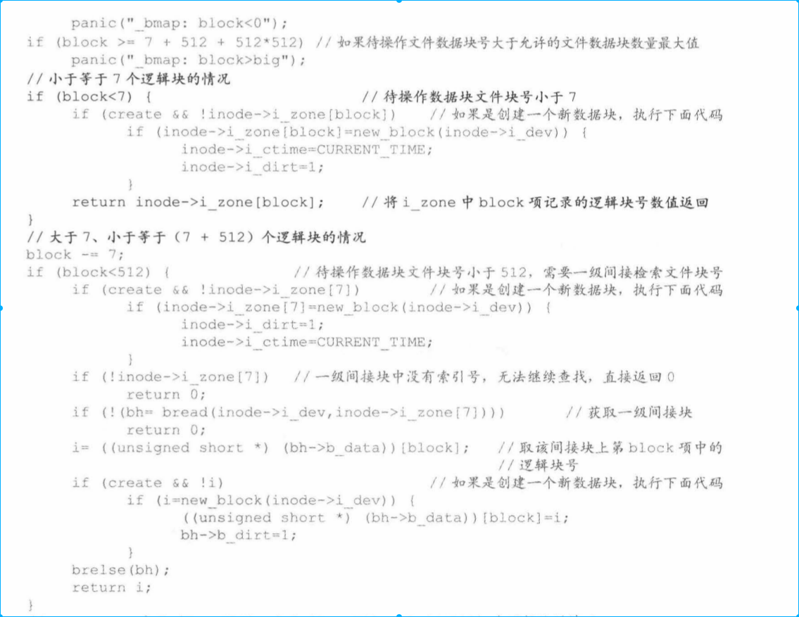
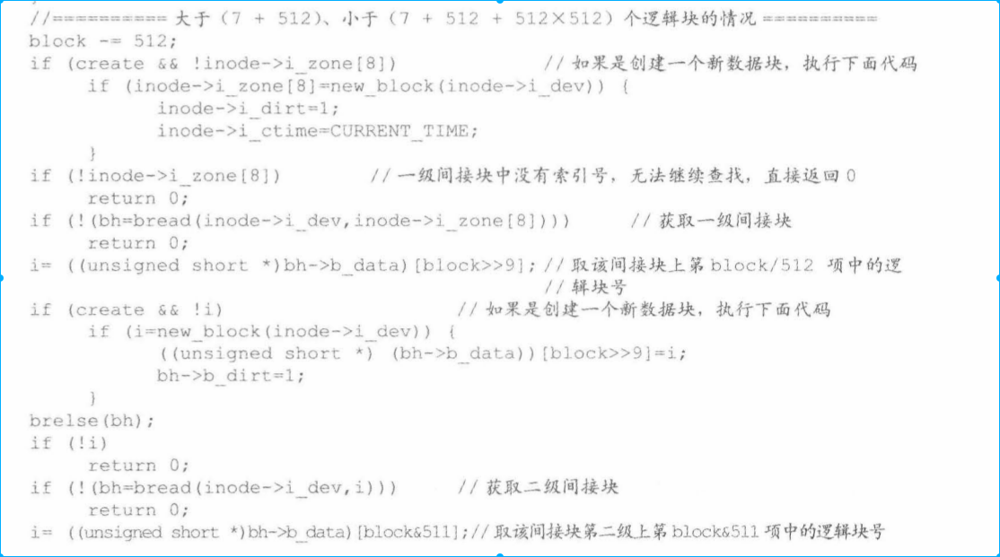


### 3.4.2 将数据块读入缓冲块 file_read()->bread()
将数据块读入缓冲区块。
调用bread()函数将硬盘中文件的第一个块读入到缓冲区。bread()详细执行过程之前已经介绍过。
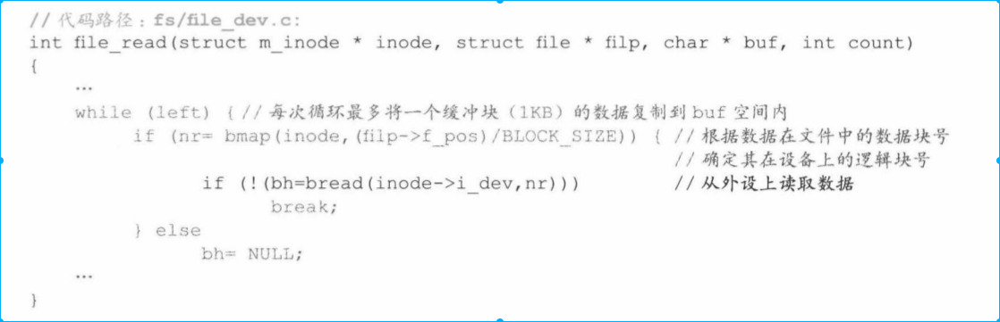

### 3.4.3 将缓冲区块中的文件复制到进程空间
数据载入缓冲区后，系统要将其从缓冲区复制到指定的进程空间数据区内（*buf）
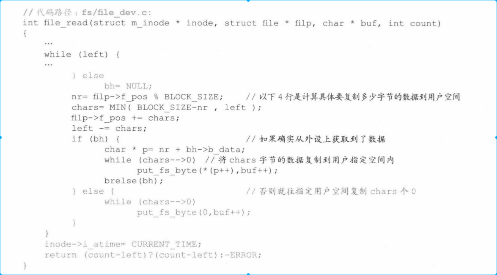

