<!-- TOC -->

- [1. 背景](#1-背景)
- [2. 管道机制](#2-管道机制)
    - [2.1 管道的创建过程](#21-管道的创建过程)
        - [2.1.1 为管道文件在file_table[64]中申请空闲项](#211-为管道文件在file_table64中申请空闲项)
        - [2.1.2 进程中task_struct的filp[20]和file_table[64]挂接](#212-进程中task_struct的filp20和file_table64挂接)
        - [2.1.3 创建管道文件i节点](#213-创建管道文件i节点)
        - [2.1.4 将i节点和file_table[64]建立联系](#214-将i节点和file_table64建立联系)
        - [2.1.5 将管道文件句柄返回给用户进程](#215-将管道文件句柄返回给用户进程)
    - [2.2 管道操作](#22-管道操作)
        - [2.2.1 读管道进程开始操作文件](#221-读管道进程开始操作文件)
        - [2.2.2 写管道进程向管道中写数据](#222-写管道进程向管道中写数据)
        - [2.2.3 写管道进程继续向管道中写入数据](#223-写管道进程继续向管道中写入数据)
        - [2.2.4 写管道进程已将写管道空间写满](#224-写管道进程已将写管道空间写满)
        - [2.2.5 写管道进程挂起](#225-写管道进程挂起)
        - [2.2.6 读管道进程从管道中读出数据](#226-读管道进程从管道中读出数据)
        - [2.2.7 读管道进程继续执行，不断从管道数据中读出数据](#227-读管道进程继续执行不断从管道数据中读出数据)
        - [2.2.8 读管道进程执行中发生中断](#228-读管道进程执行中发生中断)
        - [2.2.9 写管道进程挂起，切换到读管道进程中执行](#229-写管道进程挂起切换到读管道进程中执行)
        - [2.2.10 读管道进程继续执行，直到把管道中的数据读完](#2210-读管道进程继续执行直到把管道中的数据读完)
- [3. 信号机制](#3-信号机制)
    - [3.1 信号的使用](#31-信号的使用)
        - [3.1.1 processing 进程开始执行](#311-processing-进程开始执行)
        - [3.1.2 processing函数进入可中断状态](#312-processing函数进入可中断状态)
        - [3.1.3 sendsig进程开始执行，并向processing进程发送信号](#313-sendsig进程开始执行并向processing进程发送信号)
        - [3.1.4 系统检测当前进程接收到信号并处理](#314-系统检测当前进程接收到信号并处理)
        - [3.1.5 系统检测信号处理函数指针挂接是否正常](#315-系统检测信号处理函数指针挂接是否正常)

<!-- /TOC -->
# 1. 背景
这章非常重要，通信的速度在超算领域有非常多的优化地方。前提是理解通信的基本原理。

* 前面讲述过，通过进程隔离来实现进程保护，但是进程之间通信好像和进程保护的思想相悖。

* 如何才能做到不破坏进程保护，又能实现进程间通信的合理要求。linux0.11设计两套方法，一套是管道机制，一套是信号机制。

# 2. 管道机制
为了体现对进程保护，在不跨越进程边界检查前提下实现进程通信，linux0.11绕过对进程的边界保护，设计了管道机制。

一个管道运行两个进程交互数据，一个进程向管道输入数据，一个进程向管道输出数据。该机制实现进程间通信，同时不需要非法跨越进程边界。

操作系统在为每个管道开辟一个内存，给这个页内存分配文件属性(为什么赋予文件属性，下一章讲解)。折页由两个进程共享，但不会分配给任何进程，只由内核掌握。

在linux0.11中，管道操作分为两部分，创建管道和读写管道。
* 下面例子中pid值区分父子进程针对是用的非常经典。

## 2.1 管道的创建过程

* 从技术来看，管道就是一页内存，但进程要以文件的方式对其进行操作，这就要求折页内存具备文件属性，并减少页属性。
    * 具备文件属性表现为，创建管道相当于创建一个文件，filp[20],file_table[64],inode_table[32]以及之间的挂接都需要完成。最终要使进程知道自己操作的是一种管道类型的文件就行，其它的都不需要操作。

    * 减少页属性表现在管道毕竟要作为一个文件使用，进程不能像访问进程空间数据访问它，不能映射到进程的线性地址空间。另外，两个进程操作这个页面，必须一个读一个写，不能产生页写保护异常把页复制一份，否则无法共享管道。

### 2.1.1 为管道文件在file_table[64]中申请空闲项
* 创建文件是为当前进程服务（一个），管道文件就是两个进程服务

上面例子，管道是由父进程创建的，父进程创建管道时，处处为子进程着想，使得子进程一旦创建完毕就有操作管道能力。

父进程先在file_table[64] 申请两个空闲项，并将这两个空闲项的引用计数设置为1，表示他们被引用了，父子进程以后操作管道文件各用一项。

### 2.1.2 进程中task_struct的filp[20]和file_table[64]挂接

父进程filp[20]挂接file_table[64]后，子进程继承父进程的关系。

### 2.1.3 创建管道文件i节点
* 创建file_table[64]和inode节点之间关系
* 调用get_pipe_inode()先为该管道文件在inode_table[32]申请一个i节点，执行代码如下

* 由于管道不是文件，本质上是一个内存页面，  并将该页面地址载入i节点。值得注意的是， inode_size不再是文件大小，而是内存页面的起始地址

* 读写指针都指向内存页起始地址（inode_size）
* 设置indoe类型为管道类型，方便以后标识管道类型的特殊性

### 2.1.4 将i节点和file_table[64]建立联系
* file_table[64]申请的两个空闲项都指向这个inode节点,第一个空闲指针设置为读，第二个空闲指针设置为写。

### 2.1.5 将管道文件句柄返回给用户进程
现在将管道文件的两个句柄返回给用户进程（用户进程无法直接操作filp[20],因为实在内核区），即实例中的fd[2].
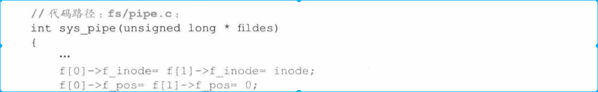
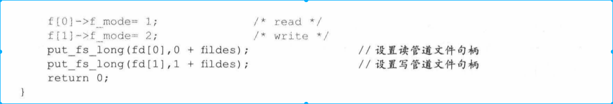

## 2.2 管道操作
linux 0.11管道操作的效果是:
* 读管道进程执行时，如果管道中有未读数据就读数据，没有未读数据就挂起。
* 写管道执行时，如果管道中有剩余空间，就继续写数据，没有剩余空间，就挂起。
* 管道只有一个页面，如果读写指针到页面微端，读写指针要回滚到页面首端以便继续操作。

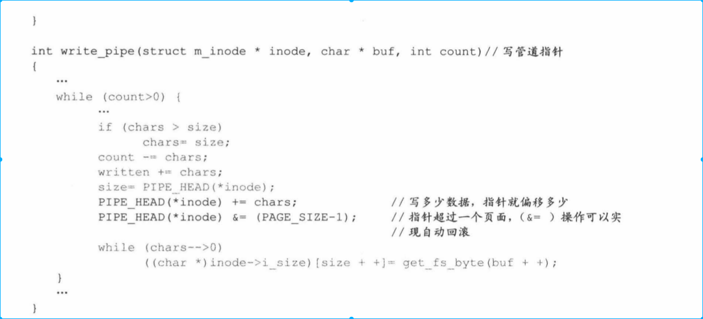

在不断回滚操作的前提下，控制写入和读取，以及将进程唤醒和挂起的代码如下。
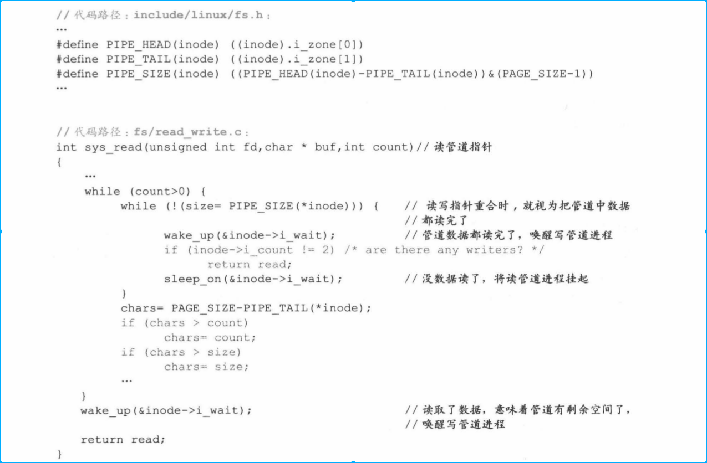
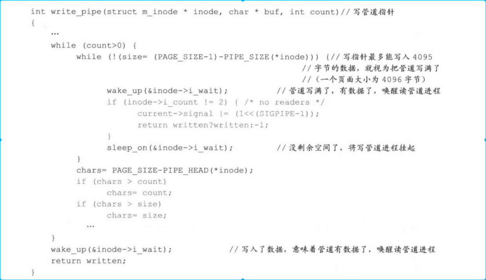

当管道中所有空间被写满时，写管道指针回滚一圈，与读管道指针差1字节，这时应该把写管道进程挂起。linux 0.11将sys_write()函数设计为写管道进程一次最多只能写4095字节。

### 2.2.1 读管道进程开始操作文件
假设读管道进程开始执行，此时管道中没有任何数据，执行read()->sys_read()->read_pipe()时会因为管道中没有任何数据被挂起。

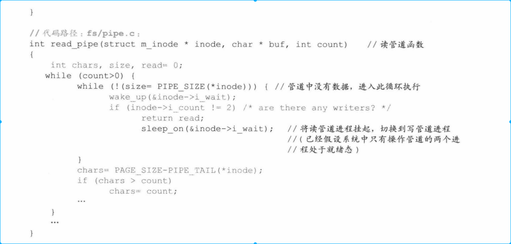

### 2.2.2 写管道进程向管道中写数据
切换到写管道进程中执行，write()->sys_write()->write_pipe(),写完后管道中就有数据可以读出，唤醒读管道进程。
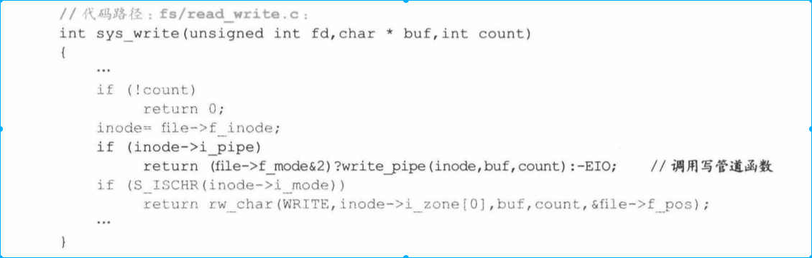
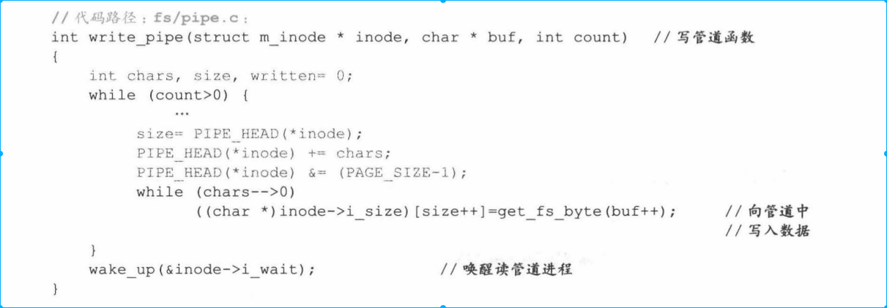

### 2.2.3 写管道进程继续向管道中写入数据
当前进程是写管道进程，写完一次管道之后将会返回用户空间。有例子中的for(i = O;i< 1 OOOO;i++）我们知道一共要写10000次，写管道进程时间片还没有用完，还需要继续执行写管道。

### 2.2.4 写管道进程已将写管道空间写满
不放在写管道进程工作过程中，发生了时间中断，消减了它的时间片，只要时间片不被消减为0，就会继续执行。
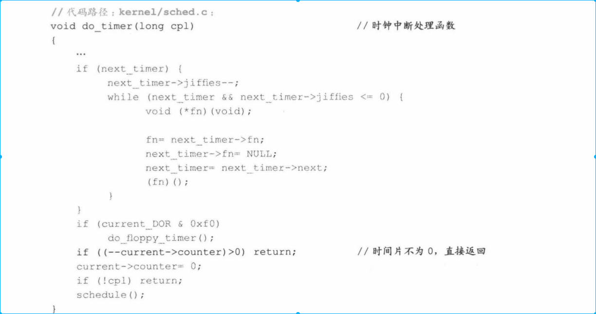

### 2.2.5 写管道进程挂起
写满后，系统要将写管道进程挂起，切换到读管道进程中执行。
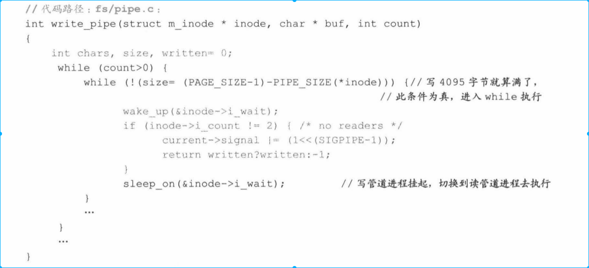

### 2.2.6 读管道进程从管道中读出数据
读管道进程开始执行read_pipe()函数，这次会将512个字节读入管道进程的用户空间。
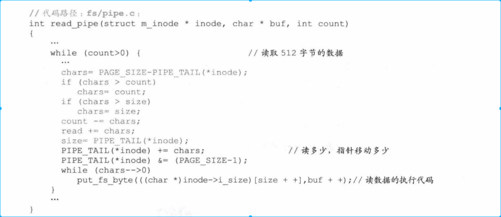

读出数据，意味着有了剩余空间，系统此时会唤醒写管道进程
* 唤醒管道进程不是立马切换到写管道进程执行，只是将写管道进程改成就绪态，此时任然是读管道进程在运行
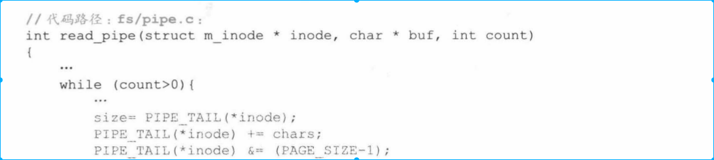

### 2.2.7 读管道进程继续执行，不断从管道数据中读出数据
由于for循环20000次，因此读管道进程会不断的从管道中读数据，直到时间片为0

### 2.2.8 读管道进程执行中发生中断
假设在读管道进程工作过程中，也发生了时间中断，消减了她的时间片。读进程时间片为0之后，切换到写管道进程中继续执行。
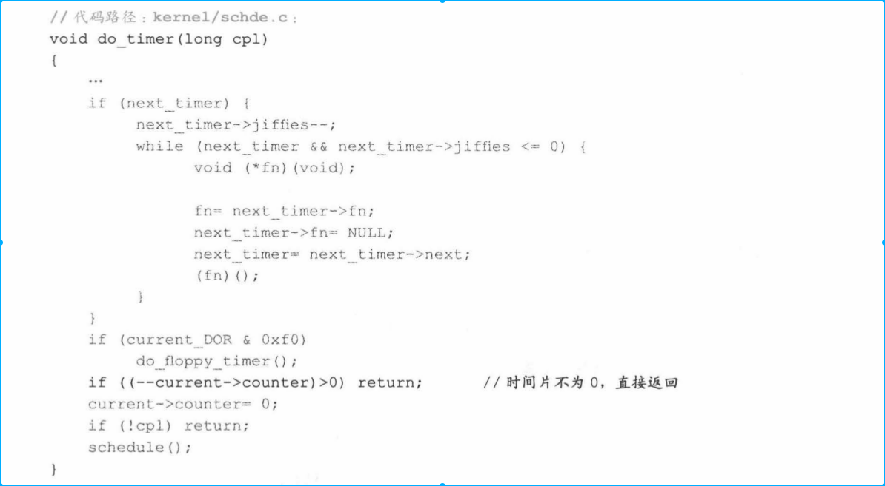

### 2.2.9 写管道进程挂起，切换到读管道进程中执行
* 假设，写管道进程时间片再次用完。此时读写管道进程时间片都为0，那么需要再分配时间片。
* linux0.11规定，当所有就绪态进程时间片都是0时，就分配进程。
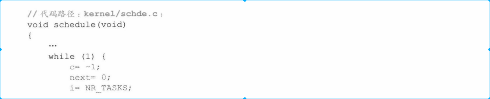
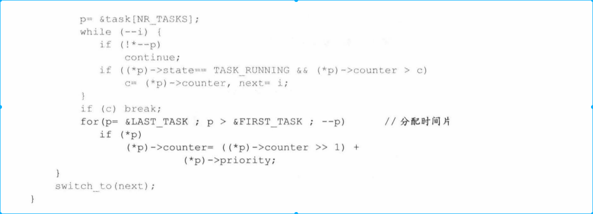

### 2.2.10 读管道进程继续执行，直到把管道中的数据读完
读管道进程开始执行后，继续将管道中的数据读出，当操作到管道尾端，也会将管道指针从尾端移动到首端，并从首端继续读管道中内容，知道彻底读完管道中数据，使读写指针重合。

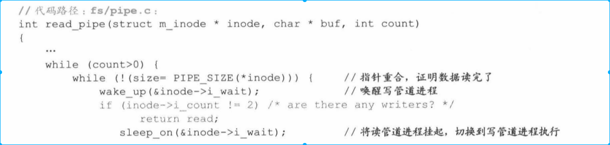
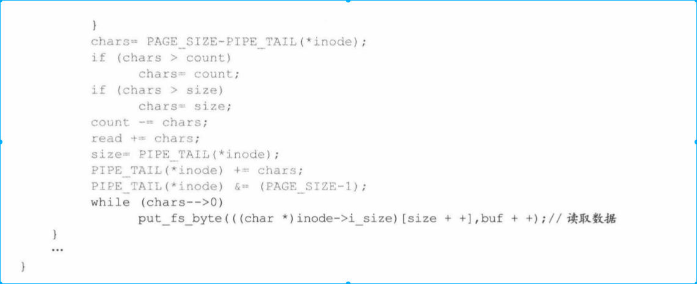

* 进程数量不超过64，打开文件不超过file_table[64],就能创建任意的管道数

# 3. 信号机制
* 信号机制是进程在执行过程中，如果系统发现某个进程收到了信号，就暂时打断进程的执行，转去执行该进程的信号处理程序。处理完毕后，再从进程“被打断”之处执行。

本节分两部分对信号量机制进行详细介绍
* 通过下面例子，对系统和进程处理信号的过程进行详细介绍
* 系统通过对信号的分析，改变对进程的执行过程

这是一个信号发送、接收、处理实例。假设有两个进程分别用于发送和接受处理信号。
* processing:接收信号

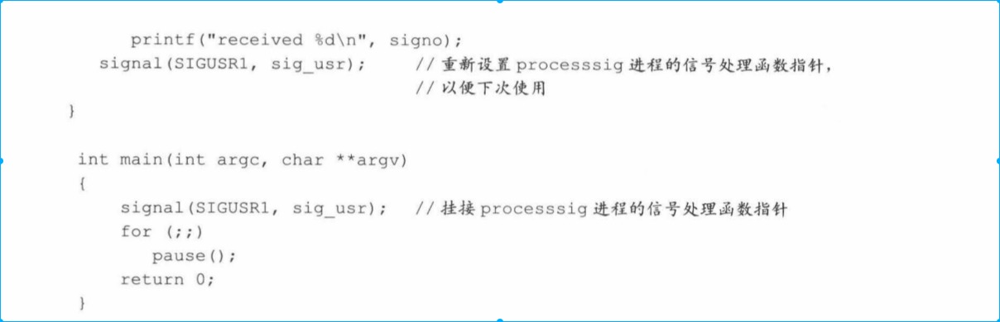
* sending:发送信号
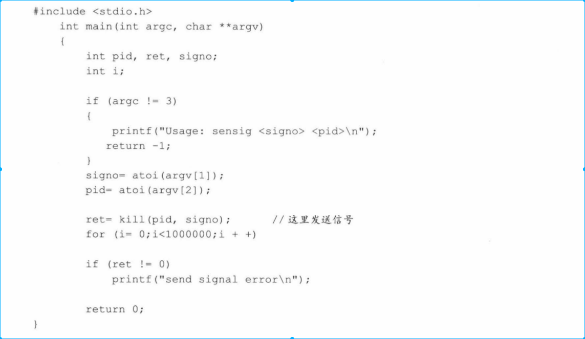

系统需要支持下面三个功能，才能支持信号量机制：
* 系统支持信号的接收和发送
    * 每个task_struct都设置用户接收信号的数据成元signal（信号位图），每个进程接收的信号就“按位”存储在这个数据结构中
    * 系统支持两种方式发送信号
        * 一种是调用特定函数库给另一个进程发送信号
        * 另一种是用户键盘输出信息后产生键盘中断后，中断服务程序给进程发送信号
        * 这两种方式原理相同，都是通过设置信号位图上的信号位来实现的
    
* 系统要及时检测到进程接收到信号，有两种方式检测进程是否接收到信号
    * 一是系统调用返回之前检测当前进程是否接收到信号
    * 另一种是时钟中断产生后，中断服务程序执行接收之前，检测当前进程时候接收到信号。
    * 两种方式检测过程一致，本例通过第一种方式来展现系统对进程对接收信号的检测。

* 系统支持进程对信号处理
    * 当进程不需要处理信号时，信号处理函数完全不参与用户进程执行
    * 当用户进程需要处理信号时，进程的程序将暂时停止执行，转而去执行信号处理函数，待信号处理函数执行完毕后，进程程序将从“暂停的现场处”继续执行

本例将从用户自定义的信号处理函数与进程进行绑定，系统对信号的预处理，信号处理完毕后的现场恢复三个方面展现系统是如何做到这些的。

下面是两个进程是如何开始运行的
* ./processing &(显示执行的进程号是160)
* ./sendsig 10 160(10代表的是SIGUSR1信号，160代表processing进程ID)

## 3.1 信号的使用
### 3.1.1 processing 进程开始执行
* processing 开始执行时，要为接收信号做准备，具体表现为对那种信号进行什么样的处理
* 进入main函数后，先将用户定义的信号处理函数与processing进程绑定。用户调用signal实现这个绑定。signal是一个系统调用，发生int0x80，并映射到sys_signal()这个系统调用函数执行

* 进入sys_signal()函数后，系统先要检测在绑定之前检测用户指定的信号是否符合规定。linux0.11只能处理32种信号，而且默认忽略SIGKILL这个信号
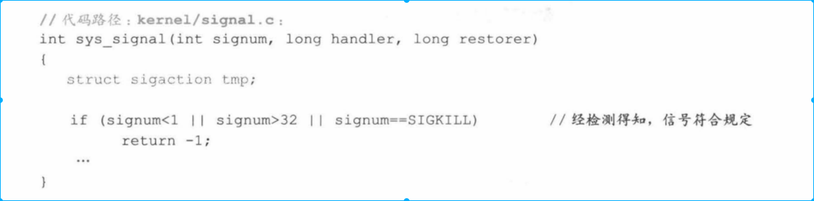

* 检测完毕，开始对processing进程task_struct中的sigaction[32]进行设置，该管理结构有32个成员，正好对应32中信号。sigaction[32]每一种成员都会为每一种信号处理提供一种服务。
    * restore()函数也在sys_signal()函数中绑定了，restore()函数功能页非常重要

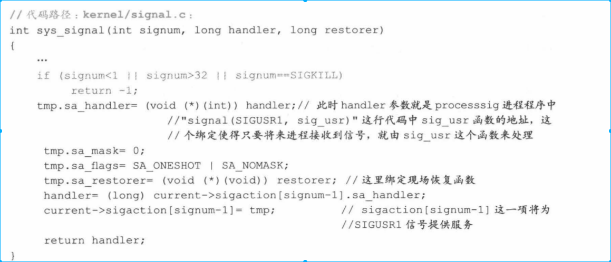

### 3.1.2 processing函数进入可中断状态
为了体现信号对进程状态影响，这里特意调用pause()将进程由就绪态转变成可中断状态，等到进程收到信号后，进程由可中断切换成就绪态。

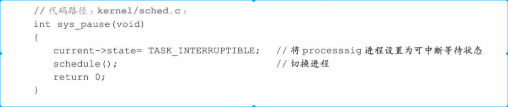

### 3.1.3 sendsig进程开始执行，并向processing进程发送信号
processing进程暂时挂起，sendsig进程执行， sendsig进程会给processing进程发送信号然后切换到processing进程执行。

* 执行kill(pid,signo)这行代码，其中kill是一个函数库，最终映射到sys_kill函数中去执行
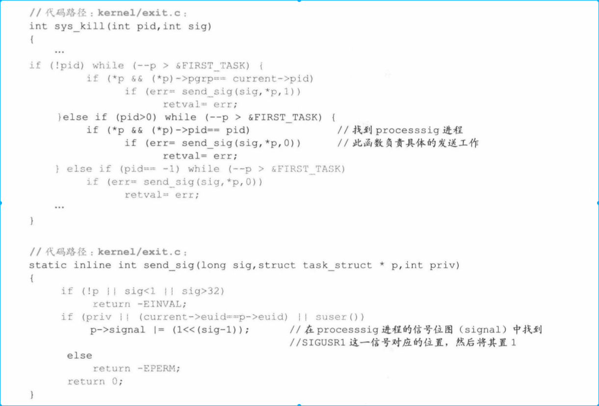

* 之后继续在sendsig进程空间随着时间中断不断产生，sendsig进程时间片被消减为0，调用导致进程切换schedule()函数开始执行
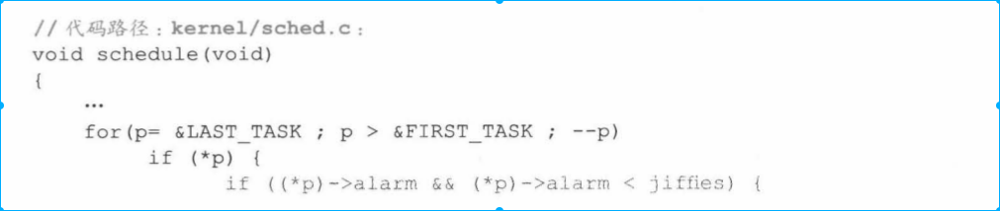
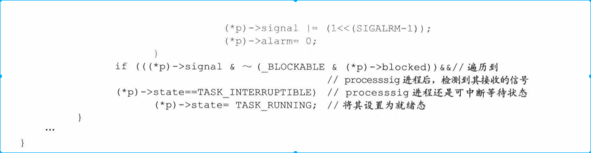

* 等到第二次遍历时，就切换到processing执行
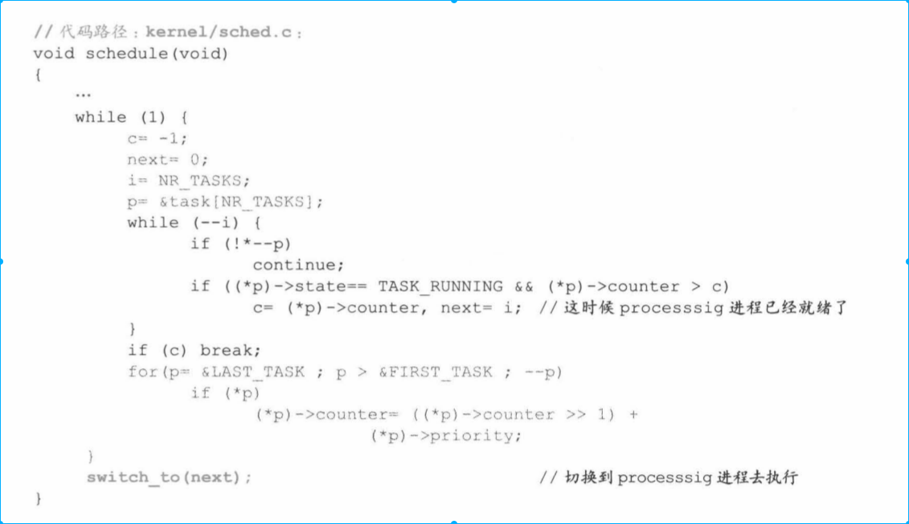

### 3.1.4 系统检测当前进程接收到信号并处理
processing进程开始执行后，会继续在for(){pause()},这个函数会最终映射到sys_pause()系统调用中执行，所以当系统调用返回时，就一定会执行到ret_from_sys_call标号处，最终调用do_signal,开始处理processing进程信号。

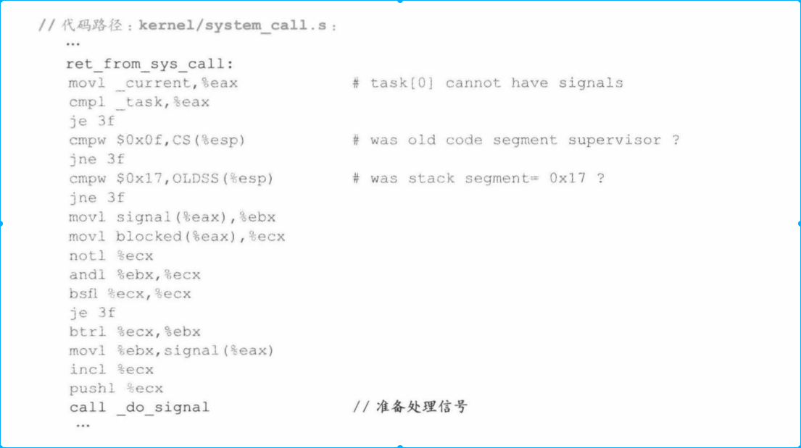

### 3.1.5 系统检测信号处理函数指针挂接是否正常
现在开始介绍信号处理之前准备工作。
进入do_signal()函数后