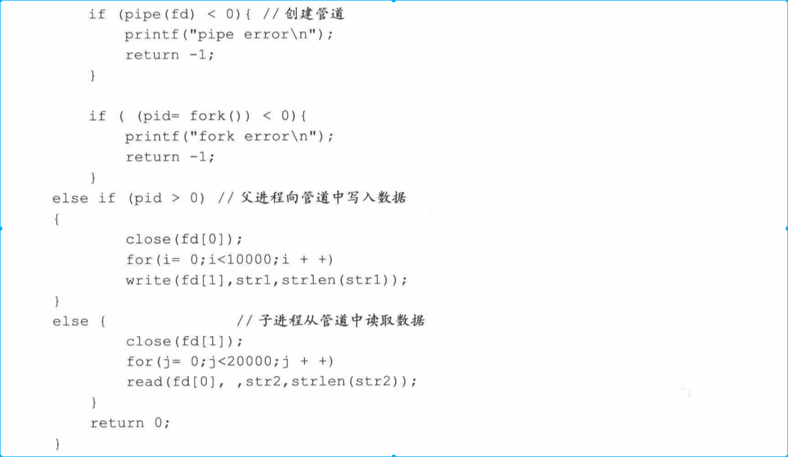
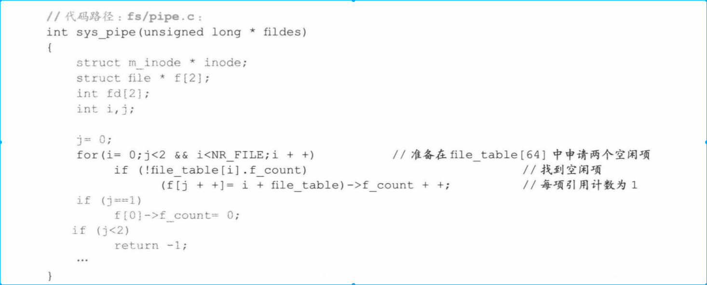
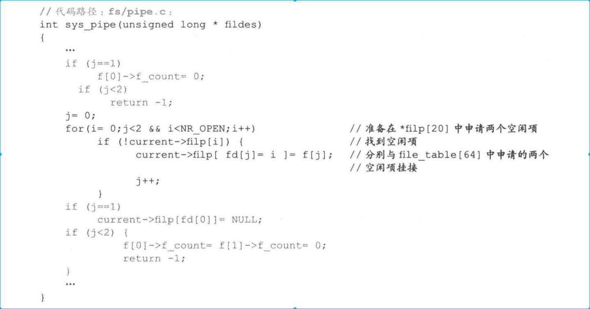
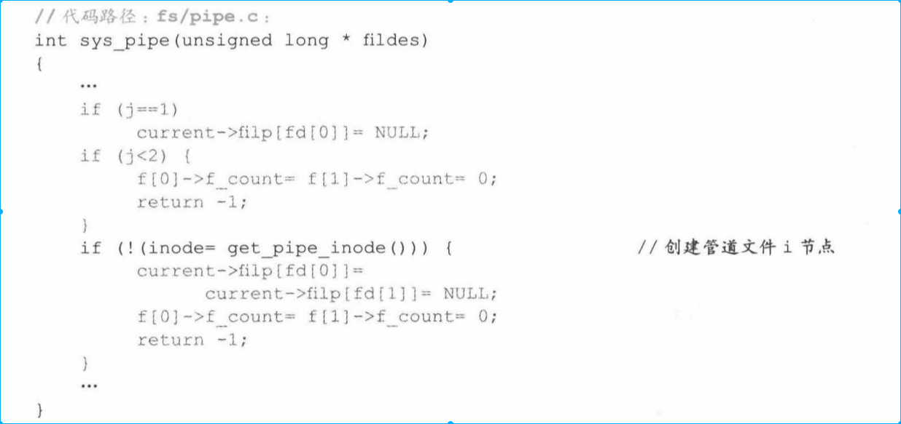
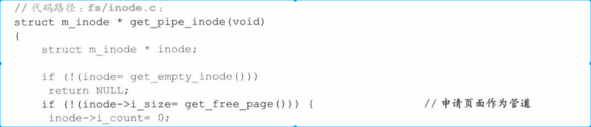
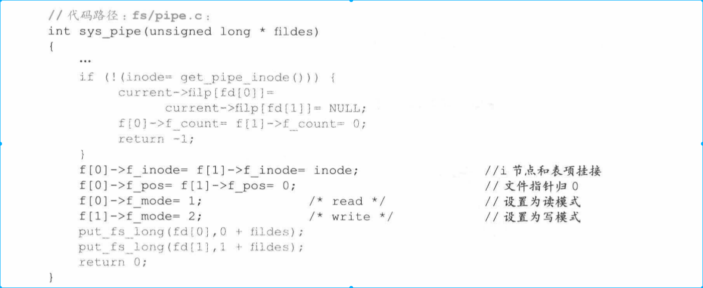

<!-- TOC -->

- [1. 背景](#1-背景)
- [2. 管道机制](#2-管道机制)
    - [2.1 管道的创建过程](#21-管道的创建过程)
        - [2.1.1 为管道文件在file_table[64]中申请空闲项](#211-为管道文件在file_table64中申请空闲项)
        - [2.1.2 进程中task_struct的filp[20]和file_table[64]挂接](#212-进程中task_struct的filp20和file_table64挂接)
        - [2.1.3 创建管道文件i节点](#213-创建管道文件i节点)
        - [2.1.4 将i节点和file_table[64]建立联系](#214-将i节点和file_table64建立联系)
        - [2.1.5 将管道文件句柄返回给用户进程](#215-将管道文件句柄返回给用户进程)

<!-- /TOC -->
# 1. 背景
这章非常重要，通信的速度在超算领域有非常多的优化地方。前提是理解通信的基本原理。

* 前面讲述过，通过进程隔离来实现进程保护，但是进程之间通信好像和进程保护的思想相悖。

* 如何才能做到不破坏进程保护，又能实现进程间通信的合理要求。linux0.11设计两套方法，一套是管道机制，一套是信号机制。

# 2. 管道机制
为了体现对进程保护，在不跨越进程边界检查前提下实现进程通信，linux0.11绕过对进程的边界保护，设计了管道机制。

一个管道运行两个进程交互数据，一个进程向管道输入数据，一个进程向管道输出数据。该机制实现进程间通信，同时不需要非法跨越进程边界。

操作系统在为每个管道开辟一个内存，给这个页内存分配文件属性(为什么赋予文件属性，下一章讲解)。折页由两个进程共享，但不会分配给任何进程，只由内核掌握。

在linux0.11中，管道操作分为两部分，创建管道和读写管道。
* 下面例子中pid值区分父子进程针对是用的非常经典。

## 2.1 管道的创建过程

* 从技术来看，管道就是一页内存，但进程要以文件的方式对其进行操作，这就要求折页内存具备文件属性，并减少页属性。
    * 具备文件属性表现为，创建管道相当于创建一个文件，filp[20],file_table[64],inode_table[32]以及之间的挂接都需要完成。最终要使进程知道自己操作的是一种管道类型的文件就行，其它的都不需要操作。

    * 减少页属性表现在管道毕竟要作为一个文件使用，进程不能像访问进程空间数据访问它，不能映射到进程的线性地址空间。另外，两个进程操作这个页面，必须一个读一个写，不能产生页写保护异常把页复制一份，否则无法共享管道。

### 2.1.1 为管道文件在file_table[64]中申请空闲项
* 创建文件是为当前进程服务（一个），管道文件就是两个进程服务

上面例子，管道是由父进程创建的，父进程创建管道时，处处为子进程着想，使得子进程一旦创建完毕就有操作管道能力。

父进程先在file_table[64] 申请两个空闲项，并将这两个空闲项的引用计数设置为1，表示他们被引用了，父子进程以后操作管道文件各用一项。

### 2.1.2 进程中task_struct的filp[20]和file_table[64]挂接

父进程filp[20]挂接file_table[64]后，子进程继承父进程的关系。

### 2.1.3 创建管道文件i节点
* 创建file_table[64]和inode节点之间关系
* 调用get_pipe_inode()先为该管道文件在inode_table[32]申请一个i节点，执行代码如下

* 由于管道不是文件，本质上是一个内存页面，  并将该页面地址载入i节点。值得注意的是， inode_size不再是文件大小，而是内存页面的起始地址

* 读写指针都指向内存页起始地址（inode_size）
* 设置indoe类型为管道类型，方便以后标识管道类型的特殊性

### 2.1.4 将i节点和file_table[64]建立联系
* file_table[64]申请的两个空闲项都指向这个inode节点,第一个空闲指针设置为读，第二个空闲指针设置为写。

### 2.1.5 将管道文件句柄返回给用户进程
现在将管道文件的两个句柄返回给用户进程（用户进程无法直接操作filp[20],因为实在内核区），即实例中的fd[2].

