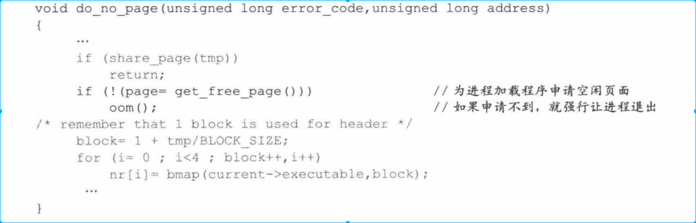
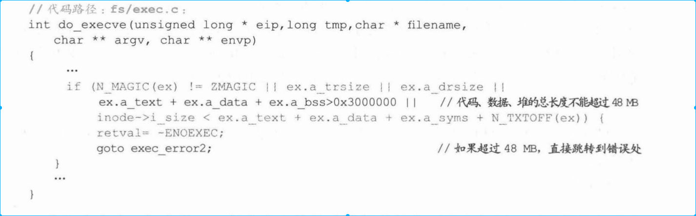
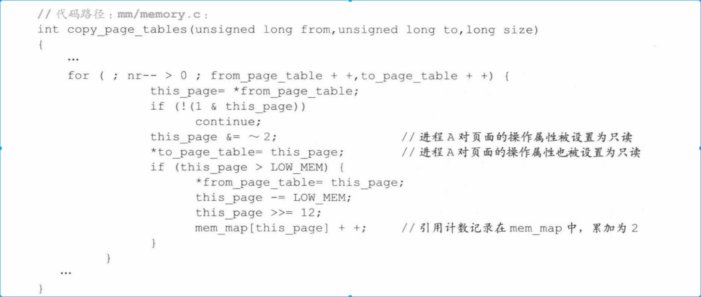

<!-- TOC -->

- [1. 背景](#1-背景)
- [2. 线性地址保护](#2-线性地址保护)
    - [2.1 线性地址空间设计格局](#21-线性地址空间设计格局)
    - [2.2 段基址、段限长、GDT、LDT、特权级](#22-段基址段限长gdtldt特权级)
        - [2.2.1 跨界地址访问](#221-跨界地址访问)
            - [2.2.1.1 一个进程非法跨到另外一个进程](#2211-一个进程非法跨到另外一个进程)
    - [2.2 分页](#22-分页)
        - [2.2.1 线性地址映射到物理地址](#221-线性地址映射到物理地址)
        - [2.2.2 进程执行时分页](#222-进程执行时分页)
        - [2.2.3 什么时候为进程申请新的页面](#223-什么时候为进程申请新的页面)
        - [2.2.4 为进程申请的页面要映射到线性地址空间](#224-为进程申请的页面要映射到线性地址空间)
    - [2.3 共享页面](#23-共享页面)
        - [2.3.1 U/S位](#231-us位)
        - [2.3.2 R/W位](#232-rw位)
    - [3.4 内核分页](#34-内核分页)
- [4. 一个进程从创建到退出的完整过程](#4-一个进程从创建到退出的完整过程)
    - [4.1 创建str1进程](#41-创建str1进程)
        - [4.1.1 为创建str1准备条件](#411-为创建str1准备条件)
        - [4.1.2 为str2进程管理结构寻找存储空间](#412-为str2进程管理结构寻找存储空间)
        - [4.1.3 Shell进程给str1进程复制task_struct结构](#413-shell进程给str1进程复制task_struct结构)
        - [4.1.4 个性化设置task_struct](#414-个性化设置task_struct)
        - [4.1.5 复制task_struct页表并设置对应的页目录项](#415-复制task_struct页表并设置对应的页目录项)
        - [4.1.6 建立str1进程和全局描述符（GDT）关联](#416-建立str1进程和全局描述符gdt关联)
        - [4.1.7 将str1进程设置为就绪态](#417-将str1进程设置为就绪态)
    - [4.2 str1 加载进程的准备工作](#42-str1-加载进程的准备工作)
        - [4.2.1 为用户进程加载做准备](#421-为用户进程加载做准备)
        - [4.2.2 释放str1进程页表](#422-释放str1进程页表)
        - [4.2.3 重新设置程序段和代码段](#423-重新设置程序段和代码段)
        - [4.2.4 调整str1进程的task_struct](#424-调整str1进程的task_struct)
    - [4.3 str1程序运行和加载](#43-str1程序运行和加载)
        - [4.3.1 产生缺页中断并有操作系统响应](#431-产生缺页中断并有操作系统响应)
        - [4.3.2 为str1申请一个内存页面](#432-为str1申请一个内存页面)
        - [4.3.3 将str1程序加载在新分配的页面中](#433-将str1程序加载在新分配的页面中)
        - [4.3.4 将str1程序的物理内存地址与str1进程的线性空间地址对应](#434-将str1程序的物理内存地址与str1进程的线性空间地址对应)
        - [4.3.5 不断通过缺页中断加载str1程序的全部内容](#435-不断通过缺页中断加载str1程序的全部内容)
        - [4.3.6 str1程序运行](#436-str1程序运行)
    - [4.4 str1进程退出](#44-str1进程退出)
        - [4.4.1 str1进程准备退出](#441-str1进程准备退出)
        - [4.4.2 释放str1代码和数据所占用的内存](#442-释放str1代码和数据所占用的内存)
        - [4.4.3 解除str1与文件有关内容，并给父进程发送信号。](#443-解除str1与文件有关内容并给父进程发送信号)
        - [4.4.4 str1退出后执行进程调度](#444-str1退出后执行进程调度)
- [5 页写保护](#5-页写保护)
    - [5.1 进程A和进程B共享页面](#51-进程a和进程b共享页面)
    - [5.2 进程A准备压栈操作](#52-进程a准备压栈操作)
    - [5.3 进程A压栈操作产生页写保护中断](#53-进程a压栈操作产生页写保护中断)
    - [5.4 进程A的页表指向新申请的页面](#54-进程a的页表指向新申请的页面)
    - [5.5 复制原页面内容到新页面](#55-复制原页面内容到新页面)
    - [5.6 进程B准备操作页面](#56-进程b准备操作页面)
- [6. 总结](#6-总结)

<!-- /TOC -->
# 1. 背景
* 多进程执行需要解决问题
    * 多个进程运行一个程序代码，进程之间不进行干扰（进程保护）
    * 如果让多个进程轮流执行（进程调度）

# 2. 线性地址保护
## 2.1 线性地址空间设计格局
* 进程隔离实现：通过地址划分实现隔离。Linux 0.11将32位地址分为64个64MB的区域，每个进程一份，进程之间彼此不能重叠。

* task[64]是进程管理格局基点，所有进程等级和注销都是由他管理。task[64]想好nr在GDT找到对象的项，然后找到LDT。task[64]对控制进程总量和关联GDT和LDT、TSS有着重要作用。

* 能够实现进程之间的跨界访问。软件是很难实现的，因为软件的指令访问区间只能在本身64MB内。这样跨界访问就需要硬件实现（很显然CPU是最常使用的）

## 2.2 段基址、段限长、GDT、LDT、特权级
* 早起CPU只设置了段首寄存器，后面CPU为了继承也没有设置断尾寄存器，而是设置段限长来起到相同作用。如果访问地址之前先进行地址检查。

### 2.2.1 跨界地址访问
#### 2.2.1.1 一个进程非法跨到另外一个进程
* GDT、LDT保护，GDT中没有存储每个进程CS地址，LDT（第一项空、第二项代码段、第三项数据段），因此每个进程只知道当前CS段地址，跳转也只能在当前进程空间跳转。
* 如果希望进程见调用，只能通过进程切换实现，很显然需要使用中断。

## 2.2 分页
### 2.2.1 线性地址映射到物理地址

* 前面在怠速前打开PG，线性地址通过页目录表-页表-页内地址三级映射，最终落实到物理地址。
* 在打开PG前，已经打开PE，转入到保护模式运行。CPU的硬件默认，在保护模式下，如果没有打开PG，线性地址恒等映射到物理地址。如果打开PG，线性地址需要经过MMU解析，以页目录表，页表，页面三级映射模式映射到物理地址。

* linux-0.11线性地址空间是4G，而实际物理地址是16M，显然PG模式是为了实现虚拟地址。

    * linux-0.11只有一个页目录表，页目录表首地址存放在CR3寄存器中，显然打开PG模式首先是将页目录表首地址加载到CR3寄存器中

### 2.2.2 进程执行时分页

* 分页以及映射到物理页时，内核需要做到一下几点
    * 必须要从空闲页中分配页面，不能分配其它进程正在使用页面
    * 不能挪用内核区页面

怠速前，内核通过mem_map 对1M以上内存进行分页管理，主内存每个页面引用计数都被初始化为0，默认空闲页。

* 在为进程分配页面时，只能在mem_map管理范围上区申请空闲页面（为0），申请之后记为1.

### 2.2.3 什么时候为进程申请新的页面
* 下面中没有看到页面替换思想，如果缺页，就直接申请页面，没有考虑替换已有一面

* 每个页目录项、页表项最后3为标志着其所管页面属性，分别表示U/S、R/W、和P。判断该页是否申请页面，是在解析线性地址时确定的，关键是看P标志位。
    * 如果P标志为1，说明该页表项已经和物理页面建立关系，直接取得线性地址就行
    * 如果P标志为0，说明没有物理页面对应，此时就产生缺页中断

* 7的二进制形式是111，P被设置成1
创建页面时，会调用页面，只要调用get_free_page()函数，把内存清0。

复制页表时，就得建立映射关系，关系建立之后，就把P设置成1.

页表和页面的关系解除后 ,页表项就要 清零。页目录项和页表解除关系后,页目录项也
要请零,这样就等于把对应的页表项、页目录项的 P 清零了。

比如在进程加载程序阶段,就调用了 free_page_tables( )函数把对应的页表项、页目录项
的 P 清零了,这样,当前进程线性地址对应的页面不存在,进程开始执行程序时,必产生缺
页中断。
进程加载程序后,与新页面建立了映射关系, P 位被设置成 1 ,代码如下:

### 2.2.4 为进程申请的页面要映射到线性地址空间
* 页目录表2014项、每个页表1024项，一页4Kb，所有地址空间是1024*1024*4K=4G
* 将地址空间分成64等分，每个进程占用16个页目录项，正好等分，所以进程空间会分页在不同的物理页面上
* 不同的地址空间运行映射到同一个物理页面上

## 2.3 共享页面
正常情况下，不能进程划分不同页面，但是有些情况需要进程之间共享页面，比如父子进程之间的继承关系，如何实现页面共享呢？

* 此时最好的选择是，子进程创建完毕后沿用父进程代码，父进程有多少页面，子进程就共享多少，将来子进程加载自身程序，再进行映射。
* 这样的问题是，多进程操作一个页面，对进程独立性造成破坏。Linux 0.11中页表中U/S、R/W两个标志位能解决这个问题
### 2.3.1 U/S位
目的是组织内核才能访问的页面被用户进程访问
* U/S位0，表示特权级为3进程不可以访问该页面，其它进程可以
* U/S为1，所有进程都可以访问页面

怠速进程为内核分页时，U/S位为1

在创建子进程时，子进程页目录项和页表项U/S位都被设置成1.

进程执行时，为进程新申请页面，并把页面映射到线性地址空间。申请的页目录项和页表项的U/S位都会设置成1.

### 2.3.2 R/W位
R/W为0说明只能读不能写，R/W为1说明可读可写。
进程是可以共享页面的，这样会带来一些问题，如果多个进程往一个页面写数据，那么数据会造成混乱。R/W就是提供读写保护。
创建进程时，父子进程共享页面，这些共享页面就不能写入数据，R/W就设置为0.

没有父子关系的两个进程也可以共享页面，这时候也需要将R/W置为0

上面我们知道，多个进程共享页面时，设置成自读无所谓，关键是如何实现写。Linux 0.11采用一套写时复制的策略来解决，即要把写入数据页面再复制一份给进程，两个进程各一个，这样就不会造成混乱，具体在下面讲解。

Linux中也有在通过管道在一个页面中又读又写，这在进程之间通信讲解（但是不属于内存共享的内容了）。

## 3.4 内核分页
内核区数据段和代码段大小都是16MB，需要四个页目录项来管理页表。

* 内核程序逻辑地址从0开始，刚好内核页的其实地址是从0开始，这样内核线性地址和物理地址是相等的，这样内核可以对内存中任意进程所有内存区域进行访问。

* 内核空间的线性地址和用户空间线性地址不一样。内核不能直接使用线性地址访问任意进程的任意地址空间。但是内核可以权限调用程序访问任意进程的数据。

* 内核肯定是能访问LDT等用户空间所有数据，但不是因为内核跨越了线性地址段。基本上都是通过寄存器+汇编形式完成。

# 4. 一个进程从创建到退出的完整过程
## 4.1 创建str1进程
* 假设有一个程序叫str1，并且在shell中执行
### 4.1.1 为创建str1准备条件
* shell调用fork开始创建进程
* 产生int0x80软中断，最终映射到sys_fork()上
* 调用find_empty_process()为str1程序申请一个可用的进程号，在task[64]申请一个空闲位置（进程号可能和task索引号不一致，因为进程号是last_pid+1,而task[64]是寻找空闲位置）

后面将根据task_struct的项号确定str1处于什么64M地址空间，LDT和TSS将和GDT哪两项挂载。

### 4.1.2 为str2进程管理结构寻找存储空间
* copy_process()函数第一件事情就是为str1申请一个页面，这个页面用来承载task_struct和内核栈。
    * 每个进程都有一个task_struct,每个进程都有这样一本帐，以保证进程之间互相独立不干扰。
    * 进程转入内核后，执行代码都是内核代码。但是执行路径未必相同，因此压栈出栈顺序不同，所有内核为每个进程都设置一个内核栈。

* 从内核分页过程已知，所有页面在刚进入PE保护模式时，就已经映射到16M线性地址空间。在内核调用get_free_page()为task_struct和进程内核栈分配的页面是在内核中分配的页。因此这个页面只能内核代码访问。

* task[64]存放了task_struct地址，因此我们可以根据进程号，找到进程有关信息。

### 4.1.3 Shell进程给str1进程复制task_struct结构
* Linux0.11设计来看，整个操作系统只有进程，内核是进程延续。
* 任何时候都要有一个进程工作，current永远指向当前进程。同时创建进程工作也由当前进程完成。
* shell给str1进程创建task_struct本质上是将自身的task_struct复制给str1

* 由于每个进程task_struct中的数据信息是不一致的，所以还要对str1的task_struct进行初始化设置。
* 进行初始化设置时首先要将进程设置成不可中断状态（因为如果设置成可中断的，初始化未完成，再次切换到该进程，该进程可能运行故障）（设置见上面代码）

### 4.1.4 个性化设置task_struct
task_struct结构中还有其它字段需要个性化设置。
* str1进程号、父进程号和shell进程的值都不一样
* 时间片：shell进程已经执行过一段时间，时间片可能减少。str1不能继承shell时间片，而是根据shell优先级确定时间片。如果优先级没有被指定过，就和原始值一致即15

* 对信号进行设置:task_struct关于信号有3个字段，signal、sigaction[32]、blocked，分别标识信号位图，信号处理函数挂接点和信号屏蔽码。
    * 创建str1进程，只是把signal清0。首先不能使用父进程shell信号位图。str1如果执行到内核，返回之前要进行信号处理，如果使用shell进程的信号位图，可能会多很多不必要的信号处理。
    * 我们将信号位清0，就没有必要设置信号处理函数挂载点和信号屏蔽码

*TSS字段设置
    * 进程切换寄存器值都是保存在TSS中
    
    

    * 这些值设置是CPU自动完成的，我们在内核中找不到给寄存器赋值代码。CPU是怎么知道那个值赋值给那个寄存器？只有一种可能，就是TSS字段设置都是事先规定好的。

### 4.1.5 复制task_struct页表并设置对应的页目录项
现在调用copy_mem为进程分段，确定线性地址空间。确定线性地址空间，关键在于确定段基址和段限长。

* 上面代码中设置了段基址，但没有设置段限长。因为段限长是设置在LDT中的，复制task_struct时，已经将LDT复制过来。

下面开始分页，分页建立在分段的基础之上，表现在分段时间段基址和段限长为分页分别确定了从哪开始复制页表信息，复制到那里去和复制多少的问题。

* 上面代码中copy_page_tables就是分页过程。但是此时str1进程并没有自己程序，复制页面表现在复制父进程页表项内容，指向父进程相同的页表内容。

    * 为新进程创建页表时，还需要调用get_free_page()函数申请页面，上面的复制页表体现在复制页表项。
    * str1申请的页面本质上是页表项（归内核管）。str1不能访问。

* 分段分页完成之后还有文件继承问题，shell打开的文件，子进程全部继承。表现为文件引用计数和i节点引用计数加1.

### 4.1.6 建立str1进程和全局描述符（GDT）关联
* 文件继承好之后，将str1进程TSS、LDT挂接在GDT指定位置处

### 4.1.7 将str1进程设置为就绪态
创建进程1工作基本结束，将其设置为就绪态，就可以参与轮转。

## 4.2 str1 加载进程的准备工作
### 4.2.1 为用户进程加载做准备
* 加载str1的准备工作和加载shell进程的准备工作非常接近
* 进入do_execve函数先做好外围工作
    * 管理str1进程参数和环境变量所占用页面做准备
    * 还需要将str1程序所在的i节点找出来，通过检测i节点信息，检测文件自身是否有问题。
    * 通过i节点找到头文件，检测文件的代码长度、数据长度，能不能容纳在64MB的线性地址空间内

* str1继承了shell进程的一些信号字段，在加载自己程序之前，需要先将这些信号字段清0.

### 4.2.2 释放str1进程页表
str1 进程和shell进程共享页表，在加载时需要解除这些关系。

* str1 和shell进程对共享页面都是只读的，同时解除的是str1进程和共享页面之间关系，不会影响shell进程的运行。这里会在写时复制技术讲解。

### 4.2.3 重新设置程序段和代码段
str1加载自身程序，需要重新设置LDT。

### 4.2.4 调整str1进程的task_struct 
对str1进程task_struct 中的brk、start_stack等信息进行设置，设置这些字段是为了避免进程在执行时发生错误，本质上是管理，不是保护。

最后调整EIP、ESP使软中断返回，直接中str1程序位置开始执行。前面我们已经介绍过，str1进程与shell进程解除了页面共享关系，控制页面的页已经释放，断绝了与str1进程页目录项的映射关系。这意味这页目录项为0，p位也为0，str1程序一开始执行，MMU线性解析地址就发现页目录P位为0，就产生缺页中断。

## 4.3 str1程序运行和加载
### 4.3.1 产生缺页中断并有操作系统响应
缺页中断信号产生后，page_fault这个程序将对此响应，并最终在_page_fault中通过call _do_no_page 调用缺页中断来处理程序。

* do_no_page程序执行前会先做两个方面检查，如果两个都不成立，就去硬盘中加载程序
    * 程序是否已经加载进来或者产生缺页中断的地址是否超过了程序代码的末端
    * 是否可能与某个现有进程共享代码（同一份程序运行两次）

现在状况是先需要在内存中申请页面，然后加载str1程序。

### 4.3.2 为str1申请一个内存页面
在主内存中申请一个空闲页面，将str1程序最起始部分载入。
* 申请的页面需要在内核数据区中mem_map中登记
* 内核分配页面后保持与页面关系。因为内核还需要在后续访问这个页面。

### 4.3.3 将str1程序加载在新分配的页面中
* 一次加载4K

### 4.3.4 将str1程序的物理内存地址与str1进程的线性空间地址对应

### 4.3.5 不断通过缺页中断加载str1程序的全部内容
* 在执行过成中，如果需要新的页面，就会产生缺页中断不断加载程序。
至此，str1程序的加载完毕

### 4.3.6 str1程序运行
这部分开始运行程序，和具体程序怎么写的代码有关

* 需要注意的是，程序在退出时需要清栈。但清栈过程中不会立马回收页面。清栈后可能有很多页面没有被释放

## 4.4 str1进程退出
内容包括如下
* 进程占用的内存空间 如何释放
* task_struct 占用空间如何处理
* str1退出主要通过exit函数实现

进程退出主要包含两方面内容、
* 释放str1进程数据和代码占用的物理内存，并接触和str1可执行文件之间关系.这件事由str1进程自己解决。
* 释放str1进程管理结构task_struct所占用的物理内存，并接触和task[64]关系，这个由父进程shell完成

### 4.4.1 str1进程准备退出
str1调用exit()函数退出，映射到sys_exit(),并调用do_exit()函数来处理str1（）进程退出的相关事物。

### 4.4.2 释放str1代码和数据所占用的内存
* do_exit()函数执行后，调用free_page_table()函数将str1程序占用的页面释放掉。并清楚管理这些页面的页表和页目录项。这些页面中任然保留str1进程的垃圾数据，但是清楚页目录项和页表项，str1进程找不到这些页面。

### 4.4.3 解除str1与文件有关内容，并给父进程发送信号。
* 父进程一旦fork子进程，就变成可中断状态，不参与时间片轮转。
str1解除和文件关系，表现为现将和父进程共享的文件释放掉，然后内核str1进程设置为僵死进程。并给它的父进程shell发送“子进程退出”信号。

### 4.4.4 str1退出后执行进程调度
到此为止，str1进程对退出善后工作完毕。

* shell收到str1进程的信号被唤醒、
* shell进程进入内核后释放str1 task_struct所占用的内存。并解除str1和task[64]之间关系。str1在task[64]中位置会被后续进程占用，该进程和str1的线性地址空间和页目录项是一样的。

# 5 页写保护
## 5.1 进程A和进程B共享页面
* 假设现在系统中有一个用户进程A，他自己对应的程序代码已经载入到内存中，此时该进程内存中所占的页面引用计数为“1”，接下来开始执行。
* 进程A通过fork子进程创建进程B，进程A、B共享页面。被共享的页面引用数为“2”.并将共享页面设置为自读状态。
* A、B进程只能对共享页面进行读操作

## 5.2 进程A准备压栈操作
假设接下来是进程A进行一系列压栈操作。
现在进程A对所有的页面都是只读的，这就意味着无论代码所占的页面还是原先压栈数据所占的页面都是自读操作，不能写。
但是压栈的线性地址一定会映射到只读页面中，产生一个“页写保护”中断。

## 5.3 进程A压栈操作产生页写保护中断
“页写保护”中断对应的服务程序是un_wp_page(),函数执行时，先要在主内存中申请一个空闲页面（后面我们称之为新页面）。来备份刚才压栈地址所在页面（称之为原页面），并且将原页面的应用计数减1.
这说明进程A会在新页面中操作数据，和原页面解除关系。

## 5.4 进程A的页表指向新申请的页面
* 进程A页表指向新页面才能和原页面完全接触关系

## 5.5 复制原页面内容到新页面
上面准备号条件后，将旧页面内容拷贝到新页面。

## 5.6 进程B准备操作页面
进程A执行一段时间后，就轮到进程B执行了。假设进程B也需要在共享页面进行写操作，由于这时共享页面只是只读操作，因此会产生页写保护，任然映射到up_wp_page()函数中。由于原页面的应用计数已经被减为1，现在就要将原页面属性改为可读可写。

# 6. 总结
本章是全书中难度较大的 一章,详细讲解了线性地址、分页、进程调度以及一个用户进
程从创建到退出的完整过程和同时运行多个用户进程 。
其中最难理解的是线性地址的部分。线性地址的设计思路体现在代码的字里行间,所以
看似简单,实际很难掌握。理解线性地址需要整体思考操作系统各部分间的关系,要有想象
力,可以说对线性地址理解的深度相当程度上影响对操作系统的理解水平。
与线性地址类似,分页机制的规则似乎也不复杂,但是涉及操作系统内核和用户进程运
行的很多方面,加之与线性地址的紧密关系,使得分页也是比较难以掌握的。
Linux 操作系统设计者默认内核是进程的延续,所以深入理解、掌握用户进程运行的全
过程及多进程同时运行时的进程调度,对理解、掌握 Linux 操作系统至关重要。

