<!-- TOC -->

- [1. 背景](#1-背景)
- [2. 系统调用过程](#2-系统调用过程)
    - [2.1 系统调用的定义和实现位置](#21-系统调用的定义和实现位置)
    - [2.2 源码分析](#22-源码分析)
        - [2.2.1 ReadFile](#221-readfile)
        - [2.2.2 NtReadFile](#222-ntreadfile)
            - [2.2.2.1 用户空间也存在NtReadFile函数](#2221-用户空间也存在ntreadfile函数)
            - [2.2.2.2 stub函数自动生成的原理](#2222-stub函数自动生成的原理)
            - [2.2.2.3 int0x2e中断向量](#2223-int0x2e中断向量)

<!-- /TOC -->
# 1. 背景
* ReactOS 项目目标是开发出一个开源的Windows，不言而喻，他要实现的系统调用就是Windows那一套系统调用
* 本文要说的是ReactOS怎样实现系统调用，也就是用户应用程序怎样进入和退出内核，实现系统调用


# 2. 系统调用过程
* 下面以系统调用NtReadFile()为例，按“自顶向下”的方式，一方面说明如何阅读ReactOS源代码，一方面说明ReacOS如何实现系统调用。


## 2.1 系统调用的定义和实现位置
* Windows应用程序库都应该通过Win32API调用这个接口定义的所有库函数，这个库函数基本上在“动态链接库”即DLL中实现。
* 比如ReadFile()是Wine32 API 所定义的一个库函数，其实现在kernel32.dll库中，定义在winbase.h文件中

## 2.2 源码分析
### 2.2.1 ReadFile
*  ReadFile在Windows 中定义
```
WINBASEAPI BOOL WINAPI ReadFile(
    IN HANDLE hFile,
    OUT LPVOID lpBuffer,
    IN DWORD nNumberOfBytesToRead, OUT LPDWORD lpNumberOfBytesRead, IN LPOVERLAPPED lpOverlapped
)
```
* ReactOS 代码同样有winbase.h，这里在目录reactos/w32api/include中
```
BOOL WINAPI ReadFile(HANDLE, PVOID, DWORD, PDWORD, LPOVERLAPPED);
```

* ReadFile 实现
微软没有开源这个函数代码，ReactOS为之提供了一个开源实现，代码在reactos/lib/kernel32/file/rw.c
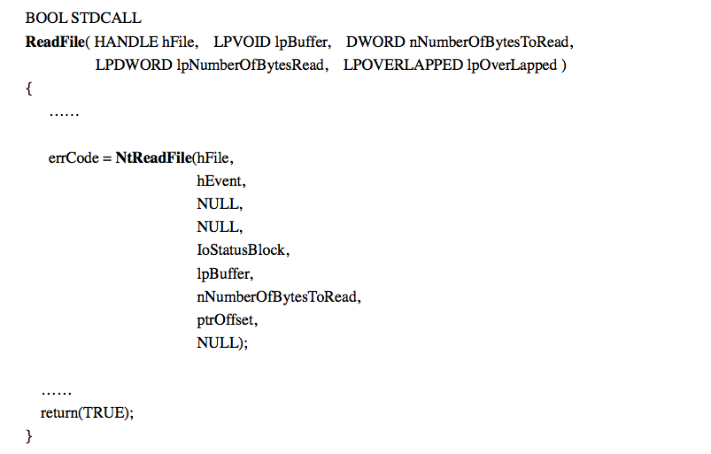


### 2.2.2 NtReadFile
* NtReadFile()是Windows的一个系统调用，它的实现在ntoskrnl.exe(这是window内核核心部分)
* ReactOS代码中内核函数NtReadFile()的定义在reactos/include/nots/zw.h中，同样的定义也出现在reactos/w32api/include/ddk/winddk.h:
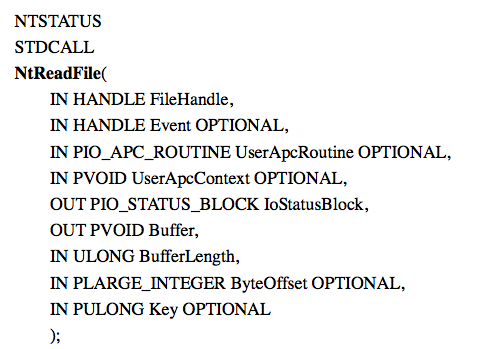

* 相应的实现在reactos/ntoskrnl/io/rw.c
    * 问题在于NtReadFile()实现在内核空间中，用户程序是如何调用内核空间代码的？
    * 因此这里面一定另外存在奥妙
#### 2.2.2.1 用户空间也存在NtReadFile函数
* 作者发现，还有另外一个NtReadFile(),在msvc6/iface/native/syscall/Debug/zw.c
    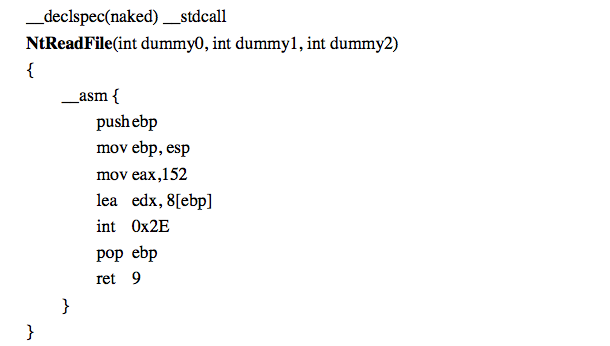
    * 用户空间也存在NtFileRead()函数，正是这个函数执行自陷阱指令“int 0x2e”，下面我们分析下上面的汇编代码：
        * 152 是NtReadFile()这个系统调用的调用号，所以当CPU自陷阱进入到系统空间后，eax持有具体的系统调用号
        * 寄存器edx执行lea这条指令后，则持有CPU在调用这个函数前夕的堆栈指针，实际上就是指向堆栈中调用参数的起点
        * (在系统调用如何传递参数这个问题上，Windows和Linux有着明显的差别，Linux是通寄存器传递参数的，Windows则是通过堆栈传递，这样的直接结果是，Linux 参数传递受寄存器限制，因此linux系统调用参数一般都很少，如果有很多参数需要传递，一般都是先经过struct封装，然后传递struct指针)
        * 堆栈中参数目前任然是存在用户空间，进入系统调用后参数需要变成内核堆栈，因此需要使用copy_from_user()一类的函数吧这些参数从用户空间拷贝过来，此时edx值就可以作为源指针
        * ebp用户调用这个函数的“堆栈框架”指针
        * 当内核完成具体系统调用操作，然后指令ret 9使得cpu返回上一层函数，同时调整堆栈指针，使其跳过堆栈中的9个调用参数

    * 当CPU从子程序返回时，由谁负责从堆栈中清除这些参数呢？要么是调用者负责，要么由被掉者负责，这里需要一个约定，使得调用者和被调者取得一致
        * 在上面的NtReadFile()这个函数中，我们看到是由被调者负责、在调整堆栈指针
        * 函数钱加上__stdcall就说明了这点
        * 另外函数调用的参数是3个而不是9个，作者在分析代码之后发现这三个参数根本没有被使用到，而前面的ReadFile()使用的参数也是9个，这里的三个参数完全是虚设的，难怪代码中称之为“dummy”
    * 用户空间的NtReadFile()向上代表内核函数NtReadFile(),向下代表要调用内核函数NtReadFile(),这里的ReadFile()。但是本身没有提供什么附加功能，这样的中间函数称为“stub”

    * ReactOS这种做法容易让读者迷茫，相比之下，Linux的做法就比较清晰，比如需要调用的库函数是wriet（），内核中对应的库函数就是sys_write()
#### 2.2.2.2 stub函数自动生成的原理
* Windows中，stub函数NtReadFile()函数在ntdll.dll中，实际上0x2e系统调用的stub函数都在这个DLL中，显然所有系统调用stub函数都有相同的样式，不同的是系统调用号和参数个数不同，所以ReactOS用一个工具来自动生成这些stub函数，这个工具的代码在msvc6/iface/native/genntdll.c,下面是一个片段
    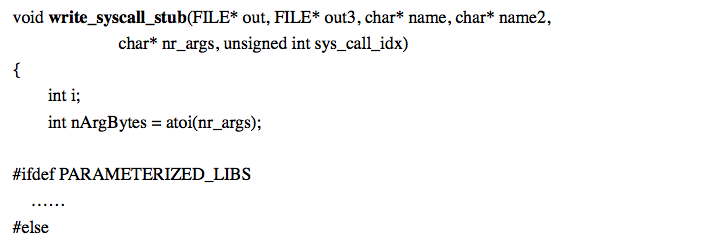
    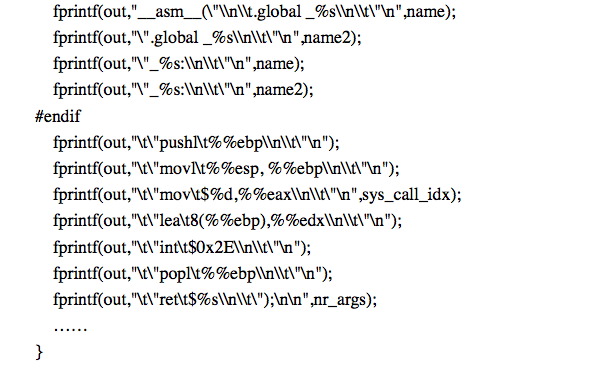

    * 这段代码根据name、nr_args、sys_call_idx等参数为给定系统调用生成stub函数的汇编代码。name这些参数是如何来的？在ReactOS代码中，reactos/tools/nci目录中有个文件sysfuncs.lst,下面是从这个文件中摘取来的几行：
        ```
        NtAcceptConnectPort 6 
        NtAccessCheck 8 
        NtAccessCheckAndAuditAlarm 11 
        NtAddAtom 3
        ...... 
        NtClose 1 
        ...... 
        NtReadFile 9 
        ......
        ```
        * 这里的NtAcceptConnectPort就是调用号为0的系统调用NtAcceptConnectPort(),它有6个参数，另一个系统调用NtClose（）只有1个参数，而NtReadFile（）有9个参数，并且正好是表中第153行，所以调用号是152

#### 2.2.2.3 int0x2e中断向量
* 和别的中断向量一样，ReactOS在其函数初始化程序KeInitExceptions()中设置了int0x2e中断向量，这个函数代码在reactos/ntoskrnl/ke/i386/exp.c中：
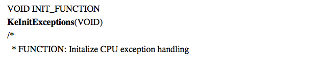
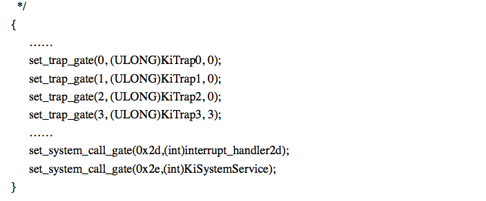

* 显然int 0x2e的向量指向KiSystemService()。ReactOS在其内核函数命名和定义上也力求和Windows一致，所以ReactOS内核中也有前缀为ke和ki的函数。
    * 前缀ke表示属于”内核“模块，注意Windows说的”内核kernel“只是内核的一部分，而不是整个内核（后面Wine也会说明）
    * 前缀ki则是内核中与中断响应和处理有关的函数
        * KiSystemServic()是一段汇编程序，其作用相当于Linux内核中的system_call()，这段代码在reactos/ntoskrnl/ke/i386/syscall.S

* 下面分析_KiSystemService函数

    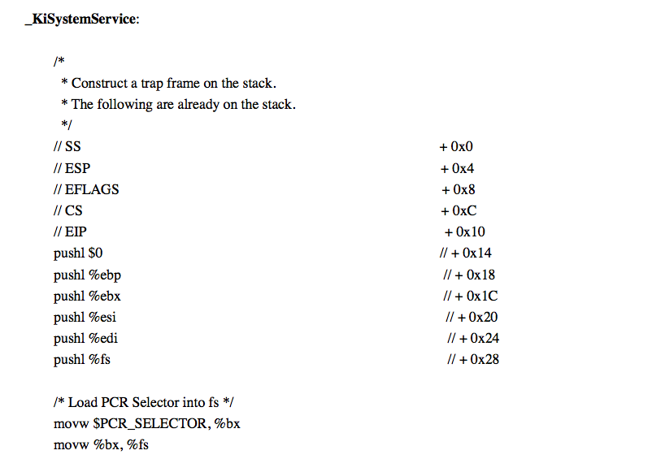
    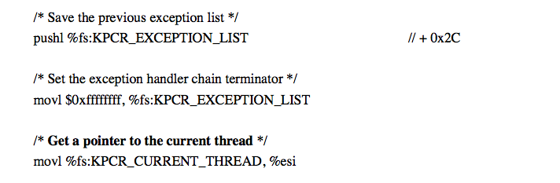
    * 前面主要是为了保存现场，类似Linux内核中宏操作SAVE_ALL
    * 这里关键一步是%fs:KPCR_CURRENT_THREAD 这个地址取得当前线程的指针并将其存放在寄存器%esi中
        * 每个线程在内核中都有个KTHREAD的数据结构，某种意义上相当于Linux内核中的进程控制块task_struct.
        *  Windows 内核中也有进程控制块，但是只相当于把进程中各个线程共享的数据块剥离出来，而线程控制块则起着更加重要作用
        * 所谓当前线程指针就是指向当前线程的KTHREAD数据结构指针。当内核调度一个线程时，就会将该地址fun放在%fs:KPCR_CURRENT_THREAD，%fs地址固定存放在PCR_SELECTOR这个地址中（定义为0x30）。
        * 总之当前%esi指向当前线程的KTHREAD数据结构，这对系统调用有着重要作用

* 分析 KTHREAD数据结构
    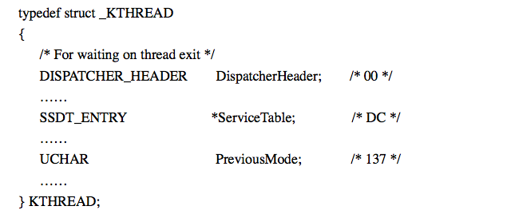
    * 每个成分后面注释说明成分在数据结构中的相对位移，ServiceTable相对位移是0xdc,这个指针也是我们最为关注的，因为它直接和系统调用函数表相关，每个线程的该指针都会指向SSDT_ENTRY结构数组，每个线程都有这个指针，那么说明每个线程都可以有自己的ServiceTable。但是实际上，每个线程的ServiceTable都会指向同一份数据结构

* 继续分析逻辑代码（ServiceTable等会分析）
    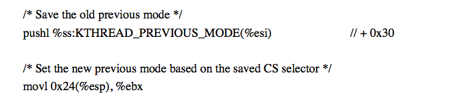
    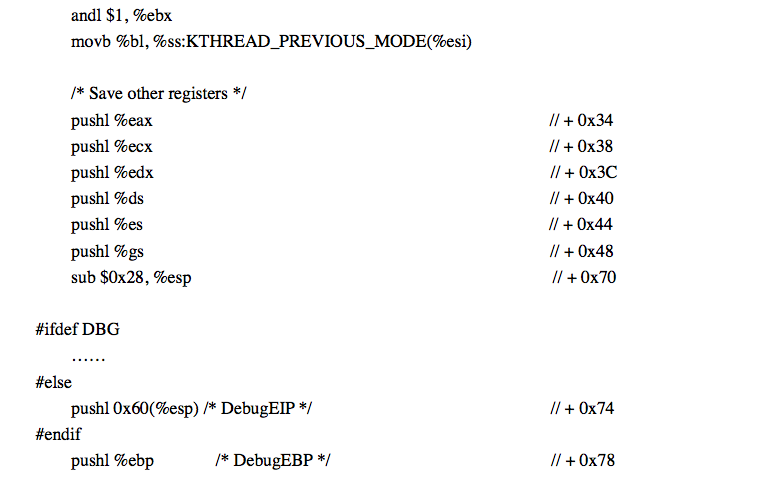
    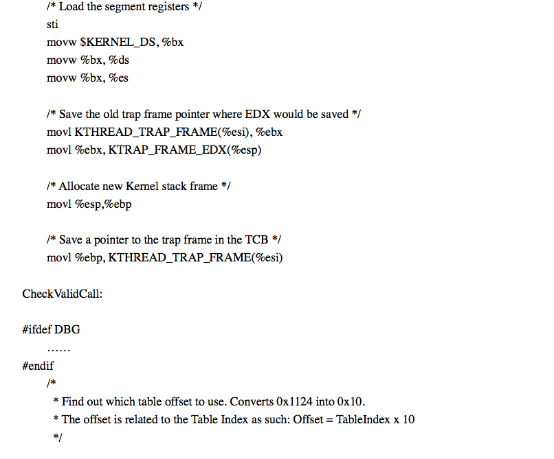
    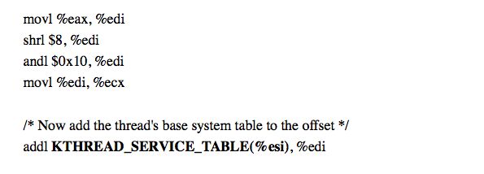
    * 这里面关注最后一段，首先KTHREAD_SERVICE_TABLE（%esi）就是当前线程ServiceTable指针，KTHREAD_SERVICE_TABLE定义为0xdc：
        ```
        #define KTHREAD_SERVICE_TABLE 0xDC
        ```
* Service table
    * 前面描述ServiceTable指针指向同一个数据结构，那就是KeServiceDescriptionTable[]:
        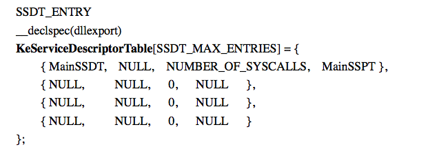
        
    * 这个数组大小一般是4，但是只用了前2个元素，这里只用了第一个元素，这就是Windows常规系统调用跳转表
    * Windows在发展过程中，把原来许多实现在用户空间功能（主要是图形界面操作）移入到内核空间，并称为一个单独内核模块win32k.sys，并添加相应一组”扩充系统调用“。这里第二个元素就是为扩充系统调用准备，但是源代码中这个元素是空的，这是因为win32k.sys是可以动态安装的，安装了以后把具体的数据结构指针填进去
    * 扩从系统调用和常规系统调用区别是：前者系统调用大于0x1000,后者小于