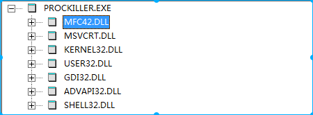

# 1. 背景
ProcKill在cdos缺少mfc42.dll库，通过winetricks安装mfc42.dll库后可以正常运行。但是上面模式是因为使用了原装安装模式。当我们使用wine内建方式安装时，出现错误。
具体问题见message日志记录。

# 2. 定位问题出现在那个模块
## 2.1 确定Windows程序组成关系
由于Windows程序是闭源的，不知道源码是由什么组成。也不知道wine是什么样模块和Windows程序进行交互。
现在非常需要知道Windows由什么组成。

## 2.1.1 ldd没法使用
因为ldd是wine启动的，不是linux 指令代码。可以推测ldd程序需要检测可执行程序格式。
```
dev@dev:~/ProcKiller$ ldd prockiller.exe
	不是动态可执行文件
```
## 2.1.2 在Windows虚拟机使用dependency


## 2.1.3 猜测
从Windows程序依赖的dll库中，我们基本可以确定ProcKiller.exe源码中可定使用了MFC42.dll路径。wine内建安装时，因为找不到这个库所以才出错。

问题
* 现在dll文件依赖角度任然太粗略，我们希望查到那个函数调用的MFC42.dll库，需要更加细致的信息
* 我们知道，Windows程序一定会使用到各种系统库，都需要通过这些路径加载库，但是wine内建安装时是没有这些库的，难道都会因为找不到这些库而出错？

计划：
* 首先获取Windows调用库信息，最好是定位到函数级别（工作可能无效，因为我们不可能区修改Windows源码）
* 理解wine是如何加载这些库的

## 2.2 精确定位函数调用MFC42.dll 
### 2.2.1 spy++ 
没法使用，spy++主要是对消息动作的一种端点行为。我们的错误是一种启动错误，没法使用。

### 2.2.2 API Monitor
这个页没法使用，启动问题


# 3. 查看如何内建加载dll
LdrInitializeThunk() 加载dll（漫谈兼容内核7）


