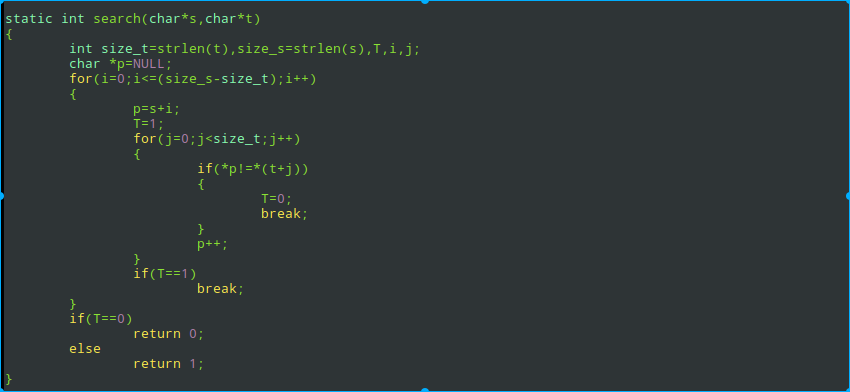
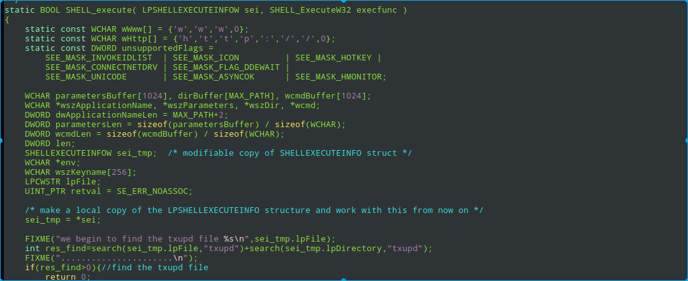

<!-- TOC -->

- [1. 背景](#1-背景)
    - [1.1 主要难点](#11-主要难点)
- [2. 修改固定文件](#2-修改固定文件)
    - [2.1 设置文件权限](#21-设置文件权限)
    - [2.2 替换部分dll文件](#22-替换部分dll文件)
- [3. 镜像回滚](#3-镜像回滚)
    - [3.1 git 手动镜像回滚](#31-git-手动镜像回滚)
    - [3.1 寻找更新动作执行入口](#31-寻找更新动作执行入口)
        - [3.1.1 字符串跟踪](#311-字符串跟踪)
        - [3.1.2 使用wine这套工具](#312-使用wine这套工具)
- [4. 操作txupd.exe](#4-操作txupdexe)
    - [4.1 删除txupd.exe](#41-删除txupdexe)
    - [4.2 替换txupd.exe](#42-替换txupdexe)
    - [4.3 探测txupd.exe进程kill掉](#43-探测txupdexe进程kill掉)
- [5. 修改wine](#5-修改wine)
    - [5.1 通过fork创建进程过程](#51-通过fork创建进程过程)
    - [5.2 shell_exect](#52-shell_exect)
        - [5.2.1 直接执行前面探测txupd 程序](#521-直接执行前面探测txupd-程序)
        - [5.2.2 创建进程执行kill txupd 进程](#522-创建进程执行kill-txupd-进程)
        - [5.2.3 创建线程](#523-创建线程)
        - [5.2.4 return 0](#524-return-0)
- [6. 最终修复结果](#6-最终修复结果)

<!-- /TOC -->
# 1. 背景
兼容QQ针对qq8.9.1 版本，如果qqupdate，我们的wine可能不能兼容新版本QQ，所以我么需要让QQ禁止更新。
虽然QQ允许让用户设置禁止更新，但是作为兼容平台层，我们希望收回用户更新软件能力。
## 1.1 主要难点
QQV8.9.1通过创建子进程txupd.exe实现更新，问题的关键是找到wine中执行更新的动作，也就是什么时候创建txupd.exe 进程。
由于QQ程序有这强大的反调试功能，Spy++、APIMonitor都无法有效的对QQ进行调试，我们无法捕捉到创建进程的相应消息，这为调试带来很大的困难。

# 2. 修改固定文件
## 2.1 设置文件权限
* 思路:首先我们git跟踪QQ更新文件前后变动,然后将替换文件的权限设置成不允许删除或者运行程序不能执行。
* 结果:设置成666,000,444,400等权限等级都失败
* 原因分析：跟新前后文件太多(几十个文件，大多是不规则文件名，而且有些是用户文件)，我们不敢对所有文件设置权限，所以可能因为设置权限的文件不对。

## 2.2 替换部分dll文件
* 思路:通过diff比较更新前后更新文件，将更新的文件回滚到旧文件
* 结果：失败，无法准确确定替换文件
* 原因分析：
    * 前后替换文件非常多，估计30多个，更让人难以接受的是很多文件名称是special（名称具有随机性），不能作为固定文件保存。
    * 另外实验diff的是8.9.1和当前最新版本（9.x.x）。如果QQ最先版本变成10.x.x，那么diff文件又可能不同，我们替换文件不完全很可能导致QQ崩溃。

# 3. 镜像回滚
## 3.1 git 手动镜像回滚
* 思路： diff 更新前后文件变化，更新之后将文件回滚到旧版本
* 结果：成功
* 过程：手动使用git可以回滚，但是无法通过程序保存切片，理想状态是wine中执行更新动作时执行保存切片
    * 手动过程： 利用git工具手动回滚能达到禁止更新目的。但是什么时候打入切点，怎么打入切点存在问题。
        * update 前： git commit 保存切点
        * update 后： git checkout . & git clean -xdf 放弃所有文件修改
        * 重启QQ发现是旧版本。
        * 但是下面的问题，如果将打入切片的动作放在QQ生命周期中（最好是在点击update button时就打入切片）
* 最终放弃原因分析：
    * git 保存切片动作无法在程序中确定

## 3.1 寻找更新动作执行入口
背景：前面能手动通过git 实现阻止QQ更新。我们接下来目的是检测到update动作，然后使用git保存切片。
这期间发现QQ反调试能力太强了。
### 3.1.1 字符串跟踪
* 思路：更新按钮会有些字符串，比如“更新到最新版本”等提示，我想着能否根据字符串能找到程序入口
* 过程: QQ字符传基本上集中在一个字符串文件中，通过ID标识（猜测程序通过应用应用ID显示字符串），这种解耦方式增加寻找难度。后来发现更变态事情，找着找着发现有些字符串压根没出现，后来发现QQ直接应用的是图片，所以思路行不通。
* 原因：引用图片，不是引用字符串

### 3.1.2 使用wine这套工具
* spy++：能定位到句柄，有效的消息，但是未获取到窗口消息
* APIMoitor: QQ Protect 程序保护，不能看QQ.exe程序信息
* winedbg：定位动作能力有限

# 4. 操作txupd.exe
发现点击update按钮更新时，会产生一个txupd.exe在线更新程序。

## 4.1 删除txupd.exe 
* 思路: 删除QQ.exe
* 过程: find 所有txupd.exe程序，发现两处全都删除。点击update按钮，QQ不更新并且暂时正常。接着QQ proctect 检测处异常，试着kill protect 程序，qq崩溃。
* 结果： protect 程序保护，失败

## 4.2 替换txupd.exe
* 思路：希望protect 程序自检测文件是否存在，试着替换txupd.exe达到通过检测目的
* 过程：和上面一致
* 结果： 失败（protect 程序厉害）

## 4.3 探测txupd.exe进程kill掉
* 思路：希望protect程序只是检测文件本身是否正常，不去检测update动作是否响应
* 过程：手动kill txupd.exe进程，发现QQ没有检测出问题。接着写了一个探测txupd.exe进程脚本，一旦发现txupd.exe进程，马上kill。
* 结果：成功，点击更新按钮没有反应。基本达到禁止更新目的。
* 影响：探测进程占用mem 6M，cpu资源基本忽略。
* 改进：QQ启动时启动探测程序，QQ关闭时关闭探测程序。如果担心我们的探测进程被恶意破坏，我们可以设计我们探测进程为交替守护进程（缺点是资源耗费可能加倍）。
 
# 5. 修改wine
既然QQv8.9.1更新是通过创建txupd子进程实现更新功能，Linux中创建子进程势必绕不开进程创建机制，并且猜测很能是通过fork来实现。当我们fork txupd子进程时，肯定要加载txupd.exe文件，因此我们可以在加载文件的地方做文章。
## 5.1 通过fork创建进程过程
 * 原理：fork创建进程过程，fork 的pid确定为子进程后，就可以execv子进程程序，通过文件名，打开探测程序
 * 结果：失败。
 * 原因：根本就没有调用fork这里。WINPAI createProcess 传递的路径名是空

## 5.2 shell_exect 
原理：可以确定的是QQ创建子进程一定绕不开Wine，如果不是通过fork系统调用实现，那么极有可能是通过直接调用Linux shell command实现创建子进程。
结果：成功定位到QQ update动作

那么下面目的就是检测到QQ更新动作后，在Wine中做响应的修改来阻止QQ更新。
### 5.2.1 直接执行前面探测txupd 程序
* 思路：直接执行4点中的探测txupd.exe程序
* 结果：失败
* 原因：程序是阻塞的
### 5.2.2 创建进程执行kill txupd 进程
 * 思路：通过fork创建子进程，执行4点中的探测txupd.exe程序
 * 结果:失败
 * 原因:fork会出现多个QQ进程，wine会检测出现问题
### 5.2.3 创建线程
* 思路：创建非阻塞线程，执行4点中的探测txupd.exe程序
* 结果:失败
* 原因：pthread.o默认编译的时候不背加载，惭愧不会修改makefile文件（上万行），尝试一直失败
### 5.2.4 return 0
* 思路：直接return 0，不做后续动作
* 结果：成功

# 6. 最终修复结果
* 修改文件：root/builddir/build/WinuxGEAR_Base/dlls/shell32/shlexec.c
* 修改描述：

