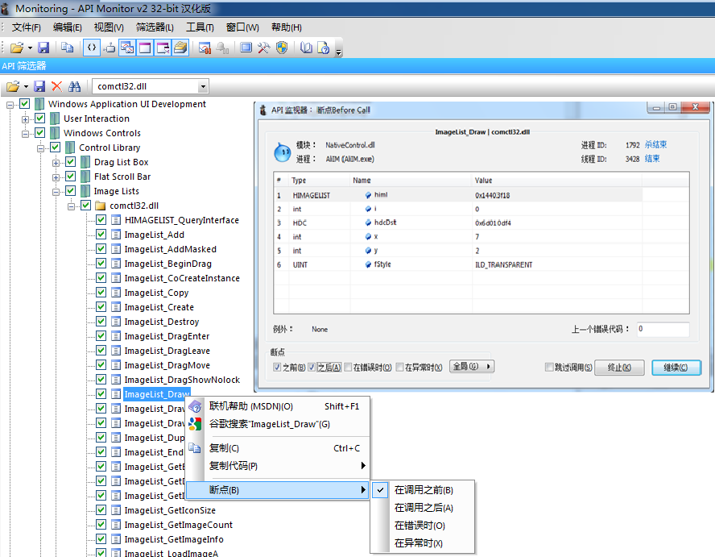

[toc]
# 1. 简介
API Monitor是一个免费软件，可以让你监视和控制应用程序和服务，取得了API调用。它是一个强大的工具，看到的应用程序和服务是如何工作的，或跟踪，你在自己的应用程序的问题。
# 2. 使用
以下继续以阿里旺旺聊天窗口输入栏为例，当输入表情时API Monitor摘要中显示，调用了内部的一个NativeControl.dll（阿里旺旺自己开发的）中的一个ImageList_Draw的函数。而该函数依赖于系统的comctl32.dll库。具体的参数与调用堆栈如下图。

## 2.1 设置断点调试
上一节定位到了comctl32.dll的ImageListDraw函数。为了更深入分析，尝试在此函数上打断点。如下图，勾选函数名前面的框并通过右键设置“在调用之前”断点。这时候，重写在阿里旺旺聊天输入栏中输入表情，会立即进入终端函数中，并弹出终端界面显示参数情况。另外，在此基础上可以继续单步调试。

