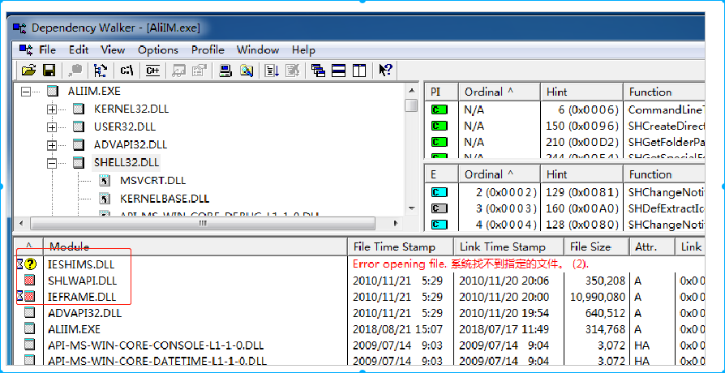

[toc]
# 1. 背景
该工具主要用来依赖查询，可以查看“exe”、“dll”等。

# 2. 使用
以下查询一下阿里旺旺软件依赖情况。操作十分简单，可以通过“File”->“Open”然后选中阿里旺旺所对应的“exe”，也可以直接将“exe”拖拽进Dependency Walker。
a) 左上角，为AliIM.exe软件的依赖关系树；
b) 底部为Module，其中显示“问号”或者“淡红色”的模块即为当前系统缺失模块。

补充： [1] 当AliIM.exe尚未使用丢失模块中的功能时，软件可能并不会发生异常。
[2] 补充模块时，一般需将其下载好的模块放置于AliIM.exe对应的dll目录中，或者放置于system32文件夹下。
[3] GUN/Linux中，使用ldd可以查询.so依赖（见上文）。
