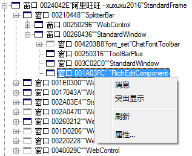
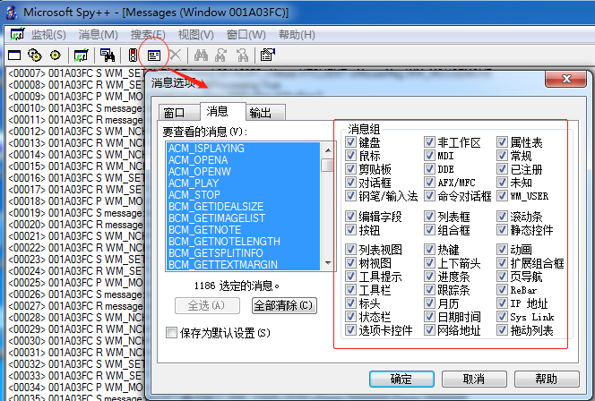

[toc]
# 1. 背景
Spy++（SPYXX.exe）是一个给予win32实用工具。提供系统的进程、线程、窗口、窗口消息的图形界面视图。

## 1.1 功能
* 显示系统对象之间系统图，包括进程、线程、窗口
* 搜索进程、窗口、线程、消息
* 查看进程、窗口、线程、消息属性
* 通过查找工具，通过鼠标定位窗口
* 使用复杂消息日志，选择设置消息选项

# 2. 使用
以下使用Spy++工具对阿里旺旺聊天输入栏进行分析，

a) 点击“监视”->“查找窗口”；
b) 拖拽“查找程序工具”图标（下图“左”红圈标识），放置阿里旺旺输入栏处

c) 此时可以看到该处为RichEditComponet类，点击“确定”后，可以得到上图“右”窗口（模块）树。
d) 右击“RichEditComponet”，可以突出显示被定位的窗口（模块）；
e) 点击“消息”，可以自定义跟踪感兴趣的消息类型，如下图。
