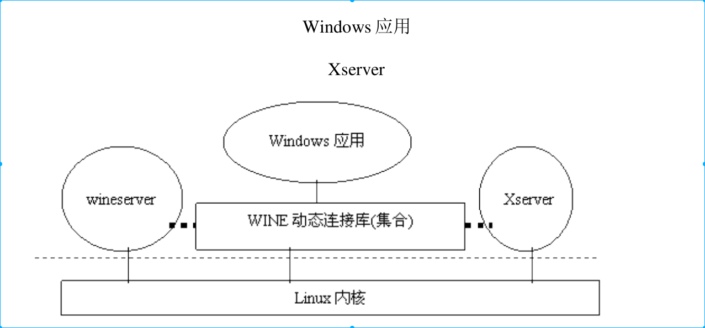

[toc]
# 1. 背景
* wine 主要目的是在Linux（Uninx）上运行windows程序
* wine不是模拟器。利用API转换技术，使得Windows调用Windows内核接口转化成调用Linux内核接口。
* wine 并不能运行所有Windows程序。会遇到很多适配问题，也会出现较多的bug。


# 2. Wine系统结构

* 本质上，wine就是Windows应用软件和Linux内核之间的适配层。
* Wine 本省作为一个进程和一组动态链接库在系统中存在。

* Wine GUI界面依赖X11（X11drv和X11服务组成）
    * x11drv 作为wine和X11之间界面。
    * X11 本身存在，因为Unix和Unix衍生系统都是依赖X11服务的。Wine本身和X11服务存在无关。

* Wine 启动程序至少有三个进程在运行
    * 应用进程本身。
        * 所有DDL调用都在该经常上下文中调用
        * 该进程需要Wine或者Wine间接提供的其它服务(特别是内核)，该进程往往通过Wine提供的各种静态链接库逐层下调。
        * wine 内部，该进程需要通过socket或者pipe和wine进程通信，已接受服务进程的管理和协调。
        * 另一方面，通过x11drv通过别的socket与X11服务进行通信，向其发送图形界面和鼠标键盘请求
    
    * Wine进程
        * Windows进程间通信和同步手段
        * Windows进程和线程、注册表、文件、Win32各种对象管理
    
    * X11服务
        *图形显示和鼠标键盘输入
    

Note:总的来说，Windows程序需要通过Wine和X11进程通信。Wine主要负责进程管理和交互（Windows内核作用），X11主要负责图形。结构图如下（本质上Windows程序直接交互的都是Wine提供的各种动态链接库）




Note：其实在运行Windows程序时，一开始运行的不是Windows程序本身，而是先用Wine启动一个进程，然后使用wine启动Windows程序。


## 2.1 wine 进程

### 2.1.1 wine为Windows进程提供的函数指针
* windows 程序和wine需要通过socket和pipe进行交互。可以理解wine为Windows程序提供RPC（跨进程系统调用）。有下面Wine提供的函数指针接口可以看出，基本上包含各种系统调用函数。

```
static const req_handler req_handlers[REQ_NB_REQUESTS] =
{
(req_handler)req_new_process,
(req_handler)req_new_thread,
(req_handler)req_terminate_process,
(req_handler)req_terminate_thread,
......
(req_handler)req_load_dll,
(req_handler)req_unload_dll,
......
(req_handler)req_create_event,
(req_handler)req_create_mutex,
(req_handler)req_create_semaphore,
......
(req_handler)req_create_file,
(req_handler)req_alloc_file_handle,
(req_handler)req_get_handle_fd,
(req_handler)req_flush_file,
(req_handler)req_lock_file,
(req_handler)req_unlock_file,
......
(req_handler)req_create_socket,
(req_handler)req_accept_socket,
(req_handler)req_set_socket_event,
(req_handler)req_get_socket_event,
(req_handler)req_enable_socket_event,
(req_handler)req_set_socket_deferred,
......
(req_handler)req_open_console,(req_handler)req_read_console_input,
(req_handler)req_write_console_output,
......
(req_handler)req_output_debug_string,

(req_handler)req_continue_debug_event,
(req_handler)req_debug_process,
(req_handler)req_debug_break,
......
(req_handler)req_set_key_value,
(req_handler)req_get_key_value,
(req_handler)req_load_registry,
......
(req_handler)req_create_timer,
(req_handler)req_open_timer,
(req_handler)req_set_timer,
(req_handler)req_cancel_timer,
......
(req_handler)req_get_msg_queue,
(req_handler)req_send_message,
(req_handler)req_get_message,
......
(req_handler)req_create_window,
(req_handler)req_link_window,
(req_handler)req_destroy_window,
(req_handler)req_set_foreground_window,
(req_handler)req_set_focus_window,
(req_handler)req_set_global_windows,
...... 共有将近 200 个函数
}
```


### 2.1.2 wine程序主函数逻辑结构
* 函数进程主题是server/fd.c中无限循环main_loop()
* 这和循环通过poll（）函数监听已经建立的所有socket和pipe。当从某个端口监听到消息时间时，就通过fd_poll_event处理消息事件。


```
[main() > main_loop()]
void main_loop(void)
{
    ......
    while (active_users)
    {
        timeout = get_next_timeout();
        if (!active_users) break; /* last user removed by a timeout */
        ret = poll( pollfd, nb_users, timeout );
        if (ret > 0)
        {
            for (i = 0; i < nb_users; i++)
            {
                if (pollfd[i].revents)
                {
                    fd_poll_event( poll_users[i], pollfd[i].revents );
                    if (!--ret) break;
                }
            }
        }
    }
}
```


* 服务进程启动之初只有一个socket（master socket），所有Windows程序运行时开始都是同master socket 通信。当wine收到通信时，就为Windows程序创建一个进程管理块，并为之创建一个Pipe，作为进程和进程之间通信手段（pipe和socket之间的区别在这里就能体现，socket 多对多，效率低。pipe一对一，效率高）.上面代码是通过master_socket_poll_event()中，master_socket的fd_ops数据结构在master_socket_df_ops保证服务进程对此函数调用（server/request.c）


* 之后Windows程序和服务进程通过pip保持通信。对Windows程序发出的请求，服务进程通过fd_poll_event（）函数响应请求。fd_poll_event执行由管道的 fd_ops 数据结构
thread_fd_ops 中给定的函数 thread_poll_event()，这个函数使用请求中使用的调用号（REQ_load_dll）为下标，在上述数组中req_handlers[]内找出相应函数并执行。最后给予请求答复。

* windows在发出请求后就sleep，在收到回复后就恢复执行。

* thread_poll_event 代码如下
    * thread_poll_event
    ```
    [main() > main_loop() > fd_poll_event() > thread_poll_event()]
    /* handle a client event */
    static void thread_poll_event( struct fd *fd, int event ){
        struct thread *thread = get_fd_user( fd );
        assert( thread->obj.ops == &thread_ops );
        if (event & (POLLERR | POLLHUP)) kill_thread( thread, 0 );
        else if (event & POLLIN) read_request( thread );
        else if (event & POLLOUT) write_reply( thread );
    }
    ```
    数据结构 struct fd 中含有具体管道属于(通往)哪一个进程/线程的信息,因此可
以知道是谁发来的请求。在正常的情况下,这个函数会调用 read_request(),我们
只看其主体部分.
    
    * read_request
    ```
    [main() > main_loop() > fd_poll_event() > thread_poll_event() > read_request()]
    /* read a request from a thread */
    void read_request( struct thread *thread )
    {
        ......
        if (!thread->req_toread) /* no pending request */
        {
            if ((ret = read( get_unix_fd( thread->request_fd ), &thread->req,
            sizeof(thread->req) )) != sizeof(thread->req)) goto error;
            if (!(thread->req_toread = thread->req.request_header.request_size))
            {
                        /* no data, handle request at once */
                call_req_handler( thread );
                return;
            }
            if (!(thread->req_data = malloc( thread->req_toread )))
            fatal_protocol_error( thread,
            "no memory for %d bytes request\n", thread->req_toread );
        }
        ......
    }
    ```
    所谓 read_request(),实际上是“读取并执行”请求。具体的执行由
call_req_handler()启动.


    * call_req_handler
    ```
    /* call a request handler */
    static void call_req_handler( struct thread *thread )
    {
        union generic_reply reply;
        enum request req = thread->req.request_header.req;
        current = thread;
        current->reply_size = 0;
        clear_error();
        memset( &reply, 0, sizeof(reply) );
        if (debug_level) trace_request();
        if (req < REQ_NB_REQUESTS)
        {
            req_handlers[req]( &current->req, &reply );
            if (current)
            {
                if (current->reply_fd)
                {
                    reply.reply_header.error = current->error;
                    reply.reply_header.reply_size = current->reply_size;
                    if (debug_level) trace_reply( req, &reply );
                    send_reply( &reply );
                }
                else fatal_protocol_error( current, "no reply fd for request %d\n", req );
            }
            current = NULL;
            return;
        }
        fatal_protocol_error( current, "bad request %d\n", req );
    }
    ```

* 这种RPC调用和动态链接库调用有本质区别。
    * 动态链接库是在进程内调用，性能高，扩张性差。
    * RPC是进程之间调用。性能差，扩展性好，隔离性强。


### 2.1.3 wine和Windows程序之间的通信

* wine 中使用了大量的宏定义，理解这些宏定义都理解wine代码至关重要。


