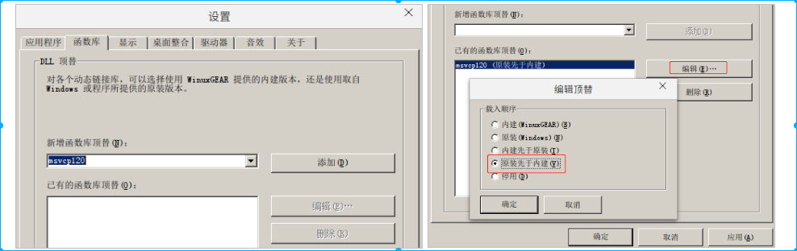
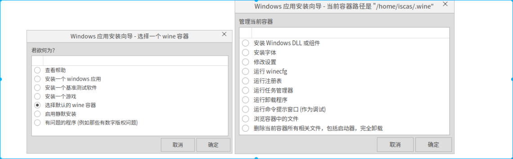

[toc]

# 1. WINEDEBUG初步

## 1.1 Wine运行日志理解

```
fixme:shell:IShellBrowser_fnOnViewWindowActive stub, 0x15b4a0 (0x175f68)
err:shell:ICommDlgBrowser3_fnOnDefaultCommand Failed to get IDataObject.
fixme:shell:IShellBrowser_fnOnViewWindowActive stub, 0x15b4a0 (0x175f68)
fixme:shell:IShellBrowser_fnOnViewWindowActive stub, 0x15b4a0 (0x175f68)
fixme:shell:ShellView_OnNotify LVN_KEYDOWN key=0x00000090
fixme:shell:ShellView_OnNotify LVN_KEYDOWN key=0x00000011
```

* 上述例子中fixme成为class，shell成为channel
* class 分为err warn fixme trace四种
* channels有400多宗

## 1.2 运行程序的命令格式
```
WINEDEBUG=[class][+/-]channel[,[class2][+/-][channel2]]
```

### 1.2.1 例子
* 关闭fixme:shell日志
```
WINEDEBUG=fixme-shell wine explorer
```
* 打开trace:shell日志
```
WINEDEBUG=trace+shell wine explorer
```
* 打开所有ddl警告和heap信息
```
WINEDEBUG=warn+shell,+heap wine explorer
```


## 1.3 winecfg--配置wine运行环境
### 1.3.1 开启隔离环境
主要是创建运行容器隔离环境。通过WINEPREFIX与winecfg命令，可以使用独立C盘和注册表配置
* 创建文件夹
    ```
    mkdir -p ~/Desktop/win_RUN/
    ```
* 搭建容器环境
    ```
    WINEPREFIX=~/Desktop/win_RUN/ winecfg
    ```
* 在隔离环境中运行程序
    ```
    WINEPREFIX=~/Desktop/win_RUN/ wine SourceInsight_V3.5.83.0_Setup.exe 
    ```
* 安装玩软件后，发现软件属性任然需要wine来启动（env WINEPREFIX="/home/wanlei/Desktop/win_RUN" wine C:\\Program\ Files\ \(x86\)\\Source\ Insight\ 3\\Insight3.exe ）

### 1.3.2 关闭创建的隔离环境
Ctrl+C 可以停掉容器，如果想杀死容器中的所有进程，可以使用以下命令
```
WINEPREFIX=~/Desktop/win_RUN/ wineserver -k
```

## 1.3.3 winecfg添加程序库文件

在使用wine安装文件时，可能会缺少XX.dll类似的系统文件，这时候可以使用winecfg去添加dll。一般选择“原装先与内建”



## 1.4 winetricks 钻床
* 如果说winecfg是一把螺丝刀那么winetricks就是钻床，它们各有所长，但是winetricks是一个更强大工具。

* winecfg 可以改变wine本身设置，而winetricks可以让你改造实际的Windows层，他可以让你装Windows重要的系统组件，比如.dll文件和系统字体，还允许你修改Windows注册表信息。还有任务管理器、卸载工具、文件浏览器。

### 1.4.1 安装winetricks
winetricks和winecfg不同，winecfg是集成在wine中的，而winetricks实际上是一个脚本工具，我们可以使用专门的工作目录去存放所有的工具。

由于winetricks是一个脚本，我们直接下载就好
```
wget https://raw.githubusercontent.com/Winetricks/winetricks/master/src/winetricks

chmod +x winetricks
```
### 1.4.2 安装dll
* 我们使用winetricks最多的任然是安装dll和Windows组件。
* 不带参数启动winetricks程序后就会有一系列图形界面帮组你去安装，比较傻瓜。



# 2. 使用winedbg
* winedbg是wine集成的调试器

* winedbg能精确的定位到日志打印的内容

## 2.1 winedbg启动调试程序
* note:不知道为什么，本人在Linux使用改方法出现错误

这里在Windows上使用Code::Blocks写了个简单foo.exe作为调试样本。
```
//foo.c
#include <stdio.h>
int foo(char* x){
    printf("hello %s\n", x);
    return 0;
}

int main(){
    int a = 1, b = 0, c = 0;
    b = c / a;
    a = b / c;  //ERROR: div 0
    foo("winedbg");
    return 0;
}
```
* 使用winedbg开始跑程序。
```
$ wine winedbg foo.exe 
WineDbg starting on pid 0031
fixme:dbghelp_dwarf:dwarf2_parse_subprogram_block no range
//…
```
* 将此设置为“0”以允许应用程序自己处理异常。(看到了异常的提示)
```
Wine-dbg>set $BreakOnFirstChance=0
Wine-dbg>cont
Unhandled exception: divide by zero in 32-bit code (0x004013a8).
Register dump:
 CS:0023 SS:002b DS:002b ES:002b FS:0063 GS:006b
//…
Stack dump:
0x0060fdc0:  00000000 00000000 0060fe68 0040195e
0x0060fdd0:  00401900 00000000 00000000 00000001
//…
Backtrace:
=>0 0x004013a8 in foo (+0x13a8) (0x0060fde8)
  1 0x004010fd in foo (+0x10fc) (0x0060fe68)
  2 0x00401290 in foo (+0x128f) (0x0060fe68)
  //…
  15 0x7c000b48 main+0x97(argc=<is not available>, argv=<is not available>) [/builddir/build/winuxengine_dev/winuxgear-engine-1.5.0/loader/main.c:254] in <wine-loader> (0xffce7d58)
  16 0xf7400276 __libc_start_main+0xf5() in libc.so.6 (0x00000000)
0x004013a8: idivl	0x14(%esp),%eax
```


## 2.2 调试正在运行程序
这里需要启动两个终端。终端1：$ wine foo.exe。终端2：$ winedbg
```
Wine-dbg>info process
 pid      threads  executable (all id:s are in hex)
 0000002f 5        'explorer.exe'
 0000000e 8        'services.exe'
 00000025 4        \_ 'winedevice.exe'
 0000001e 3        \_ 'plugplay.exe'
 00000012 4        \_ 'winedevice.exe'
 00000008 1        'foo.exe'
 00000031 1        \_ 'winedbg.exe'
Wine-dbg>attach 0x00000008
Wine-dbg>set $BreakOnFirstChance=0
Wine-dbg>cont
```

## 2.3 winedbg 配置
上一节中，用到了$BreakOnFirstChance，其实wine还有更多的配置项，比如：
* $ BreakAllThreadsStartup
如果在所有线程启动时设置为TRUE，则调试器停止设置为FALSE，如果仅在给定进程的第一个线程启动时调试器停止。默认为FALSE。
* $ BreakOnCritSectTimeOut
如果调试器在关键部分超时（5分钟）时停止，则设置为TRUE; 默认为TRUE。
* $ BreakOnAttach
如果在未处理的异常之后winedbg附加到现有进程时，则设置为TRUE，应在第一个附加事件上输入winedbg。由于attach事件在异常事件的上下文中是无意义的（下一个事件是异常事件当然是相关的），该选项可能是FALSE。
* $ BreakOnFirstChance
异常可以生成两个调试事件。第一个在异常之后传递给调试器（称为第一次机会）。然后调试器可以决定是继续执行（参见winedbg的cont命令）还是将异常传递给程序中的异常处理程序链（如果存在）（winedbg通过pass命令实现）。如果没有任何异常处理程序处理异常，则异常事件将再次发送到调试器（称为最后机会异常）。您无法传递最后一个异常。当BreakOnFirstChance异常为TRUE时，则为第一个和最后一个机会异常输入winedbg（为FALSE），它只输入最后机会异常）。
* $ AlwaysShowThunk
如果调试器在从其名称查找符号时显示具有该名称的所有thunk，则设置为TRUE。默认值（FALSE）允许不必在符号和使用该符号的所有DLL中的所有导入thunk之间进行选择。 

## 2.4 winedbg的34个命令
虽然很相似，但是winedbg的命令还是较少，它相当于gdb的一个子集。以下命令是可以使用的（共34个命令）。具体用途，可以查阅本节参考文献。

```
$Wine-dbg>help
```