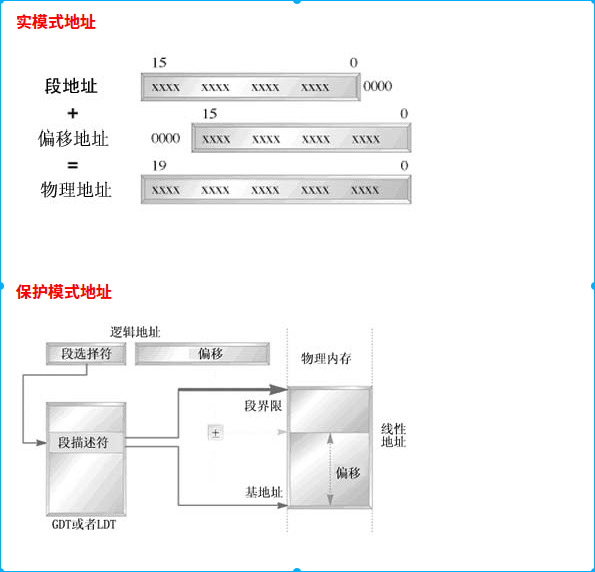

[toc]

# 1. 背景
* 80386开始，CPU有三种工作方式。实模式、保护模式、虚拟80386模式。
* 机器刚启动时为实模式（real-mode），只能方位1M以内内存
* 操作系统运行起来之后为保护模式（protect-mode），所有内存地址空间都能访问
* 为了向后兼容8086程序，支持虚拟8086模式
# 2. 实模式
* 实模式主要是为了兼容早期系统程序，比如dos系统全都是运行在实模式下
* 实模式没有硬件级的内存保护概念和多道任务工作模式
* 80386 能访问20位地址（1M），包含BIOS和物理内存地址，由于BIOS地址映射占用部分内存，软件真正使用的内存只有640k-920k

# 3. 保护模式
保护模式本身是80286及以后兼容处理器序列之后产成的一种操作模式，它具有许多特性设计为提高系统的多道任务和系统的稳定性。例如内存的保护，分页机制和硬件虚拟存储的支持。
# 4.虚拟8086模式
主要是为了兼容8086程序

# 5. real-mode 和protect-mode区别
两者看似都是使用内存段、中断、内存驱动处理硬件。但是两者还是有很大区别。

* 实模式下地址使用段基址+段偏移地址。实模式下使用段描述符（全局描述符GDT和局部描述符LDT）。
* 实模式下段长固定64KB。但是在实模式下段长可变，最大4GB
* GDT是一个段描述符数组，包含所有程序都可以使用的基准段描述符每个系统都必须定义一个GDT（共享）。LDT也是段描述符的一个数组，但是不是共享的

* 从图中可以看出，实模式下内存地址访问是受保护的。因为用户使用的是虚拟地址，系统通过段描述才能找到实际地址，而实模式下程序使用的直接是实地址。