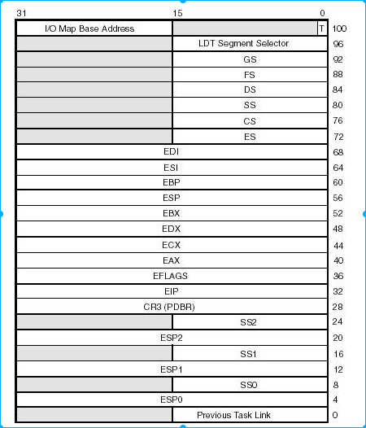
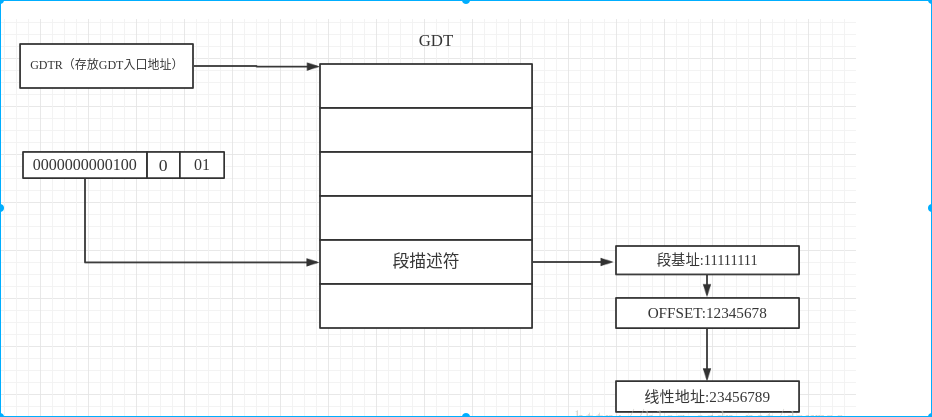
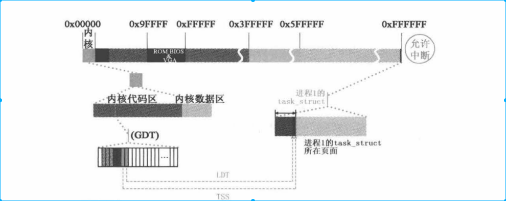
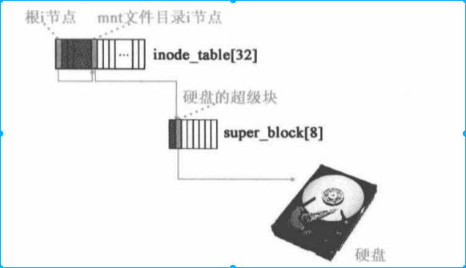
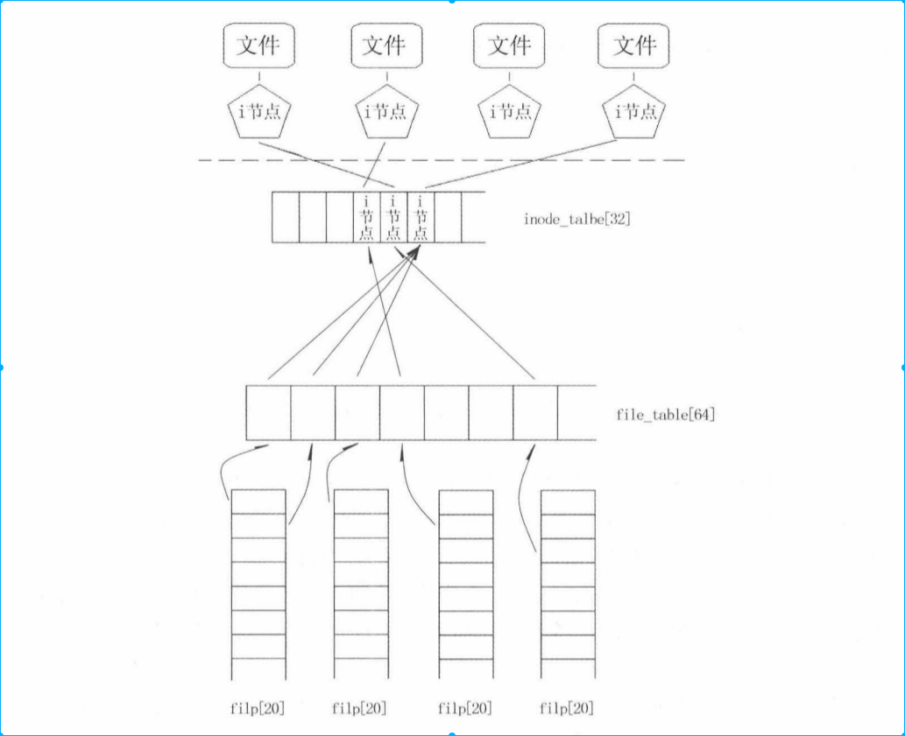
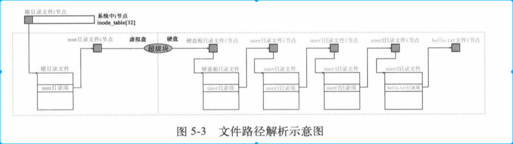

[toc]
# 1. 背景
Linux kernel还是很复杂的。有效的记住这些名词对我们非常有帮助。
下面，主要根据名词所属的类型进行分类。

# 2. 进程重要名称解释

## 2.1 TSS
* TSS: task state segment,是操作系统在进行进程切换时保护现场信息段。
    * 通常保存的是进程CPU中各种寄存器的值
### 2.1.1 TSS结构和各部分作用

TSS 结构基本上是非常固定的。

* 寄存器保存区：TSS偏移20H--5FH(图中32-95).保存通用寄存器、指令寄存器、标志寄存器、指令指针。

* 内存堆栈指针区域：途中4--24区域都为堆栈指针，主要保存的0级和3级模式切换的指针
    * 为甚么是3个堆栈区域。
        * 3级用户程序一个堆栈
        * 0级内核有一个堆栈
        * 3级程序向0级内核跳转有一个堆栈（系统调用）
        * 没有0级程序向3级程序挑战的堆栈。我们想想系统调用，是通过退栈来实现层级跃迁的（其实也可以理解成3级和0级之间需要有个堆栈，不需要方向）
    
* 地址映射寄存器区域：我们知道地址映射主要通过GDT和LDT实现。在进程切换时我们需要保存LDT和CR3(页目录起始地址)，对应图中96和28
    * CR3和LDT到底存放的是什么？(#2.2 回答)

* 链接字段：对应图中0处。该字段保存的是前一任务TSS地址。该字段因使用段间跳转指令call和中断（异常）而激活存放前一个进程TSS值，并在标志寄存器EFLAGES中的NT位置置1是该字段有效。当使用ret或中断返回指令时，会检查NT字段是否有效，如果有效则找到前一个TSS切换到上一个进程。

* I/O许可字段：为了实现输入输出保护，需要使用I/O许可位图。通过该字段，进程能知道自身的I/O权限。

## 2.2 GDT、LDT、CR3

* GDT 表示全局描述符，系统一张。每项存储一个LDT来找到进程
* LDT 标识系统描述符，每个进程一张。每项存储一个段，一个进程分为很多段。
* CR3 标识进程内存页初始化地址，一个进程一个。我们知道，每个进程虚拟编址都是从0开始，只有借助CR3才能找到真实物理地址


## 2.3 task_struct
task_struct是我们常说的PCB进程控制块结构体体。那么task_struct和GDT、LDT、TSS之间的关系又是什么


如图所示
* GDT项关联的其实是task_struct结构体，并非是LDT和TSS
* task_struct是包含LDT和TSS结构体的
* 因此我们通过GDT找到task_struct，再找到LDT和TSS

# 3. 文件系统重要名词解释

## 3.2 引导块、超级块、i节点位图、逻辑块位图、i节点区块
* 引导块： BIOS自动读入执行的代码
* 超级块：存放设备文件系统信息，包括逻辑块数、i节点数、最大文件长度等。对应结构体uper_block
```
struct super_block {
    unsigned short s_ninodes;
    unsigned short s_nzones;
    unsigned short s_imap_blocks;
    unsigned short s_zmap_blocks;
    unsigned short s_firstdatazone;
    unsigned short s_log_zone_size;
    unsigned long  s_max_size;
    unsigned short s_magic;
/* These are only in memory */ //上面这些字段是具体存储在盘设备中，下面是在内存中初始化的结构体成员
    struct buffer_head 　　*s_imap[8];
    struct buffer_head 　　*s_zmap[8];
    unsigned short 　　　　 s_dev;
    struct m_inode 　　　　 *s_isup; //根目录i节点
    struct m_inode 　　　　 *s_imount;
    unsigned long 　　　　  s_time;
    struct task_struct 　　*s_wait;
    unsigned char 　　　　　　s_lock;
    unsigned char 　　　　　　s_rd_only;
    unsigned char 　　　　　　s_dirt;
};
```
* i节点位图：表示i节点是否被使用，i节点对应文件或者目录索引，相当与文件创建或者被内核管理文件数量
* 逻辑块位图：表示逻辑块是否被使用，逻辑块是实际上的数据块，存储文件内容
* i节点区域：存放具体i节点数据；存储结构如下
```
struct d_inode {
    unsigned short i_mode;
    unsigned short i_uid;
    unsigned long i_size;
    unsigned long i_time;
    unsigned char i_gid;
    unsigned char i_nlinks;
    unsigned short i_zone[9];//对应数据区内的逻辑块号，其中0~6是直接块号、7为一次直接块号、8是二次直接块号。
};
```
* 数据区：即逻辑块区域；

## 3.3 各个名词作用
### 3.3.1 super_block[8],inode_table[32],i节点关系和作用，filp[20],file_table[40]
i节点：主要是硬件方面作用，通过设备路径可以获取到系统i节点，i节点可以知道设备的块号和设备号
super_block[8] :主要是用来存放根设备的超级快信息（特别是文件系统），super_block[8]需要挂载在i节点上，这样i节点就能找到磁盘文件系统信息。
inode_table[32]：主要存放i节点，以及i节点树状结构





* inode_table[32]并不能存放所有所有文件i节点，linux提供通过路径寻找i节点方式


