[toc]

# 1. 背景
从加电到执行操作系统main函数主要分以下三步:
* 启动BIOS，准备中断向量表和中断服务程序
* 从启动盘加载操作系统到内存，加载工作就是有前面中断服务程序执行的
* 执行main函数前做一些过渡工作

# 2. 启动BIOS，准备中断向量表和中断服务程序

## 2.1. BIOS
### 2.1.1. BIOS 启动

BIOS启动之前RAM中什么都没有，那么BIOS程序由什么来执行呢？（此时操作系统还未被加载）

* 既然先在程序中没有软件，那么就由硬件来执行程序。
* Intel 8086 系列芯片都被设计成加电进入16位实模式状态。同时非常关键的是CPU加电瞬间强行将CS值设计为0xF0000，IP设计为OxFFF0，这样CS:IP就指向0xFFFF0，这里正好指向BIOS地址范围。
* 0xFFFF0 必须是BIOS程序入口地址，如果不是，计算机就死机。

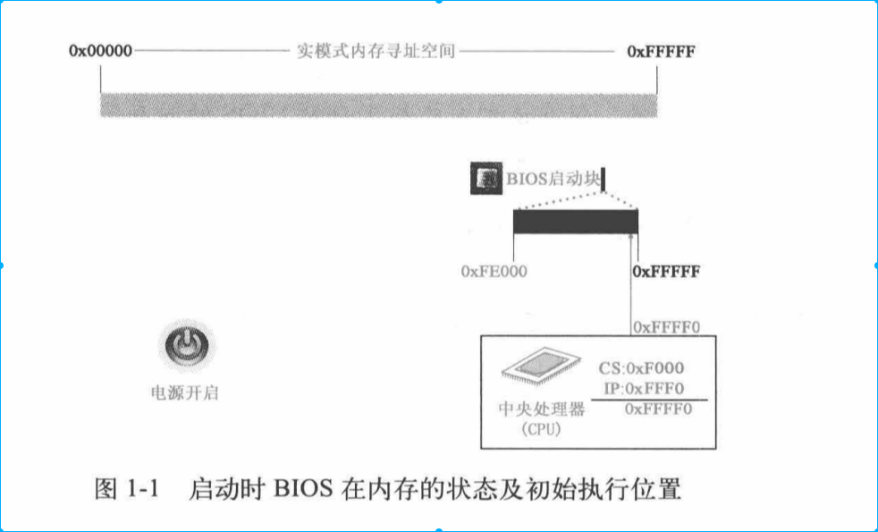

### 2.1.2. BIOS在内存中加载中断向量表和中断服务程序

* BIOS程序量不大但是非常精深，并且要把很多硬件都了解清楚，这不是我想研究方向，因此下面只是理解加载中断向量表和中断服务程序。

* BIOS 是被固化在ROM中，启动BIOS后会进行检查显卡内存等工作，这期间执行非常重要的工作是建立中断向量表和中断服务程序。

* BIOS 在内存最开始1kb构建中断向量表，紧接着256B构建BIOS数据区，并在之后57kb左右位置加载中断服务程序
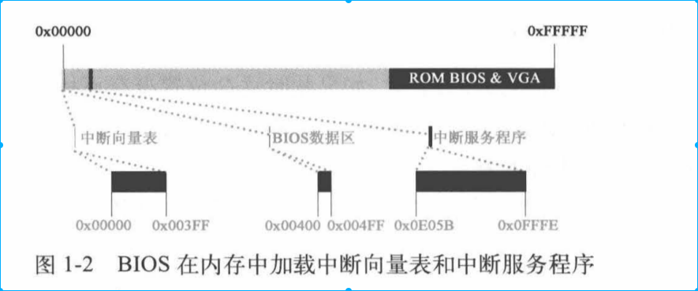

* 中断向量表中有256个中断向量，每个中断向量4字节，前两字节标识CS，后两个字节标识IP，分别指向每一个中断服务程序起始地址。

# 3. 中断服务程序将操作系统内核程序加载在内存
* 中断向量表和中断服务程序都是BIOS事先设计好的。可以说中断服务程序就是BIOS中部分代码映射。（当断服务程序有BIOS加载，那么不同的BIOS有不同的中断服务程序？）

## 3.1. 加载操作系统内核程序并为保护模式做准备
* boot操作：boot操作就是我们讲操作系统内核程序加载在内存中
* 对Linux 0.11操作系统而言，计算机分三步分别加载操作系统内核代码，第一批由BIOS中断int 0x19把第一扇区bootsect的内容加载在内核中，第二批、第三批在bootsect的指挥下分别将接下来的4个扇区和240个扇区分别加载在内存中

### 3.1.1. 加载第一部分内核代码--引导程序（bootsect）

* 我们把硬盘设计为启动盘，计算机硬件体系结构设计和BIOS联合会生成一个int 0x19中断信号。
* CPU收到中断信号后，会立即找到中断向量表，然后找到中断服务程序，这个程序作用就是将硬盘中第一个扇区的程序加载在内存中的指定位置。（0号磁头，0号磁道1号扇区内容）。这个扇区内容就是操作系统引导程序（bootsect，第一个执行的Linux 内核代码，是用汇编写的）

* BIOS 是厂商决定的，不是由Linux 内核的人决定的。因此两边必须要有合适的协调机制，目前采用“两头约定”和“定位识别”
    * 操作系统：操作系统的启动程序必须定位在启动扇区（0磁头、0磁道、0扇区），其余程序由操作系统设计加载
    * BIOS收到启动操作系统命令，只从启动扇区把程序加载在0x07c00（BOOTSEG）这个位置（参见Seabios 0.6.0//boot.c 代码中的boot_disk 函数），至于这个扇区中是否是启动程序，是什么操作系统boot不管

### 3.1.2. 加载第二部分程序--setup

#### 3.1.2.1. bootsect对内存规划
* 为了将第二批和第三批内核代码加载在内存中，bootsect代码首先要做的是内存规划

* 实模式下没有内存保护，setup首先要做的是设置不同代码段的地址范围，比如如下

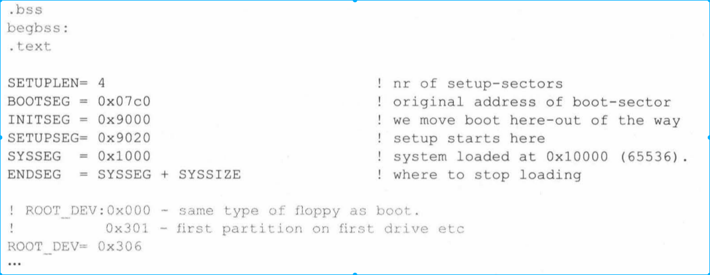
    * SETUPLEN:setup程序扇区数
    * SETUPSEG:setup程序加载位置
    * BOOTSEG: 启动扇区(Bootsect)被扇区加载位置
    * INITSEG: 启动程序即将要移动的新位置
    * SYSSEG: kernal要被加载的位置
    * ENDSEG: 内核结束位置
    * ROOT_DEV: 根文件系统设备号

    上面这些地址都被bootsect明确的标识出来，确保即将加载的代码和已经加载代码在内存中的地址不会发生冲突

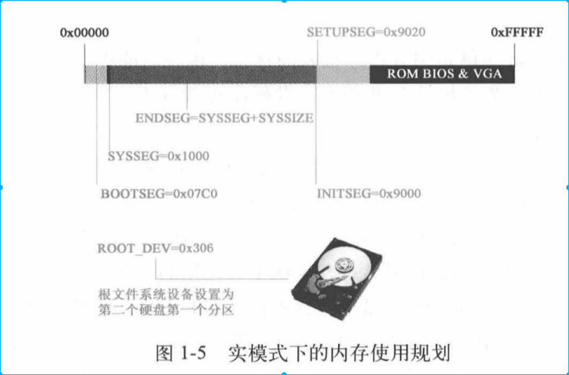

#### 3.1.2.2. 复制bootsect

bootsect将bootsect从BOOTSEG处移动到INITSEG处。为什么要复制自己（有病？）由于原来的“两头设计”，bootsect被迫的被放在BOOTSEG位置上，移动自己说明bootsect开始根据自身的需求安排内存。

复制代码如下
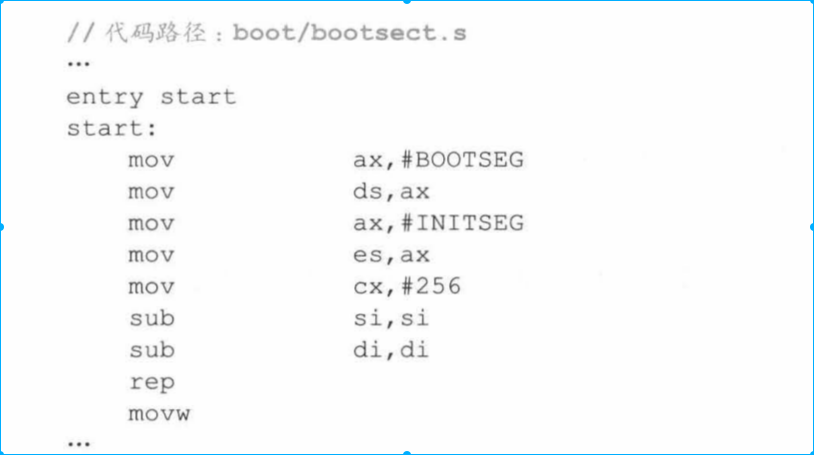

* ds 和si构成源地址，es，di构成目的地址。cx存放256代表复制第一个扇区（256字，512字节）
* 此时的cs指向的是BOOTSEG，即原来的bootsect程序

复制代码完毕后就会执行下面代码
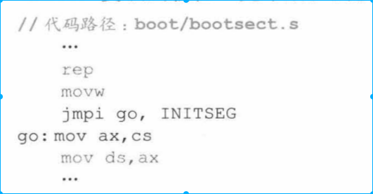

* 这里主要是CS:IP跳转到INITSEG部分，这是程序已经完全脱离BIOS范畴了。

上面我们已经改变了CS地址，下面我们对DS、ES、SS、SP做调整，执行如下代码
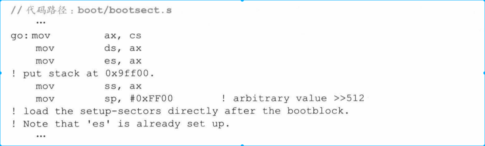

* cs值复制给 ds（数据段）、es（附加段寄存器）、ss（栈基址），SP指向偏移地址0xFF00.如图所示
    * 这里ss和sp初始化，说明下面可以对栈进行操作。栈的压栈是从高地址向低地址方向
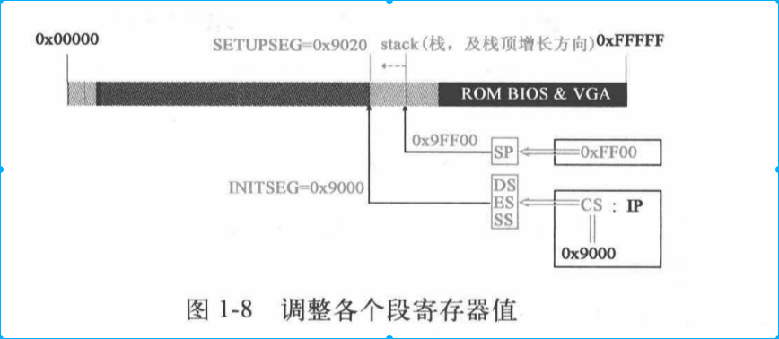

#### 3.1.2.3. 将setup程序加载在内存中

* 加载setup程序，需要借助BIOS提供的int 0x13所指向的中断服务
* int0x13和int0x19不同，调用者是linux代码并且目的地址可指定不是固定的0x07C00
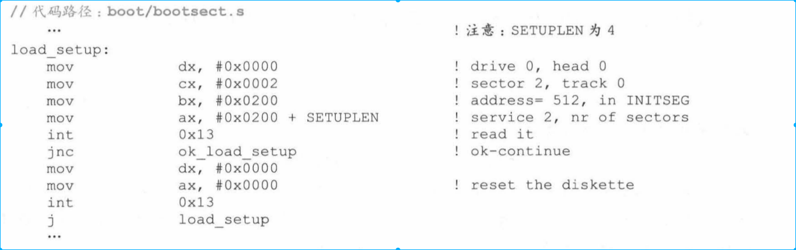

## 3.2. 加载第三部分内核代码--system
* 和加载setup程序一样，使用int0x13中断
* 这时操作系统任然没有运行，全都是汇编代码

## 3.3. 再次确认下根设备号
* Linux 启动包含两个方面，一个是内核镜像，一个是根文件系统（这里的文件系统不是操作系统中文件系统代码，而是带有某种文件系统格式的设备）
* Linux使用Minix操作系统的文件管理方式，要求系统必须存在一个根文件系统，其它文件系统挂在在上面（不是同等地位）
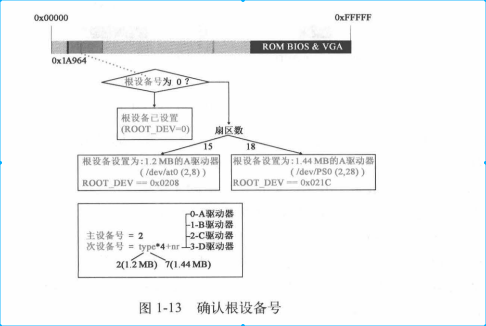

代码如下
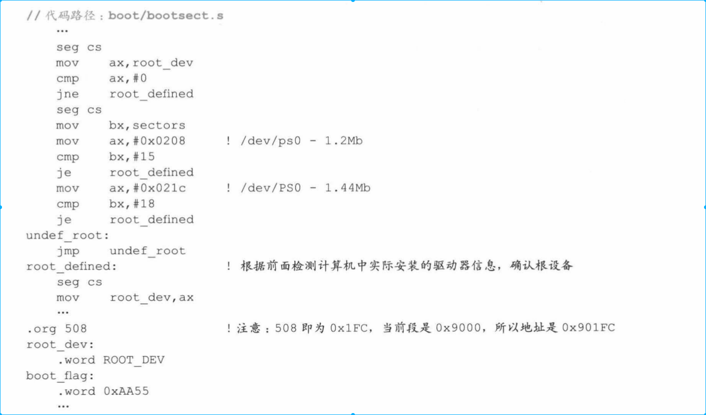

以上bootsect代码就执行完毕。

## 3.4. 执行setup程序
接下来要跳转到SETUPSEG处，执行setup程序。

* setup 首先利用BIOS提供的中断服务获取内核运行所需的系统机器系统数据。为后面的main函数执行提供重要作用

以上内核加载基本结束
# 4. 开始想32位转变，为运行main函数做准备
* 这部分对Linux 操作系统有战略意义，系统通过已加载在内核中的代码，实现从实模式转变成保护模式。这部分使得Linux成为真正意义上的现代操作系统。

* 操作系统要使程序运行在32位保护模式下工作，这期间需要做大量重建工作。
    * 打开32位寻址空间
    * 打开保护模式
    * 建立保护模式下的中断响应机制
    * 做好保护模式响应的配套工作
    * 建立内存分页机制
    * 为调用面函数做准备

## 4.1. 关中断，并将system移动到内存起始位置
* 首先关闭中断（EFLAGS中的中断标志位置0），这时不再对BIOS中断服务进行响应。
* 在下一章讲解的执行mian函数时才会重新打开中断进行响应，并且更牛逼的是这时候的中断服务已经换成了操作系统对应的中断服务（这时回答了我们啊Q1问题）

* 将system代码移动到0x00000时，显然就破坏了原来的16为中断机制，但是我们使用的是32为linux系统，就是为了破坏16位中断表。

## 4.2. 设置中断描述符表和全局描述符表
* 之前setup程序获取中断描述符表寄存器（IDTR）和全局描述符表寄存器（GDTR），用来进行初始化

    * GDT(Global Descriptor Table 全局描述符)，在系统中唯一存放段寄存器内容数组。可以理解成所有进程的总目录
    * LDT（Local Descriptor Table）LDT包含当前进程各种寄存器信息，方便中断后进程恢复
    * GDTR （Global Descriptor Table Register）寄存器中存放GDT入口
    * IDT（Interrupt Descriptor Table 中断描述符表） 保护模式下所有中断服务程序入口地址，类似中断向量表。16为中断向量表位置固定在内存起始地址，32 IDT位置不固定。
    * IDTR（Interrupt Descriptor Table Register）存放IDT起始地址

    

## 4.3. CPU中打开A20 实现32位寻址
* CPU中打开A20标志着CPU可以实现32位寻址

打开A20代码如下

## 4.4. 为保护模式下执行head.s做准备

* 为实现保护模式下的中断机制，setup程序将对可编程中断控制器8259A进行编程（8025A是专门对8085A、8086 8088进行中断控制而设计的芯片，是可以使用程序控制的中断控制器。）
* 在保护模式下，Intel将int0x00--0x1F保留为内部（不可屏蔽中断）和异常。这样和实模式下的int0x00--0x1F中断信号冲突。因此，8025A编程就将原来的IRQ0

编程的代码如下
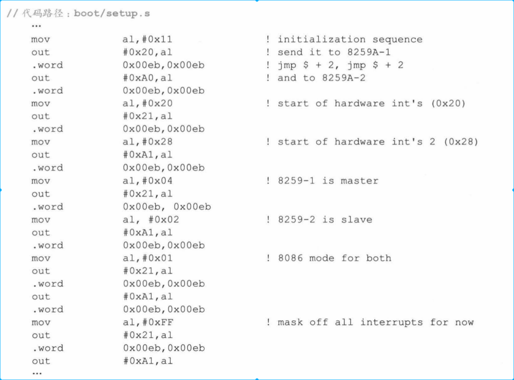

* 重新编程的结果如下图所示
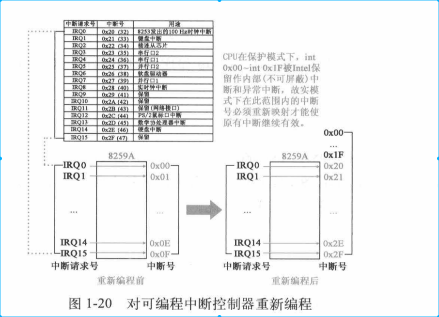

* setup 通过下面代码前两行将CPU工作方式设置为保护模式。将CR0寄存器第一位（PE）置1，即设置处理器为保护模式

* cpu 设置成保护模式需要做的重要事情就是根据GDT决定执行哪里的程序。

到此位置setup程序使命结束。主要是为为保护模式下做一些准备工作，下面的任务有head程序执行

## 4.5 head.s开始执行
* 执行mian之前，主要有bootsect，setup，heads三个汇编程序组成。之后能运行C语言程序。

* 前面bootsect加载在0x07c00和0x90000，setup 加载在0x90200，都是先加载后执行。head程序是现将head.s汇编成目标代码，将C写的内核代码编译成目标代码，然后链接成system模块。system中内核程序包含汇编head程序（在前）和内核程序（在后）

* 前面setup程序将system程序加载在0x00000位置，内存起始地址的代码是head程序。如下所示
    

* head程序（25kb+184B大小）还做了一个非常重要的工作，就是在自身程序空间内建立起分页机制。记载0x00000位置创建了页目录表，页表缓冲区、GDT、IDT（将已执行过的head程序覆盖掉）

* 这说明head程序将自己废弃，从自身程序开始执行

### 4.5.1 head建立内存分页（理解内核的基础知识）
先看如下代码

* 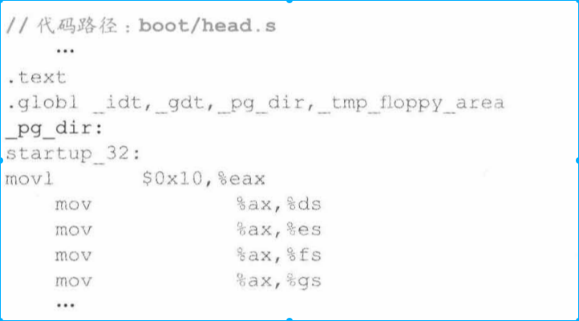
__pg_dir标识内存分页机制完成后内核的其实位置（0x000000）
* head马上要在这里建立页表，为分页机制做准备。这里是理解内核的核心理论知识。下图标识页表在内存中所在位置
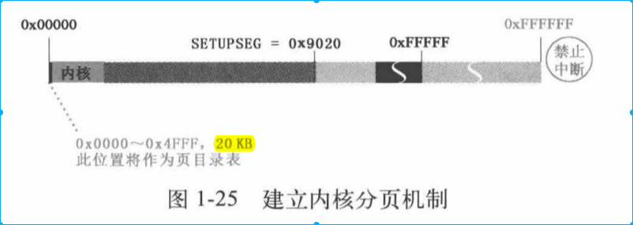

* 下面是head代码正式开始执行。本质上是让程序从实模式转向保护模式做准备。
    * 实模式下CS是代码段基址，保护模式不是，标识的是段选择符
    * DS、ES、FS、GS等其它寄存器也要从实模式下向保护模式下转变
    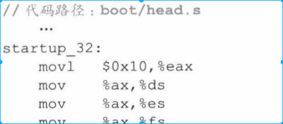
    

    *代码执行完毕之后，4个寄存器的值都相同0x10,00010000,最后两位标识内核特权级，倒数第三位标识选择GDT，第4,5两（10）位标识选择GDT的第2项也就是第3项（从0开始）。也就说三个寄存器的特权、段基址、段限长（0x7FF 8M）都相等
    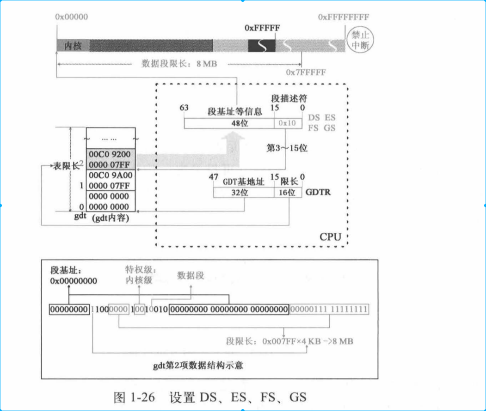

    * 这些指定所使用的GDT表都是setup之前创建好的

### 4.5.2 head程序废除原有GDT表
* 为什么要废除GDT。因为原来GDT是由setup程序创建的，如果setup程序被覆盖，那么GDT很有可能会被覆盖。那么heads程序所在位置是安全的。
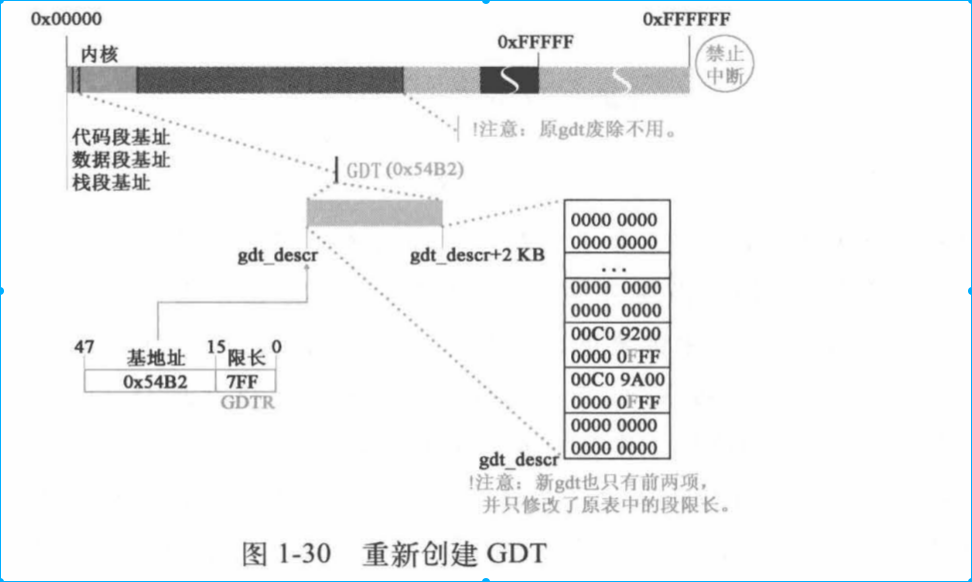

* 这时段长限编程16M，需要修改相应寄存器值

### 4.5.3 加载mian最后准备工作--将main压栈

* head 将L6标号和main函数地址压栈。如果mian函数异常退出，就返回L6标号继续执行进行出错处理。
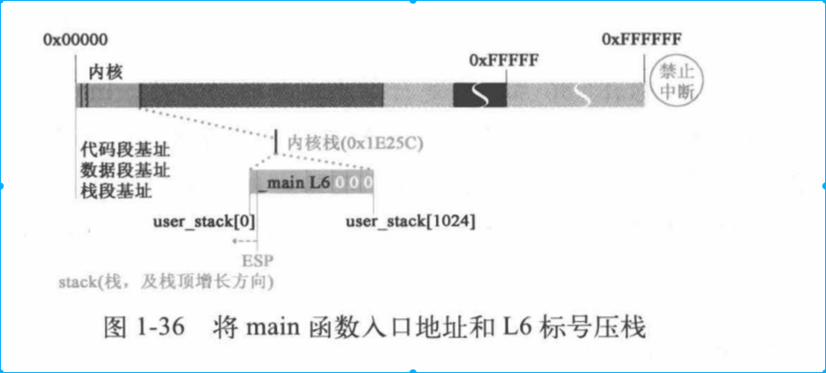

指向代码如下
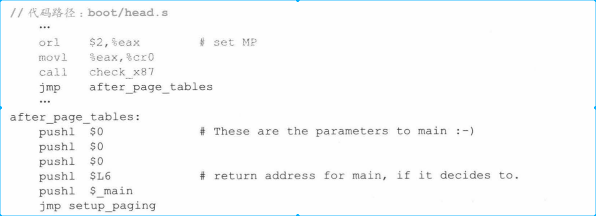

* 压栈动作完成之后，head程序跳转到setup_paging去执行，开始创建分页机制。现将页目录和4个页表放在内存起始位置，内存地址前5个页都清0来覆盖head自身程序。
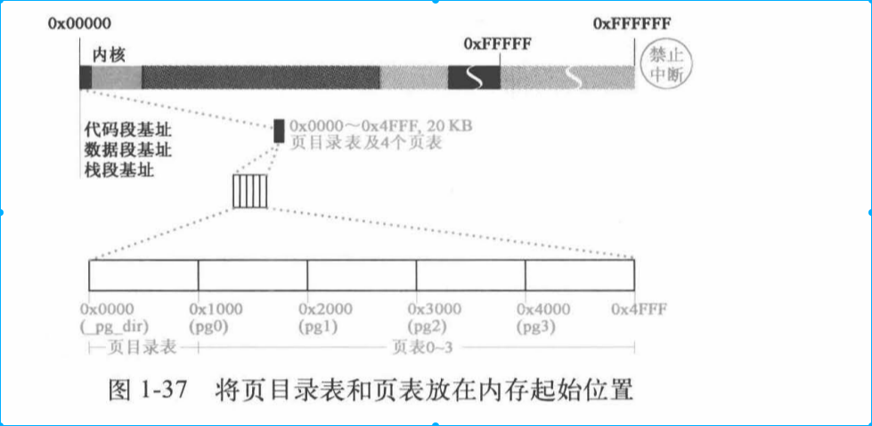

* 将页目录放在内存的其实位置，能够帮助操作系统掌管全局，掌控进程在内存中安全运行的基石之一。
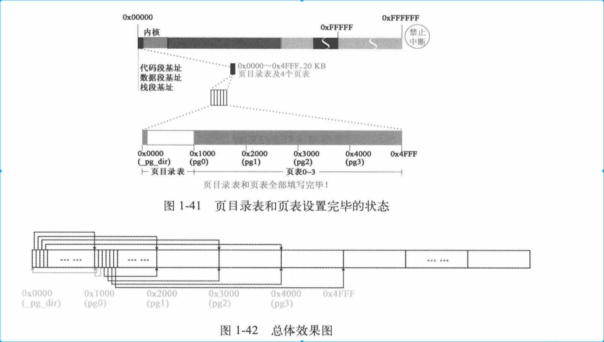

* 这四个页表是内核专属页表，后面每个用户都有自己页表。

* 设置完页表之后就是设置中断寄存器值

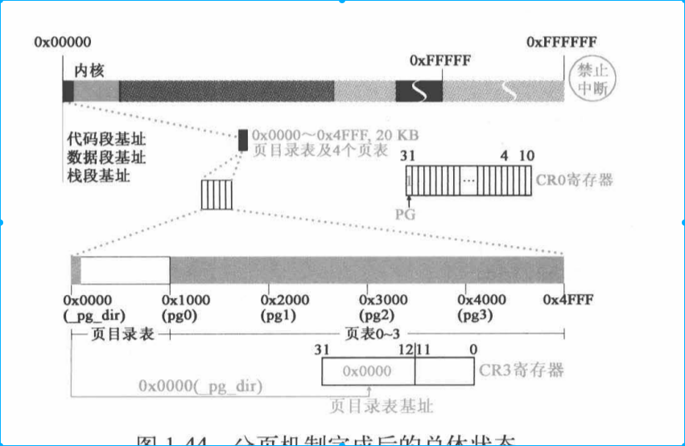

* head 程序最后一步是ret，将压入栈的main入口地址弹出给EIP。开始执行main函数

# 5. 小结
* 本章两部分，一部分加载操作系统。一部分在保护、分页模式下main函数做准备

# 5. Q&A
## 5.1. Q1 中断服务程序如何统一
中断向量表和中断服务程序是由BIOS加载在操作系统中的。那么不同的BIOS就由不同的中断服务程序吗？Linux 调用中断都是通过中断信号来的，如果我的中断向量表因为中断信号由BIOS设计不同意或者中断服务程序不同意，那么程序调用不同的中断是否会返回不同的结果

启动操作系统过程中的中断服务确实是由BIOS提供的，但是等到操作系统运行之后，中断服务是由linux内核提供的。

## 5.2 Q2 什么是保护模式，保护模式标志是什么
保护模式的标志是使用虚拟地址。在head切换到保护模式的标志是分页机制的形成。