[toc]

# 1. 背景
0号进程存在主要是为了创建1号进程。

# 2. 1号进程创建
* note：下面讲解进程机制都是0号进程以外。 进程都是通过fork父进程来的

## 2.1 调用fork函数
fork 函数本质上属于系统调用，引用程序是如何使用系统调用的呢

    * 挂起一个进程一般都是等待一个唤醒进程才能重新执行进程。但是0号进程例外，因为0号进程总是运行在系统空闲时刻。0号进程的挂起执行的其实是检查其它进程是否在运行，如果没有其它进程在运行就返回0号进程。

* fork 如何编写
    * 首先肯定是要通过系统调用，如何想systemcall传递fork参数

fork 实际上执行的是unistd.h中的宏函数syscall0
    
    
    

很显然，fork参数传递是通过宏展开实现的，fork宏展开代码如下

    * __NR_fork 值是2(define 定义的)并赋值给eax
    * 由于使用int 80中断，因此会在fn_ptr_sys_call_table中寻找地址为2的中断服务程序函数（sys_fork）,sys_fork是由system_call.s汇编程序实现的
    * 其实上面代码说穿了就是通过传递中断服务程序的偏移地址来寻找中断服务程序。但是用的最为经典的还是使用汇编手法，通过函数名称和汇编定义结合，来实现函数名称传参实现一对多的关系。

## 2.2 调用systemcal
上面产生了中断int 80，并将fork便宜地址2传递到寄存器eax。
下面代码是system_call如何调用fork中断服务程序。

* 这部分原理也很简单，只是简单system_call代码调用fork汇编代码。这么长主要是因为汇编指令的问题

## 2.3 在task[64]为进程1申请空闲位置并获取进程号

* 第二章介绍过对task[64]除0以外的所有项清空
* 先在调用find_process_empty()函数为进程1获取一个可用的进程号和task[64]中的一个位置

* find_process_empty 代码如下
    * 很简单，就是找一个空闲位置，很闲我们找到的进程PID=1

## 2.4 copy_process函数

* copy_process函数 主要是通过进程0信息来创建进程1结构信息
    * 为进程1创建task_struct,将进程0的task_struct赋值给进程1
    * 为进程1的task-struct和tss做个性化设置
    * 为进程1创建页表，将进程0的页表项赋值给该页表项
    * 进程1共享进程0文件
    * 将进程1设置为就绪态，参与进程间切换
### 2.4.1 申请内存页

* 这段代码是申请内存页赋值给task[1]的数据结构

* 这段代码意思是从高地址反向扫描主内存区，找到一块引用数为0的空闲页返回

### 2.4.2 将进程0的taskstruct赋值给进程1，并对进程1的task_struct做个性话设置

*   *p=*current(current标识0号进程struct，体现了1号进程继承0号进程能力)但是只是拷贝struct，并没有拷贝内核栈

### 2.4.3 设置进程1的分页管理
* linux是段页管理基址，所有访问都是先访问段然后访问页

#### 2.4.3.1 在进程1的线性
在下面代码中，copy_mem()先设置进程1代码段、数据段段基址、段限长，提取当前进程（0进程）代码段、数据段基址限长信息，并设置进程1的数据段和代码段基址。
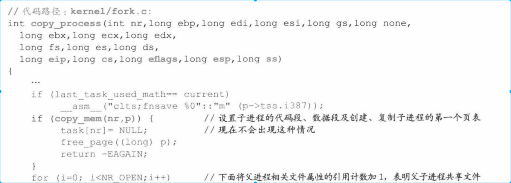

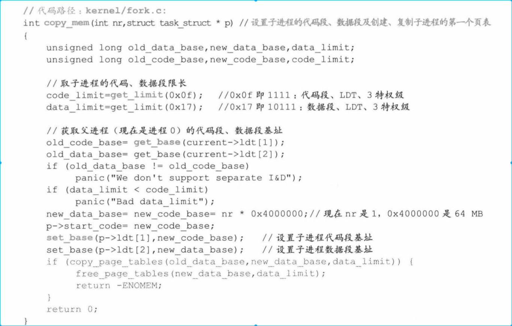
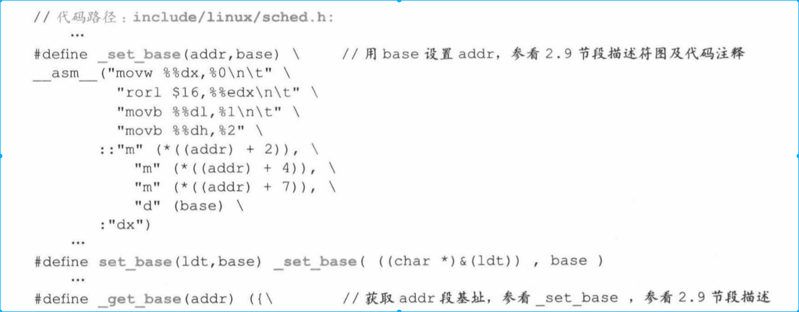

#### 2.4.3.2 为进程1创建第1个页表并设置对应的目录项
* 从下面的寻址方式来看，完成是根据页来寻址。段可能只是用来逻辑保护方式。
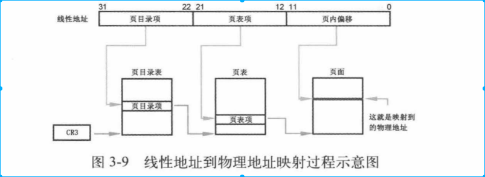
* 上面代码中copy_page_tables()就是设置页表过程。
    * 先为新的页表申请一个空闲页面
    * 把进程0的160个页表项复制过来（1页4kb，共640kb），因此进程0和进程1都指向相同页面。
    * 为进程1设置页目录项
    * 最后用重置CR3方法刷新页变换高速缓存，
代码如下

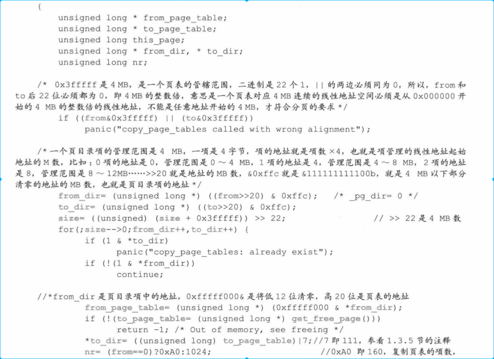
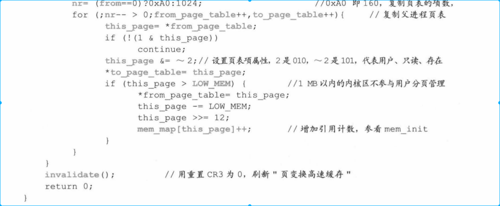

#### 2.4.3.3 进程1从进程0中独立
* 现在进程1还是个空架子，没有自己程序，没有自己的页目录结构
* 进程1有程序后，会先和1解除关系，并重新组织目录结构。这部分没讲

## 2.5 进程1共享进程0的文件

在copy_process()中，task_struct设置与文件相关成员。包括打开了那些文件p->filp[20],0进程当前工作的目录节点i，根目录i节点结构，以及执行文件i节点结构。（虽然进程0这些值都是空的，进程只具备在主机中正常运行能力，但是不具备和设备交互能力，但是这些设置对进程的遗传非常有意义
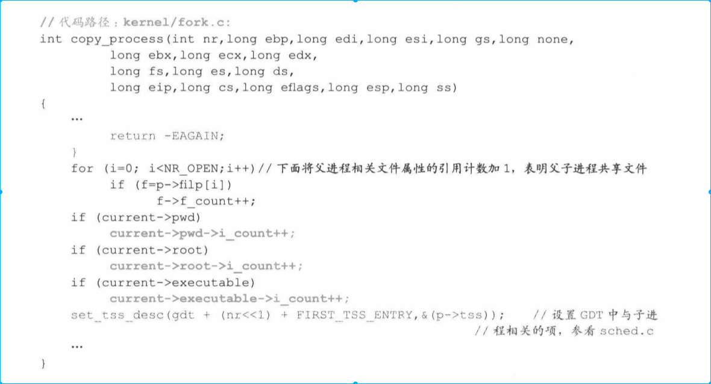

## 2.6 设置进程1在GDT中表项
之后将LDT和TSS挂在在GDT中。
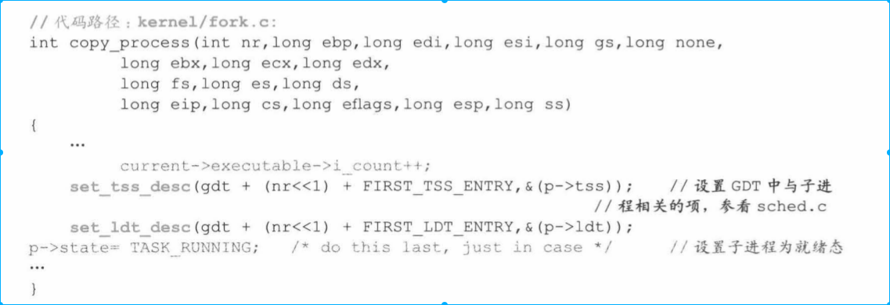

## 2.7 进程处于就绪态

自此，进程1创建工作完成，进程1有进程0的全部能力，可以在系统中正常运行。

## 2.8 下面是一系列系统调用返回返回工作

* copy_process()执行完毕返回sys_fork()中的call_copy_process()下一行执行，执行代码如下，
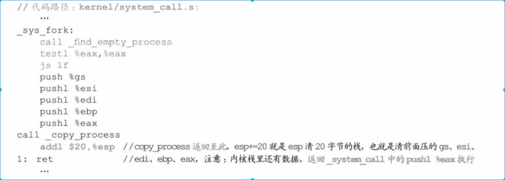

* 返回到system_call中的call_table中下一行执行。
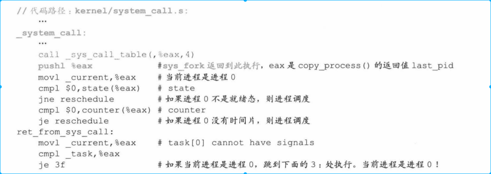
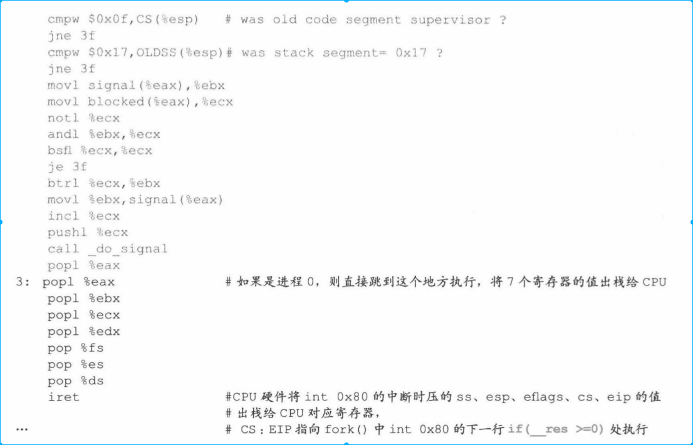

    * 上面有个popl %eax,就是将1号进程pid 复制给%eax
    * iret中断返回，CPU硬件将int 0x80中断时候压ss esp 等寄存器值返回给cpu

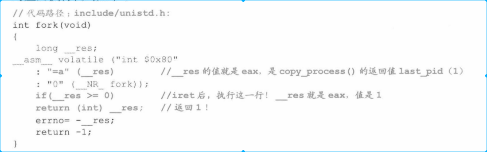

上面返回的是__res是eax寄存器值1，说以！1为假，会执行pause部分

# 3. 内核第一次做进程调度
之前都是执行0进程代码，现在开始切换到1进程执行。

* 普通进程切换三种情况
    * 进程时间片执行完毕
    * 进程执行完毕
    * 进程产生中断

* 0号进程进行进程切换有些不同
在执行 for(;;) pause(),最终会执行到schedule（）切换到进程1。

pause()和fork()一样，最终会执行到unistd.h中的syscall0，通过int 80中断，在system_call.s中调用call _system_call_table(,%eax,4)映射到sys_pause()中区执行。fork使用汇编写的，pause是C写的。

* 进入sys_pause()中断服务程序后，会将进程0设置成可中断，然后进行schedule调用

下面是对schedule（）函数进行分析
* schedule 第一次便利task[64]这个数据结构，只要指针不为空，就要对他们“报警定时值alarm”和信号位图“signal”进行处理（这里面在后面描述）。这时0号进程没有接受任何信号，因此第一次检查不会进行任何操作。

* 第二次遍历所有进程，比较进程状态和时间片，找出就绪态中cont值最大进程。这时就绪态中就只有1号进程，因此找出的进程就是1号进程。
* 然后执行swit_to_next切换到1号进程中去

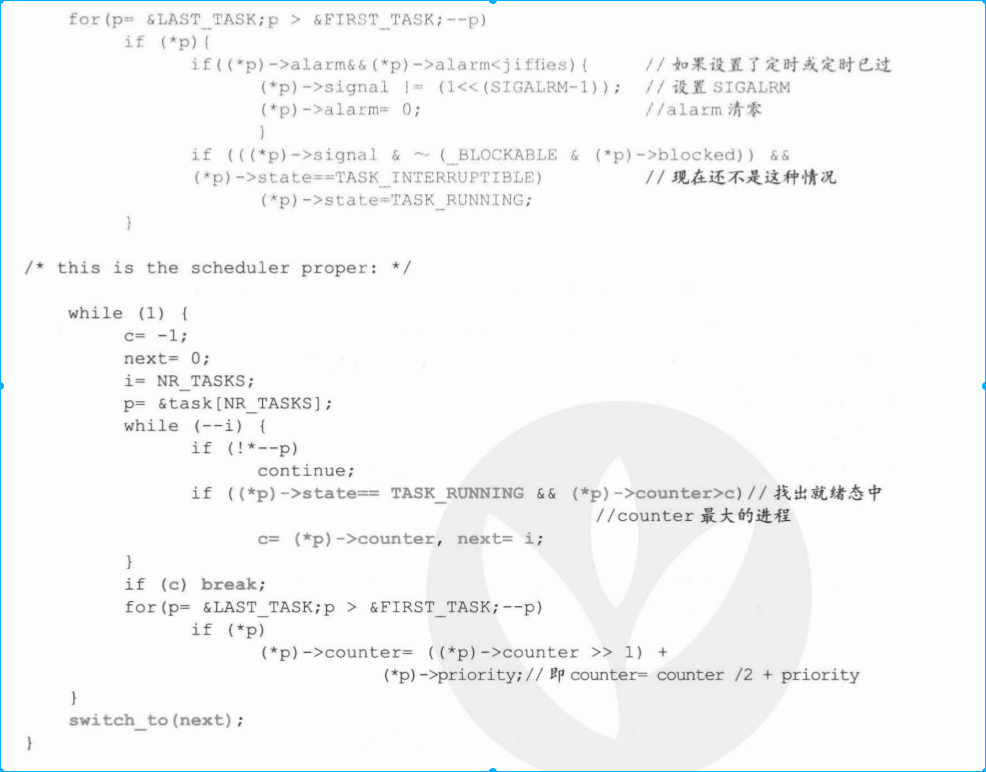
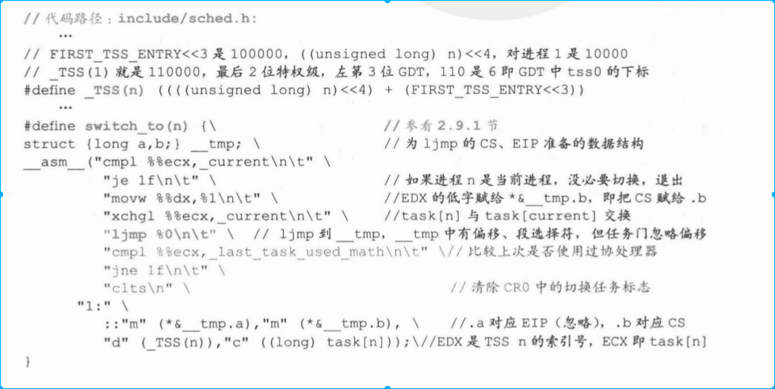

* "ljmp %0 \n\t"，；ljmp通过CPU任务门机制（并未实际使用任务men），将进程0信息保存在TSS中，取出进程1的TSS、LDT给CPU各种寄存器。并实现从0级权限转换到3级权限进程1代码。

# 4. 进程1的执行
* note:
    * 进程1使用进程0的结构，进程1如何构建自己的环境，并和设备交互
    * 上面的ljmp还没有执行，因此系统调用int 80并没有返回

ljmp通过任务门机制将进程1的TSS给CPU，那么tss.eip就是目前CPU EIP值。但是由于EIP源于进程0用户程序，所以现在EIP指向的任然是fork处代码（如何和进程0过程区分开，避免死循环呢）
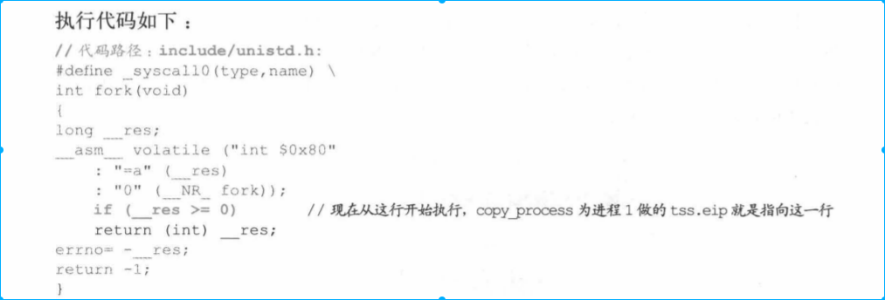
由于上面0进程处理后，0进程的tss.eax=0，在return的时候，返回的其实是0.

return到面函数
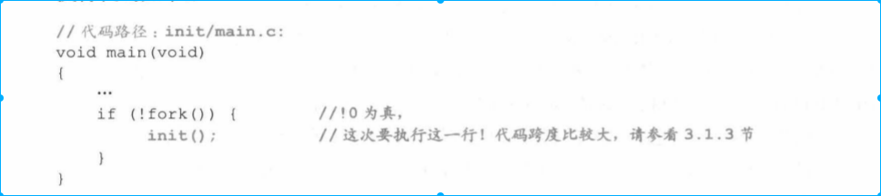
由于fork()返回值是0，则这次会执行init()代码（经分析，只有1号进程才能执行这段init代码，因为0号进程的子进程只有1号进程）

* init函数主要执行setup函数。setup函数也是一个系统调用。前面的pause()系统调用还没有中断返回，现在setup有开始一个中断

## 4.1 进程1为安装硬盘文件系统做准备

主要过程如下
*   根据机器系统数据设置硬盘参数
*   读取硬盘引导快
*   从引导块中获取信息

### 4.1.1 设置硬盘hard_info
硬盘hard_info包括磁头数，磁道数、扇区数
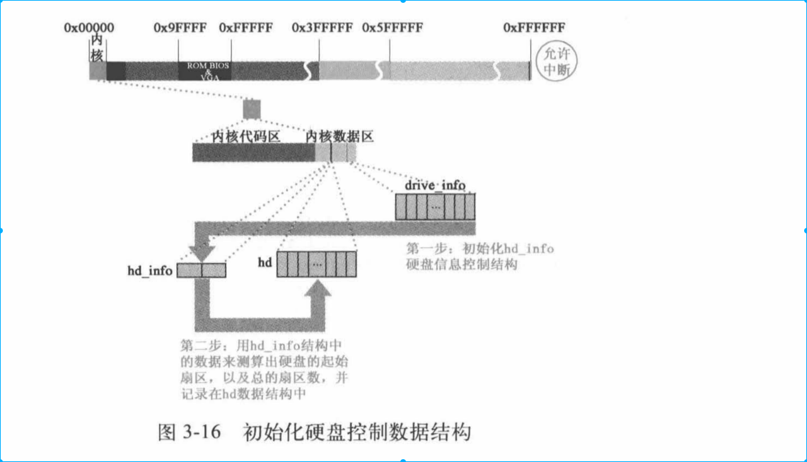

### 4.1.2 读取硬盘引导块在缓冲区
略
### 4.1.3 将缓冲区块和请求项结构挂接
### 4.1.4 读硬盘
读硬盘会将

