<!-- TOC -->

- [1. 背景](#1-背景)
- [2. 1号进程创建](#2-1号进程创建)
    - [2.1 调用fork函数](#21-调用fork函数)
    - [2.2 调用systemcal](#22-调用systemcal)
    - [2.3 在task[64]为进程1申请空闲位置并获取进程号](#23-在task64为进程1申请空闲位置并获取进程号)
    - [2.4 copy_process函数](#24-copy_process函数)
        - [2.4.1 申请内存页](#241-申请内存页)
        - [2.4.2 将进程0的taskstruct赋值给进程1，并对进程1的task_struct做个性话设置](#242-将进程0的taskstruct赋值给进程1并对进程1的task_struct做个性话设置)
        - [2.4.3 设置进程1的分页管理](#243-设置进程1的分页管理)
            - [2.4.3.1 在进程1的线性地址空间设置代码段和数据段](#2431-在进程1的线性地址空间设置代码段和数据段)
            - [2.4.3.2 为进程1创建第1个页表并设置对应的目录项](#2432-为进程1创建第1个页表并设置对应的目录项)
            - [2.4.3.3 进程1从进程0中独立](#2433-进程1从进程0中独立)
    - [2.5 进程1共享进程0的文件](#25-进程1共享进程0的文件)
    - [2.6 设置进程1在GDT中表项](#26-设置进程1在gdt中表项)
    - [2.7 进程处于就绪态](#27-进程处于就绪态)
    - [2.8 下面是一系列系统调用返回返回工作](#28-下面是一系列系统调用返回返回工作)
- [3. 内核第一次做进程调度](#3-内核第一次做进程调度)
- [4. 进程1的执行](#4-进程1的执行)
    - [4.1 进程1为安装硬盘文件系统做准备](#41-进程1为安装硬盘文件系统做准备)
        - [4.1.1 设置硬盘hard_info](#411-设置硬盘hard_info)
        - [4.1.2 读取硬盘引导块在缓冲区](#412-读取硬盘引导块在缓冲区)
        - [4.1.3 将缓冲区块和请求项结构挂接](#413-将缓冲区块和请求项结构挂接)
        - [4.1.4 读硬盘](#414-读硬盘)
        - [4.1.5 硬盘发生硬中断](#415-硬盘发生硬中断)
        - [4.1.6 切换到进程1](#416-切换到进程1)
    - [4.2 进程1格式化虚拟磁盘并跟换根设备的虚拟磁盘](#42-进程1格式化虚拟磁盘并跟换根设备的虚拟磁盘)
    - [4.3 在设备上加载根文件系统](#43-在设备上加载根文件系统)
        - [4.3.1 根设备复制到super_block[8]中](#431-根设备复制到super_block8中)
        - [4.3.2 将根设备中的根i节点挂载在super_block[8]中根设备超级快中](#432-将根设备中的根i节点挂载在super_block8中根设备超级快中)
        - [4.3.3 将根文件系统和进程1关联](#433-将根文件系统和进程1关联)

<!-- /TOC -->
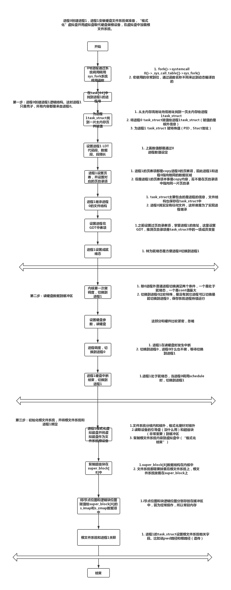
# 1. 背景
0号进程存在主要是为了创建1号进程。

# 2. 1号进程创建
* note：下面讲解进程机制都是0号进程以外。 进程都是通过fork父进程来的

## 2.1 调用fork函数
fork 函数本质上属于系统调用，引用程序是如何使用系统调用的呢

    * 挂起一个进程一般都是等待一个唤醒进程才能重新执行进程。但是0号进程例外，因为0号进程总是运行在系统空闲时刻。0号进程的挂起执行的其实是检查其它进程是否在运行，如果没有其它进程在运行就返回0号进程。

* fork 如何编写
    * 首先肯定是要通过系统调用，如何想systemcall传递fork参数

fork 实际上执行的是unistd.h中的宏函数syscall0
    
    
    

很显然，fork参数传递是通过宏展开实现的，fork宏展开代码如下

    * __NR_fork 值是2(define 定义的)并赋值给eax
    * 由于使用int 80中断，因此会在fn_ptr_sys_call_table中寻找地址为2的中断服务程序函数（sys_fork）,sys_fork是由system_call.s汇编程序实现的
    * 其实上面代码说穿了就是通过传递中断服务程序的偏移地址来寻找中断服务程序。但是用的最为经典的还是使用汇编手法，通过函数名称和汇编定义结合，来实现函数名称传参实现一对多的关系。

## 2.2 调用systemcal
上面产生了中断int 80，并将fork便宜地址2传递到寄存器eax。
下面代码是system_call如何调用fork中断服务程序。

* 这部分原理也很简单，只是简单system_call代码调用fork汇编代码。这么长主要是因为汇编指令的问题

## 2.3 在task[64]为进程1申请空闲位置并获取进程号

* 第二章介绍过对task[64]除0以外的所有项清空
* 先在调用find_process_empty()函数为进程1获取一个可用的进程号和task[64]中的一个位置

* find_process_empty 代码如下
    * 很简单，就是找一个空闲位置，很闲我们找到的进程PID=1

## 2.4 copy_process函数

* copy_process函数 主要是通过进程0信息来创建进程1结构信息
    * 为进程1创建task_struct,将进程0的task_struct赋值给进程1
    * 为进程1的task-struct和tss做个性化设置
    * 为进程1创建页表，将进程0的页表项赋值给该页表项
    * 进程1共享进程0文件
    * 将进程1设置为就绪态，参与进程间切换
### 2.4.1 申请内存页

* 这段代码是申请内存页赋值给task[1]的数据结构

* 这段代码意思是从高地址反向扫描主内存区，找到一块引用数为0的空闲页返回

### 2.4.2 将进程0的taskstruct赋值给进程1，并对进程1的task_struct做个性话设置

*   *p=*current(current标识0号进程struct，体现了1号进程继承0号进程能力)但是只是拷贝struct，并没有拷贝内核栈

### 2.4.3 设置进程1的分页管理
* linux是段页管理基址，所有访问都是先访问段然后访问页

#### 2.4.3.1 在进程1的线性地址空间设置代码段和数据段
在下面代码中，copy_mem()先设置进程1代码段、数据段段基址、段限长，提取当前进程（0进程）代码段、数据段基址限长信息，并设置进程1的数据段和代码段基址。

#### 2.4.3.2 为进程1创建第1个页表并设置对应的目录项
* 从下面的寻址方式来看，完成是根据页来寻址。段可能只是用来逻辑保护方式。

* 上面代码中copy_page_tables()就是设置页表过程。
    * 先为新的页表申请一个空闲页面
    * 把进程0的160个页表项复制过来（1页4kb，共640kb），因此进程0和进程1都指向相同页面。
    * 为进程1设置页目录项
    * 最后用重置CR3方法刷新页变换高速缓存，
代码如下

#### 2.4.3.3 进程1从进程0中独立
* 现在进程1还是个空架子，没有自己程序，没有自己的页目录结构
* 进程1有程序后，会先和1解除关系，并重新组织目录结构。这部分没讲

## 2.5 进程1共享进程0的文件

在copy_process()中，task_struct设置与文件相关成员。包括打开了那些文件p->filp[20],0进程当前工作的目录节点i，根目录i节点结构，以及执行文件i节点结构。（虽然进程0这些值都是空的，进程只具备在主机中正常运行能力，但是不具备和设备交互能力，但是这些设置对进程的遗传非常有意义

## 2.6 设置进程1在GDT中表项
之后将LDT和TSS挂在在GDT中。

## 2.7 进程处于就绪态

自此，进程1创建工作完成，进程1有进程0的全部能力，可以在系统中正常运行。

## 2.8 下面是一系列系统调用返回返回工作

* copy_process()执行完毕返回sys_fork()中的call_copy_process()下一行执行，执行代码如下，

* 返回到system_call中的call_table中下一行执行。

    * 上面有个popl %eax,就是将1号进程pid 复制给%eax
    * iret中断返回，CPU硬件将int 0x80中断时候压ss esp 等寄存器值返回给cpu

上面返回的是__res是eax寄存器值1，说以！1为假，会执行pause部分

# 3. 内核第一次做进程调度
之前都是执行0进程代码，现在开始切换到1进程执行。

* 普通进程切换三种情况
    * 进程时间片执行完毕
    * 进程执行完毕
    * 进程产生中断

* 0号进程进行进程切换有些不同
在执行 for(;;) pause(),最终会执行到schedule（）切换到进程1。

pause()和fork()一样，最终会执行到unistd.h中的syscall0，通过int 80中断，在system_call.s中调用call _system_call_table(,%eax,4)映射到sys_pause()中区执行。fork使用汇编写的，pause是C写的。

* 进入sys_pause()中断服务程序后，会将进程0设置成可中断，然后进行schedule调用
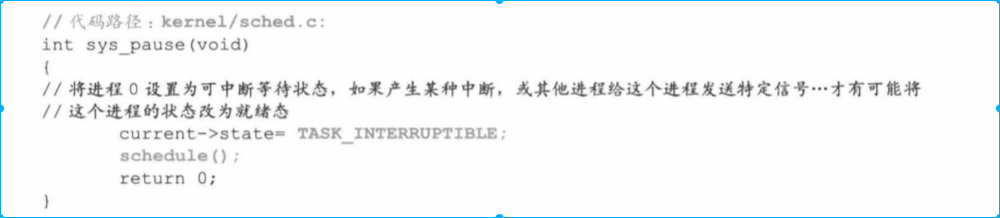

下面是对schedule（）函数进行分析
* schedule 第一次便利task[64]这个数据结构，只要指针不为空，就要对他们“报警定时值alarm”和信号位图“signal”进行处理（这里面在后面描述）。这时0号进程没有接受任何信号，因此第一次检查不会进行任何操作。

* 第二次遍历所有进程，比较进程状态和时间片，找出就绪态中cont值最大进程。这时就绪态中就只有1号进程，因此找出的进程就是1号进程。
* 然后执行swit_to_next切换到1号进程中去

* "ljmp %0 \n\t"，；ljmp通过CPU任务门机制（并未实际使用任务men），将进程0信息保存在TSS中，取出进程1的TSS、LDT给CPU各种寄存器。并实现从0级权限转换到3级权限进程1代码。

# 4. 进程1的执行
* note:
    * 进程1使用进程0的结构，进程1如何构建自己的环境，并和设备交互
    * 上面的ljmp还没有执行，因此系统调用int 80并没有返回

ljmp通过任务门机制将进程1的TSS给CPU，那么tss.eip就是目前CPU EIP值。但是由于EIP源于进程0用户程序，所以现在EIP指向的任然是fork处代码（如何和进程0过程区分开，避免死循环呢）

由于上面0进程处理后，0进程的tss.eax=0，在return的时候，返回的其实是0.

return到面函数

由于fork()返回值是0，则这次会执行init()代码（经分析，只有1号进程才能执行这段init代码，因为0号进程的子进程只有1号进程）

* init函数主要执行setup函数。setup函数也是一个系统调用。前面的pause()系统调用还没有中断返回，现在setup有开始一个中断

## 4.1 进程1为安装硬盘文件系统做准备

主要过程如下
*   根据机器系统数据设置硬盘参数
*   读取硬盘引导快
*   从引导块中获取信息

### 4.1.1 设置硬盘hard_info
硬盘hard_info包括磁头数，磁道数、扇区数

### 4.1.2 读取硬盘引导块在缓冲区
略
### 4.1.3 将缓冲区块和请求项结构挂接
### 4.1.4 读硬盘
读硬盘会将调用schedule()函数。切换到0进程中。
note: 在设置硬盘的时候，已经将进程1设置成不可中断状态。

* 常规进程切换必须有两个条件，一个是进程处于就绪态，一个是count值最大
    * 参照代码 if((*p)->state==TASK_RUNNING && p->count>c)
    * 但是由于当前1号进程处于不可中断，0号进程是可中断，因此没有满足进程切换条件

* kernel解决方案是强行切换到0进程（结果是，没有进程处于就绪态时，我们就切换到0进程中）
    * next初始化代码是0进程，因此会切换到0进程中去
    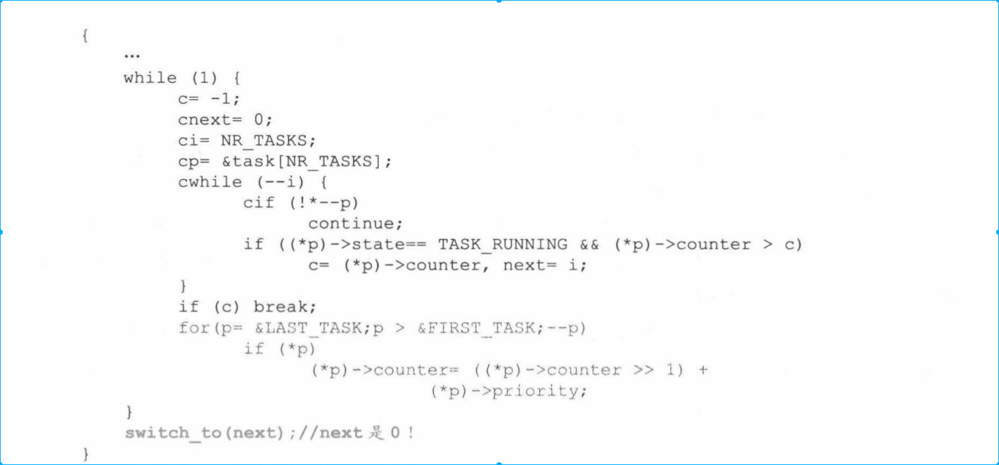

    * 当前进程0切换到进程1时，是从switch_to(1)的ljmp %0 \n\t这行切走的，现在要执行cmpl这行指令
    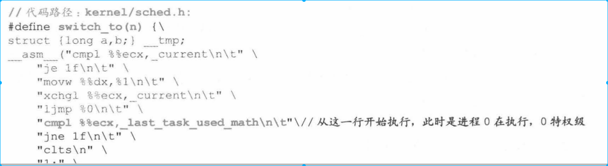
    

进程从0号进程切换到1号进程路线是pause()->sys_pause(),schedule()、switch_to()这个调用路线执行过来。现在return到sys_pause()中的for(;;) pause()中执行

pause()会调用schedule（）函数，schedule函数会不断去寻找可以切换进程。由于taks[64]中没有就绪进程可以切换，因此0号进程会切换到0号进程中。

现在我们看“cmpl %%ecx\n\t”,"je 1 f\n\t",这两条指令的意思是如果是当前进程切换到当前进程，就跳转到下面1.
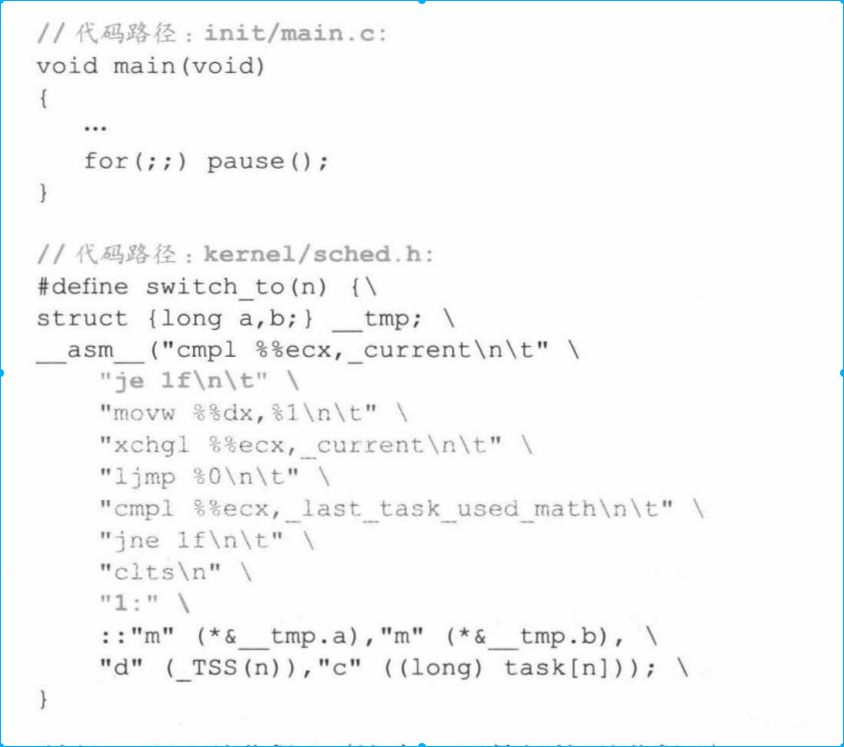
* 这就是0号进程的特殊作用。当所有进程都挂起或者没有进程在执行时，0进程就维持基本运转。所以有人叫0进程为“怠速进程”，就像汽车没有启动维持汽车怠速状态。

* 由于硬盘读写速度慢，硬盘任然忙着将指令写在缓存中。

### 4.1.5 硬盘发生硬中断

硬盘读写完毕后发生硬中断，终止正在执行程序，肯定在pause（），sys_pause(),schedule(),switch_to()函数某处。现在去执行硬件中断程序。
* 硬件中断程序是不断载入磁盘引导盘。在载入引导盘结束之后，会将进程1设置成就绪状态。
* 硬盘中断处理结束，也就是载入硬盘引导快工作结束。ret 到进程0中。

### 4.1.6 切换到进程1
0进程继续调用schedule，这时进程1是就绪状态，因此切换到进程1执行。

进程是从ljmp切走的。这时硬盘引导盘使命结束，为第五章安装硬盘文件系统做好准备。

## 4.2 进程1格式化虚拟磁盘并跟换根设备的虚拟磁盘
第二章讲过设置虚拟盘空间并初始化。那时候盘是一块白盘，没有文件系统格式。bootsect、setup、system（1+4+240=245），这次格式化是从256个扇区开始
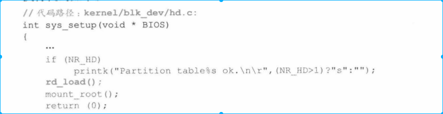

* re_load() 从硬盘读取写数据块，也就是“格式化”虚拟盘需要的引导盘和超级块
* 引导盘数据块没什么用
* 之后分析超级块信息，包括判断文件系统是不是minix文件系统，根文件系统数据会不会比整个虚拟盘区都大。这些条件通过才能加载根文件系统。

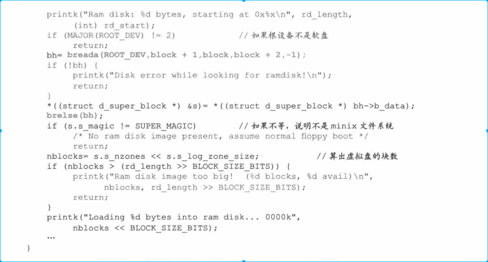

* 然后调用breada（）函数将文件系统相关内容拷贝到虚拟盘中，最后释放缓冲区。复制后将虚拟盘作为根文件系统。最终完成格式化过程。

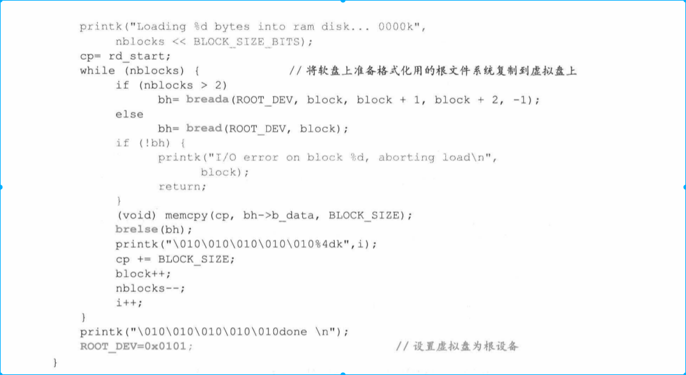

## 4.3 在设备上加载根文件系统

操作系统中加载根文件系统涉及文件、文件系统、根文件系统、加载文件系统、加载根文件系统这几个概念。这里我们我们只讨论设备（硬盘，虚拟盘）

* 操作系统文件系统分两部分，一部分是操作系统内核内，一部分是核外。

* 文件系统用i节点管理文件，一个节点管理一个文件。文件系统使用树状管理方式
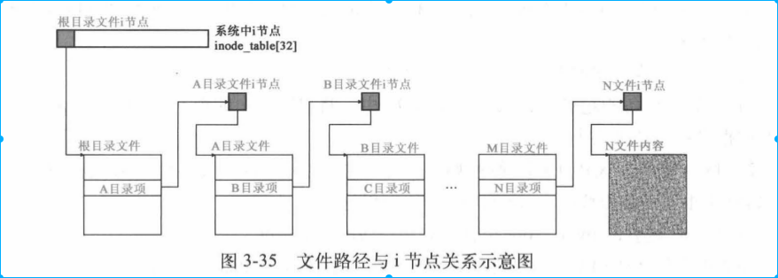

* 一个系统中可以有多套文件系统，通过mount方式挂载。因此系统中一定有一个被其它文件系统挂载的文件系统。这个文件系统叫做根文件系统，跟系统所在设备是根设备。

* 被的文件系统可以挂在在根设备上，那根设备挂在在什么地方呢？答案是挂在在super_block[8]上。

Linux 0.11上只有一个根设备，每个数组元素是一个超级块，一个超级块管理一个设备，也就是操作系统上只能挂在8块逻辑设备，并且只有一个是根设备。加载文件系统，最重要的是将文件系统中i节点挂在在super——block[8]中。

* 挂在根文件系统主要分三步
    * 复制超级设备到spuer_block[8]中，并将根设备i节点挂载在super_block[8] 中的超级设备上
    * 将驻留在缓冲区中的16个缓冲块根设备逻辑位图，i节点位图分别挂在在super_block[8]中根设备超级块s_zmap[8],s_imap[8]上
    * 将当前文件系统指针指向根设备上。root指针指向根设备i节点

通过调用mount_root()函数实现根设备上加载根文件系统。

### 4.3.1 根设备复制到super_block[8]中

系统只想和任何设备通过文件方式进行交互，并且将设备信息存储在super_block中，这样系统就可以通过super_block获取设备在文件系统中信息。根设备页不例外。
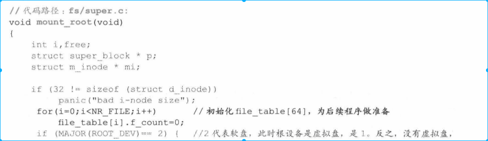
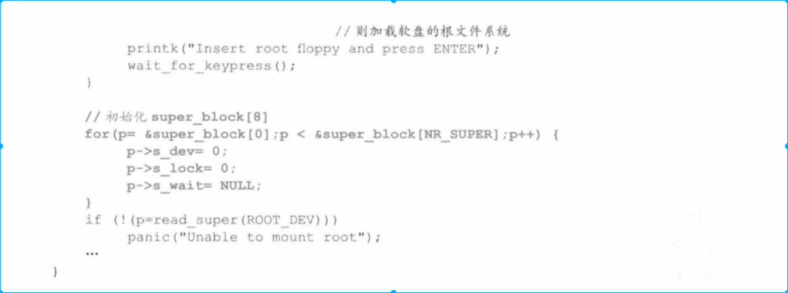

* 前面rd_load()已经格式化号虚拟盘，接下来会调用read_super()函数将从虚拟盘中读取根设备超级块。并复制到super_block[8]中。

* read_super()先检测超级盘是否被加载，如果被加载则直接使用，否则加载。

* 根设备文件系统没有被加载过，因此需要在super_block中申请一项（此时是第一项），并对其加锁将根文件系统块写在super_block[8]中。
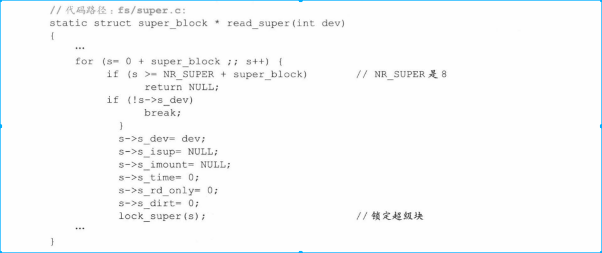

* bread()函数会将虚拟盘根文件系统内容复制在是是super_block中，从虚拟盘写入内存调用的是do_rd_quest()函数（若是从磁盘中写如内存，调用do_hd_request()需要使用中断）
* 复制到super_block[8]第一项之后，会调用release函数，释放缓冲块

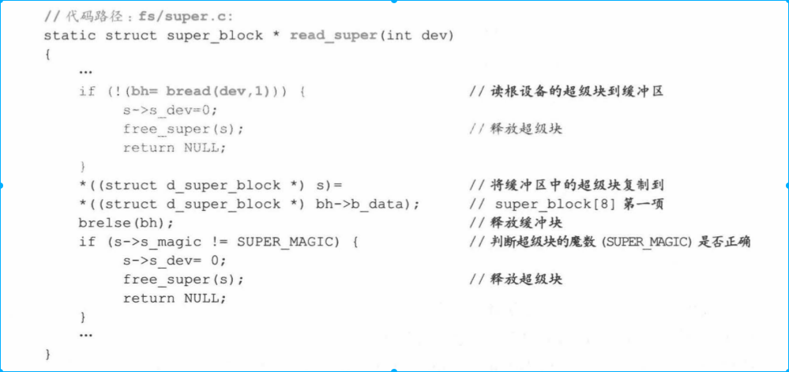

* 初始化super_block[8]中虚拟盘中的i节点位图s_imap和逻辑位图s_zmap,并将i节点位图和逻辑块位图占用的所有逻辑块读到缓冲区，将这些块分别挂接到s_imap[8],he_zmap[8]中。由于对他们操作比价频繁，这些块所占用的缓冲区块并不会释放，将常驻内存。
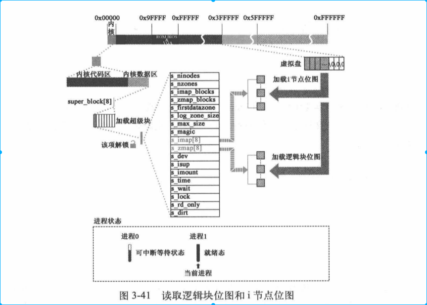
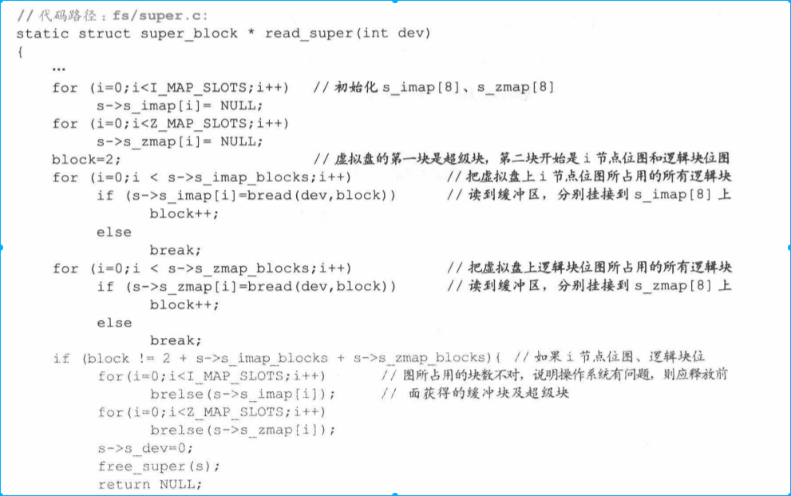

### 4.3.2 将根设备中的根i节点挂载在super_block[8]中根设备超级快中

回到mount_roo函数，调用iget()函数从虚拟盘中读取i节点。根i节点意义在于通过它可以到文件系统中任何指定节点i，也可以找到任何指定文件。

执行代码如下：

进入iget（）函数后，操作系统从i节点表inode_table[32]中申请一个空闲i节点位置(inode_table[32]是操作系统用来控制同时打开最大文件数)。这时应该是打开首个i节点,对这个i节点进行初始化包括i节点设备号和该i节点节点号。
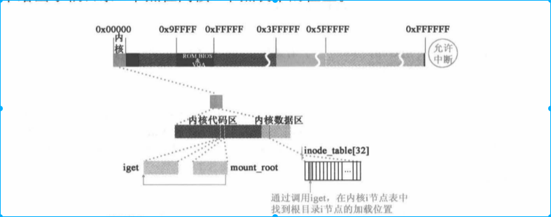

### 4.3.3 将根文件系统和进程1关联
进程1task_struct设置相关根文件系统字段设置。
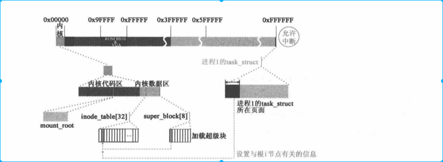
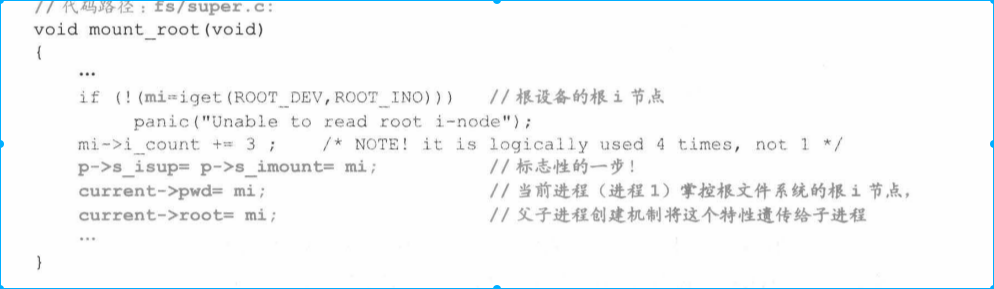

* 得到super_block[8]信息，就可以根据超级快中“逻辑块位图”里记载信息计算出虚拟盘上数据库占用与空闲情况。并将信息保存在驻留在缓冲区中“装载逻辑块位图信息的缓冲区块”中
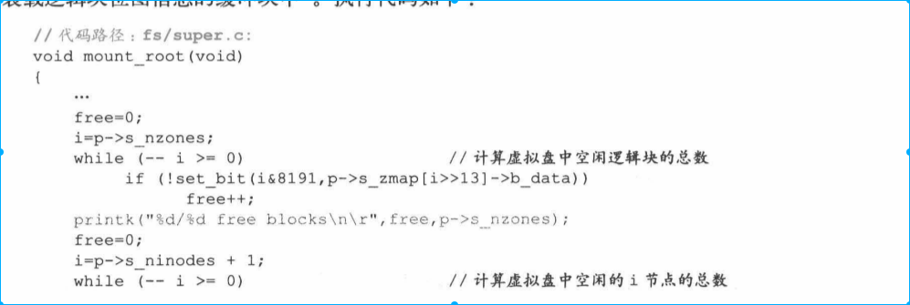

至此sys_setup()系统调用结束。至此进程1创建完毕，进程0创建进程1，进程1安装硬盘文件系统做准备，“格式化”虚拟盘并用虚拟盘取代硬盘做根设备，在虚拟盘中加载根文件系统。

