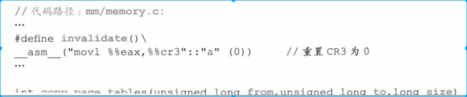

[toc]

# 1. 背景
0号进程存在主要是为了创建1号进程。

# 2. 1号进程创建
* note：下面讲解进程机制都是0号进程以外。 进程都是通过fork父进程来的

## 2.1 调用fork函数
fork 函数本质上属于系统调用，引用程序是如何使用系统调用的呢

    * 挂起一个进程一般都是等待一个唤醒进程才能重新执行进程。但是0号进程例外，因为0号进程总是运行在系统空闲时刻。0号进程的挂起执行的其实是检查其它进程是否在运行，如果没有其它进程在运行就返回0号进程。

* fork 如何编写
    * 首先肯定是要通过系统调用，如何想systemcall传递fork参数

fork 实际上执行的是unistd.h中的宏函数syscall0
    
    
    

很显然，fork参数传递是通过宏展开实现的，fork宏展开代码如下

    * __NR_fork 值是2(define 定义的)并赋值给eax
    * 由于使用int 80中断，因此会在fn_ptr_sys_call_table中寻找地址为2的中断服务程序函数（sys_fork）,sys_fork是由system_call.s汇编程序实现的
    * 其实上面代码说穿了就是通过传递中断服务程序的偏移地址来寻找中断服务程序。但是用的最为经典的还是使用汇编手法，通过函数名称和汇编定义结合，来实现函数名称传参实现一对多的关系。

## 2.2 调用systemcal
上面产生了中断int 80，并将fork便宜地址2传递到寄存器eax。
下面代码是system_call如何调用fork中断服务程序。

* 这部分原理也很简单，只是简单system_call代码调用fork汇编代码。这么长主要是因为汇编指令的问题

## 2.3 在task[64]为进程1申请空闲位置并获取进程号

* 第二章介绍过对task[64]除0以外的所有项清空
* 先在调用find_process_empty()函数为进程1获取一个可用的进程号和task[64]中的一个位置

* find_process_empty 代码如下
    * 很简单，就是找一个空闲位置，很闲我们找到的进程PID=1

## 2.4 copy_process函数

* copy_process函数 主要是通过进程0信息来创建进程1结构信息
    * 为进程1创建task_struct,将进程0的task_struct赋值给进程1
    * 为进程1的task-struct和tss做个性化设置
    * 为进程1创建页表，将进程0的页表项赋值给该页表项
    * 进程1共享进程0文件
    * 将进程1设置为就绪态，参与进程间切换
### 2.4.1 申请内存页

* 这段代码是申请内存页赋值给task[1]的数据结构

* 这段代码意思是从高地址反向扫描主内存区，找到一块引用数为0的空闲页返回

### 2.4.2 将进程0的taskstruct赋值给进程1，并对进程1的task_struct做个性话设置

*   *p=*current(current标识0号进程struct，体现了1号进程继承0号进程能力)但是只是拷贝struct，并没有拷贝内核栈

### 2.4.3 设置进程1的分页管理
* linux是段页管理基址，所有访问都是先访问段然后访问页

#### 2.4.3.1 在进程1的线性
在下面代码中，copy_mem()先设置进程1代码段、数据段段基址、段限长，提取当前进程（0进程）代码段、数据段基址限长信息，并设置进程1的数据段和代码段基址。

#### 2.4.3.2 为进程1创建第1个页表并设置对应的目录项
* 从下面的寻址方式来看，完成是根据页来寻址。段可能只是用来逻辑保护方式。

* 上面代码中copy_page_tables()就是设置页表过程。
    * 先为新的页表申请一个空闲页面
    * 把进程0的160个页表项复制过来（1页4kb，共640kb），因此进程0和进程1都指向相同页面。
    * 为进程1设置页目录项
    * 最后用重置CR3方法刷新页变换高速缓存，
代码如下

