[toc]
# 1. 背景
文件系统概念和操作。

# 2. 安装文件系统
* 操作系统加载了根文件系统，使操作系统能够以文件形式和根设备交互。
* 安装磁盘文件系统，就是将磁盘文件系统挂在根设备文件系统上。

安装文件系统分一下三步:
* 将磁盘中超级快读出来，并载入super_block[8]中
* 将虚拟盘指定i节点读出，并将此节点加载在系统中的inode_table[32]中
* 将系统中超级块挂接到inode_table[32]中指定的i节点上

我们常使用挂在文件系统命令是"mount /dev/hd1 /mnt"，意思试讲/dev/hd1设备挂在在/mnt目录下。
* 系统会启动mount()进程，并最终执行sys_mount()系统调用
* 磁盘是可以分区的，一个分区就是一个设备。这里我们将整个设备作为一个分区，具体后面讲述。

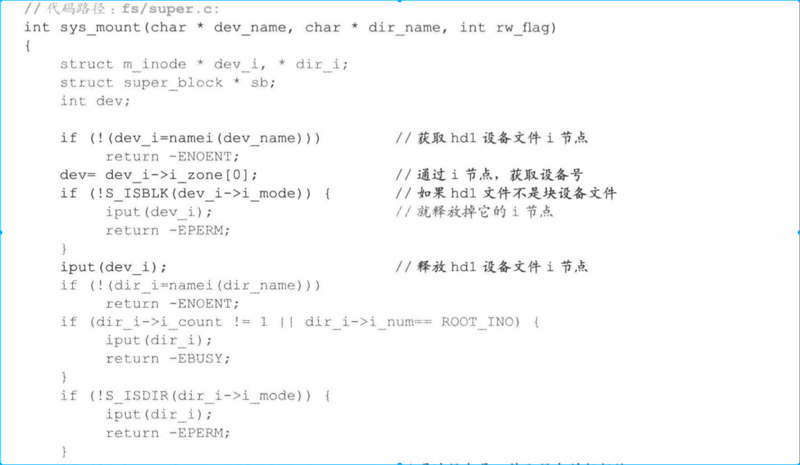
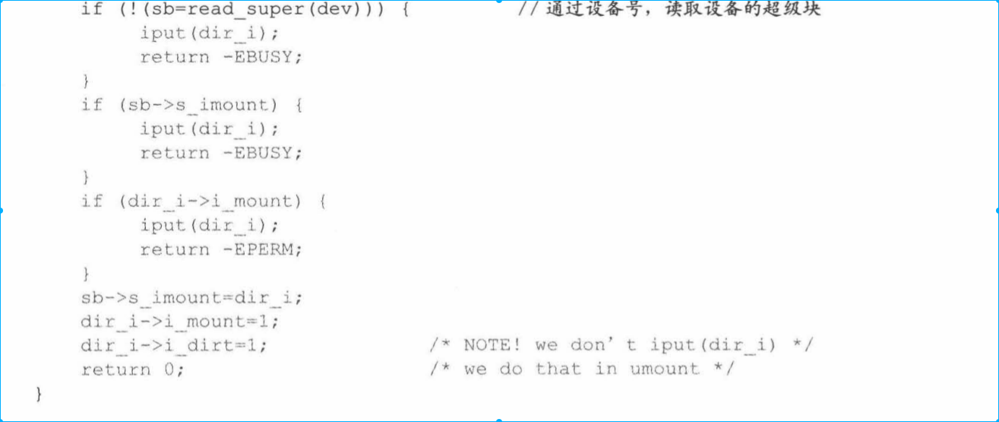

## 2.1 获取外设超级块
read_super()读取设备数据主要分为下面三步:
* super_block中选定一个空闲项来存储超级块
* 将超级块载入上面空闲项
* 根据超级块提供的的信息，载入i节点位图和逻辑块位图

加载超级快表项时需要加锁。
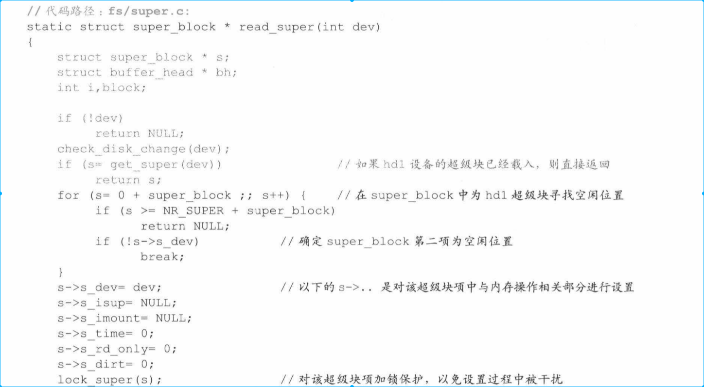
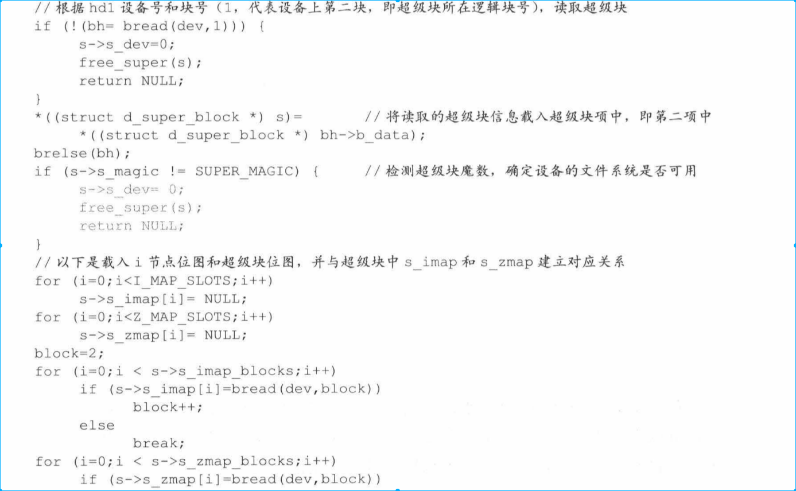
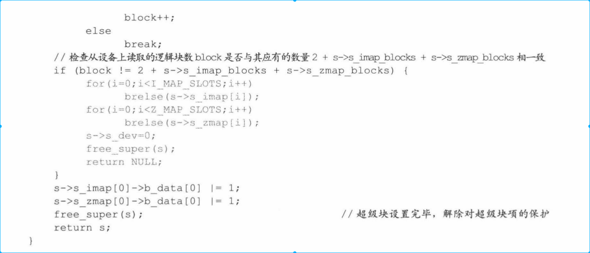

## 2.2 确定根文件系统挂载点
再次调用namei()函数，根据/mnt路径名，获取mnt目录文件的i节点后，分析i节点属性，判断i节点是否可以用来挂载文件系统。

代码分析见上面

## 2.3 超级块和根文件系统挂接
挂接前确保挂接点和被挂接点都是“干净的”
    * hdl设备的文件系统没有被安装过
    * mnt 目录文件上也没有安装其它文件系统
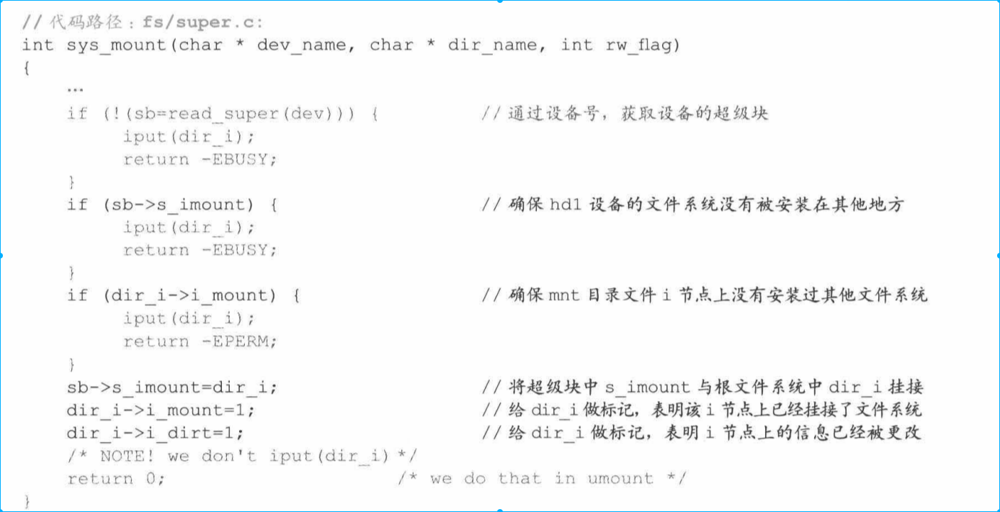

# 3. 实例1--用户打开一个在硬盘中已经存在的文件，并读取文件内容
主要分为两部分，打开文件和读文件

## 3.1 打开文件
打开进程本质是某个进程操作文件，需要如下两步:
* 将用户进程中的task_struct中的filp[20]和内核中的file_table[64]进行登记
* 用户需要打开的i节点在file_table[64]进行登记

### 3.1.1 filp[20],file_table[64],i节点三者之间关系
* filp[20]记录进程打开的文件数，一个进程可以打开多个文件，也可以打开同一文件多次。没打开一次，filp[20]就记录一项，因此一个进程最多能同时打开文件20次

* file_table[64]是记录所有进程打开文件的数据结构，和filp[20]一样也是记录打开文件次数。系统最多能同时打开文件次数64次。

* i节点是记录文件属性最关键结构，操作系统中i节点和文件是一一对应的，找到i节点就能找到唯一文件。内核通过inode_table[32]掌握正在使用的文件i节点数，每个被使用的i节点都要记录其中。

打开文件其实就是建立三者数据结构之间关系。open()函数映射到sys_open()系统调用实现上面关系建立。
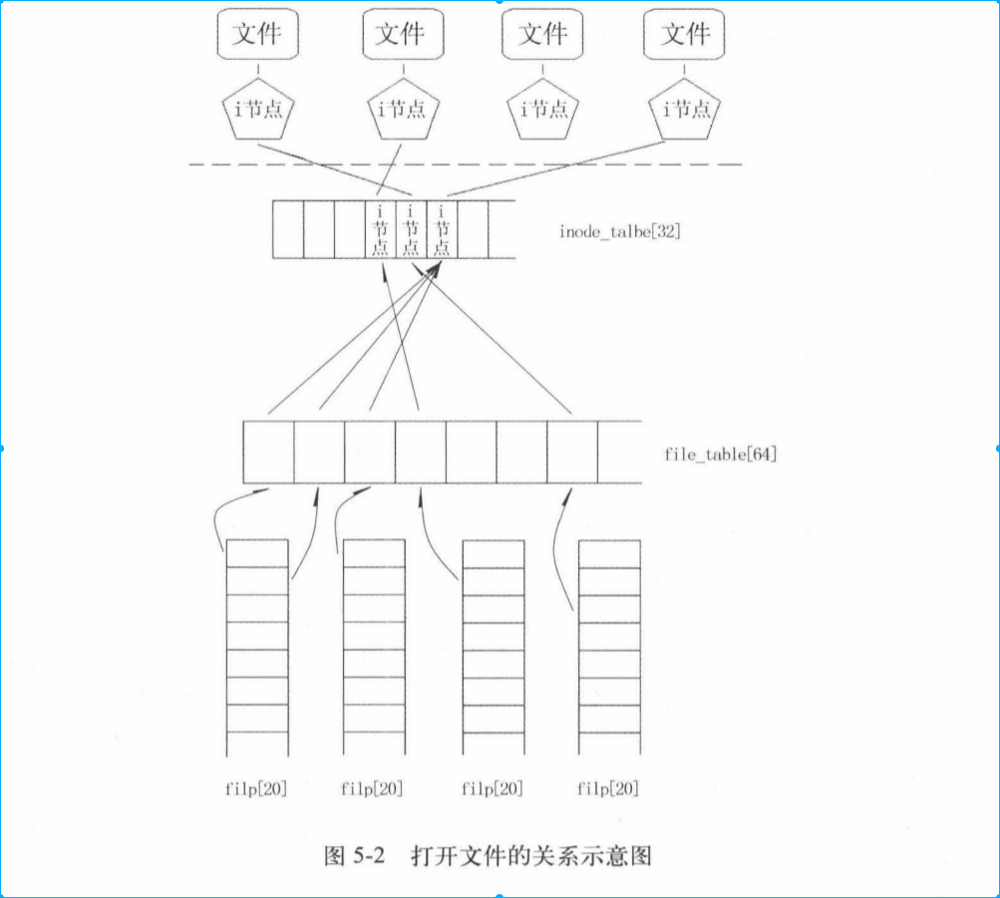

## 3.2 filp[20]file_table[64]挂接

sys_open()中实现挂接。
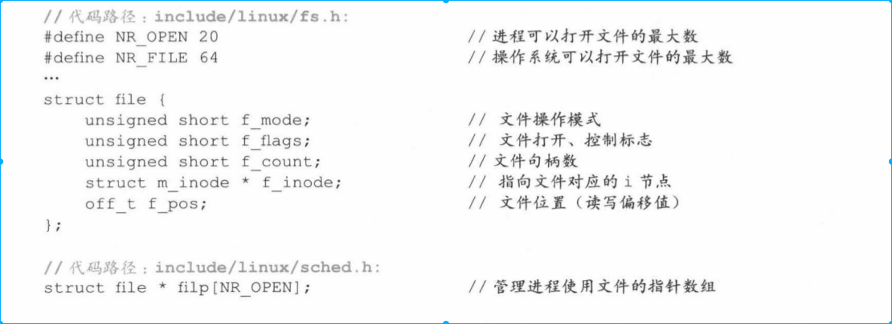
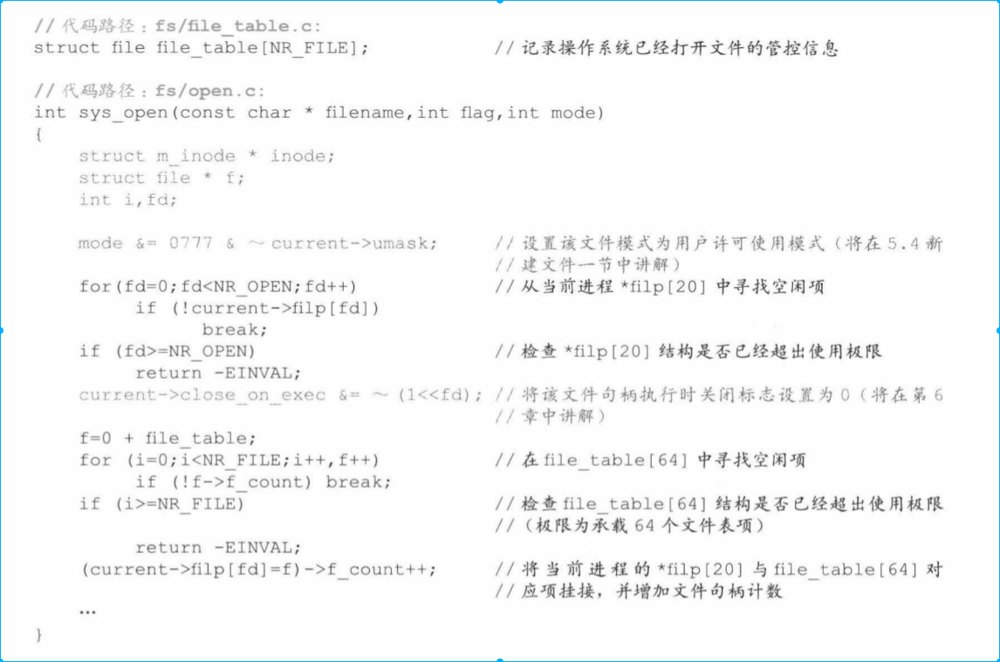

## 3.3 获取文件i节点

主要根据文件路径名找到文件i节点。
这次找i节点和前面找i节点过程不一致，因为这次文件是存储在硬盘中。查找过程如下：
寻找i节点->通过i节点找到目录文件->
通过目录文件找到目录项->通过目录项找到目录文件i节点号->
通过目录文件找到目录项->通过目录项找到目录文件i节点号->
...
循环下去，最终找到hello.txt文件
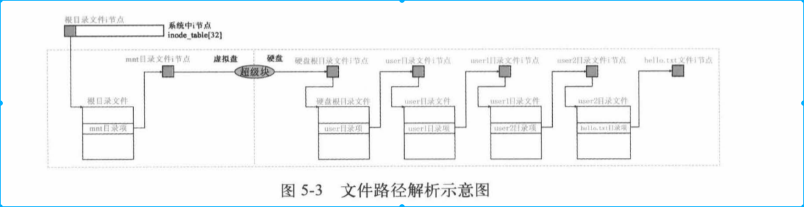

### 3.3.1 获取目录文件i节点
#### 3.3.1.1 进入open_namei()
* 进入open_namei()函数后，先对用户所要打开文件设置参数mode、flag，执行代码如下。

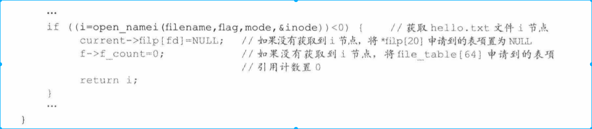
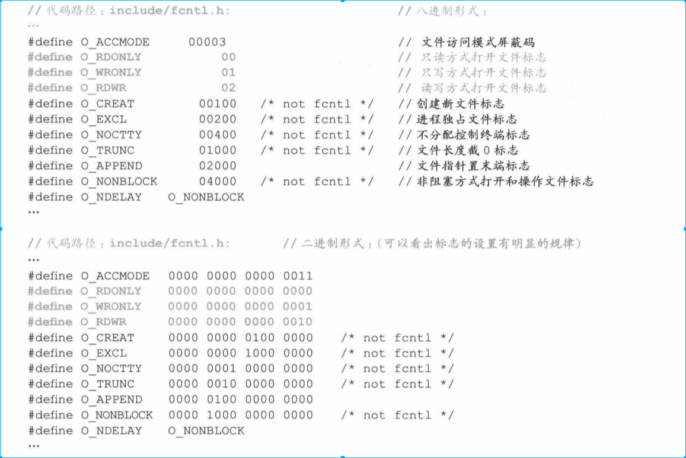
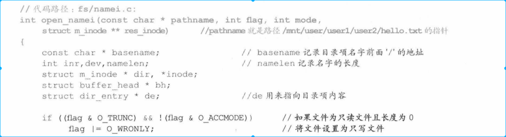
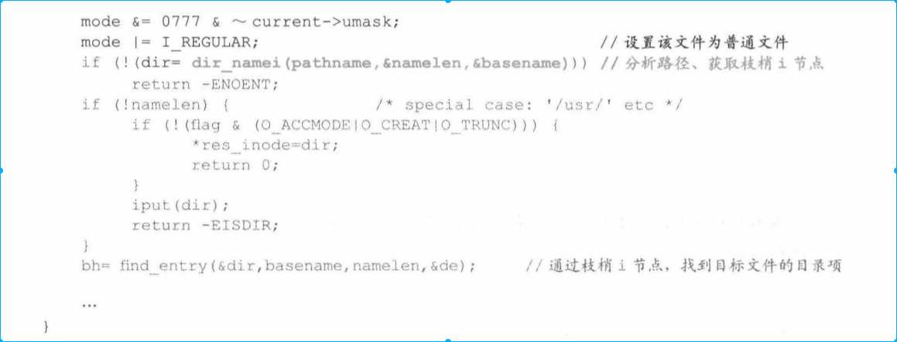

* dir_namei()函数分析用户给出路径，获取最后一个目录文件的i节点（树梢i节点）

#### 3.3.1.2 open_namei()->dir_namei()
* 上面get_dir()函数主要是为了获取树梢i节点
* 下面的通过指向路径的字符串指针，获取文件名和文件名长度
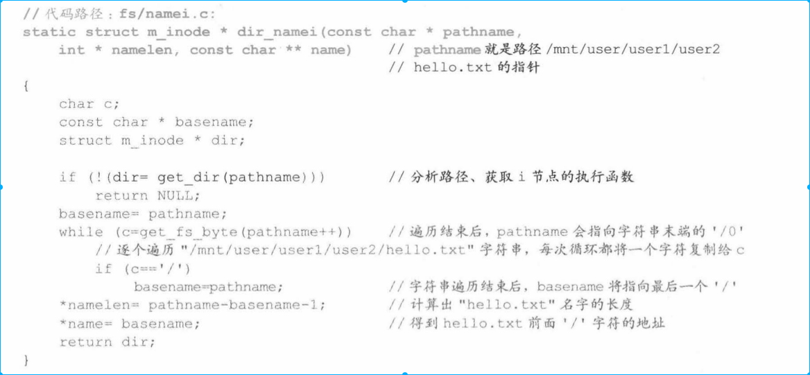