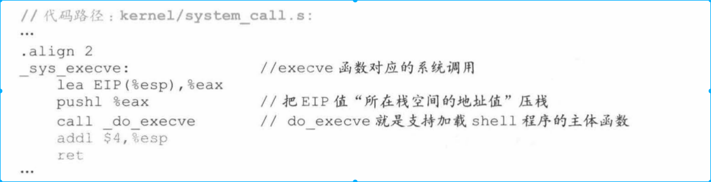
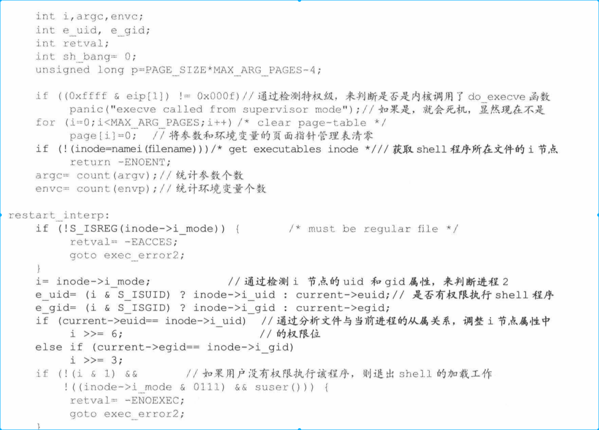
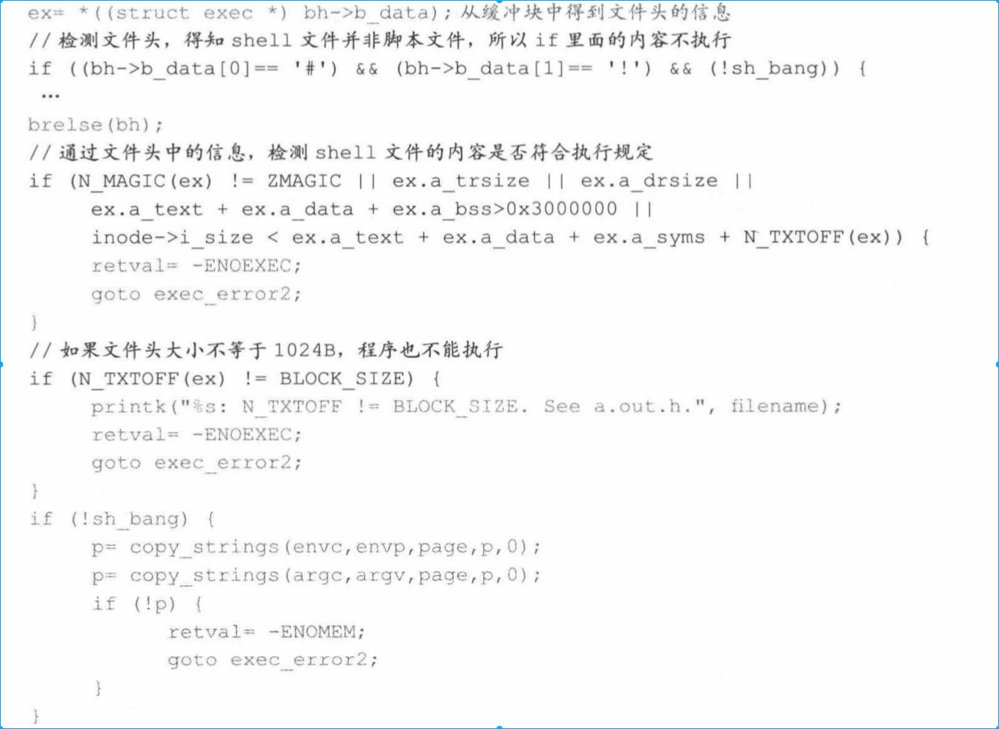
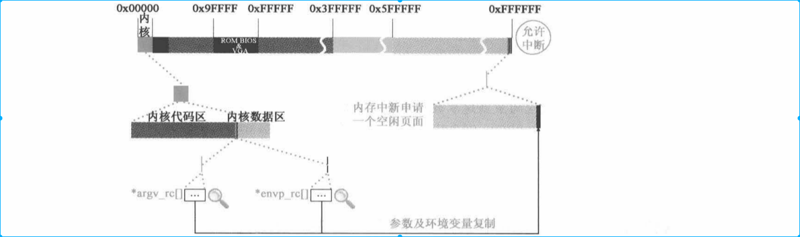

[toc]

# 1. 背景
现在我们已经执行了进程0和进程1，本章重点介绍进程1创建进程2，进程2执行，最终shell进程开始执行，完成整个boot工作。

# 2. 打开终端文件和赋值文件句柄
* 用户使用键盘显示器通过shell进程和操作系统进行交互
tty0（终端文件）文件加载后形成如下效果图

## 2.1 file_table[0]挂载在进程1的filp[0]中
* 加载问根文件系统后，在进程1支持下，通过调用open()函数来打开标准输入文件

* open 函数执行后产生软中断，并最终映射到sys_open()函数执行。这个过程和第三章fork()映射到sys_fork()过程一致

* sys_open首先将file_table[64]和filp[20]挂接

## 2.2 获取树梢节点信息（dev）
### 2.2.1 确定绝对路径起点
* 内核调用open_namei()函数最终获取标准输入文件i节点
    * 首先通过dir_namei()获取/dev/tty0 的dev i节点
    * 通过dev i节点调用fine_entry()找到tty0这个目录项
    * 再通过该目录项找到tty0的i节点

#### 2.2.1.1 下面调用dir_namei()函数

* dir_namei()首先调用get_dir()来获取枝梢i节点（dev），然后通过路径解析获取文件名tty0目录项地址和文件名长度信息。

    * get_fs_byte()是解析路径的核心函数，可以逐一提取路径中的字符，在后面经常使用到。
    

    * get_dir()首先确定路径的绝对起点，即分析“/dev/tty0”这个路径的第一个字符是不是"/",如果是，则说明路径是绝对路径，因此将会从根节点开始查找路径。
    
    

###2.2.2 获取dev目录i节点

从根路径i节点遍历解析"/dev/tyy0"这个路径名，首先会解析到dev这个目录项，之后在虚拟盘中找到这个目录所对应的逻辑块，并读进指定缓冲区。

/dev/ttyO 路径名 dev 的’d’字符开始遍历,遇到’/’后跳出循环, name I en 数值累加为 3 。这些信息将和根 i 节点指针一起,作为 find_entry()函数的参数使用。 find_entry()函数会将目录所在的逻辑块读入缓冲块。

得到dev i节点号就可以“dev”目录所有应目录文件i节点，内核就可以通过i节点找到dev目录文件

* 获取i节点代码如下

inode_table[32 ]用来管理所有被打开文件的 i 节点; iget()函数根据 i 节点号和设备号,将文件 i 节点载入 inode_table[32 ]。获得 dev 目录文件 I 节点的情景如图 4-4 所示。

### 2.2.3 确定dev为树梢节点（topmost）

获取树梢i节点，目标文件i节点执行路径如下

解析路线和前面解析dev i节点过程基本一致，只是结果有点不同。

获取树梢i节点后，还需要确定目标文件目录名“首地址”和“名字长度”，这两个信息用来和虚拟盘中存储目录名称对比。这样围绕树梢i节点工作完成了。

## 2.3 确定tty0的i节点

和之前获取树梢节点过程大致一致
* find_entry,将目标文件目录项载入缓冲块
* 从目录项中获取i节点号
* 调用iget（）函数，通过i节点和设备号，在虚拟盘上获取tty0文件i节点
* 将i节点返回

## 2.4 确定tty0是字符设备
分析 ttyO 文件的 i 节点属性 i_mode ,会得知它是设备文件,再通过 1 节点中的 i_zone[O],确定设备号,井对 current->tty 和 tty_table 进行设置。执行代码如下：

## 2.5 设置file_table[0]
sys_open( )最后要针对 file_table[64]中与进程 l 的 filp[20]对应的表项 file_table[O]进行设置。这样,系统通过 file_ table[ 64],建立了进程 l 与 ttyO 文件(标准输入设备文件) i 节点的对应关系。执行代码如下:

## 2.6 打开标准输出、标准错误输出文件

打开标准输出、标准错误输出文件和标准输入文件不同之处在于复制文件句柄方式。

### 2.6.1 打开标准输出文件
* open（）函数打开tty0文件后，调用dup()函数2次复制文件句柄。

    * dup()函数会产生系统调用sys_dup(),并调用dupfd()函数中复制文件句柄，执行代码如下
    

    * 确定具备复制条件之后，将tty0文件句柄指针复制在进程1的filp[20]的空白项中（filp[1]）,并将file_table[0]的f_count+1（这次是2），这样进程就打开了tty0输入设备

### 2.6.2 打开标准错误输出文件
上面的第二次dup()函数就是打开标准错误输出文件。
和标准输出文件过程一致，f_count=1后为3

# 3. 进程1创建进程2并切换到进程2执行

## 3.1 进程1 fork进程2

* !fork() 返回的是假，因此会调用wait()函数
* wait()函数主要是进程切换的善后工作
    * 进程1有等待退出子进程时，就为该进程做善后工作
    * 若进程1有子进程，但是不是处于等待退出时，就进行进程切换
    * 若进程1没有子进程时，就进程退出

* wait()函数会调用sys_waitpid()函数进行进程遍历，确定进程1有那些子进程。由于进程2有进程1创建，所以进程2会被选中。

* flag 设置成1就可以跳出循环。内核现将进程1设置成可中断状态，之后调用schedule()函数切换进程，进程2是唯一处于就绪态进程，因此切换到进程2中执行

# 4. 加载shell程序

* 切换到进程2之后开始最开始的执行路线，和前面将的最开始切换到进程1的原理一致（因为代码完全复制，进程2行为如何和进程1区分开）

## 4.1 替换标准输入文件tty0为rc文件
* if(!(pid=fork()))这条语句为真后，调用close()函数关闭标准输入设备文件，并用rc文件替换它。

* close()映射到sys_close()函数执行，
    * 进程2继承进程1文件信息，因此进程2关闭filp[0]文件就是关闭tty0输入文件（关闭操作就是清空filp[0]信息,这里关闭的是进程2的，进程1的filp[20]没有发生变化，因为filp[20]是拷贝的）
    * 紧接着打开rc文件，这时找到的filp[20]第一项位置，这样rc文件就替代tty0成为标准输入文件
    * rc是脚本文件，文件中记录着一些命令，应用程序通过解析这些命令来达到执行任务目的

    

## 4.2 加载shell程序
* 参数是实现准备好的

* execve()函数最终会映射到sys_execve()中去

### 4.2.1 检测shell文件
#### 4.2.1.1 检测i节点属性
* do_execve()执行后会先调用namei()函数获取shell文件i节点，这和第三章讲的过程一致。以此确定shell程序是否具备加载。

#### 4.2.1.2 检测文件头属性

通过i节点能获取文件所在设备号和块号（文件头块号i_zone[0]）,将文件头载入缓存并获取其信息。并检测文件头信息。

#### 4.2.1.3 检测shell文件内容信息

## 4.3 为执行shell文件做准备条件

### 4.3.1 加载参数和环境变量
设置参数和环境变量管理指针表page，并统计参数和环境变量个数，最终将他们复制到进程1的栈空间

* 看数据区，参数和环境变量是在内核区

### 4.3.2 调整进程2管理结构
进程2有了自己对应的程序shell，因此要对自身task_struct调整以适应变化。比如和原来集成1共享文件，共享页面要解除关系。要根据shell代码量身定制LDT、代码段、数据段、栈段、控制变量。

