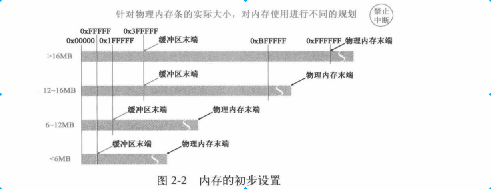
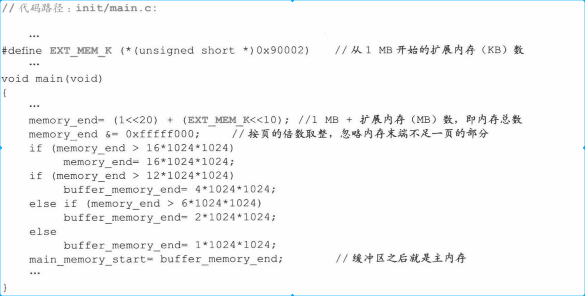
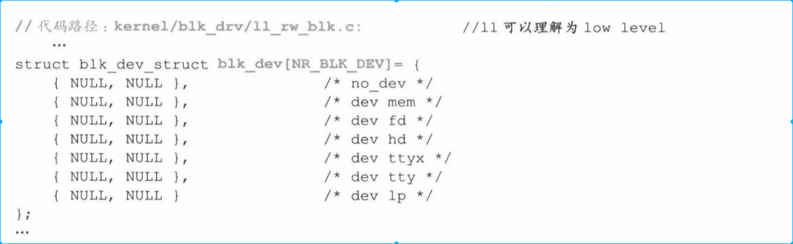
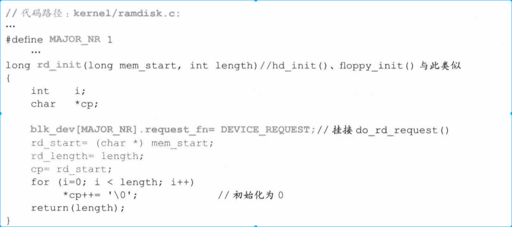

[toc]
# 1.背景
前面我们已经知道启动了操作系统面函数。但是距离执行用户程序还有一段距离，比如用户程序进行计算、和设备交互、人机交互。
这章我们主要完成上面任务，初始化设备并且启动第一个进程--0号进程。

* 我们希望进程之间相互隔离，但是进程本身不具有这层“保护”，因此需要人为设计一层保护机制（进程管理信息数据结构）。进程管理数据结构包括task_struct、task[64]、GDT。
    * task-struct是每个进程独有。包含进程各项属性，时间片、进程执行状态、局部数据描述符表（LDT）、任务描述符表（TSS）
    * task[64]存储这系统中所有进程的task_struct
    * GDT 中存储这一套所有进程所有结构，通过索引项操作系统可以间接与每个进程中LDT和TSS建立关系。（TSS--任务描述符，LDT--私有描述符）

* 本章还讲解操作系统如何对内存、CPU、串行口、显示器、键盘、硬盘、软盘等硬件进行设计。并将这些硬件和中断服务关联。（对硬件可能不会很关注，这节内容可能会去掉很多）

# 2. 根设备、硬盘
* bootsect 初始化硬盘设备。细节我这边不是很关注。

# 3. 规划内存格局
* 处理内核代码和数据所占的内存外，将剩余内存设置缓存区，主内存，虚拟盘。
    * 主内存包含进行运行的空间，也包含内核管理进程的数据结构
    * 缓冲区是内存和外设数据交换的中转站
    * 虚拟盘（缓存）可以先将外设上的数据复制到虚拟盘中，提高读写速度。

* 先根据内存大小对缓冲区和主内存打下进行设置，结果如下

代码如下

