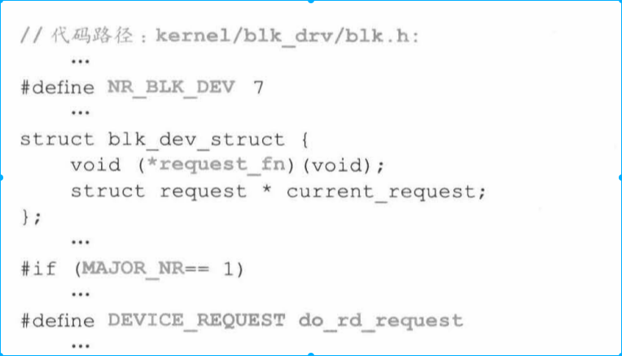
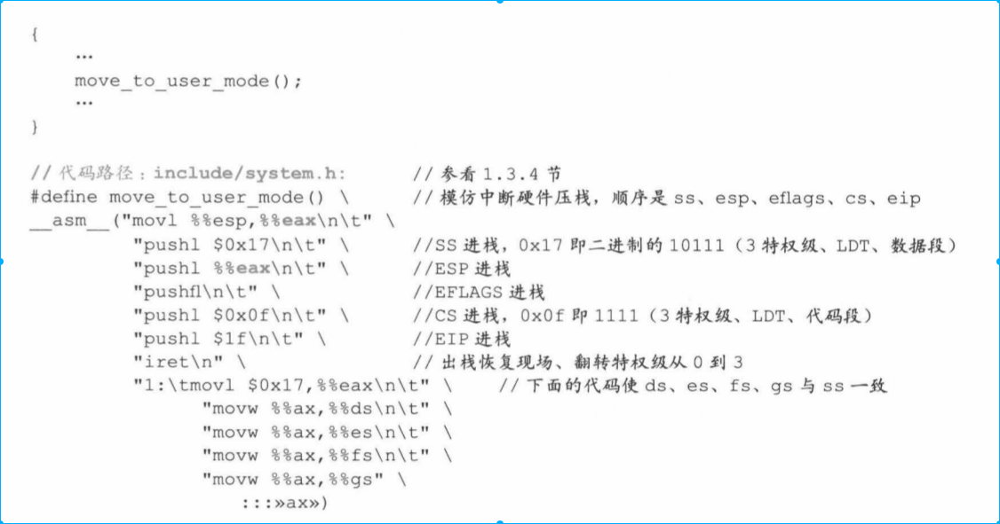

[toc]
# 1.背景
前面我们已经知道启动了操作系统面函数。但是距离执行用户程序还有一段距离，比如用户程序进行计算、和设备交互、人机交互。
这章我们主要完成上面任务，初始化设备并且启动第一个进程--0号进程。

* 我们希望进程之间相互隔离，但是进程本身不具有这层“保护”，因此需要人为设计一层保护机制（进程管理信息数据结构）。进程管理数据结构包括task_struct、task[64]、GDT。
    * task-struct是每个进程独有。包含进程各项属性，时间片、进程执行状态、局部数据描述符表（LDT）、任务描述符表（TSS）
    * task[64]存储这系统中所有进程的task_struct
    * GDT 中存储这一套所有进程所有结构，通过索引项操作系统可以间接与每个进程中LDT和TSS建立关系。（TSS--任务描述符，LDT--私有描述符）

* 本章还讲解操作系统如何对内存、CPU、串行口、显示器、键盘、硬盘、软盘等硬件进行设计。并将这些硬件和中断服务关联。（对硬件可能不会很关注，这节内容可能会去掉很多）

# 2. 根设备、硬盘
* bootsect 初始化硬盘设备。细节我这边不是很关注。

# 3. 规划内存格局
* 处理内核代码和数据所占的内存外，将剩余内存设置缓存区，主内存，虚拟盘。
    * 主内存包含进行运行的空间，也包含内核管理进程的数据结构
    * 缓冲区是内存和外设数据交换的中转站
    * 虚拟盘（缓存）可以先将外设上的数据复制到虚拟盘中，提高读写速度。

## 3.1 设置虚拟盘大小
* 先根据内存大小对缓冲区和主内存打下进行设置，结果如下

代码如下

* rd_init() 先将虚拟盘的请求处理函数do_rq_request()与图2-4函数控制结构blk_dev[7]第二项挂钩。将虚拟盘内内存区域清0.结果如下图所示。最后将虚拟盘长度返回，返回值用来设置主内存起始位置
    
    

## 3.2. 设置主内存--内存管理结构mem_map初始化
* 对主内存起始位置确定，标志这主内存和缓冲区大小已经确定。这时调用men_init（）函数
* 系统使用mem_map对1M以上内存进行分页管理，记录一个页面使用次数。系统首先将所有页面置100，然后将主内存区域置0表示未使用。
* 操作系统内核区域（1M）和用户区域（主内存）使用的是不同的分页管理方。内核的分页管理方式使得线性地址和物理地址是一致的，但是用户区域的线性地址和用户地址不一致

初始化结果如下

初始化代码如下

# 4. 设置中断服务

* trap_init()将函数中断、异常处理的服务程序与IDT进行挂接，逐步重建中断服务体系，支持内核、进程在主机中的运算。

* 挂接后结果如下

* 函数执行结果如下

* 这些代码就是为了讲之前讲述的中断描述符
* 函数调用过程如下

* 函数处理结果如下

* set_system_gate 和set_trap_gate所使用的__set_gat是一致的。不同的是set_trap_gate 的dpl是0（特权级），只能内核处理，而set_system_gate的dpl是3（用户级）

* 中断过程如下：硬件产生中断信后传递给8259A，8259A对信号进行初步处理，看CPU执行情况决定是否将信号传递给CPU，如果CPU接收到信号就立即打断正在执行的程序并通过IDT找到对应的中断服务程序。

* 早期中断信号处理是通过CPU主动轮询查看是否有中断信号，现在方式换成被动响应。这种设计模式是计算机系统的一大进步。

# 5. 硬件设备
## 5.1 初始化块设备请求项数据结构
* 硬件设备分块设备和字符设备。进程和设备进行通信都需要进过缓冲区。
* 请求项管理结构request[32]就是操作系统管理缓冲区中缓冲块与块设备上逻辑上读写关系的数据结构。并且各种请求的优先级都是通过请求管理数据结构处理的。

## 5.2 初始化通用硬件设备
没细看，不是很关注

# 6. 0号进程
* 第一个进程是0号进程。没有fork是怎么创建进程的？

* 0号进程管理结构task_struct已经在代码设计阶段事先设计好了，但是并不代表0号进程就可以直接用了，因为要将task_struct和LDT、TSS、GDT关联。并对GDT和task[64]以及与进程相关的寄存器进行初始化

* 0号进程支持中断轮询运行，所有子进程也继承这种能力。在这里进行时钟中断设置。

* 0号进程需要提供调用系统中断的能力，通过set_system_gate将system_call和IDT绑定，这样0号进程就能使用系统调用能力。并且0号将这种能力遗传给所有子进程，这样进程就完成调用系统中断能力。

# 7. 初始化缓冲区管理结构

* 缓存区存在于内存和外设之间，作为内存和外设交互的中间途径。
* 操作系统通过设置hash_table[NR_HASH] buffer_head双向环链表组成的复杂hash表管理缓冲区

* 在内核末端和缓冲区地址末端相向分别建立buffer_head（低地址）和缓冲区块（高地址），直到不足一个buffer_head和缓冲区块
    * buffer 成员包括设备号b_dev,引用次数（b_count）,更新标志b_uptodata,脏标志b_dirt,锁定标志b_block 都设置为0
    * b_data指向缓冲区块
    * b_prev_free和b_next_free将所有buffer-head组成一个双向环链表 
* 最后将hash_table所有数据都设置为null

# 8. 初始化硬盘和软盘
忽略

# 9. 开启中断
* 前面已经划分内存大小，初始化各种类型数据结构，并完成初始化内存，现在可以开始启用中断

* 开启中断很简单，就是打开EFLAGES中的中断位

## 9.1 进程从0级进程翻转到3级进程，成为真正的进程
* linux 操作系统规定，除了进程0之外，所有进程都需要由已有进程在三级特权下创建。因此进程0创建进程1之前，必须要有0级特权转换成3级权限。

* 翻转权限很显然是使用中断。
    * 中断和函数调用过程非常像，不同的是函数调用知道调用地址在什么地方，因此很容易实现压栈。但是进程是不知道中断服务程序地址的，所以压栈出栈操作都是由硬件完成的。
    * 0号进程权限变化参考了进程使用系统调用的权限翻转过程。不同的是系统调用是双向的（有return），但是0号进程权限变化是单向的。因此0号进程在翻转权限时是通过手工压栈完成的，模拟return操作。
    

    * 执行一次move_to_user_mode相当于一次中断返回，这样0号进程就成为实际上进程。

