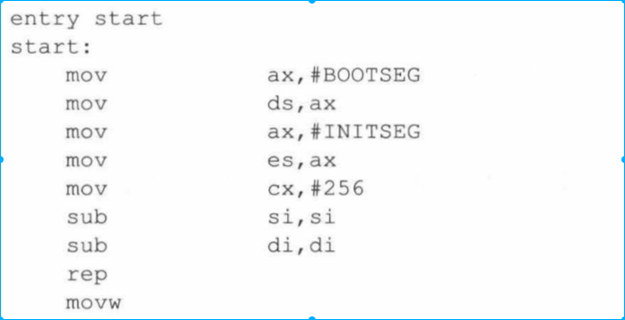
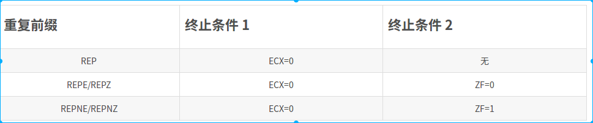

[toc]

# 1. 标识
* entry 标识伪代码指令入口
    如下图所示，第一行start代码标识。意思就是进入start 代码段执行

## 1.1 flag 标志
* ZF=1 0标志为0
* CF=1 产生借位
* SF=1 符号位为负
* OF=1 溢出
# 2.循环执行(rep)
一定要设置终止条件
* REP（重复）
* REPE（相等时重复）
* REPNE（不相等时重复
* REPZ（为零时重复
* REPNZ（不为零时重复）

## 2.1 设置si、di方向
* CLD（cleardirection）清除方向标志，cld即告诉程序si，di向前移动
* STD 指令为设置方向，告诉程序si，di向后移动

# 3.跳转指令(jmp)
## 3.1 段间
* jmpi 段间跳转
这部分标识跳转到INITSEG:go处的指令执行（属于段间跳转）

## 3.2段内
* jmp 段内跳转
### 3.2.1 无符号
* ja 大于调转（a 表示above）
* jna 不大于
### 3.2.2 有符号
* jg 大于
* jle 小于等于

# 4. 比较指令（cmp）
* cmp a b
    * 使用第一个操作数减去第二个操作数
    * 不影响a b值
    * 影响的是flag 的CF、ZF、OF、AF、PF

    * 如何判断大小呢
        * 若是无符号数
            * ZF=1->a=b
            * ZF=0 CF=1 -> a<b
            * ZF=0 CF=0 -> a>b
        * 若是有符号数
            SF=0,OF=0 -> a>b
            SF=1,OF=0 -> a<b
            SF=0,OF=1 -> a<b
            SF=1,OF=1 -> a>b

            正+正，负+负，正-负，负-正上面四中情况可能溢出