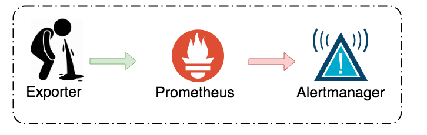
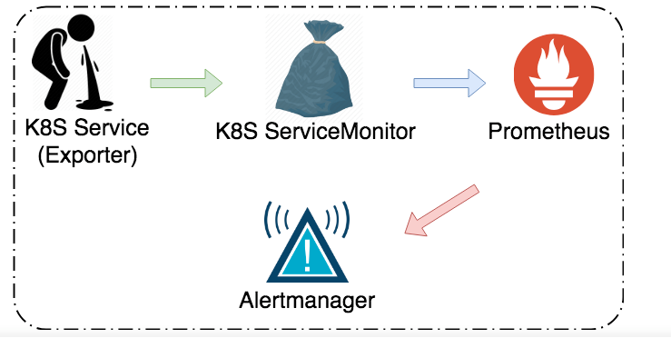

# 一、为什么要使用Prometheus Operator

（1）传统Prometheus 监控

Exporter: 必須把想要傳送給 Prometheus 的資料給暴露出來。当Exporter数量很多，并且Exporter在k8s中时动态变化的，这样增加Prometheus server配置Exporter复杂度。

（2）使用Prometheus Operator后的监控结构（只针对k8s集群）

这样所有的k8s Exporter监控信息都需要经过Prometheus Operator，这样使得Prometheus 配置更加简洁。

获取到监控信息需要满足一下四步：

1、负责输出metric的Exporter必须要存在。

2、Exporter需要连接在k8s service上

3、需要有一个k8s CRD serviceMonitor通过label对应到k8s service上。CRD会根据定义自动产生scarpe组状态，从而可以让 Prometheus service 获取到metric信息。

4、监控的rule规则需要定义在k8s的configMap中。
