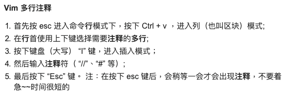

[toc]
# 1.vim 常用方式

## 1.1 多行注释




## 1.2 显示行号
### 1.2.1 临时
命令执行set nu
### 1.2.2永久
* 如果只是当前用户，配置～/.vimrc  
* 如果是所有用户，配置/etc/.vimrc 


# 2. 文件配置
## 2.1 自动缩进
### 2.1.1 tabstop softtabstop shiftwidth 区别
https://www.jianshu.com/p/05116bcc2c3b

### 2.1.2 自动缩进代码配置
```
  1 set nu
  2 
  3 set shiftwidth=4
  4 set tabstop=4
  5 set softtabstop=4
  6 #set expandtab ,后来注释掉是因为我们在使用makefile时，使用make规则只能使用tab不能使用空格代替
  7 
  8 " set autoindent
  9 " set cindent
 10 " set smartindent
 11 
 12 inoremap ' ''<ESC>i
 13 inoremap " ""<ESC>i
 14 inoremap ( ()<ESC>i
 15 inoremap[ []<ESC>i
 16 inoremap{ {<CR>}<ESC>O
```

如何将代码进行缩进。
* 普通模式按gg进入首行
* shift+v进入可视模式
* shift+g全选
* = 代码就缩进了

缩进的方式适合C这样带括号方式，但是Python格式比较灵活，可能会破坏Python 代码的原有格式。


