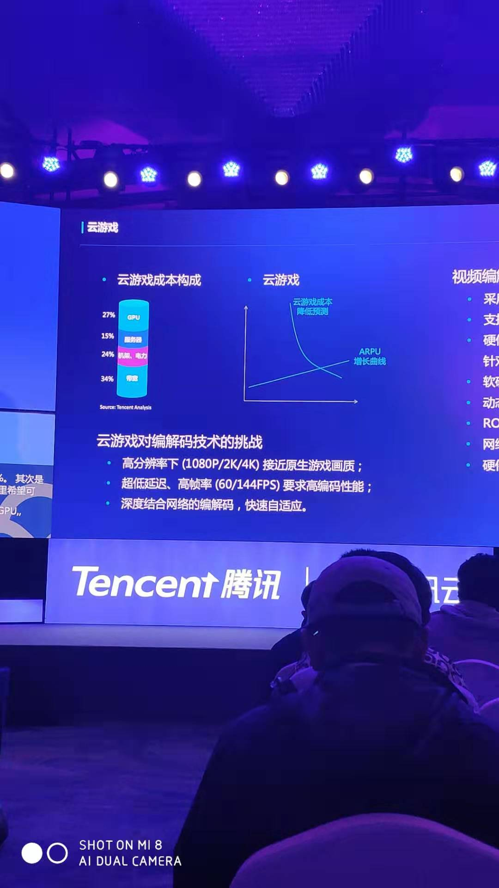
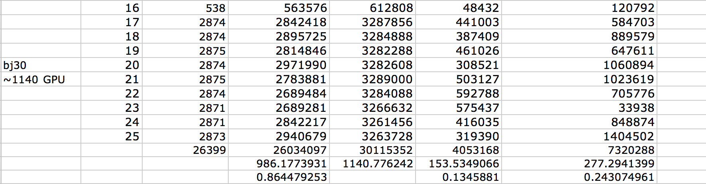
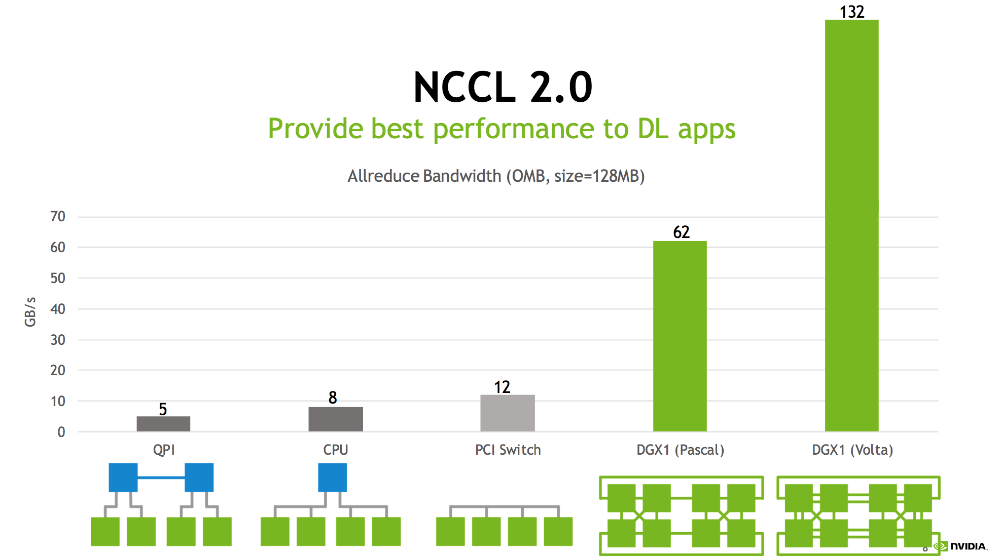

<!-- TOC -->

- [1. 概述](#1-概述)
- [2. 研究背景](#2-研究背景)
    - [2.1 应用场景](#21-应用场景)
        - [2.1.1 云游戏](#211-云游戏)
            - [2.1.1.1 成本](#2111-成本)
            - [2.1.1.2 Wine在容器中使用GPU](#2112-wine在容器中使用gpu)
        - [2.1.2 深度学习训练](#212-深度学习训练)
- [3. 研究内容](#3-研究内容)
    - [3.1 批量调度](#31-批量调度)
    - [3.2 拓扑结构](#32-拓扑结构)
    - [3.3 弹性调度](#33-弹性调度)
- [4. 实现路线](#4-实现路线)
    - [4.1 实现的侧重点](#41-实现的侧重点)
    - [4.2 实现计划](#42-实现计划)

<!-- /TOC -->
# 1. 概述
“云原生”是近年来最火的词之一，在云上有非常多可以做的事情。GPU是一种非常特殊资源，昂贵、功耗高、共享能力差、拓扑敏感。但是，目前云平台上GPU利用率并不高，如果能提高平台上GPU利用率将是一件非常有实际意义事情。

本人准备做的是在容器云上将GPU任务调度到合适节点上，考虑的因素有批量调度、拓扑敏感、弹性调度。
* 批量调度是对一组多GPU任务，要么全调度，要么一个也不调度。
* 拓扑敏感指的是GPU之间的拓扑结构对任务通信性能影响很大，尽量将任务调度到同一节点或者相邻节点上。
* 弹性调度是“云原生”的基本功能，指的是调度器能根据当前集群GPU负载情况动态分配GPU数量。
* 其中，实现的重点是弹性调度，因为目前没有任何一款在云平台上针对GPU通用任务的弹性调度，并且实现的技术路线比较清楚。其它两项主要复用现有的开源项目，做适当修改。

该调度器主要使用在云上对GPU资源有需求的任务，主要有云游戏（如Google今年年初发布的Stadia，腾讯即将发布的START），另外是深度学习领域（如云端学习、边缘计算）。

2018年Kubernetes才在容器云中取得统治地位，kubernetes主要是用来管理微服务，设计之初并没有考虑GPU这种特殊的资源，默认的GPU调度有非常多的问题。目前，GitHub上面向容器云的GPU调度项目只有kube-batch,并且处于小版本，并且没有拓扑感知和弹性调度的功能。

总的来说，研究云上弹性调度能占先机优势，社区项目一大半时间在PR（Pull Request）的争论中，并且目前还不支持弹性调度功能。

# 2. 研究背景
## 2.1 应用场景
### 2.1.1 云游戏
随着视屏编解码技术发展和5G时代的到来，云游戏厂商纷纷推出自身的云游戏平台占据市场，比如Google今年发布的Stadia，国内Tencent也即将发布自己的START平台。如果云游戏平台成功落地，相信对游戏市场影响深远。

#### 2.1.1.1 成本
云游戏成本构成中GPU所占的比例非常高，如下图所示，是今年11月份腾讯开发者大会上腾讯音视频实验室提供的一份START成本构成图，图中显示带宽成本第一占34%，GPU成本第二占27%。但是该图是腾讯做视屏编解码技术的人提供的，视屏编解码有很大一部分是专利费用，而google已经开源了其vpx系列，未来的视屏编解码成本相信会大幅度降低。另外GPU功耗是单独算在“机架、电力部分”，而GPU一直都是几个少数企业垄断的，个人相信GPU成本在云游戏成本中所占的比例会更高。

#### 2.1.1.2 Wine在容器中使用GPU
* wine-staging 1.7.34 开始对nvidia-cuda提供支持，并且不需要额外配置（https://wiki.winehq.org/Wine-Staging_CUDA）。
* github.com/scottyhardy/docker-wine 开源项目实现wine在容器中使用GPU资源（github.com/scottyhardy/docker-wine）
* CrossOver是一款基于Wine实现可以让Mac和Linux系统中正常运行Windows软件的应用程序。github.com/john-shine/Docker-CodeWeavers_CrossOver-VNC 开源项目可以使CrossOver 运行在docker中。（https://github.com/john-shine/Docker-CodeWeavers_CrossOver-VNC）

### 2.1.2 深度学习训练
随着云计算的发展，越来越多企业开始推出自己的深度学习训练平台，来降低深度学习门槛和成本，典型的如青云、paddlepaddle以及中科院的诸葛·深知。

* 商汤的数据
数据说明：
* 挑选的集群都是GPU任务过载的集群，GPU任务请求GPU数超过总GPU数
* 总共10个集群，北京5个集群每个集群约700张GPU卡。上海5个集群、每个集群约1500张v100 32 GPU 卡。
* 数据收集脚本共执行10天、每30s请求一次。元数据在数据附件二、每列分别代表时间、集群已使用GPU数、总GPU数、空闲GPU数、pending任务的请求GPU数、pending任务数
* 数据统计结果见数据附件一，说明如下：
    * 如下图所示，每列分别代表：集群、天数、监控请求次数、sum(已使用GPU)、sum(总GPU)、sum(空闲GPU)、sum(pending GPU任务)
    * 倒数第三行是求和、倒数第二行是每个值/监控请求次数来求平均、最后一行是每个值/集群总GPU 来求GPU使用率、空闲率、GPU任务pending率
    
* 最后一行得出来的结论很有意思，例子中显示集群有13.4%空闲GPU，同时有24.3%GPU任务分配不到GPU。意思是假设一个集群有1000张GPU卡，有134个GPU空闲，同时有243个GPU任务因为没有分配到GPU而处于pending状态。
* 集群中通常使用过负载提高GPU利用率，但是负载不能解决GPU碎片问题，而且数据显示碎片率还比较高。
* 相信使用弹性动态调度的算法能很好的提高GPU利用率。

* (note:整理出来的10个集群数据并不是完全有效，一般在过负载的情况才能很好的说明碎片问题，个人任务pending率>GPU空闲率 能比较好的说明问题)

# 3. 研究内容
## 3.1 批量调度
kubernetes 主要是解决无状态微服务的，对多GPU有状态任务支持并不友善。kubernetes默认调度策略是，不管任务请求多少个GPU，先尽可能占用GPU，如果资源不满足就阻塞，并且不会主动释放资源。这样一定会出现大任务阻塞小任务、资源死锁等问题。比如任务A需要4个GPU、任务B需要2个GPU、集群中还剩2个GPU，理想状态是任务B被调度，任务A阻塞，但是实际是任务A先占用2个GPU，任务A和B均阻塞。

批量调度是指，当集群中GPU资源满足任务请求数量时，该任务才被分配资源。达到的效果就是要么请求资源全部被满足，要么一个也不满足。

该需求开源项目kube-batch基本可以满足，但是该项目关于饥饿的解决还在争论中。

## 3.2 拓扑结构
* GPU 可以说对拓扑链路非常敏感，通常的链路通道包括网络、CPU、PCI SWitch、Nvlink等。

如下图所示，不同的拓扑结构对通信的速率有着重要影响，抛最后两项nvidia推出的产品，传统的PCI SWitch通道速度也是QPI通道的2.4倍。任务调度到合理的节点有利于提高GPU任务通信性能。（参考multi-gpu-training-with-nccl.pdf）

## 3.3 弹性调度
云有很多特点，最重要的有高性能、高可用、可扩展、弹性等。
实现GPU弹性调度是希望实现根据集群资源情况动态的为任务分配GPU资源。提高集群GPU资源利用率。

阿里于2019年9月在Google开发者大会上海站上发布了ElasticDL，目前第一个针对TensorFlow 2.0 训练任务实现弹性调度。（https://developer.aliyun.com/article/718209）。该项目局限性在于只支持TensorFlow 2.0，调度没考虑到GPU拓扑、GPU弹性调度使用方式是嵌入在深度学习代码中，对用户并不友好。
# 4. 实现路线
## 4.1 实现的侧重点
* 批量调度基于kube-batch实现，有现成的策略和方案。
* 根据GPU拓扑结构，将任务调度到合适的节点上。但是GPU拓扑结构非常复杂，根据拓扑结构调度本身就是一个很有意思的方向。目前没准备根据拓扑结构设计复杂的算法，只是会将多GPU任务竟可能调度在同一节点上。
* 弹性调度是实现的重点，目的是根据集群GPU使用情况，动态为任务分配GPU资源。我们需要实现的主要有两部分，首先我们需要一个controller实现状态机，具体实现调度的扩容和缩容的状态转换，另外还需要一个调度器去执行具体的调度算法和策略。

## 4.2 实现计划

* 【完成】调研Wine在容器中使用GPU资源
* 【完成】调研开源的controller实现。准备使用开源tf-operator或者pytorch-operator,这两个controller结构类似选择任何一个即可。这两个controller主要使用在深度学习场景，其主要功能是对GPU静态任务创建和维护。弹性调度的状态机可以在其基础上实现和维护。
* 【完成】调研GPU调度器，目前开源社区唯一火热的开源项目是kube-batch，其实现了基础的批量调度功能。可以在该基础上实现根据拓扑感知和弹性调度因素调度。
* 【完成】pytorch-operator 开源项目源码阅读完毕，并且画出了弹性调度的状态机
* 【进行中】kube-batch 源码阅读
* 【跟进中】基于pytorch-operator实现状态机
* 【跟进中】基于kube-batch实现具体的调度算法
* 【跟进中】控制器和调度器进行联调
* 【跟进中】在机器上跑结果，得出实验结论，参照点可以是开源的kube-batch中GPU利用率
* 【跟进中】完成毕业论文撰写

