<!-- TOC -->

- [1. Wine 简介](#1-wine-简介)
    - [1.1 Wine概述](#11-wine概述)
        - [1.1.1 宏伟目标](#111-宏伟目标)
        - [1.1.2 开源代码和用户驱动](#112-开源代码和用户驱动)
    - [1.2 Wine 延伸和相关产品](#12-wine-延伸和相关产品)
        - [1.2.1 Wine 延伸计划](#121-wine-延伸计划)
            - [1.2.1.1 Cedega游戏](#1211-cedega游戏)
            - [1.2.1.2 CrossOver软件包装器](#1212-crossover软件包装器)
            - [1.2.1.3 PlayOnLinux辅助安装程序](#1213-playonlinux辅助安装程序)
            - [1.2.1.4 Winetricks钻床](#1214-winetricks钻床)
        - [1.2.2 Windows NT 开源先驱RactOs](#122-windows-nt-开源先驱ractos)
            - [1.2.2.1 从零开始制作Windows内核](#1221-从零开始制作windows内核)
            - [1.2.2.2 ReactOS项目可视化——Doxygen软件包](#1222-reactos项目可视化doxygen软件包)
    - [1.3 Wine对使用GPU资源的支持](#13-wine对使用gpu资源的支持)
        - [1.3.1 Wine在容器上部署](#131-wine在容器上部署)
        - [1.3.2 Nvidia-Docker](#132-nvidia-docker)
- [2. 云平台](#2-云平台)
    - [2.1 为什么需要“云”](#21-为什么需要云)
    - [2.2 云平台分类](#22-云平台分类)
        - [2.2.1 IssS](#221-isss)
            - [2.2.1.1 IaaS 好处](#2211-iaas-好处)
            - [2.2.1.2 IaaS应用程序](#2212-iaas应用程序)
        - [2.2.2 PaaS](#222-paas)
            - [2.2.2.1 App Engine概念](#2221-app-engine概念)
            - [2.2.2.2 架构设计](#2222-架构设计)
        - [2.2.3 SaaS](#223-saas)
            - [2.2.3.1 常见 SaaS 方案](#2231-常见-saas-方案)
            - [2.2.3.2 SaaS 的优点](#2232-saas-的优点)
        - [2.2.4 IaaS、PaaS、SaaS三者区别](#224-iaaspaassaas三者区别)
            - [2.2.4.1 目前主流的IaaS、PaaS和SaaS产品](#2241-目前主流的iaaspaas和saas产品)
    - [2.3 云平台依赖的技术](#23-云平台依赖的技术)
    - [2.4 如何将Wine上部署到“云”上](#24-如何将wine上部署到云上)
        - [2.4.1 虚拟机和容器](#241-虚拟机和容器)
        - [2.4.2 虚拟机和容器对比](#242-虚拟机和容器对比)
    - [2.5 云计算开源框架](#25-云计算开源框架)
        - [2.5.1 OpenStack的诞生和繁荣](#251-openstack的诞生和繁荣)
        - [2.5.2  Kubernetes的开场](#252--kubernetes的开场)
        - [2.5.3 OpenStack + Kubernetes](#253-openstack--kubernetes)
        - [2.5.4 IoT下IaaS架构的选择](#254-iot下iaas架构的选择)
        - [2.5.5 PaaS和IaaS的共同演进](#255-paas和iaas的共同演进)
- [3. Kubernetes 平台上的调度策略](#3-kubernetes-平台上的调度策略)
    - [3.1  Kubernetes 简介](#31--kubernetes-简介)
        - [3.1.1 传统软件维护方式](#311-传统软件维护方式)
        - [3.1.2 Kubernetes是什么](#312-kubernetes是什么)
        - [3.1.3 Kubernetes 解决了什么问题](#313-kubernetes-解决了什么问题)
            - [3.1.3.1 减少服务环境依赖](#3131-减少服务环境依赖)
            - [3.1.3.2 服务器资源管理](#3132-服务器资源管理)
            - [3.1.3.3 服务容灾恢复](#3133-服务容灾恢复)
            - [3.1.3.4 硬件资源利用](#3134-硬件资源利用)
            - [3.1.3.4 服务资源创建](#3134-服务资源创建)
            - [3.1.3.5 可视化管理](#3135-可视化管理)
            - [3.1.3.6 服务资源监控](#3136-服务资源监控)
            - [3.1.3.7 资源整合管理](#3137-资源整合管理)
            - [3.1.3.8 版本管理与滚动升级](#3138-版本管理与滚动升级)
    - [3.2 Kubernetes结构](#32-kubernetes结构)
        - [3.2.1 Kubernetes常用相关概念](#321-kubernetes常用相关概念)
        - [3.2.2 Kubernetes结构图](#322-kubernetes结构图)
    - [3.3 调度过程和原理](#33-调度过程和原理)
    - [3.4 自定义调度](#34-自定义调度)
    - [3.5 多调度器](#35-多调度器)
        - [3.5.1 优先级调度](#351-优先级调度)
    - [3.6 自定义资源控制器](#36-自定义资源控制器)
        - [3.6.1 自定义资源（CRD）](#361-自定义资源crd)
        - [3.6.2 自定义资源控制器](#362-自定义资源控制器)
- [4 针对GPU资源调度](#4-针对gpu资源调度)
    - [4.1 GPU 资源的特点](#41-gpu-资源的特点)
        - [4.1.1 GPU和CPU区别](#411-gpu和cpu区别)
        - [4.1.2 GPU 市场](#412-gpu-市场)
            - [4.1.2.1 Imagination公司的PowerVR](#4121-imagination公司的powervr)
            - [4.1.2.2 高通的Adreno](#4122-高通的adreno)
            - [4.1.2.3 ARM公司的Mali](#4123-arm公司的mali)
            - [4.1.2.4 NVIDIA(主要是PC市场，移动市场也有)](#4124-nvidia主要是pc市场移动市场也有)
            - [4.1.2.5 Vivante的GCxx](#4125-vivante的gcxx)
            - [4.1.2.6 AMD(ATI)（主要PC市场）](#4126-amdati主要pc市场)
            - [4.1.2.7 Intel（主要是PC市场）](#4127-intel主要是pc市场)
            - [4.1.2.8 GPU市场份额](#4128-gpu市场份额)
    - [4.2 NVIDIA 资源的特殊性](#42-nvidia-资源的特殊性)
        - [4.2.1 通信性能](#421-通信性能)
        - [4.2.2 成本](#422-成本)
            - [4.2.2.1 购买价格](#4221-购买价格)
            - [4.2.2.2 功耗](#4222-功耗)
            - [4.2.2.3 利用率低](#4223-利用率低)
    - [4.3 GPU调度策略](#43-gpu调度策略)
        - [4.3.1 kube-batch开源调度策略](#431-kube-batch开源调度策略)
            - [4.3.1.1 kube-batch 在Kubernetes集群中的定位](#4311-kube-batch-在kubernetes集群中的定位)
            - [4.3.1.2 kube-batch原理](#4312-kube-batch原理)
            - [4.3.1.3 目前使用kube-batch企业](#4313-目前使用kube-batch企业)
        - [4.3.2 现有企业研究策略](#432-现有企业研究策略)
            - [4.3.2.1 Vivo](#4321-vivo)
- [5. 工作展望](#5-工作展望)
    - [5.1 计划实现的功能](#51-计划实现的功能)
        - [5.2.1 实现gang schedule](#521-实现gang-schedule)
        - [5.2.2 实现GPU 拓扑感知调度](#522-实现gpu-拓扑感知调度)
        - [5.2.3 实现GPU资源弹性调度](#523-实现gpu资源弹性调度)
    - [5.2 主要工作](#52-主要工作)
        - [5.2.1 实现Wine在容器中使用GPU资源](#521-实现wine在容器中使用gpu资源)
        - [5.2.2 实现弹性调度的状态机](#522-实现弹性调度的状态机)
        - [5.3.3 修改kube-batch部分调度策略](#533-修改kube-batch部分调度策略)

<!-- /TOC -->

# 1. Wine 简介
不同的软件程序是针对不同的操作系统而设计的，并且大多数软件程序不适用于，那些不是为其设计的系统。正如，Windows程序不能在Linux中运行，因为它们包含了使用Windows系统环境翻译之前，Linux无法理解的指令。同样，Linux程序也不能在Windows操作系统下运行，因为Windows无法解释所有指令。在这样的背景下，一个被称为Wine的项目诞生了。


图1-1 Wine的葡萄酒杯logo
## 1.1 Wine概述
Wine（“Wine Is Not an Emulator”的首字母缩写）是一个能够在多种POSIX-compliant操作系统（比如Linux，macOS以及BSD等）上运行Windows应用的兼容层，其logo如图1-1所示。Wine不是像虚拟机或者模拟器一样模仿内部的Windows逻辑，而是將 Windows API调用翻译成为动态的POSIX调用，免除了性能和其他一些行为的内存占用，让你能够干净地集合Windows应用到你的桌面。
具体来说，Wine可以与任何类Unix操作系统（尤其是Linux）一起运行Windows程序。Wine的核心是Windows应用程序编程接口（API）库的实现，充当Windows程序和Linux之间的桥梁。将Wine视为兼容层，当Windows程序尝试执行Linux通常无法理解的功能时，Wine会将该程序的指令转换为系统支持的指令。例如，如果程序要求系统创建Windows按钮或文本编辑字段，Wine将使用标准X11协议以窗口管理器命令的形式将该指令转换为其Linux等效命令。
### 1.1.1 宏伟目标
Wine项目由Bob Amstadt于1993年发起，旨在寻求一种在Linux上运行Windows 3.1 程序的办法。不久之后，Alexandre Julliard 开始接手领导 Wine 的开发，从此由他管理这个项目。多年以来，随着Windows API和应用为了适应新硬件及软件而不断演变，Wine也一直不断发展来支持新的特性，移植到更多其他系统，并且更加稳定，提供着更好的用户体验。
通过确立一个宏伟的目标，在2008年项目到达v1.0之前，Wine一直稳健地持续了15年之久，那是第一个稳定版。多个版本以后，虽然还有许多工作要做，但今天Wine仍然在活跃地开发着。并且有大约数以百万人计的人们使用Wine在他们所选择的系统上运行Windows软件。目前Wine版本：稳定版（Wine 3.0.3）、开发版（Wine 3.20）。
### 1.1.2 开源代码和用户驱动
Wine将会永远是自由软件。大约一半的Wine代码由志愿者编写，其余部分由商业公司赞助。特别是CodeWeavers，出售着一个Wine的支持版本。
Wine也是高度依赖用户社区的。用户自愿贡献时间在我们的Application Database上分享技巧和他们程序的运行测试结果，在我们的Bug-Tracker上撰写bug报告提醒开发者问题所在，或者在论坛上回复问题。
## 1.2 Wine 延伸和相关产品
最初目的是为了让16位Windows 3.1程序可以在Linux上运行，但随着计算机和时代的演进，Wine也一路支持到更新的Windows和64位的计算机体系结构。并且现在已经支持多种平台，有BSD、Mac OS X与Solaris-x86。
### 1.2.1 Wine 延伸计划
Wine的延伸计划主要有两大产品，一个是CodeWeavers开发的CrossOver，另一个是TransGaming Technologies的Cedega。
CrossOver Office以提供应用软件支持为主，Cedega则锁定在游戏娱乐方面。CodeWeavers和Wine计划一直保有密切的合作关系。CodeWeavers亦雇用了Alexandre Juillard以将CrossOver Office的源代码回馈给Wine。在2005年6月22日，CodeWeavers 宣布支持基于英特尔处理器的苹果电脑。Transgaming的Cedega则是商业软件，以Wine为基础，在Wine更换授权后停止使用Wine的源代码，虽然有Cedega提供源代码下载（经由CVS），但在不包含专利技术的情形下，功能与可用性都不高。
#### 1.2.1.1 Cedega游戏 
为Transgaming开发的商业软件，是衍生于Wine的一款专门用来在Linux下为Windows游戏提供运行环境的软件。可以运行魔兽争霸3、CS 1.5(1.6)、星际争霸等游戏，支持多达243个游戏的运行，其基本界面如图1-2所示。在Wine更换许可后停止使用Wine的源代码，虽然有Cedega提供源代码下载（经由CVS），但在不包含专利技术的情形下，功能与可用性都不高。

图1-2 Cedega游戏
#### 1.2.1.2 CrossOver软件包装器 
CrossOver并不是一个全新的虚拟层，它同样基于Wine以允许基于Windows的软件在Linux及macOS系统中运行，但它完善了一系列Windows API在Unix/Linux上的兼容性。CrossOver的目标是让更多的Windows软件能在Linux上运行，对于Wine本身短时间内无法实现的功能（函数接口），会直接使用Windows原版
DLL代替，测试通过后，打包上传到商店中，如图1-3所示。

图1-3 CrossOver软件包装器
#### 1.2.1.3 PlayOnLinux辅助安装程序 
PlayOnLinux是一个辅助安装程序，支持非常多的商用应用程序，对于应用程序的安装经过最优化，所以几乎不用设置。使用辅助安装程序，可以让Linux的用户安装基于Windows的电子游戏、Microsoft Office（2000到2010）、Microsoft Internet Explorer、以及其他许多应用软件（如图1-4所示），像是Apple iTunes及Safari等。
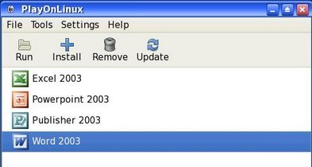
图1-4 PlayOnLinux辅助安装程序
#### 1.2.1.4 Winetricks钻床 
它可以完全自动化地安装一系列的应用程序与游戏，其中包含套用所需的调整。如果winecfg1（Wine的配置工具）是一把螺丝刀，那么winetricks就是一个钻床。
它们各有特长，但是winetricks真的是一个强大的多的工具（如图1-5所示）。实际上，它甚至可以启动 winecfg。
winecfg让你可以改变Wine本身的设置，而winetricks则可以让你改造实际的Windows层，它可以让你安装Windows重要的系统组件，比如DLL文件和系统字体，还可以允许你修改Windows注册表的信息。它还有任务管理器、卸载工具和文件浏览器。

图1-5 使用Winetricks安装DLL
与winecfg不同，winetricks不是集成在Wine中的，它实际上只是一个脚本工具。既然作为一个工具，我们可以专门建立一文件夹用来存放所有的工具。
```
$ mkdir ~/tools && cd ~/Tools
$ wget https://raw.githubusercontent.com/Winetricks/winetricks/master/src/winetricks
$ chmod +x winetricks
```
尽管winetricks可以做大量的工作，但是大部分时间我们用到的功能也就是管理DLL文件和Windows组件。
举个例子 给小环境AliIM2018安装riched20.dll组件。
```
$ WINEPREFIX=~/pro/AliIM2018/ sh ~/tools/winetricks riched20
```
在小环境中，使用sh运行winetricks脚本。这时候riched20.dll就会被安装在AliIM2018这个小环境中。有时候并不知道具体组件的名字，不带参数运行winetricks，就会进入可视化安装界面。同时，也可以使用WINEPREFIX来指定默认容器。如图1-6所示。
```
$ sh ~/tools/winetricks
$ WINEPREFIX=~/pro/AliIM2018/ sh ~/tools/winetricks
```
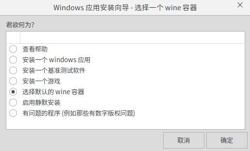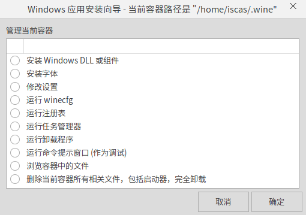
图1-6 Winetricks图形化安装界面

### 1.2.2 Windows NT 开源先驱RactOs
大约在1996年时，一群开源软件开发者启动了一个名为FreeWin95的项目，旨在实现一个Windows 95的克隆操作系统。这个项目当时只停留在关于系统实现的讨论上。
到了1997年末，项目依旧没有进展。开发成员呼吁重新开始这个项目，而实现的目标也改为Windows NT系统，同时项目名称命名为ReactOS（“React”意为“反抗”）,logo如图1-7所示。1998年2月ReactOS项目正式启动，开始开发系统内核和基本的驱动程序。ReactOS是一款开源操作系统，该操作系统模仿了Windows NT架构进行开发，目的是开发出一款可以替代Windows（主要是Windows XP）的开源操作系统。

图1-7 ReactOS内核logo
#### 1.2.2.1 从零开始制作Windows内核  
这群最早的ReactOS开发者，他们是完全从零开始编码制作Windows内核的（并不依赖于Linux内核）。同样，ReactOS也只是一个内核，它依赖Wine项目的用户空间库文件使整个系统能够运行。
当然，ReactOS和Wine之间有很密切的关系，可以在ReactOS的wiki中有看到：
It is not another wrapper built on Linux, like WINE. It does not attempt or plan to compete with WINE; in fact, the user-mode part of ReactOS is almost entirely WINE-based and our two teams have cooperated closely in the past.
也就是说，ReactOS的用户态的部分，几乎就是Wine的工程了。

#### 1.2.2.2 ReactOS项目可视化——Doxygen软件包 
在ReactOS官网上，有个https://doxygen.reactos.org/页面。Main标签页中写道：“这是使用优秀的Doxygen软件包生成的ReactOS源代码的交叉引用。它每天都会更新”。 图1-8至1-13是其相关内容的视图：
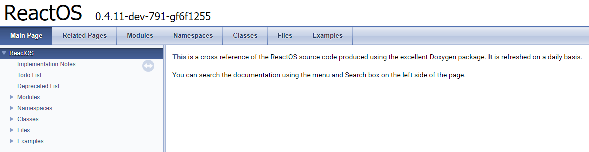
图1-8 Main Page
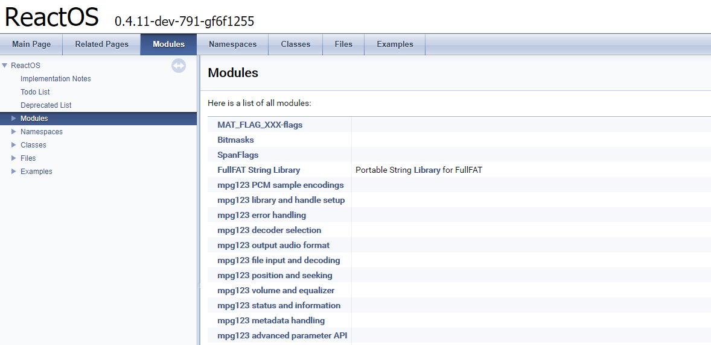
图1-9 Modules
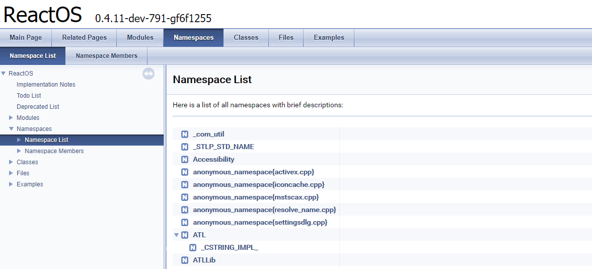
图1-10 Namespaces
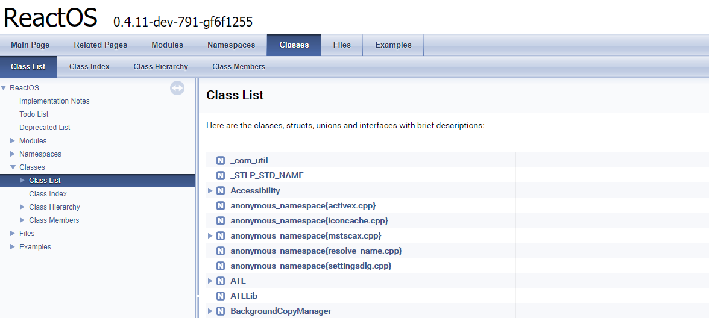
图1-11 Classes
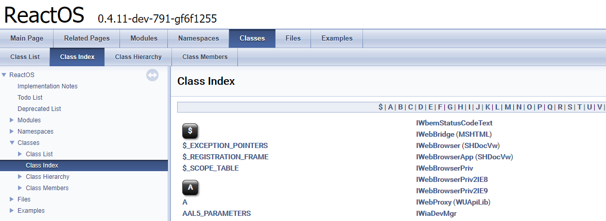
图1-12 Class Index
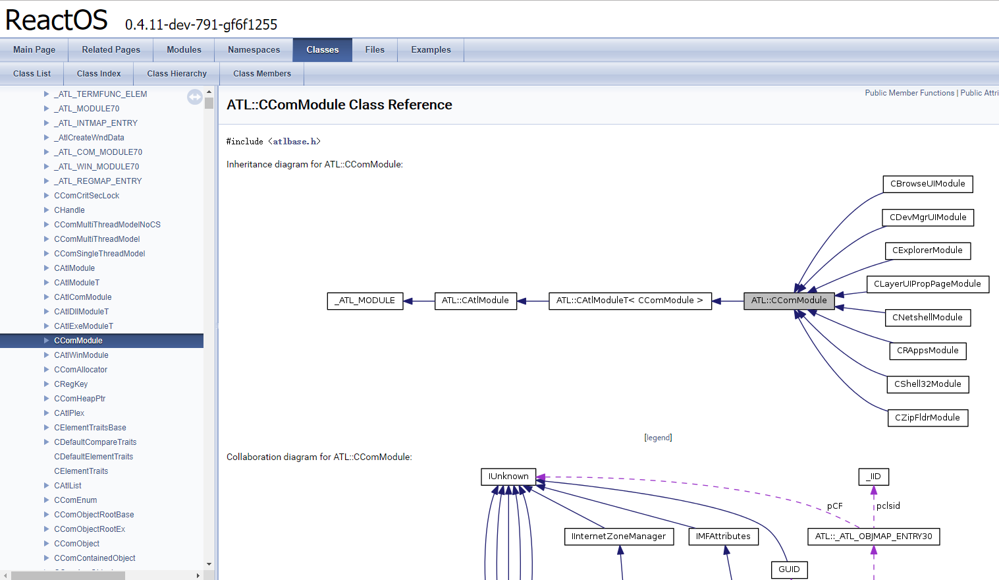
图1-13 ATL::CComModule Class Reference

## 1.3 Wine对使用GPU资源的支持
Wine 3.0 支持AMD和Intel GPU的Direct3D 11，官方文档并未说明直接对NVIDIA GPU的直接支持。
Wine 4.0 提供了对Direct3D 12的支持，并且支持NVIDIA GPU。

### 1.3.1 Wine在容器上部署
在github上搜索“wine docker”项目，共有228个项目，大部分是将具体的应用和Wine一起封装在容器中，通过容器不熟具体应用。其中，有部分项目是Wine4.02 封装在容器中，将docker镜像pull到本地运行，wine能正常运行。

### 1.3.2 Nvidia-Docker
NVIDIA Container Toolkit允许用户构建和运行GPU加速的Docker容器。 toolkit包括容器运行时库和实用程序，用于自动配置容器以利用NVIDIA GPU。
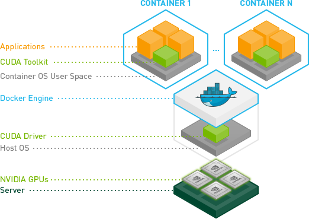
图中可以看到，NVIDIA-Docker能支持使用GPU资源，是因为在容器用户层上，添加了CUDA Toolkit，其中包含调用CUDA Drive的库，因此在容器中直接使用GPU资源。
Ubuntu 16.04/18.04 下安装NVIDIA docker过程如下：
```
# Add the package repositories
$ distribution=$(. /etc/os-release;echo $ID$VERSION_ID)
$ curl -s -L https://nvidia.github.io/nvidia-docker/gpgkey | sudo apt-key add -
$ curl -s -L https://nvidia.github.io/nvidia-docker/$distribution/nvidia-docker.list | sudo tee /etc/apt/sources.list.d/nvidia-docker.list

$ sudo apt-get update && sudo apt-get install -y nvidia-container-toolkit
$ sudo systemctl restart docker
```

# 2. 云平台
云计算平台也称为云平台，是指基于硬件资源和软件资源的服务，提供计算、网络和存储能力。云计算平台可以划分为3类：以数据存储为主的存储型云平台，以数据处理为主的计算型云平台以及计算和数据存储处理兼顾的综合云计算平台。
硬件管理对使用者/购买者高度抽象：用户根本不知道数据是在位于哪里的哪几台机器处理的，也不知道是怎样处理的，当用户需要某种应用时，用户向“云”发出指示，很短时间内，结果就呈现在他的屏幕上。云计算分布式的资源向用户隐藏了实现细节，并最终以整体的形式呈现给用户。
使用者/购买者对基础设施的投入被转换为OPEX(Operating Expense，即运营成本)：企业和机构不再需要规划属于自己的数据中心，也不需要将精力耗费在与自己主营业务无关的IT管理上。他们只需要向“云”发出指示，就可以得到不同程度、不同类型的信息服务。节省下来的时间、精力、金钱，就都可以投入到企业的运营中去了。对于个人用户而言，也不再需要投入大量费用购买软件，云中的服务已经提供了他所需要的功能，任何困难都可以解决。基础设施的能力具备高度的弹性(增和减)：可以根据需要进行动态扩展和配置。云计算平台可以大致分为以下3类：
1、以数据存储为主的存储型云平台；
2、以数据处理为主的计算型云平台；
3、计算和数据存储处理兼顾的综合云计算平台。
## 2.1 为什么需要“云”
传统的应用正在变得越来越复杂：需要支持更多的用户，需要更强的计算能力，需要更加稳定安全等等，而为了支撑这些不断增长的需求，企业不得不去购买各类硬件设备（服务器，存储，带宽等等）和软件（数据库，中间件等等），另外还需要组建一个完整的运维团队来支持这些设备或软件的正常运作，这些维护工作就包括安装、配置、测试、运行、升级以及保证系统的安全等。便会发现支持这些应用的开销变得非常巨大，而且它们的费用会随着你应用的数量或规模的增加而不断提高。这也是为什么即使是在那些拥有很出色IT部门的大企业中，那些用户仍在不断抱怨他们所使用的系统难以满足他们的需求。而对于那些中小规模的企业，甚至个人创业者来说，创造软件产品的运维成本就更加难以承受了。
将应用部署到云端后，可以不必再关注那些令人头疼的硬件和软件问题，它们会由云服务提供商的专业团队去解决。使用的是共享的硬件，这意味着像使用一个工具一样去利用云服务（就像插上插座，你就能使用电一样简单）。
另外，云平台提供按需服务功能，根据需求来支付费用，节省了软件运行的成本。并且可以通过需求弹性扩展硬件配置，有利于提供硬件资源利用率。

## 2.2 云平台分类
云计算不是一种单一的产品类型，而是一系列旨在满足组织各种IT需求的服务。通过云计算提供的一种服务是基础设施即服务（IaaS），它通常通过互联网向企业提供虚拟化计算资源。基础设施即服务（IaaS）、软件即服务（SaaS）和平台即服务（PaaS）是主要的云计算服务类型。

### 2.2.1 IssS

在IaaS模型中，第三方服务提供商以高度自动化的交付模式为客户托管硬件设备、操作系统和其他软件、服务器，存储系统和各种其他IT组件。在某些情况下，IaaS提供商还处理诸如持续系统维护、数据备份和业务连续性等任务。

使用IaaS的组织可以自行提供基础设施服务，并按使用次数付费。费用通常按小时、周或月支付，具体取决于服务合同。在某些情况下，提供商根据客户在一段时间内使用的虚拟机（VM）容量向客户收取基础设施服务费用。


与其他云计算服务类似，IaaS通过公共连接（通常是互联网）提供对虚拟化环境中IT资源的访问。但是通过IaaS，企业可以访问虚拟化组件，这样就可以在其组件上而不是在自己的数据中心创建自己的IT平台。

IaaS不能与PaaS混淆，PaaS是一种基于云计算的产品，服务提供商向客户提供平台，允许他们开发、运行和管理业务应用程序，而无需构建和维护此类软件开发过程通常需要的基础设施。

IaaS也不同于SaaS，SaaS是一种软件分发模型，服务提供商为客户托管应用程序，并通过互联网向这些客户提供应用程序。
提供给客户的IaaS服务池来自多个服务器和网络，这些服务器和网络通常分布在由云计算提供商拥有、运营和维护的多个数据中心中。

IaaS资源可以是单租户或多租户，并且它们托管在服务提供商的数据中心中。

“多租户”是指多个客户机共享这些资源，即使它们的系统是分开的。这是最常见的交付IaaS的方式，因为它既高效又可扩展，采用云计算的成本普遍较低。

相比之下，单租户系统的存在是为了服务那些需要与他人严格分离但成本更高的客户。单租户系统更像是传统的托管服务，其中第三方提供商基本上在其数据中心租用企业专用的空间，但真正的单租户IaaS还提供特定于云计算的功能，例如可扩展性和对各种平台技术的访问托管服务通常无法提供。

企业可以使用云计算技术在自己的数据中心内创建自己的内部IaaS，但这不是真正的IaaS。它实际上是一个使用现代云计算技术的传统数据中心。基于云计算的IaaS提供商通常提供更高的可扩展性、更多的技术选择、按需可用性，以及通常更好的安全性，因为它创建了IaaS平台以支持数百或数千个客户。
#### 2.2.1.1 IaaS 好处
与其他云计算产品一样，IaaS的主要业务优势之一是，它提供了依赖于本地数据中心的传统IT基础设施无法实现的灵活性。

IaaS平台提供对高度可扩展的IT资源的访问，这些资源可以根据容量变化的需求进行调整。这使得该模型非常适合那些工作负荷暂时很高的公司，例如许多零售商在假日购物季所面临的问题。它也非常适合那些期望稳定增长的中小型企业。

如今的企业正在寻求更灵活的方式，更好地与能够随时做出改变的基于网络的企业竞争。提高业务敏捷性和可扩展性是IaaS的关键业务驱动因素之一。

节省成本也是如此。通过将IT基础设施转移到云端，企业可以节省资本和运营支出。通过只为需要的计算能力支付费用，企业可以降低未充分利用资源的成本，还可以降低IT硬件维护成本，因为减少了对内部数据中心硬件的依赖。云计算监控工具和了解云计算的成本模型可以帮助企业识别隐藏的成本和浪费的开支，并避免IaaS账单螺旋式增长。

但是，企业必须小心监视其使用情况，并确保企业的应用程序和其他系统有效地使用云计算资源。因为，在IaaS的计量世界中，企业需要与有效使用资源相同的价格支付浪费的资源的费用。

IaaS的另一个好处是位置灵活性。企业几乎可以从任何可以访问互联网的地方访问IaaS产品。

还有可用性的优势。由于云计算提供商依赖于多个设施，因此没有单点故障。他们还分配他们的设施，以根据客户所在位置减少延迟。
#### 2.2.1.2 IaaS应用程序
企业可以将IaaS用于各种工作负载。但根据调研机构Gartner公司在2019年7月发布的调查报告，这些服务通常需要四大类：

• 数字业务：几乎所有业务都受到数字中断的影响，数字业务需求占据了IAAS的大部分工作负载。数字业务用例包括数字营销、电子商务、客户资源管理、软件即服务、数据服务和物联网（IOT）应用程序。

• 敏捷项目：许多组织已经启动了他们以敏捷方式执行的IT项目。快速的应用程序开发、原型设计、实验和其他需要敏捷性、灵活性和满足紧急基础设施需求的项目通常在IaaS上执行。

• 数据中心替换：在许多组织中，IaaS正在逐步取代或补充传统的本地数据中心基础设施。在这些情况下，IaaS通常与组织的内部虚拟化环境类似，企业通常从开发环境或不太关键的生产应用程序开始，然后逐渐扩展其对IaaS的使用，以便在获得更多经验和信任时托管关键应用程序。

• 批量计算：这是IaaS最不常见的需求，Gartner公司表示，在这些情况下，IaaS可以替代传统的高性能或网格计算。可能的应用包括渲染、视频编码、基因排序、建模和模拟、数值分析和数据分析。
### 2.2.2 PaaS
PaaS(Platform as a service)，平台即服务，指将软件研发的平台（或业务基础平台）作为一种服务，以SaaS的模式提交给用户。
PaaS是云计算服务的其中一种模式，云计算是一种按使用量付费的模式的服务，类似一种租赁服务，服务可以是基础设施计算资源（IaaS），平台（PaaS），软件（SaaS）。租用IT资源的方式来实现业务需要，如同水力、电力资源一样，计算、存储、网络将成为企业IT运行的一种被使用的资源，无需自己建设，可按需获得。
PaaS的实质是将互联网的资源服务化为可编程接口，为第三方开发者提供有商业价值的资源和服务平台。简而言之，IaaS就是卖硬件及计算资源，PaaS就是卖开发、运行环境，SaaS就是卖软件。

#### 2.2.2.1 App Engine概念
App Engine是PaaS模式的一种实现方式，App Engine将应用运行所需的 IT 资源和基础设施以服务的方式提供给用户，包括了中间件服务、资源管理服务、弹性调度服务、消息服务等多种服务形式。App Engine的目标是对应用提供完整生命周期（包括设计、开发、测试和部署等阶段）的支持，从而减少了用户在购置和管理应用生命周期内所必须的软硬件以及部署应用和IT 基础设施的成本，同时简化了以上工作的复杂度。常见的App Engine有：GAE(Google App Engine)，SAE(Sina App Engine)，BAE(Baidu App Engine)。

App Engine利用虚拟化与自动化技术实现快速搭建部署应用运行环境和动态调整应用运行时环境资源这两个目标。一方面实现即时部署以及快速回收，降低了环境搭建时间，避免了手工配置错误，快速重复搭建环境，及时回收资源， 减少了低利用率硬件资源的空置。另一方面，根据应用运行时的需求对应用环境进行动态调整，实现了应用平台的弹性扩展和自优化，减少了非高峰时硬件资源的空置。

简而言之，App Engine主要目标是：Easy to maintain(维护), Easy to scale(扩容), Easy to build(构建)。

#### 2.2.2.2 架构设计
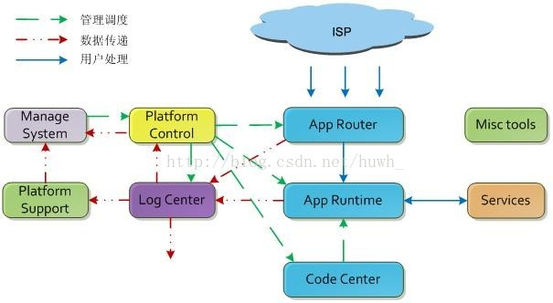

App Router[流量接入层] 	接收用户请求，并转发到不同的App Runtime。
App Runtime[应用运行层] 	应用运行环境，为各个应用提供基本的运行引擎，从而让app能够运行起来。
Services[基础服务层] 	各个通用基础服务，主要是对主流的服务提供通用的接入，例如数据库等。
Platform Control[平台控制层] 	整个平台的控制中心，实现业务调度，弹性扩容、资源审计、集群管理等相关工作。
Manage System[管理界面层] 	提供友好可用的管理操作界面方便平台管理员来控制管理整个平台。
Platform Support[平台支持层] 	为应用提供相关的支持，比如应用监控、问题定位、分布式日志重建、统计分析等。
Log Center[日志中心] 	实时收集相关应用及系统的日志（日志收集），提供实时计算和分析平台（日志处理）。
Code Center[代码中心] 	完成代码存储、部署上线相关的工作。

最典型的Paas平台就是Kubernetes。
### 2.2.3 SaaS


软件即服务 (SaaS) 让用户能够通过 Internet 连接和使用基于云的应用程序。常见示例有电子邮件、日历和办公工具（如 Microsoft Office 365）。

SaaS 提供完整的软件解决方案，你可以从云服务提供商处以即用即付方式进行购买。为组织租用应用，组织用户即可通过 Internet 连接到该应用（通常使用 Web 浏览器）。所有基础结构、中间件、应用软件和应用数据都位于服务提供商的数据中心内。服务提供商负责管理硬件和软件，并根据适当的服务协议确保应用和数据的可用性和安全性。SaaS 让组织能够通过最低前期成本的应用快速建成投产。

#### 2.2.3.1 常见 SaaS 方案
如果你使用了基于 Web 的电子邮件服务（例如 Outlook、Hotmail 或 Yahoo! Mail），那么你已经使用一种形式的 SaaS。使用这些服务，你可以通过 Internet 登录到你的帐户（通常从 Web 浏览器进行登录）。电子邮件软件位于服务提供商的网络上，你的邮件也存储在那里。你可以通过任何连接到 Internet 的计算机或移动设备上的 Web 浏览器访问你的电子邮件和已保存邮件。

以上示例是供个人使用的免费服务。对于组织用途，可以租用电子邮件、协作和日历等生产力应用以及客户关系管理 (CRM)、企业资源规划 (ERP) 和文件管理等先进的商业应用程序。可以按订阅或根据使用水平为这些应用的使用付费。

#### 2.2.3.2 SaaS 的优点
可以使用先进的应用程序。 要向用户提供 SaaS 应用，你无需购买、安装、更新或维护任何硬件、中间件或软件。SaaS 让缺乏自行购买、部署和管理必需基础结构和软件所需资源的企业能够使用 ERP 和 CRM 等非常先进的企业应用程序。

只为自己使用的东西付费。 并且由于 SaaS 服务将根据使用水平自动扩展和收缩，你还能节省费用。

免客户端软件使用。 用户可以从其 Web 浏览器直接运行大部分 SaaS 应用而无需下载和安装任何软件（部分应用需要插件）。这意味着你无需为用户购买和安装特殊软件。

轻松增强员工移动性。 SaaS 让你能够轻松增强员工“移动性”，因为用户可以从任何连接到 Internet 的计算机或移动设备访问 SaaS 应用和数据。无需考虑将应用开发为可在不同类型的计算机和设备上运行，因为服务提供商已经完成了这部分工作。此外，无需学习专业知识即可处理移动计算带来安全问题。无论使用数据的设备是什么类型，谨慎选择的服务提供商都将确保数据的安全。

从任何位置访问应用数据。 将数据存储到云后，用户即可通过任何连接到 Internet 的计算机或移动设备访问其信息。并且将应用数据存储到云后，用户的计算机或移动设备发生故障时不会丢失任何数据。

### 2.2.4 IaaS、PaaS、SaaS三者区别
SaaS、PaaS、IaaS简单的说都属于云计算服务，也就是云计算+服务。我们对于云计算的概念，维基百科有以下定义：Cloud computing is a new form of Internet-based computing that provides shared computer processing resources and data to computers and other devices on demand. 云计算就是一种按照需求通过Internet获取计算资源的形态。这些计算资源被包装成为服务，提供给用户。而提供这些服务的主体，我们称之为云服务供应商（Cloud Service Provider）。按照NIST (National Institute of Standards and Technology，美国国家标准和技术研究院)的定义，云服务最主要的有三类，就是题主提问的IaaS、PaaS、SaaS。


IaaS（Infrastructure as a service – 基础设施即服务）：用户可以在云服务提供商提供的基础设施上部署和运行任何软件，包括操作系统和应用软件。用户没有权限管理和访问底层的基础设施，如服务器、交换机、硬盘等，但是有权管理操作系统、存储内容，可以安装管理应用程序，甚至是有权管理网络组件。简单的说用户使用IaaS，有权管理操作系统之上的一切功能。我们常见的IaaS服务有虚拟机、虚拟网络、以及存储。
PaaS（Platform as a service – 平台即服务）：PaaS给用户提供的能力是使用由云服务提供商支持的编程语言、库、服务以及开发工具来创建、开发应用程序并部署在相关的基础设施上。用户无需管理底层的基础设施，包括网络、服务器，操作系统或者存储。他们只能控制部署在基础设施中操作系统上的应用程序，配置应用程序所托管的环境的可配置参数。常见的PaaS服务有数据库服务、web应用以及容器服务。成熟的PaaS服务会简化开发人员，提供完备的PC端和移动端软件开发套件（SDK），拥有丰富的开发环境（Inteli、Eclipse、VS等），完全可托管的数据库服务，可配置式的应用程序构建，支持多语言的开发，面向应用市场。
SaaS（Software as a Service – 软件即服务）：SaaS给用户提供的能力是使用在云基础架构上运行的云服务提供商的应用程序。可以通过轻量的客户端接口（诸如web浏览器（例如，基于web的电子邮件））或程序接口从各种客户端设备访问应用程序。 用户无需管理或控制底层云基础架构，包括网络，服务器，操作系统，存储甚至单独的应用程序功能，可能的例外是有限的用户特定应用程序配置设置。类似的服务有：各类的网盘(Dropbox、百度网盘等)，JIRA，GitLab等服务。而这些应用的提供者不仅仅是云服务提供商，还有众多的第三方提供商（ISV: independent software provider）。

这里借用汽车的例子对IaaS、PaaS、SaaS的解释进一步阐述三者的区别。假设你需要出去外出使用交通工具，我们有四种的方案：On-premise方案： 自己开车，需要维护汽车，是其安全工作。同时需要为车上保险，提供燃料。（服务器 + 操作系统/数据库 + 应用软件）IaaS: 从租车公司租一辆车，汽车的维修、安检都由租车公司承担。你只需要提供燃料（需要提供操作系统+应用软件）PaaS: 除了基础设施（汽车），还为你提供司机。类似出租车。只需要提供目的地，汽车的行驶和运行都有司机决定。（只需要提供应用软件）。SaaS:类似于做轨道交通， 一切都是由别人控制。只有较少的定制化功能。
#### 2.2.4.1 目前主流的IaaS、PaaS和SaaS产品
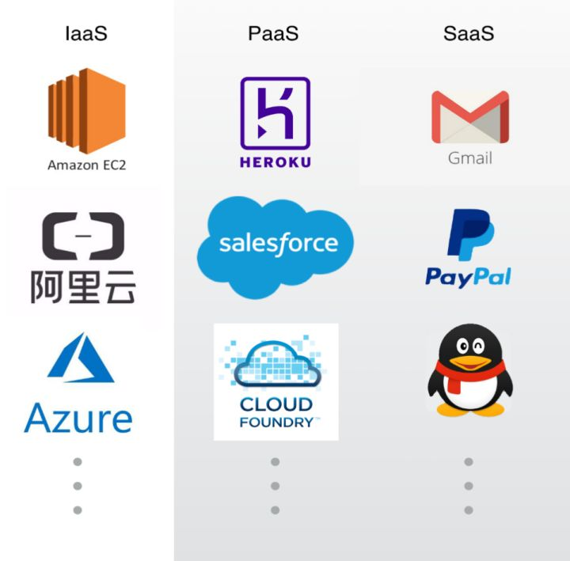


## 2.3 云平台依赖的技术 
分布式：“云”一般具有相当的规模，一些知名的云供应商如Google云计算、Amazon、IBM、微软、阿里等也都拥能拥有上百万级的服务器规模。而依靠这些分布式的服务器所构建起来的“云”能够为使用者提供前所未有的计算能力。
虚拟化：云计算都会采用虚拟化技术，用户并不需要关注具体的硬件实体，只需要选择一家云服务提供商，注册一个账号，登陆到它们的云控制台，去购买和配置你需要的服务（比如 云服务器，云存储，CDN等等），再为你的应用做一些简单的配置之后，你就可以让你的应用对外服务了，这比传统的在企业的数据中心去部署一套应用要简单方便得多。而且你可以随时随地通过你的PC或移动设备来控制你的资源，这就好像是云服务商为每一个用户都提供了一个IDC(Internet Data Center)一样。
高可用性和扩展性：那些知名的云计算供应商一般都会采用数据多副本容错、计算节点同构可互换等措施来保障服务的高可靠性。基于云服务的应用可以持续对外提供服务（7*24小时），另外“云”的规模可以动态伸缩，来满足应用和用户规模增长的需要
按需服务，更加经济：用户可以根据自己的需要来购买服务，甚至可以按使用量来进行精确计费。这能大大节省IT成本，而资源的整体利用率也将得到明显的改善。
安全：网络安全已经成为所有企业或个人创业者必须面对的问题，企业的IT团队或个人很难应对那些来自网络的恶意攻击，而使用云服务则可以借助更专业的安全团队来有效降低安全风险。

## 2.4 如何将Wine上部署到“云”上
很显然更，将Wine部署到云上，需要使用Pass平台，通常有两种方法，一种通过虚拟机将Wine部署到云平台上，另外一种是通过容器将Wine部署到云平台上。我们可以根据自身需求按需选择。
### 2.4.1 虚拟机和容器
虚拟机（Virtual Machine）与容器技术（Container）都是虚拟化技术，两者的区别在于虚拟化的程度不同。
如图×××所示，vm多了一层guest OS，虚拟机的Hypervisor会对硬件资源也进行虚拟化，而Container会直接使用宿主机的硬件资源。
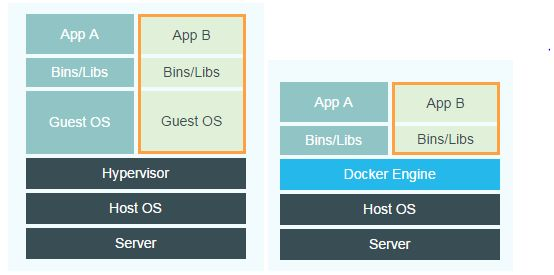

### 2.4.2 虚拟机和容器对比
隔离性：在隔离性上面，由于vm对操作系统也进行了虚拟化，隔离的更加彻底。而Container共享宿主机的操作系统，隔离性较差。
运行效率：由于vm的隔离操作，导致生成虚拟机的速率大大低于容器Container生成的速度，因为Container直接利用宿主机的系统内核。比如openstack能够以10台/min的速度创建虚拟机，而Container可以做到在几秒钟之内创建大量容器，它们的启动速度是在数量级上的差距。
资源利用率：在资源利用率上虚拟机由于隔离更彻底，因此利用率也会相对较低。

因此，如果我们对隔离性要求很高，可以偏向使用虚拟机部署。如果对效率资源利用率更看重，可以偏向使用容器部署。

## 2.5 云计算开源框架

* https://zhuanlan.zhihu.com/p/78284490

全球云计算的龙头亚马逊近日风光无限，成为继苹果公司之后，第二个市值突破万亿美元的公司。但是市盈率却高达400倍，而同期苹果公司却只有20倍。暂且不说亚马逊能否撑起如此之高的市盈率，可见全球市场对云计算持有乐观的发展预期。云计算的概念在2006年由谷歌首次提出，大约经过10年的探索和技术积累，在2015年开始进入应用的繁荣期。 亚马逊占据了市场60%的市场份额，具有绝对领先的地位。亚马逊的CEO贝佐斯要求开发人员按照SOA理念来进行开发，即面向服务的理念，要求所有程序模块必须要用服务接口把数据和功能开放出来，这种设计理念也奠定了现在AWS的基本技术基础。

### 2.5.1 OpenStack的诞生和繁荣

当然参与云计算的公司一直都很多，在2010年7月，RackSpace和NASA(美国国家航空航天局)，分别捐献出RackSpace云文件平台代码和NASANebula平台代码，OpenStack由此诞生。OpenStack作为AWS的追随者，其设计理念和AWS都非常的相似，核心组件包括计算（Nova）、对象存储（Swift）、认证（Keystone）、用户界面（Dashboard）、块存储（Cinder）、网络（Neutron）和镜像服务（Glance），这些组件协同工作为用户提供计算、网络和存储等硬件资源。OpenStack这种DIY的设计模式受了极大追捧，而且OpenStack涉及的概念和调用接口也和AWS一致。用户可以把AWS上的应用无缝迁移到基于OpenStack的云平台上，思科、IBM、HP等一些列的IT巨头纷纷基于OpenStack推出了自己的公有云平台。OpenStack不光在公有云上作为AWS的替代者，而且在私有云领域也打破了VMware公司在服务器虚拟机的垄断。全世界的云计算工程师都为之欢呼，因此基于OpenStack的产业链也就诞生了。国内出现了很多基于OpenStack的创业公司，比如united stack、easystack、awcloud等。拥有最多数据中心的三大运营商，也分别成立云计算分公司并组建OpenStack团队。还有一些金融等传统行业也成立自己的事业部，志在基于OpenStack打造自己的私有云。互联网巨头腾讯和百度，也有自己的OpenStack团队和对应的产品。所以在OpenStack黄金会员里面，我们华人公司占据了一半的席位。随着OpenStack的蓬勃发展，其笨重、性能等缺陷日益显露。部署起来非常复杂，光部署工具就有很多种；使用起来性能也不是太好，非常多的重复代码。而且社区管理也有问题，功能组件繁多且重复，围绕OpenStack有100多个项目，各个厂商利益角逐。就比如裸机管理项目最开始是ironic，后面华为和intel又搞出来mogon。两个项目只是代码框架不同却是实现相同的功能，这样的情况并不是特例，这无疑分散了OpenStack的研发实力。有些PTL和TC更是想把自己的项目脱离OpenStack单独部署，无非是想脱离走下坡路的OpenStack社区。目前社区的一些任务目标，PTL响应也不够，完成度更不用说了。因为随着OpenStack的衰落，公司支持力度下降，有些PTL都是兼职自愿奉献社区。就比如Trove项目的前任PTL，因为Tesora被收购一拍屁股走人，我们国人接过来trove的PTL重担，但是2018年温哥华峰会的时候，据说因为其个人原因没有如期参加吧，也饱受批评。OpenStack经历了短暂的繁荣期，2015年惠普把EG（中国惠普企业集团）51%的股份卖给了紫光股份，并于次年2017年9月彻底解散了国内云计算团队；惠普美国云计算也纷纷有大佬离职，并把OpenStack组件资产卖给了SUSE，表示SUSE将是其OpenStack业务发展的首选合作伙伴。思科也在2017年3月关闭基于OpenStack的Intercloud公有云服务，并宣称将专注于混合云和网络虚拟化服务的提供。IBM也在2018年放弃OpenStack，转向做kubernetes去了。但是国内在云计算领域公有云份额很少，私有云份额很大占到95%，所以仍然有很多厂商在私有云领域采用OpenStack，至于公有云的话，OpenStack框架确实也不太适合。国内华为、金山等公有云厂商，虽然使用的OpenStack，但是基本上功能已经改了很多了。

### 2.5.2  Kubernetes的开场 
伴随着OpenStack的衰落，Kubernetes已经成为新贵。说到Kubernetes，不得不说一下docker。2013年3月dotcloud公司推出了一项新的容器技术Docker。说到容器技术，也不是什么新技术，只是非常的小众。然而Docker的出现，降低了容器技术使用的门槛，带来了无可比拟的优势，所以迅速在IT行业内普及。不光是IT工程师，还是产品经理等非技术工作人员，人们争相讨论着容器化会带来哪些便利和优势，也像OpenStack一样催化了无数的创业公司。但是在Docker发布的初期，受到了谷歌、IBM等互联网巨头的挤压，同期也有CoreOS推出的rkt等容器技术作为有力的竞争者。互联网巨头纷纷站队，或者推出自己的容器技术。互联网巨头有着众多的研究人员、雄厚的经济实力和丰富的项目经验，初创公司对此毫无招架之力。于是Docker的创始人决定把Docker开源，让全世界的感兴趣的容器工作者参与其中，无疑增加了研发实力。然后建立了全世界最丰富的镜像仓库，使用者可以在这里找到自己想要的镜像，间接也增加了docker的用户群。最后就是通过融资，收购了一些容器编排相关的创业公司来提升自己的整体实力。这样的竞争持续了两年多，最终在DockerCon 2015上，Docker的创始人和CoreOS的创始人最终握手言和，并成立runC项目，和基金会一起维护容器的标准。此时Docker已然给云计算、应用交付等多个领域带来巨大的革新。随着Docker的普及和使用，其自身的性能无法满足大规模集群的使用，需要一个工具对成千上万个容器进行统一编排。在2015年又开始了容器编排之争，行业内最主要的三个编排框架分别是docker公司的swarm、google的kubernetes以及Apache  mesos。Mesos是参考谷歌的borg大规模集群管理系统，并于2009年推出的。swarm和kubernetes是为docker等容器技术，新推出的框架。swarm是docker公司发布的，有近水楼台先得月的优势。kubernetes是参考谷歌的borg系统10几年的容器管理经验，重新推出的一套容器管理框架，可谓含着金钥匙出身，kubernetes迅速得到了微软，红帽等支持。这场战争不用打，或许都已经猜到结局是什么，战争的胜利只是一个时间问题。Docker公司的用户大部分是IT开发人员，所以靠这些用户带来盈利是非常难的。Docker公司在2017年1月把docker分为社区版docker-ce和商业版docker-ee，一直没有放弃盈利的机会，但是也一直没有找到盈利的方式。终于，2017年10月的dockerCon峰会上，docker公司官方支持Kubernetes，确立了kubernetes成为了容器编排界事实上的标准。2018年初docker的母公司cloud control还一度传出资不抵债要破产的节奏。有人说docker和kubernetes的出现加速了OpenStack的衰落，确实容器技术会抢占一部分虚拟机的市场。但是OpenStack的衰落自身也有原因，包括OpenStack也有些容器相关的项目，但是在我看来顶多算个自我救赎而已，始终不能摆脱那个复杂的框架。

### 2.5.3 OpenStack + Kubernetes
Kubernetes 面向应用层，变革的是业务架构，而 OpenStack 面向资源层，改变的是资源供给模式。使用容器且集群规模不大，直接用 Kubenetes 就可以；集群规模大，不管应用是否只是跑在容器中，都是 OpenStack + Kubernetes 更好。
OpenStack + Kubernetes 是各取所长，并不只是因为惯性，而是对于多租户需求来说，Container（容器）的隔离性还需要加强，需要加一层 VM（虚拟机） 来弥补，而 OpenStack 是很好的方案。不过，VM + Container 的模式，必然有性能的损耗，所以 OpenStack 基金会也推出一个项目叫 Kata Containers，希望减少虚拟化的开销，兼顾容器的性能和隔离性。永恒的只有变化，未来的业务都会运行在云上，容器是走向 DevOps、Cloud Native（云原生）的标准工具，已经开始走向平凡，而 Kubernetes 的编排能力，让容器能够落地到业务应用中，所以我们看到 Docker、Mesos、OpenStack 以及很多公有云、私有云服务商，都在支持 Kubernetes，大家都加入了 CNCF（云原生计算基金会）。总结起来，OpenStack 是兼容传统的架构，而 Kubernetes 是面向未来的架构。最后，计算开源云这几年发展很快，从这个问题提出到现在，社区又有了很多变化。所以要修正一个观点：Kubernetes 支持的容器运行时不仅仅是 Docker，也包括 Rkt，当然 Docker 更加流行。

### 2.5.4 IoT下IaaS架构的选择
国内阿里涉足云计算领域比较早，所以阿里云采用的是自身研发的云计算架构，其余公司都或多或少的采用开源的云计算架构。所以在4月26日云栖大会·南京峰会上，阿里云副总裁李津表示：“中国只有两种云，一种是拿来主义的云，一种是自主可控的飞天云”。当然这不完全准确，但也能反映目前国内公有云和私有云市场现状。日前，美国权威调研机构Gartner发布了全球公共云市场份额报告(2017年)。从报告中可以发现，全球公有云前三市场份额占到66%，且持续扩大。另外Gartner的“2018年全球公共云魔力象限”也有所体现，2017年有14家企业入围魔力象限，而2018年只有6家，这也意味着全球云计算市场头部企业和尾部企业差距逐渐拉大。与国际市场不同的是，我们国内IaaS市场是阿里云一家独大，但是PaaS层和SaaS层才刚刚发展，所以不失为一个突破口。
先看一下，谷歌云的IoT的框架图 
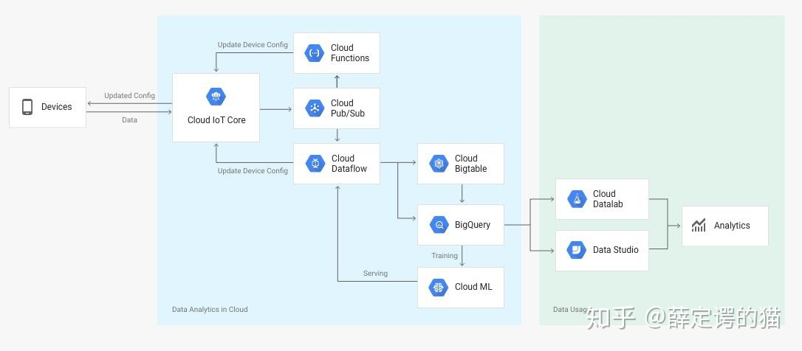

把物联网设备通过某种协议，接入到IoT云平台。IoT云平台对外提供API接口，我们可以通过接口控制物联网设备。谷歌在物联网和AI这一块做的比较成熟，还开发了对应的物联网芯片cloud edge，可以直接植入到散布在全球各地的物联网设备。在云平台一侧，开发大数据分析的模块big query，更加方便第三方厂商对物联网设备的数据进行分析，打造从芯到云的整个产业链。我们目前还处于的初级阶段，第一阶段首先实现物联网设备接入到自研IoT云平台，然后APP调用IoT云平台对外的API接口，控制和收集设备的状态。使用户利用从分布在全球的设备获得的数据，实时发掘业务数据洞见。IoT平台收集的设备数据将发布到订阅和发布系统以进行下游分析。目前支持简单的大数据分析，丰富的报表和信息中心以可视化的方式呈现物联网数据结果。 IaaS层要为IoT PaaS平台提供动态可扩展的网络、计算和存储等资源。初期网络的流量主要是设备到IoT后台服务、app和Iot后台服务之间的交互，所以网络模型相对简单。网络的峰值一般会出现在一天中的晚上某个时刻，这个时候后台服务的压力就比较大，相应的要求更多计算资源。对于存储的话，前期阶段主要是物联网设备的数据和用户的数据，存储量比较少。综合上面的因素，高峰期时对计算的要求比较大，然而网络和存储的要求比较简单。所以选择轻量级的docker+kubernetes能实现高峰期的自动扩容，而且也支持网络自动化和存储持久化。Kubernetes的社区发展情况来看，更加倾向于服务的治理，即PaaS层的编排工具，但是又有非常丰富的插件，可以直接运行在真实的服务器、虚拟机、国内外公有云上。如果公司有丰富的原始技术积累，还是采用定制化自研云平台，平台升级就不会涉及到与社区版本的兼容性。但是国内的大部分公司由于研发实力不够，一般都采用成熟的开源社区项目，随着上线产品的优化，迭代完善使用的开源框架。

### 2.5.5 PaaS和IaaS的共同演进
目前谷歌云IoT业务植入大数据和AI的元素，能够根据用户的物联网设备数据分析出每个用户的习惯等，也提供一些AI的方案供用户选择。随着PaaS层陆续增加大数据和AI等功能，对IaaS的要求也就越来越高。Kubernetes在生产环境上的应用主要是容器编排，在8月份刚刚发布Istio(服务治理)项目生产环境的版本，还没有涉及像IoT等如此细分的生产项目。虽然Kubernetes社区也有AI的孵化项目，但是能不能满足我们的需要，还是要通过实践来验证。Kubernetes提供了非常丰富的网络插件，说到网络一直是云计算领域的痛点和难点。OpenStack也有非常多的网络插件，这些插件也给使用者带来困扰。我到底选择哪个插件，那这个插件在未来会一直持续活跃下去么，还是说在不久的将来会被社区废弃。我们现在服务间的网络模型也非常简单，所以选用的flannel网络插件，所有的容器都在一个大二层里面。流量限速、网络隔离和安全问题等问题社区还在完善，随着我们业务的增长，我们也可以引入SDN等复杂的网络模型。计算的方面的话，由于一个个容器不像虚拟机做到真正的隔离，目前是限制容器对cpu和内存的使用率来控制。如果是公有云的话，可能这样会带来潜在的风险，因为我们没有办法确定用户的镜像会不会利用系统的漏洞危害其他容器，或者独占宿主机导致超负载以至于其他容器不能获取到资源。但是我们目前是私有云的形式，我们每个服务、每个镜像都是安全可追溯的。如果后面有对虚拟机和裸机的要求，我们也可以自己开发对应的插件，或者采用OpenStack+Kubernetes的形式，来管理更复杂的集群。我们的PaaS服务用到了MySql、redis、mogonDB等数据库，还有emq消息队列，这些都是需要持久化存储的。如果服务器发生异常关机，那么要确保服务器启动以后，数据是可以恢复的。Kubernetes提供了ceph、公有云存储等大约20个存储后端，也增加了选型上负担。如果采用公有云提供的稳定的方案得话，可能带来安全和稳定性方面的顾虑。如果采用私有自建云的话，可能需要一定的技术积累。总之，根据业务进行迭代开发，要优于一开始就做大而全的私有云方案。


# 3. Kubernetes 平台上的调度策略
kube-scheduler是 kubernetes 系统的核心组件之一，主要负责整个集群资源的调度功能，根据特定的调度算法和策略，将 Pod 调度到最优的工作节点上面去，从而更加合理、更加充分的利用集群的资源，这也是我们选择使用 kubernetes 一个非常重要的理由。如果一门新的技术不能帮助企业节约成本、提供效率，我相信是很难推进的。

## 3.1  Kubernetes 简介
### 3.1.1 传统软件维护方式
在传统的项目架构中(单体or微服务)，我们一般将项目打包为war或fatJar的方式进行部署。
在部署时，需要人工创建相应的服务器及资源，并搭建项目运行的依赖环境，预估服务需要占用的内存与CPU，同事还要考虑到高可用的部署环境，在不同配置的服务器上部署相应的服务。当服务意外崩溃或者服务器意外宕机时，需要人工处理。总结一下传统部署的不足如下:
依赖服务器环境，需要各服务器资源统一。
无法充分利用服务器等资源，使用率一般仅能达到70%。
无法或很难做到容灾恢复。
需要人工进行服务扩容，修改服务配置。
服务资源散乱(域名，服务器，负载，数据库)，无法做集中管理。
时间消耗较多，增加运维成本。
需要借助第三方工具进行资源监控，较为麻烦。
需要对开发、测试、生产环境进行区别管理。
要想解决以上的问题是相对比较麻烦的，特别是现在的项目多为微服务项目，少则几十，多则上百，极大的增加了运维的难度和成本。
### 3.1.2 Kubernetes是什么
官方文档中描述为：Kubernetes一个用于容器集群的自动化部署、扩容以及运维的开源平台。通过Kubernetes,你可以快速有效地响应用户需求;快速而有预期地部署你的应用;极速地扩展你的应用;无缝对接新应用功能;节省资源，优化硬件资源的使用。为容器编排管理提供了完整的开源方案。
* 容器:我们现在常说的容器一般是指Docker容器，通过容器隔离的特性和宿主机进行解耦，使我们的服务不需要依赖于宿主机而运行，与宿主机互不影响，Docker容器十分轻量。而kubernetes则负责管理服务中所有的Docker容器，创建、运行、重启与删除容器。
* 快速响应 :个人理解为两个方面。一、新增或者修改需求时，可以快速进行部署测试(CICD)；二、kubernetes可以根据不同条件进行动态扩缩容，举个栗子，用户访问量突然由1000人上升到100000人时，现有的服务已经无法支撑，kubernetes会自动将用户服务模块增加更多实例以保证当前的系统访问量。
* 扩展:在快速响应的特点中已经有所提及，这里再补充一点: Kubernetes内部有完善的注册发现机制，当某个服务的实例增加时，kubernetes会自动将其加入服务列表中，免除在传统运维中需要人工维护服务列表的问题。
* 对接新应用:kubernetes是一个通用的容器编排框架，支持不同类型的语言，或者是语言无关的，新增加的应用都会以一个新的对象进行接入。
* 硬件资源 :    这一点我觉得是kubernetess很基本但是非常重要的一个优点了，kubernetes在部署应用时会自动检查各个服务器的cpu与内存使用量，同时会根据服务申请的cpu与内存资源，将服务部署到最合适的服务器。(其实这就是容器调度的核心功能了)

### 3.1.3 Kubernetes 解决了什么问题
#### 3.1.3.1 减少服务环境依赖
kubernetes是使用Docker进行容器管理的，所以天生具备Docker的所有特性，只需要使用相应环境的Docker镜像就可以运行服务，还需要关心宿主机是redhat、centos还是ubuntu，只要在宿主机上安装Docker环境即可，相比传统运维，减少了各种依赖环境的冲突，降低运维成本，也方便整体服务的迁移。

#### 3.1.3.2 服务器资源管理
对于kubernetes来说，是不关心有几台服务器的，每个服务器都是一个资源对象(Node)，kubernetes关心的是这个Node上有多少可用的cpu和内存。例如现在有两台服务器

    server01 (4c16g), 已用(2c7.5G)
    server02 (4c16g), 已用(3c13G)
现在有一个服务ServiceA需要部署，ServiceA申明自己运行需要至少3G内存，这时kubernetes会根据调度策略将其部署到server01上，很明显server01的资源是更加充足的。实际上kubernetes的调度策略要复杂的多，kubernetes会监控整体服务器资源的状态进行调度，而以前的运维方式只能由人工判断资源使用。这里只做简单示例。

各个服务器节点的状态
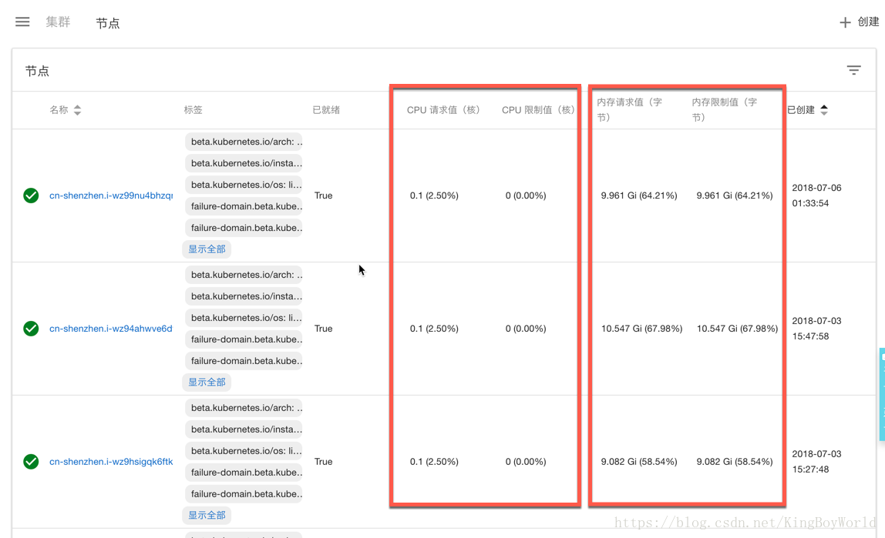
总体集群的资源状态
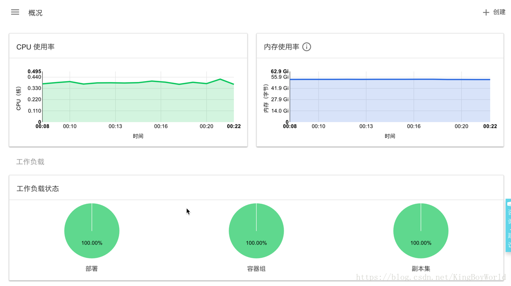

#### 3.1.3.3 服务容灾恢复
说简单点，就是服务挂了之后，能够自动恢复。例如现在有一个ServiceA，运行在server01上，kubernetes会通过内部的kubelet组件监控ServiceA服务进程的状态，一旦发现进程丢失(服务本身挂掉或者整个server01的服务器挂掉)，就会尝试换一台资源充足的服务器重新部署ServiceA并启动，这样就可以确保我们的服务一直是可用状态，而不需要人工维护。

#### 3.1.3.4 硬件资源利用
前面已经说过，kubernetes会根据节点(Node)的CPU与内存资源的可用量对服务进行部署调度，在调度策略中，可以配置不同的调度策略。例如现在有两台服务器：

    server01 (4c16g), 已用(3c7.5G)
    server02 (4c16g), 已用(1c13G)

需要部署两个服务

    serviceA-Java, 申请2G内存，0.5CPU单位
    ServiceB-Nginx, 申请200M内存,申请1CPU单位
这里kubernetes如果讲道理的话，会将ServiceA-Java部署到server01，将serviceB-Nginx部署到server02。这里server01的内存和server02的CPU资源都得到了充分的利用。经过个人实践，相比之前的部署方式，kubernetes节省了很多资源，资源利用是非常高效的。

#### 3.1.3.4 服务资源创建
kubernetes创建服务是非常方便的，分为以下两个方面：

    自有服务
        在kubernetes中，进行项目服务部署是十分方便的，只需要构建好相应的镜像，编写一个yaml文件即可完成服务的部署。

yaml示例
```
apiVersion: apps/v1beta1
kind: Deployment
metadata:
  # 部署的模块名称
  name: phantom-server-admin
  # 需要部署哪个环境
  namespace: develop
spec:
  # 部署的实例数量
  replicas: 1
  template: 
    metadata:
      labels:
        # 给这个部署打个标签，方便之后进行选择
        app: phantom-server-admin
    spec:
      containers:
      # 服务的名称
      - name: phantom-server-admin
        # 服务的镜像
        image: phantom-server-admin:v1
        ports:
        # 服务的端口
        - containerPort: 7006
        resources:
          limits:
            # 该服务需要的内存
            memory: 1000Mi
```
公共基础服务

    kubernetes开源社区中有一个工具叫helm, 类比的话就像是CentOS中的yum，我们可以通过这个工具进行简单快速的安装复杂的应用。阿里云提供了可视化的创建界面，创建十分方便，相比于传统运维需要自己进行基础软件的安装的优点是十分突出的，免去了繁琐的安装过程，服务的稳定性也有了一定的保障。talk is cheap, show you the below images,
应用商店
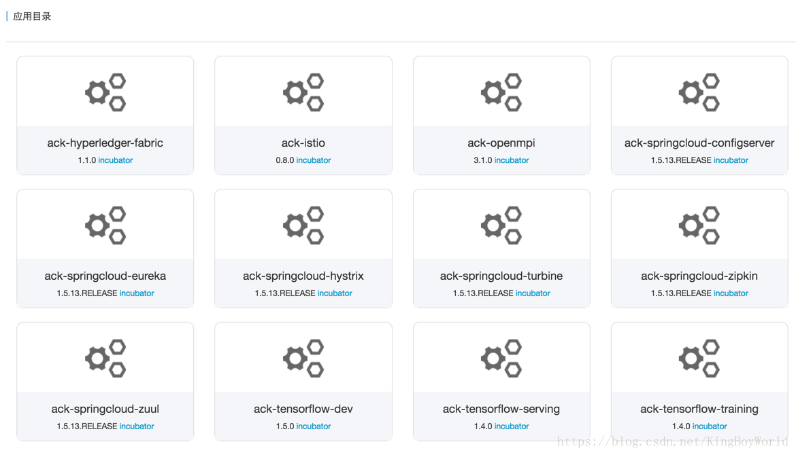
eureka示例
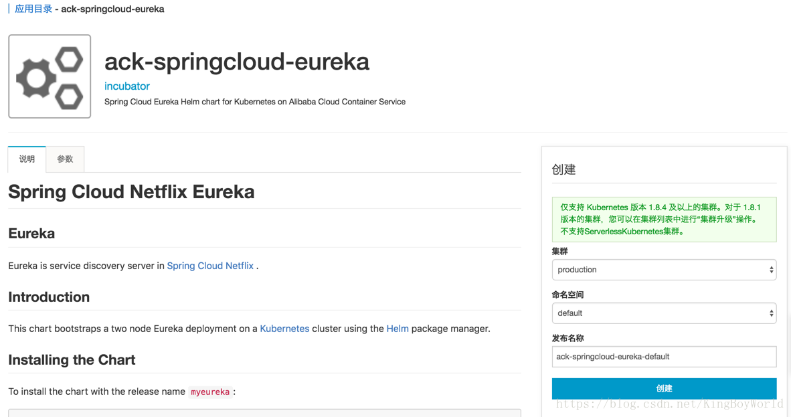

#### 3.1.3.5 可视化管理
在kubernetes中，所有的概念都抽象成不同的对象，而所有的对象都是可以通过图形化界面进行管理和监控的，当然了，也同时提供了命令行客户端kubectl进行管理。

对象创建
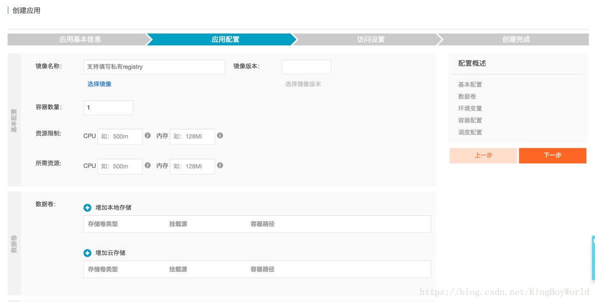
日志监控
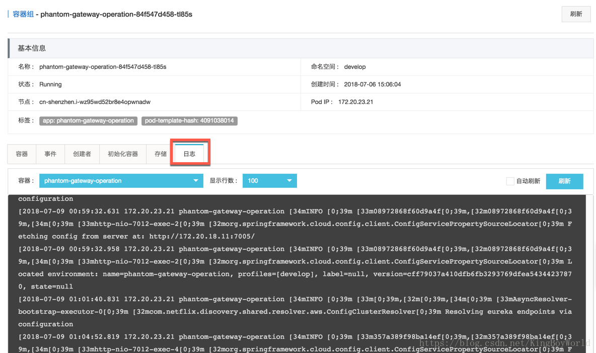
#### 3.1.3.6 服务资源监控
各个节点的使用量监控
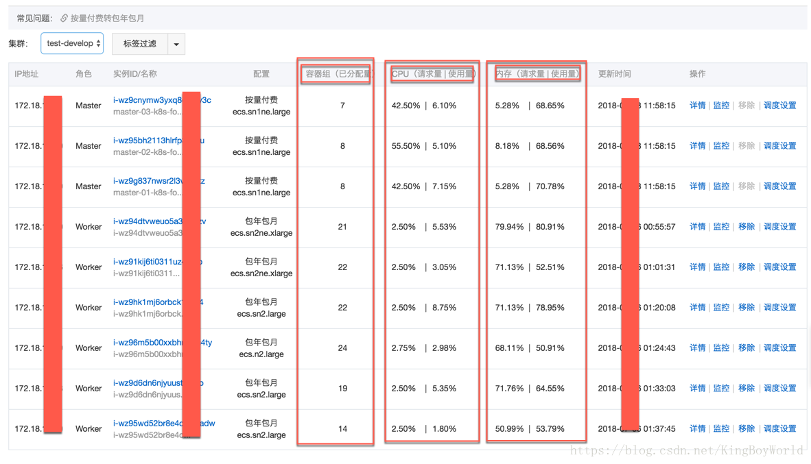
每个服务的使用量监控
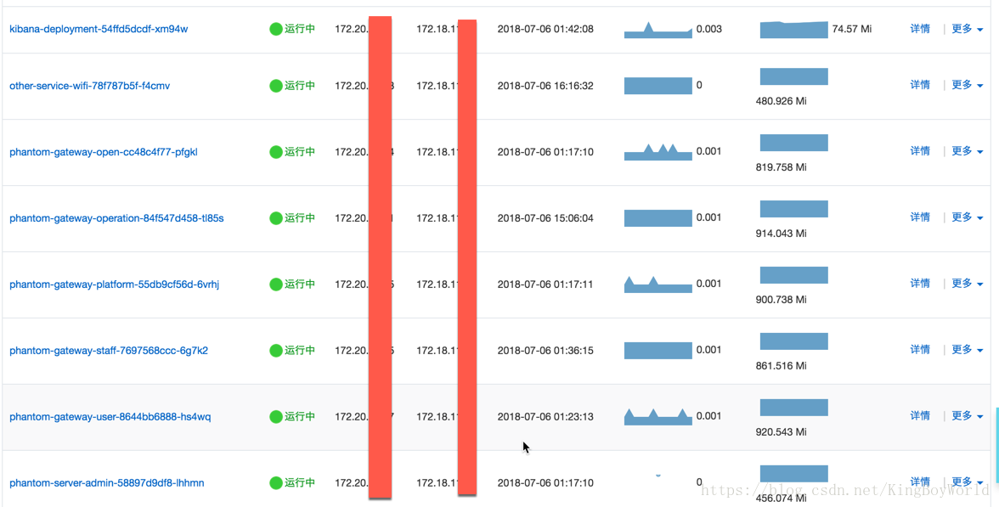

#### 3.1.3.7 资源整合管理
在之前的运维过程中，对各种资源的管理是十分复杂的，想做到统一管理各种资源更是难上加难，从前到后，我们需要对域名、负载均衡、服务实例、存储服务进行逐个配置，配置的细节暂且不说，各个资源的关联关系就错综复杂，非专业运维人员是无法进行统一规划的。

而使用与云服务整合的kubernetes之后，这些问题都迎刃而解。先看下图做简单说明
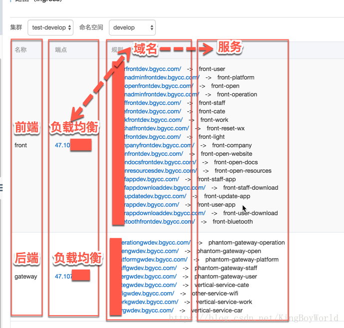
这是阿里kubernetes的路由配置界面，其中将负载均衡设备与域名和对应的服务进行了绑定，可以很直观的表述三者之间的关系，同时易于修改排错。
#### 3.1.3.8 版本管理与滚动升级
版本管理

    kubernetes在部署服务时，会记录部署服务的版本，我们可以很容易的进行上次版本或跨版本回退。

滚动升级
    kubernetes在进行服务升级时，采用的默认策略是先将一部分新的服务启动，确定服务正常后，停止一部分旧服务，进行新老服务的替换，之后再启动一些新的服务，停止一部分旧服务，直到旧服务全部停止，即切换完成。滚动省级的过程中，极大的减少了服务切换的间隔时间。

## 3.2 Kubernetes结构
### 3.2.1 Kubernetes常用相关概念
* 部署 - Deployment
类似于Docker中的镜像Image，也就是容器(Pods)实例的模板，容器实例是根据Deploy创建出来的。在Deployment对象中会写明容器的镜像，容器的版本，容器要部署的数量等信息。
* 容器组 - Pods
Pods是Kubernetes中的最小管理单元，Pods和Docker中的容器可以理解为包含关系，在Pods中可以包含有多个Docker容器，例如有ServiceA和ServiceB,ServiceA高度依赖ServiceB(需要共享主机的相同文件),这时就可以将ServiceA与ServiceB放在同一个Pods中，当做一个整体来管理。如果分开部署当然也可以，不过会小号额外的资源或者产生其他不必要的麻烦。
* 服务 - Service
Service是一个对象，这个对象有自己的IP，也就是ClusterIP,可以理解为就是下层服务的负载均衡。
* 路由 - Ingress
无论是容器组还是Service，外网都是无法直接访问的，Ingress就可以通过一个负载IP与Kubernetes集群内部进行通讯，一般会和Service对象进行配合使用。
* 配置项 - ConfigMap
简单理解为一个管理配置的对象，可以将项目的配置写入到ConfgiMap中，项目中的配置使用相应的变量名就可以读取相应的变量值。

### 3.2.2 Kubernetes结构图
Kubernetes由Master节点和Worker节点组成。master节点是Kubernetes的大脑，而woker节点则是kubernetes中实际运行服务的劳动者。

Master主要由ETCD/Controller Manager/Api Server/Schedular能成，
    ETCD
        主要负责存储各个woker节点的状态和其它相关数据，可以理解为kubernetes的数据库。
    Controller Manager
        负责维护集群的状态，比如故障检测、自动扩展、滚动更新等
    Scheduler
        负责资源的调度，按照预定的调度策略将Pod调度到相应的机器上

Worker主要由kubelet和kube-proxy组成，一般还会安装kube-dns组件。

    kubelet
        负责维护容器的生命周期，同时也负责Volume（CVI）和网络（CNI）的管理；
    kube-proxy
        负责为Service提供cluster内部的服务发现和负载均衡；
    kube-dns
        负责为整个集群提供DNS服务，通过Service名称访问相应的服务
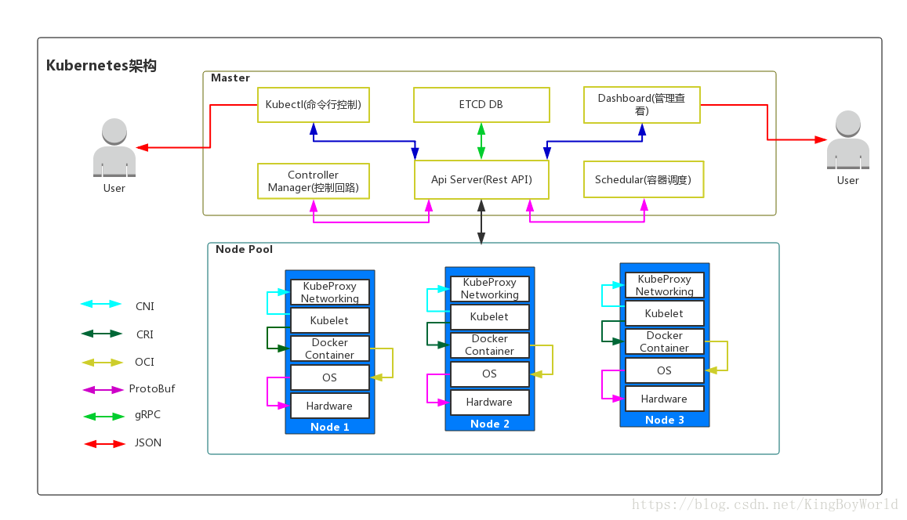


## 3.3 调度过程和原理
默认情况下，kube-scheduler 提供的默认调度器能够满足我们绝大多数的要求，我们前面和大家接触的示例也基本上用的默认的策略，都可以保证我们的 Pod 可以被分配到资源充足的节点上运行。但是在实际的线上项目中，可能我们自己会比 kubernetes 更加了解我们自己的应用，比如我们希望一个 Pod 只能运行在特定的几个节点上，或者这几个节点只能用来运行特定类型的应用，这就需要我们的调度器能够可控。
kube-scheduler 是 kubernetes 的调度器，它的主要作用就是根据特定的调度算法和调度策略将 Pod 调度到合适的 Node 节点上去，是一个独立的二进制程序，启动之后会一直监听 API Server，获取到 PodSpec.NodeName 为空的 Pod，对每个 Pod 都会创建一个 binding。
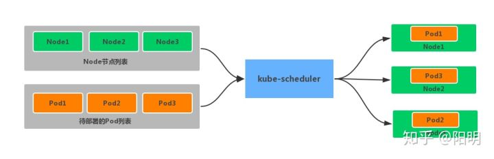

这个过程在我们看来好像比较简单，但在实际的生产环境中，需要考虑的问题就有很多了：

    如何保证全部的节点调度的公平性？
    要知道并不是说有节点资源配置都是一样的如何保证每个节点都能被分配资源？
    集群资源如何能够被高效利用？集群资源如何才能被最大化使用？
    如何保证 Pod 调度的性能和效率？
    用户是否可以根据自己的实际需求定制自己的调度策略？
考虑到实际环境中的各种复杂情况，kubernetes 的调度器采用插件化的形式实现，可以方便用户进行定制或者二次开发，我们可以自定义一个调度器并以插件形式和 kubernetes 进行集成。

kubernetes 调度器的源码位于 kubernetes/pkg/scheduler 中，大体的代码目录结构如下所示：(不同的版本目录结构可能不太一样)
```
kubernetes/pkg/scheduler
-- scheduler.go         //调度相关的具体实现
|-- algorithm
|   |-- predicates      //节点筛选策略
|   |-- priorities      //节点打分策略
|-- algorithmprovider
|   |-- defaults         //定义默认的调度器
```
其中 Scheduler 创建和运行的核心程序，对应的代码在 pkg/scheduler/scheduler.go，如果要查看kube-scheduler的入口程序，对应的代码在 cmd/kube-scheduler/scheduler.go。

调度主要分为以下几个部分：
    首先是预选过程，过滤掉不满足条件的节点，这个过程称为Predicates
    然后是优选过程，对通过的节点按照优先级排序，称之为Priorities
    最后从中选择优先级最高的节点，如果中间任何一步骤有错误，就直接返回错误

最后从中选择优先级最高的节点，如果中间任何一步骤有错误，就直接返回错误
Predicates阶段首先遍历全部节点，过滤掉不满足条件的节点，属于强制性规则，这一阶段输出的所有满足要求的 Node 将被记录并作为第二阶段的输入，如果所有的节点都不满足条件，那么 Pod 将会一直处于 Pending 状态，直到有节点满足条件，在这期间调度器会不断的重试。
所以我们在部署应用的时候，如果发现有 Pod 一直处于 Pending 状态，那么就是没有满足调度条件的节点，这个时候可以去检查下节点资源是否可用。
Priorities阶段即再次对节点进行筛选，如果有多个节点都满足条件的话，那么系统会按照节点的优先级(priorites)大小对节点进行排序，最后选择优先级最高的节点来部署 Pod 应用。
下面是调度过程的简单示意图： 
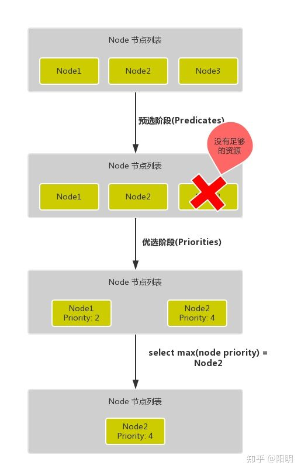
更详细的流程是这样的：

    首先，客户端通过 API Server 的 REST API 或者 kubectl 工具创建 Pod 资源
    API Server 收到用户请求后，存储相关数据到 etcd 数据库中调度器监听 API Server 查看为调度(bind)的 Pod 列表，循环遍历地为每个 Pod 尝试分配节点，这个分配过程就是我们上面提到的两个阶段：
        预选阶段(Predicates)，过滤节点，调度器用一组规则过滤掉不符合要求的 Node 节点，比如 Pod 设置了资源的 request，那么可用资源比 Pod 需要的资源少的主机显然就会被过滤掉
    优选阶段(Priorities)，为节点的优先级打分，将上一阶段过滤出来的 Node 列表进行打分，调度器会考虑一些整体的优化策略，比如把 Deployment 控制的多个 Pod 副本分布到不同的主机上，使用最低负载的主机等等策略


    经过上面的阶段过滤后选择打分最高的 Node 节点和 Pod 进行 binding 操作，然后将结果存储到 etcd 中
    最后被选择出来的 Node 节点对应的 kubelet 去执行创建 Pod 的相关操作

其中Predicates过滤有一系列的算法可以使用，我们这里简单列举几个：
    PodFitsResources：节点上剩余的资源是否大于 Pod 请求的资源
    PodFitsHost：如果 Pod 指定了 NodeName，检查节点名称是否和 NodeName 匹配
    PodFitsHostPorts：节点上已经使用的 port 是否和 Pod 申请的 port 冲突
    PodSelectorMatches：过滤掉和 Pod 指定的 label 不匹配的节点
    NoDiskConflict：已经 mount 的 volume 和 Pod 指定的 volume 不冲突，除非它们都是只读的
    CheckNodeDiskPressure：检查节点磁盘空间是否符合要求
    CheckNodeMemoryPressure：检查节点内存是否够用

除了这些过滤算法之外，还有一些其他的算法，更多更详细的我们可以查看源码文件：http://k8s.io/kubernetes/pkg/scheduler/algorithm/predicates/predicates.go。

而Priorities优先级是由一系列键值对组成的，键是该优先级的名称，值是它的权重值，同样，我们这里给大家列举几个具有代表性的选项：
    LeastRequestedPriority：通过计算 CPU 和内存的使用率来决定权重，使用率越低权重越高，当然正常肯定也是资源是使用率越低权重越高，能给别的 Pod 运行的可能性就越大
    SelectorSpreadPriority：为了更好的高可用，对同属于一个 Deployment 或者 RC 下面的多个 Pod 副本，尽量调度到多个不同的节点上，当一个 Pod 被调度的时候，会先去查找该 Pod 对应的 controller，然后查看该 controller 下面的已存在的 Pod，运行 Pod 越少的节点权重越高
    ImageLocalityPriority：就是如果在某个节点上已经有要使用的镜像节点了，镜像总大小值越大，权重就越高
    NodeAffinityPriority：这个就是根据节点的亲和性来计算一个权重值，后面我们会详细讲解亲和性的使用方法

除了这些策略之外，还有很多其他的策略，同样我们可以查看源码文件：http://k8s.io/kubernetes/pkg/scheduler/algorithm/priorities/ 了解更多信息。每一个优先级函数会返回一个0-10的分数，分数越高表示节点越优，同时每一个函数也会对应一个表示权重的值。最终主机的得分用以下公式计算得出：
```
finalScoreNode = (weight1 * priorityFunc1) + (weight2 * priorityFunc2) + … + (weightn * priorityFuncn)
```
## 3.4 自定义调度
上面就是 kube-scheduler 默认调度的基本流程，除了使用默认的调度器之外，我们也可以自定义调度策略。
kube-scheduler在启动的时候可以通过 --policy-config-file参数来指定调度策略文件，我们可以根据我们自己的需要来组装Predicates和Priority函数。选择不同的过滤函数和优先级函数、控制优先级函数的权重、调整过滤函数的顺序都会影响调度过程。

下面是官方的 Policy 文件示例：
```
{
    "kind" : "Policy",
    "apiVersion" : "v1",
    "predicates" : [
        {"name" : "PodFitsHostPorts"},
        {"name" : "PodFitsResources"},
        {"name" : "NoDiskConflict"},
        {"name" : "NoVolumeZoneConflict"},
        {"name" : "MatchNodeSelector"},
        {"name" : "HostName"}
    ],
    "priorities" : [
        {"name" : "LeastRequestedPriority", "weight" : 1},
        {"name" : "BalancedResourceAllocation", "weight" : 1},
        {"name" : "ServiceSpreadingPriority", "weight" : 1},
        {"name" : "EqualPriority", "weight" : 1}
    ]
}
```

## 3.5 多调度器
如果默认的调度器不满足要求，还可以部署自定义的调度器。并且，在整个集群中还可以同时运行多个调度器实例，通过podSpec.schedulerName 来选择使用哪一个调度器（默认使用内置的调度器）。
```
apiVersion: v1
kind: Pod
metadata:
  name: nginx
  labels:
    app: nginx
spec:
  schedulerName: my-scheduler  # 选择使用自定义调度器 my-scheduler
  containers:
  - name: nginx
    image: nginx:1.10
```
要开发我们自己的调度器也是比较容易的，比如我们这里的 my-scheduler:

首先需要通过指定的 API 获取节点和 Pod
然后选择phase=Pending和schedulerName=my-scheduler的pod
计算每个 Pod 需要放置的位置之后，调度程序将创建一个Binding
对象然后根据我们自定义的调度器的算法计算出最适合的目标节点

### 3.5.1 优先级调度
与前面所讲的调度优选策略中的优先级（Priorities）不同，前面所讲的优先级指的是节点优先级，而我们这里所说的优先级 pod priority 指的是 Pod 的优先级，高优先级的 Pod 会优先被调度，或者在资源不足低情况牺牲低优先级的 Pod，以便于重要的 Pod 能够得到资源部署。

要定义 Pod 优先级，就需要先定义PriorityClass对象，该对象没有 Namespace 的限制：
```
apiVersion: v1
kind: PriorityClass
metadata:
  name: high-priority
value: 1000000
globalDefault: false
description: "This priority class should be used for XYZ service pods only."
```
其中：
    value为 32 位整数的优先级，该值越大，优先级越高
    globalDefault用于未配置 PriorityClassName 的 Pod，整个集群中应该只有一个PriorityClass将其设置为 true

然后通过在 Pod 的spec.priorityClassName中指定已定义的PriorityClass名称即可：
```
apiVersion: v1
kind: Pod
metadata:
  name: nginx
  labels:
    app: nginx
spec:
  containers:
  - name: nginx
    image: nginx
    imagePullPolicy: IfNotPresent
  priorityClassName: high-priority
```
另外一个值得注意的是当节点没有足够的资源供调度器调度 Pod，导致 Pod 处于 pending 时，抢占（preemption）逻辑就会被触发。Preemption会尝试从一个节点删除低优先级的 Pod，从而释放资源使高优先级的 Pod 得到节点资源进行部署。

现在我们通过下面的图再去回顾下 kubernetes 的调度过程是不是就清晰很多了： 


## 3.6 自定义资源控制器
### 3.6.1 自定义资源（CRD）
我们知道，Kubernetes 中一切都可视为资源，它提供了很多默认资源类型，如 Pod、Deployment、Service、Volume等一系列资源，能够满足大多数日常系统部署和管理的需求。但是，在一些特殊的需求场景下，这些现有资源类型就满足不了，那么这些就可以抽象为 Kubernetes 的自定义资源，在 Kubernetes 1.7 之后增加了对 CRD 自定义资源二次开发能力来扩展 Kubernetes API，通过 CRD 我们可以向 Kubernetes API 中增加新资源类型，而不需要修改 Kubernetes 源码或创建自定义的 API server，该功能大大提高了 Kubernetes 的扩展能力。
在集群中使用GPU进行调度，需要根据自身需求自定义一组资源。比如，我们想让Kubernetes识别Kind为Foo的对象，那么必须先创建一个kind为Foo的CustomerResourceDefinition（CRD缩写）对象。
```
apiVersion: samplecontroller.k8s.io/v1alpha1
kind: Foo
metadata:
  name: example-foo
spec:
  deploymentName: example-foo
  replicas: 1
```
```
apiVersion: apiextensions.k8s.io/v1beta1
kind: CustomResourceDefinition
metadata:
  name: foos.samplecontroller.k8s.io
spec:
  group: samplecontroller.k8s.io
  version: v1alpha1
  names:
    kind: Foo
    plural: foos
  scope: Namespaced
```
### 3.6.2 自定义资源控制器
Kubernetes 中运行了一系列控制器来确保集群的当前状态与期望状态保持一致，它们就是 Kubernetes 的大脑。例如，ReplicaSet 控制器负责维护集群中运行的 Pod 数量；Node 控制器负责监控节点的状态，并在节点出现故障时及时做出响应。总而言之，在 Kubernetes 中，每个控制器只负责某种类型的特定资源。
上面我们定义了一种Kind为Foo的资源对象并且Kubernetes能识别这种对象，但是Kind中自定义的deploymentName、replicas自定义字段并不能根据我们的需求进行一些逻辑操作。这时候我们可以根据我们自定义的资源对象编写一个对应的逻辑控制器来维护自定义资源的状态。GUP调度的状态机维护可以通过该控制器来实现。

如下图所示，是一个控制器的结构图，首先通过informer不断的从APIServer中监听CRD对象，Infomer会将该对象存储在本地Key-Value存储中，控制器中有增删改的回调函数，当发现对该对象进行增删该操作时，会将该对象key值入队Workerqueue，然后Worker根据出队的Key往本地存储中获取存储对象的Value，并进行一些列逻辑操作。对CRD对象的修改，会通过Clients组件反馈到Kubernetes 的APIServer组件中，并完成修改对象的操作。
该图中，红色部分是需要开发人员自己完成，其余的操作都封装在Kubernetes提供的client-go组件中。
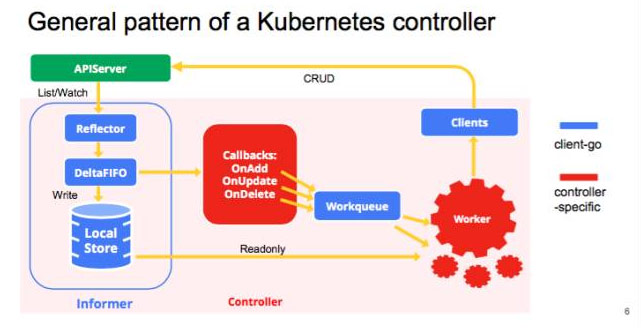


# 4 针对GPU资源调度
## 4.1 GPU 资源的特点
### 4.1.1 GPU和CPU区别
CPU和GPU之所以大不相同，是由于其设计目标的不同，它们分别针对了两种不同的应用场景。CPU需要很强的通用性来处理各种不同的数据类型，同时又要逻辑判断又会引入大量的分支跳转和中断的处理。这些都使得CPU的内部结构异常复杂。而GPU面对的则是类型高度统一的、相互无依赖的大规模数据和不需要被打断的纯净的计算环境。
于是CPU和GPU就呈现出非常不同的架构（示意图）：
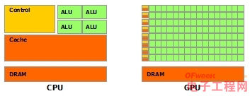
图片来自nVidia CUDA文档。其中绿色的是计算单元，橙红色的是存储单元，橙黄色的是控制单元。GPU采用了数量众多的计算单元和超长的流水线，但只有非常简单的控制逻辑并省去了Cache。而CPU不仅被Cache占据了大量空间，而且还有有复杂的控制逻辑和诸多优化电路，相比之下计算能力只是CPU很小的一部分
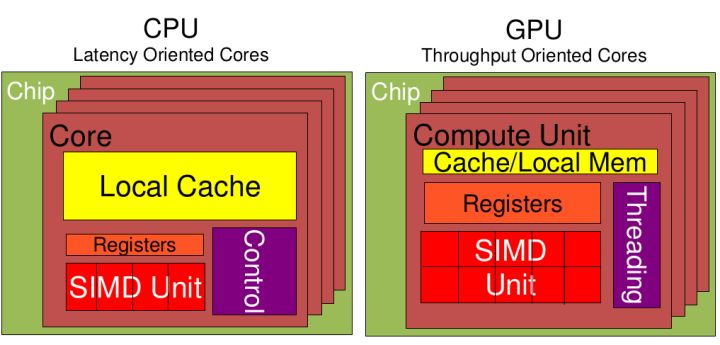
从上图可以看出：Cache, local memory： CPU > GPU Threads(线程数): GPU > CPURegisters: GPU > CPU  多寄存器可以支持非常多的Thread,thread需要用到register,thread数目大，register也必须得跟着很大才行。SIMD Unit(单指令多数据流,以同步方式，在同一时间内执行同一条指令): GPU > CPU。 CPU 基于低延时的设计：
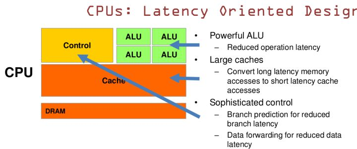
CPU有强大的ALU（算术运算单元）,它可以在很少的时钟周期内完成算术计算。当今的CPU可以达到64bit 双精度。执行双精度浮点源算的加法和乘法只需要1～3个时钟周期。CPU的时钟周期的频率是非常高的，达到1.532～3gigahertz(千兆HZ, 10的9次方).大的缓存也可以降低延时。保存很多的数据放在缓存里面，当需要访问的这些数据，只要在之前访问过的，如今直接在缓存里面取即可。复杂的逻辑控制单元。当程序含有多个分支的时候，它通过提供分支预测的能力来降低延时。数据转发。 当一些指令依赖前面的指令结果时，数据转发的逻辑控制单元决定这些指令在pipeline中的位置并且尽可能快的转发一个指令的结果给后续的指令。这些动作需要很多的对比电路单元和转发电路单元。
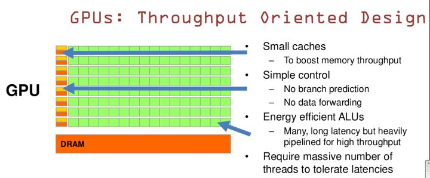


GPU是基于大的吞吐量设计。GPU的特点是有很多的ALU和很少的cache. 缓存的目的不是保存后面需要访问的数据的，这点和CPU不同，而是为thread提高服务的。如果有很多线程需要访问同一个相同的数据，缓存会合并这些访问，然后再去访问dram（因为需要访问的数据保存在dram中而不是cache里面），获取数据后cache会转发这个数据给对应的线程，这个时候是数据转发的角色。但是由于需要访问dram，自然会带来延时的问题。GPU的控制单元（左边黄色区域块）可以把多个的访问合并成少的访问。GPU的虽然有dram延时，却有非常多的ALU和非常多的thread. 为啦平衡内存延时的问题，我们可以中充分利用多的ALU的特性达到一个非常大的吞吐量的效果。尽可能多的分配多的Threads.通常来看GPU ALU会有非常重的pipeline就是因为这样。所以与CPU擅长逻辑控制，串行的运算。和通用类型数据运算不同，GPU擅长的是大规模并发计算，这也正是密码破解等所需要的。所以GPU除了图像处理，也越来越多的参与到计算当中来。GPU的工作大部分就是这样，计算量大，但没什么技术含量，而且要重复很多很多次。就像你有个工作需要算几亿次一百以内加减乘除一样，最好的办法就是雇上几十个小学生一起算，一人算一部分，反正这些计算也没什么技术含量，纯粹体力活而已。而CPU就像老教授，积分微分都会算，就是工资高，一个老教授资顶二十个小学生，你要是富士康你雇哪个？GPU就是这样，用很多简单的计算单元去完成大量的计算任务，纯粹的人海战术。这种策略基于一个前提，就是小学生A和小学生B的工作没有什么依赖性，是互相独立的。很多涉及到大量计算的问题基本都有这种特性，比如你说的破解密码，挖矿和很多图形学的计算。这些计算可以分解为多个相同的简单小任务，每个任务就可以分给一个小学生去做。但还有一些任务涉及到“流”的问题。比如你去相亲，双方看着顺眼才能继续发展。总不能你这边还没见面呢，那边找人把证都给领了。这种比较复杂的问题都是CPU来做的。　　总而言之，CPU和GPU因为最初用来处理的任务就不同，所以设计上有不小的区别。而某些任务和GPU最初用来解决的问题比较相似，所以用GPU来算了。GPU的运算速度取决于雇了多少小学生，CPU的运算速度取决于请了多么厉害的教授。教授处理复杂任务的能力是碾压小学生的，但是对于没那么复杂的任务，还是顶不住人多。当然现在的GPU也能做一些稍微复杂的工作了，相当于升级成初中生高中生的水平。但还需要CPU来把数据喂到嘴边才能开始干活，究竟还是靠CPU来管的。什么类型的程序适合在GPU上运行？　　（1）计算密集型的程序。所谓计算密集型(Compute-intensive)的程序，就是其大部分运行时间花在了寄存器运算上，寄存器的速度和处理器的速度相当，从寄存器读写数据几乎没有延时。可以做一下对比，读内存的延迟大概是几百个时钟周期；读硬盘的速度就不说了，即便是SSD, 也实在是太慢了。　　（2）易于并行的程序。GPU其实是一种SIMD(Single Instruction Multiple Data)架构， 他有成百上千个核，每一个核在同一时间最好能做同样的事情。

### 4.1.2 GPU 市场
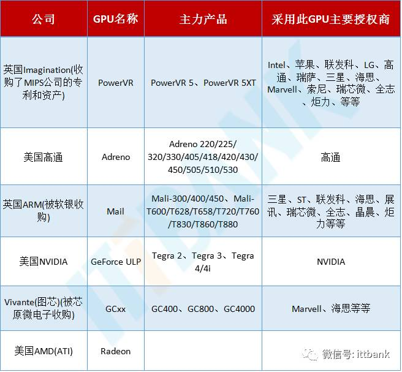
#### 4.1.2.1 Imagination公司的PowerVR
Imagination技术公司并不介入ARM处理器生产，他们专注于是移动GPU技术授权，因为专业所以强大，Imagination绝对是移动平台GPU授权的老大，即便是Intel的Atom处理器及桌面的GMA 500也使用了PwerVR系列GPU核心，他们的触角伸得很广，并不局限于ARM阵营。

Imagination也是一家英国公司，早前还有个部门VideoLogic，在3D加速卡方兴未艾的那个年代，VideoLogic也曾参与了Voodoo、NVIDIA、ATI等公司激战3D加速卡的战役，可惜最终存活的只有NVIDIA和ATI（AMD），不过失之东隅收之桑榆，Imagination的移动GPU技术部门PwerVR反倒有所收获，在移动市场上他们又可以俯视NVIDIA了。

Imagination公司的授权伙伴主要有Intel、苹果、联发科、LG、高通、瑞萨、三星、海思、Marvell、索尼等等，几乎都是大腕，其中Intel和苹果还是Imagination公司的大股东之一。
#### 4.1.2.2 高通的Adreno
作为屈指可数（如果不是唯一一个）可以自己改进ARM指令的移动处理器厂商，说高通是安卓阵营移动处理器一哥估计没人会反对，再加上高通的3G技术及基带上的优势，高通处理器绝对是近年来最热门的选择之一，顺带着也把高通的Adreno图形核心带火了。

跟ARM亲生的儿子Mali不同，高通的Adreno其实是领养的，Adreno原本是ATI旗下的移动GPU部门，当时叫做Imageon，主要为当时的掌上平台提供图形核心，2006年AMD收购了ATI,Imageon部分也进入了AMD公司。收购ATI之后AMD就进行了改组，Imageon部分很不幸地成为多余资产，最终在2008年末被高通以区区6500万美元的代价买走，现在就是高通的Adreno图形部门了。（不知道AMD看到现在的情况是否会后悔？）
#### 4.1.2.3 ARM公司的Mali
RM公司不仅提供ARM处理器授权，他们也有一整套GPU授权方案——Mali。由于亲生的血缘关系，Mali在好爸爸ARM的帮助下也攻城掠地，很多不具备独立开发GPU技术的芯片供应商都直接使用了ARM处理器+Mali GPU的设计，比如三星、瑞芯微、展讯、意法半导体、全志等，其中三星和全志还是出货量大户，所以Mali GPU的份额和出货量可不低。

说到Mali的历史，ARM原本也是没有GPU授权的，此前他们也是使用Imagination的GPU核心，Mali其实是源于2006年收购的一家挪威特隆赫姆地区的移动GPU芯片厂商Falanx，ARM公司的Mali GPU开发中心也就落户在哪里，现在Mali已经变成了ARM的亲儿子了。

#### 4.1.2.4 NVIDIA(主要是PC市场，移动市场也有) 
现在最大的独立显卡生产销售商。

NVIDIA也同样销售固化在主板上的集成显卡，这些显卡随着主板一起发售，但是由于AMD兼并ATI后自身主板芯片能力提高，NV主板如日中天的景象已经失去了半壁江山。

#### 4.1.2.5 Vivante的GCxx
与PowerVR、Mali、Adreno等明星相比，Vivante公司的GC系列GPU核心就不太为人熟知了，就连市场份额比它少的Tegra系列都比Vivante知名。去年让Vivante露一大脸的是华为旗下的海思K3V2，这颗号称“世界最快四核”的移动处理器在华为去年的Ascend D1四核、荣耀2四核以及今年初的Ascend D2、6.1寸超大屏的Mate上全面应用，其16核GPU实际上就源于Vivante的GC系列GPU。

Vivante其实还是挺有资本的，创立于2004年，创始人好像还是个华裔，他们专注于移动GPU市场，2010年的时候就有超过40家授权单位，主要客户有Marvell、飞思卡尔等，很多人不知道的是国内的瑞芯微电子的RK2918以及自主知识产权的国产明星“龙芯-2H”使用的也是Vivante的GPU核心。

#### 4.1.2.6 AMD(ATI)（主要PC市场）
世界上第二大的独立显卡生产销售商，他的前身就是ATI。

他的显卡主要就是大家熟悉的HD系列。由于AMD兼并ATI后，其主板市场迅速扩大，已经夺取了NVIDIA在AMD处理器主板的半壁江山。

就发售量和发售盈利方面，AMD显卡方面仍然略输于NVIDIA,不过两者不相伯仲。
#### 4.1.2.7 Intel（主要是PC市场）
Intel不但是世界上最大的CPU生产销售商，也是世界最大的GPU生产销售商。

Intel的GPU在现在完全是集成显卡，用于Intel的主板和Intel的笔记本。

#### 4.1.2.8 GPU市场份额
Jon Peddie Research (JPR)是一家从事市场研究和管理咨询的美国企业。 该公司长期研究图形处理器行业，一直关注Nvidia和AMD两大巨头的动态。
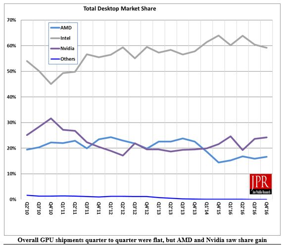
台式机GPU市场份额（Q2'10-Q4'16）
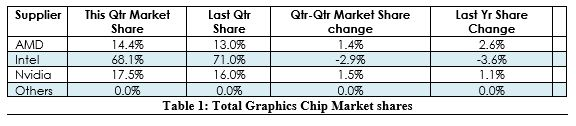
GPU市场份额（Q4'16）
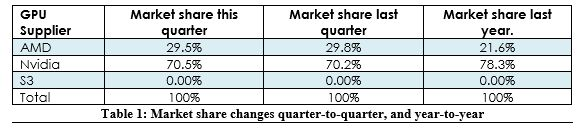
AIB市场份额（Q4'16）
现时有许多公司生产绘图芯片，如Intel、NVIDIA和AMD都是目前台式机图形处理器市场的领导者，分别拥有68.1%、17.5%和14.4%的市场占有率。[5]然而，这些数字包括英特尔的低成本，低性能集成图像处理器。扣除这些数字，NVIDIA和AMD控制将近100%的市场占有率。[6]手机、平板电脑等移动设备方面，PowerVR与高通等公司占有较高市占率。另外，硅统科技、威盛电子/S3 Graphics和Matrox等公司过去也曾生产图像芯片。更多关于英伟达（NVIDIA）和超威半导体（AMD）的图形处理器产品介绍请看《英伟达图形处理器简介》和《AMD图形处理器简介》。

## 4.2 NVIDIA 资源的特殊性
### 4.2.1 通信性能
NCCL是Nvidia Collective multi-GPU Communication Library的简称，它是一个实现多GPU的collective communication通信（all-gather, reduce, broadcast）库，Nvidia做了很多优化，以在PCIe、Nvlink、InfiniBand上实现较高的通信速度。下面分别从以下几个方面来介绍NCCL的特点，包括基本的communication primitive、ring-base collectives、NCCL在单机多卡上以及多机多卡实现、最后分享实际使用NCCL的一些经验。
（1）communication primitive
并行任务的通信一般可以分为Point-to-point communication和Collective communication。P2P通信这种模式只有一个sender和一个receiver，实现起来比较简单。第二种Collective communication包含多个sender多个receiver，一般的通信原语包括broadcast，gather,all-gather,scatter,reduce,all-reduce,reduce-scatter,all-to-all等。简单介绍几个常用的操作：Reduce：从多个sender那里接收数据，最终combine到一个节点上。
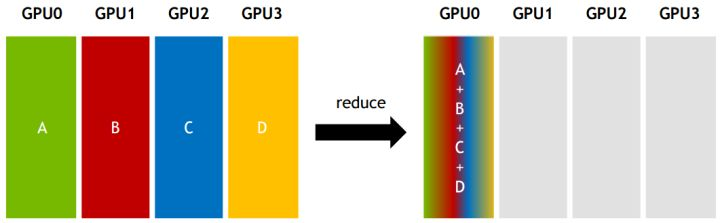
All-reduce：从多个sender那里接收数据，最终combine到每一个节点上。
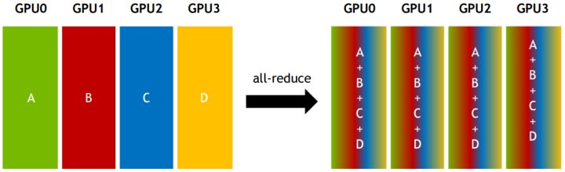
而传统Collective communication假设通信节点组成的topology是一颗fat tree，如下图所示，这样通信效率最高。但实际的通信topology可能比较复杂，并不是一个fat tree。因此一般用ring-based Collective communication。
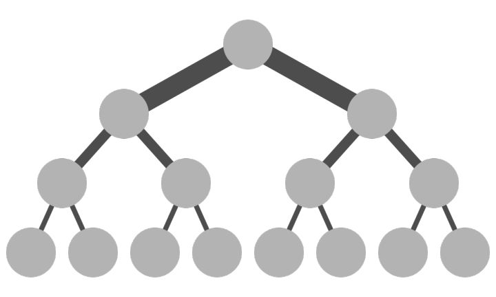
(2) ring-base collectives
ring-base collectives将所有的通信节点通过首尾连接形成一个单向环，数据在环上依次传输。以broadcast为例， 假设有4个GPU，GPU0为sender将信息发送给剩下的GPU，按照环的方式依次传输，GPU0-->GPU1-->GPU2-->GPU3，若数据量为N，带宽为B，整个传输时间为（K-1）N/B。时间随着节点数线性增长，不是很高效。
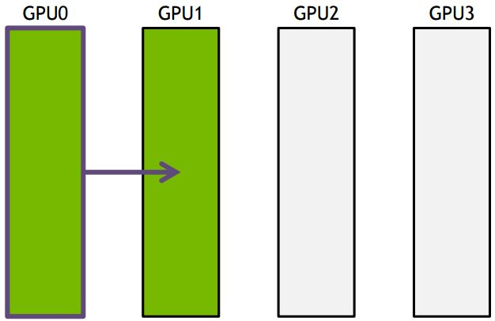
下面把要传输的数据分成S份，每次只传N/S的数据量，传输过程如下所示：
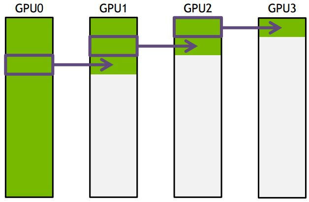
GPU1接收到GPU0的一份数据后，也接着传到环的下个节点，这样以此类推，最后花的时间为S*(N/S/B) + (k-2)*(N/S/B) = N(S+K-2)/(SB) --> N/B，条件是S远大于K，即数据的份数大于节点数，这个很容易满足。所以通信时间不随节点数的增加而增加，只和数据总量以及带宽有关。其它通信操作比如reduce、gather以此类推。那么在以GPU为通信节点的场景下，怎么构建通信环呢？如下图所示：单机4卡通过同一个PCIe switch挂载在一棵CPU的场景：
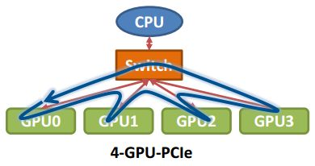
单机8卡通过两个CPU下不同的PCIe switch挂载的场景：
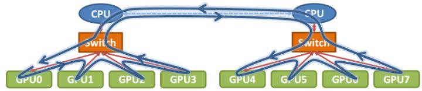
（3）NCCL实现
NCCL实现成CUDA C++ kernels，包含3种primitive operations： Copy，Reduce，ReduceAndCopy。目前NCCL 1.0版本只支持单机多卡，卡之间通过PCIe、NVlink、GPU Direct P2P来通信。NCCL 2.0会支持多机多卡，多机间通过Sockets (Ethernet)或者InfiniBand with GPU Direct RDMA通信。下图所示，单机内多卡通过PCIe以及CPU socket通信，多机通过InfiniBand通信。
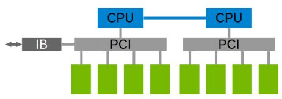
同样，在多机多卡内部，也要构成一个通信环
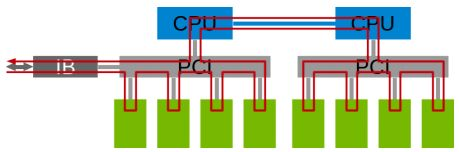
下面是单机 4卡（Maxwel GPU）上各个操作随着通信量增加的带宽速度变化，可以看到带宽上限能达到10GB/s，接近PCIe的带宽。
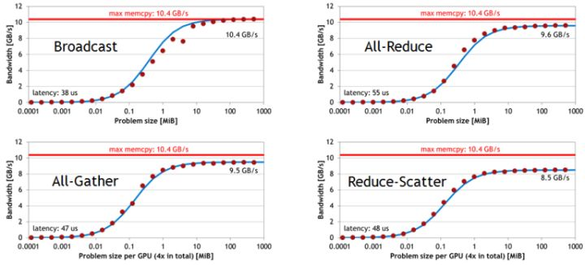
下图是Allreduce在单机不同架构下的速度比较：
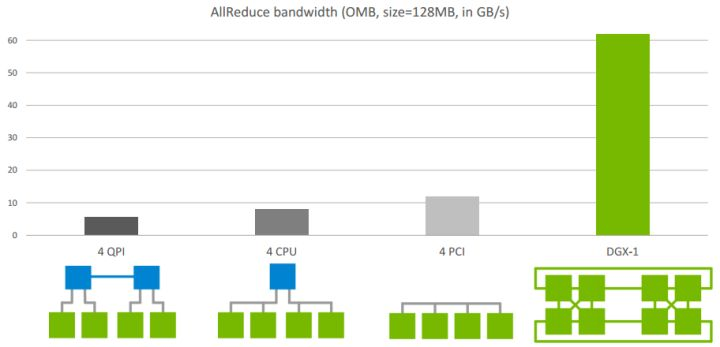
先不看DGX-1架构，这是Nvidia推出的深度学习平台，带宽能达到60GB/s。前面三个是单机多卡典型的三种连接方式，第三种是四张卡都在一个PCIe switch上，所以带宽较高，能达到>10GB/s PCIe的带宽大小，第二种是两个GPU通过switch相连后再经过CPU连接，速度会稍微低一点，第一种是两个GPU通过CPU然后通过QPI和另一个CPU上的两块卡相连，因此速度最慢，但也能达到>5GB/s。下图是Allreduce多机下的速度表现，左图两机8卡，机内PCIe，机间InfiniBand能达到>10GB/s的速度，InfiniBand基本上能达到机内的通信速度。
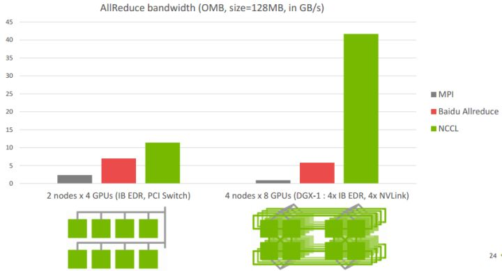
下图是NCCL在CNTK ResNet50上的scalability，32卡基本能达到线性加速比。
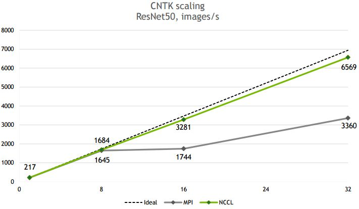
（4）我们的实测经验
首先，在一台K40 GPU的机器上测试了GPU的连接拓扑，如下：
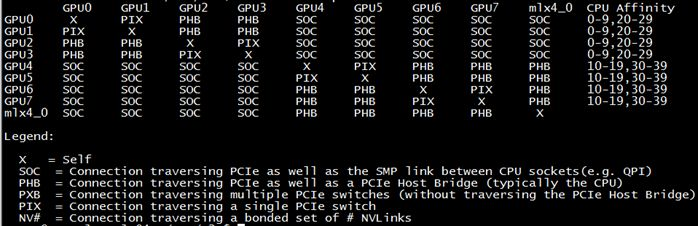
可以看到前四卡和后四卡分别通过不同的CPU组连接，GPU0和GPU1直接通过PCIe switch相连，然后经过CPU与GPU2和GPU3相连。下面是测试PCIe的带宽，可以看到GPU0和GU1通信能达到10.59GB/s，GPU0同GPU2~3通信由于要经过CPU，速度稍慢，和GPU4~7的通信需要经过QPI，所以又慢了一点，但也能达到9.15GB/s。
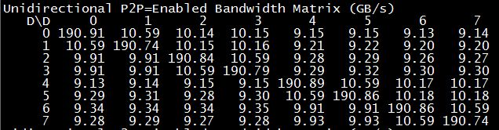

而通过NVlink连接的GPU通信速度能达到35GB/s：
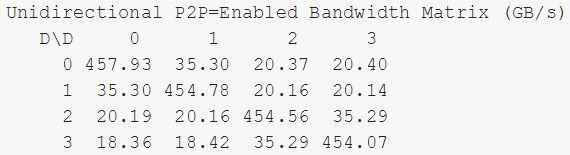
NCCL在不同的深度学习框架（CNTK/Tensorflow/Torch/Theano/Caffe）中，由于不同的模型大小，计算的batch size大小，会有不同的表现。比如上图中CNTK中Resnet50能达到32卡线性加速比，Facebook之前能一小时训练出ImageNet，而在NMT任务中，可能不会有这么大的加速比。因为影响并行计算效率的因素主要有并行任务数、每个任务的计算量以及通信时间。我们不仅要看绝对的通信量，也要看通信和计算能不能同时进行以及计算/通信比，如果通信占计算的比重越小，那么并行计算的任务会越高效。NMT模型一般较大，多大几十M上百M，不像现在image的模型能做到几M大小，通信所占比重会较高。下面是NMT模型单机多卡加速的一个简单对比图：
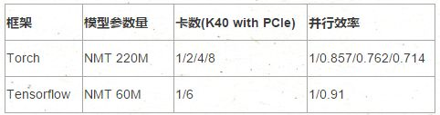

### 4.2.2 成本
#### 4.2.2.1 购买价格
* Nvidia
    NVIDIA TeslaV100 32G显存：80000
    NVIDIA TeslaV100 16G显存：60000
    NVIDIA TeslaP100 16G显存：40000
    NVIDIA Quadro P5000 16G显存：15000
* AMD
   S7150x2 16GB ：20000
   S7150 8GB :16000
* Intel
    intel京东上主要是将服务器打包在一起，不好进行对比
#### 4.2.2.2 功耗
功耗一直都是数据中心的的第一个成本，微软甚至在研究将数据中心沉入海底来降低功耗：
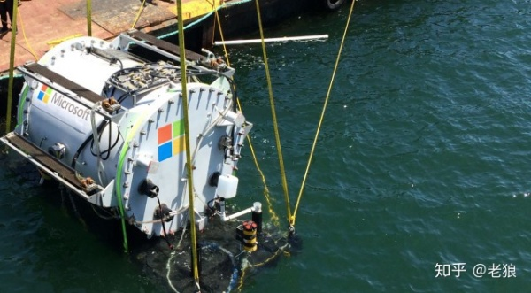
到底制冷所消耗的能源有多花钱呢？我们先来看一下服务器机架的总拥有成本（TCO）。TCO可以帮助我们了解服务器在购买和使用中整体的使用成本，有助于了解整体的花销，而不是仅仅购买时的短暂的肉痛。TCO包括三个构成： 投资成本、运营成本和能源成本。因为机架里面的服务器价格大不相同，我们刨去这部分的成本。据 IDC 统计，数据中心的平均使用年限为 9 年。然而 Gartner 的数据显示任何运营超过 7 年的设施都趋于陈旧。为了简化，假定使用年限为10年。一个典型的数据中心的TCO构成为：
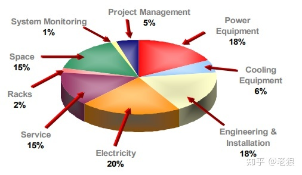
可以看出，电力能耗成本占据所有成本的20%！是数据中心主要的成本。

GPU计算性能比CPU性能高几十倍，同时GPU的能耗是CPU十几倍。比如
Intel Xeon E5-2690 120W，GFLOPS 243。也就是GFLOPS/w = 2.0。
GeForce GTX Titan X 250W，GFLOPS 6144。也就是GFLOPS/w = 24.6。
GPU功耗大，性能更是大得多。能效比10倍以上。
    
#### 4.2.2.3 利用率低
和CPU不同，CPU有着成熟的虚拟化方案，数据中心的CPU利用率相对很高。但是由于GPU没有很好的开源的虚拟化方案（NVIDIA有，但是闭源收费），一般GPU只能按照一颗一颗分割，利用率发挥不高。

## 4.3 GPU调度策略
就目前来看，云平台的业务场景非常复杂，各大巨头公司都有自己的一套调度策略，但是很少有专门针对GPU资源进行调度。开源的GPU调度策略大家页开始研究，就目前，Kubernetes最火热的是kube-batch调度策略，但是该调度策略比较简单，并且处于v0.6小版本，很少有企业愿意直接用该开源项目。

### 4.3.1 kube-batch开源调度策略
K8s本身的调度器具有一些缺陷：
（1） 默认的调度器是以 pod 为粒度的，对调度一组pod的任务很不利。
（2）默认的调度器无法提供队列调度的功能
Kube-batch 目前是 Kubernetes SIGs 旗下的一个孵化项目，是一个运行在 Kubernetes 上面向机器学习 / 大数据 /HPC 的批调度器（batch scheduler）。kubeflow中gang scheduler的实现就使用的是kube-batch.

#### 4.3.1.1 kube-batch 在Kubernetes集群中的定位
下图描述了Kubernetes集群中使用kube-batch的总体架构。下面这一层是kube-batch能看到的资源对象。上面一层是具体的一些应用调用kube-batch。
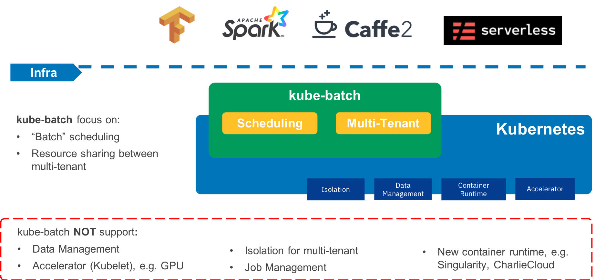

#### 4.3.1.2 kube-batch原理
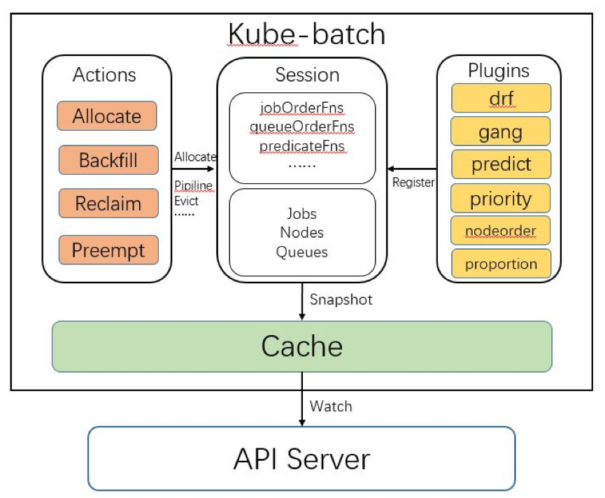
如上图所示，kube-batch 中有四个模块，分别是 Cache, Session, Plugin 和 Action。
* Cache 模块
Cache 模块封装了对 API Server 节点、容器等对象的数据同步逻辑。K8s 的数据保存在分布式存储 etcd 中，所有对数据的查询和操作都通过调用 API Server 接口，而非直接操作 etcd。在调度时，需要集群中节点和容器的使用资源和状态等信息。Cache 模块通过调用 K8s 的 sdk，通过 watch 机制监听集群中节点、容器的状态变化，将信息同步到自己的数据结构中。

Cache 模块还封装了对 API server 接口的调用。比如 Cache.Bind 接口，会调用 API Server 的 Bind 接口，将容器绑定到指定节点上。在 kube-batch 中，只有 cache 模块需要和 API Server 交互，其他模块只需要调用 Cache 模块接口。

* Session 模块
如图所示，Session 模块是将其他三个模块串联起来的模块。Kube-batch 在每个调度周期开始时，都会新建一个 Session 对象，这个 Session 初始化时会做以下操作：

    调用 Cache.Snapshot 接口，将 Cache 中节点、任务和队列信息拷贝一份副本，之后在这个调度周期中使用这份副本进行调度。因为 Cache 的数据会不断变化，为了保持同个调度周期中的数据一致性，在一开始就拷贝一份副本。

    将配置中的各个 plugin 初始化，然后调用 plugin 的 OnSessionOpen 接口。plugin 在 OnSessionOpen 中，会初始化自己需要的数据，并将一些回调函数注册到 session 中。Plugin 可以向 Session 中注册的函数是：

    jobOrderFns： 决定哪个训练任务优先被处理（调度、回收、抢占）。
    queueOrderFns：决定哪个训练队列优先被处理。
    taskOrderFns：决定任务中哪个容器优先被处理。
    predicateFns： 判断某个节点是否满足容器的基本调度要求。比如容器中指定的节点的标签。
    nodeOrderFns： 当多个节点满足容器的调度要求时，优先选择哪个节点。
    preemptableFns：  决定某个容器是否可以被抢占。
    reclaimableFns ：决定某个容器是否可以被回收。
    overusedFns： 决定某个队列使用的资源是否超过限额，是的话不再调度对队列中的任务。
    jobReadyFns：判断某个任务是否已经准备好，可以调用 API Server 的接口将任务的容器调度到节点。
    jobPipelinedFns ： 判断某个任务是否处于 Pipelined 状态。
    jobValidFns： 判断某个任务是否有效。
注意：plugin 不需要注册上面所有的函数，而是可以根据自己的需要，注册某几个函数。比如 Predict plugin 就只注册了 predicateFns 这个函数到 session 中。

初始化成功后，Kube-batch 会依次调用不同的 Action 的 Execute 方法，并将 Session 对象作为参数传入。在 Execute 中，会调用 session 的各种方法。这些方法，有些最终会调用到 Cache 的方法， 有些是调用 Plugin 注册的方法。
* Action 模块
Action 模块实现了具体的调度流程。现在有 4 个不同的 Action:

    Allocate: 这个 Action 负责将还未调度的设置了资源限制（request、Limit）的容器调度到节点上。
    Backfill: 这个 Action 负责将还未调度的的没设置资源限制的容器调度到节点上。
    Reclaim: 这个 Action 负责将任务中满足回收条件的容器删除。
    Preempt: 这个 Action 负责将任务中满足条件的容器抢占。

Action 实现了调度机制（mechanism），Plugin 实现了调度的不同策略（policy）。举个例子，在 Allocate 中，每次会从优先队列中找到一个容器进行调度，这是机制，是由 Action 决定的。而在优先队列中容器排序的策略，是调用了 session 的 TaskOrderFn 方法，这个方法会调用 Plugin 注册的方法，因此策略是由 Plugin 实现。这种机制和策略分离的软件设计，带来了很好的扩展性和灵活性。

* Plugin 模块
Plugin 模块提供了一种可插拔的方式，向调度提供不同的策略的实现。

如图所示，目前最新版本有 6 个 plugin，它们分别是:

    drf: ：实现了 Dominant Resouce Fairenss 算法，这个算法能够有效对多种资源（cpu、memory、gpu) 进行调度。
    gang：实现了 gang scheduling 的逻辑，即保证任务所需 worker 同时被启动。
    predict：判断某个节点是否满足容器的基本要求。
    priority： 根据容器和队列设置的 PriorityClass 决定容器和队列的优先级。
    node order：决定满足调度要求的节点中，哪个节点优先被选择。
    proportion： 根据队列设置的权重决定每个队列分配到的资源。


#### 4.3.1.3 目前使用kube-batch企业
* Kubeflow
* Volcano
* Baidu Inc
* Tusimple
* MOGU Inc
* Vivo


### 4.3.2 现有企业研究策略
#### 4.3.2.1 Vivo
https://www.infoq.cn/article/PH7xwdf-qAUE3yTADsrV
在使用kube-batch之前，每个团队都分配一定数量的物理机，有些团队的资源使用率不高，有些团队资源十分紧张。分布式训练任务需要同时在多台机器上将任务拉起，并且满足不同任务的资源需求，这需要一个成熟的调度系统。
后将将训练机器加入 k8s 集群。作为统一资源池，各任务都通过平台向 k8s 申请资源，由 k8s 将任务的各个 worker 调度到各个机器上并启动容器。为了进一步提高资源利用率，我们采用了批调度器 kube-batch。
为什么采用Kube-batch
K8s 的原生调度器会将需要启动的容器，放到优先队列（Priority Queue）里面，每次从队列里面取出容器，将其调度到一个节点上。 分布式训练需要所有 worker 都启动后，训练才能够开始进行。使用原生调度器，可能会出现以下问题：

    一个任务包含 10 个 worker, 但是集群资源只满足 9 个 worker。原生调度器会将任务的 9 个 worker 调度并启动，而最后一个 worker 一直无法启动。这样训练一直无法开始，9 个已经启动的 worker 资源就会被浪费。

    两个任务，各包含 10 个 worker, 集群资源只能启动 10 个 worker。两个任务分别有 5 个 worker 被启动，但两个任务都无法开始训练。10 个 worker 的资源被浪费了。

由此可见，原生调度器对于分布式训练的调度存在问题，影响了资源的利用率。而 k8s 社区提供了一个批调度器 kube-batch ， 它能够将一个训练任务的多个 worker 当做整体进行调度，只有当任务所有 worker 的资源都满足，才会将容器在节点上启动。这解决了上述问题，避免了任务间的资源死锁，提高了资源利用率。

kube-batch 还提供了队列机制，同个队列的任务会依次运行。不同队列直接可以设置优先级，优先级高的队列中的任务会优先得到调度。队列还可以设置权重，权重高的队列分配到的资源会更多。

# 5. 工作展望
从目前的现状来看，云端上针对GPU特点资源的调度基本上处于起步阶段，也没有成熟的可以使用的开源方案，业界内的GPU调度器基本上停留在PPT阶段。
GPU调度策略难以满足业内需求我认为主要有一下三点，一是起步晚，从github上的开源项目来看，kubeflow、kubebatch、tf-operator，pytorch-operator都是小版本，基本上刚刚突破版本0.5，一大堆PR都来不及解决。第二是技术门槛高，Kubernetes在国内真正兴起是在这几年，每年的云原生会议上基本上一半是在讲Kubernetes。但是Kubernetes本质上是对微服务提供支持的，并没有专门的去对GPU资源提供支持。因为分布式原因，Kubernetes本身复杂度就不亚于linux 内核，再加上GPU编程门槛限制，一般只有庞大的企业才有技术底蕴玩的起。最后是需求多样性，成熟的开源框架诞生之前总少不了争论，开源社区必须要权衡各方面的利弊还有满足竟可能多的要求，所以开发进度显得非常缓慢。
总的来说，GPU在云端上的调度有很多可以做的地方，只要有一定的技术背景，再加上一些真实需求，完全可以在一段时间内实现一个具有现实意义的云端调度器。

## 5.1 计划实现的功能
在实现具体的GPU调度，计划打算基于下面几点需求，一是实现gang schedule，第二是基于GPU拓扑感知调度，第三是实现弹性调度。
### 5.2.1 实现gang schedule
gang schedule 简单解释就是一组调度对象，要目全部被调度，要么一个也不被调度。这样的需求是基于现有的Kubernetes在GPU场景下的缺陷，Kubernetes调度器是只要看见资源就去占有并且不会互动的释放资源。这样带来的问题就是集群中很容易出现GPU资源需求大的任务阻塞GPU资源需求小的任务，甚至出现死锁的场景。
比如，我有两个任务A、B分别需要8,4个GPU，现在集群中有5个GPU，在默认调度策略下，如果任务A先被调度，那么A就会先占有5个GPU资源，并且一直等待其它资源被释放。这样任务B因为没有资源可以调度，就会一直处于阻塞任务。
### 5.2.2 实现GPU 拓扑感知调度
前面我们分析过NVIDIA 在不同GPU拓扑结构下通信的影响。目前没有任何开源GPU调度器会针对GPU拓扑进行调度，因此在我们调度策略中，可以将GPU拓扑结构考虑在内。
但是拓扑结构本身就是一个十分复杂的研究点，在规划中，不会针对拓扑网络做复杂的调度策略，可以只实现将一个任务竟可能的调度在一个节点上。
### 5.2.3 实现GPU资源弹性调度
弹性调度意思是根据当前集群资源现状区去动态增加或者减少使用的GPU资源。单行调度一方面是希望集群中竟可能能多的任务处于运行状态，而不是阻塞状态。另外一方面是希望竟可能提供集群中GPU资源利用率。
实现后的场景如下，我们可以定义一个任务使用使用的GPU资源最小值是4，最大GPU数量是8，当集群中GPU资源充足时，我们会将GPU为4的任务调整到GPU数量为8。反之，如果GPU资源不足，并且有任务处于阻塞状态，那么我们就将GPU数为8的任务缩小到GPU数为4.

## 5.2 主要工作
### 5.2.1 实现Wine在容器中使用GPU资源
前面调研发现，docker和Wine都支持使用GPU资源，将Wine运行在容器中从理论上来讲，是完全可以正常的使用GPU资源。
要实现这个过程，主要做的工作如下，一是实现docker 使用GPU资源，这个有现成的开源方案。而是Wine在容器中使用GPU资源，虽然Wine4.0官网已经明确说明Wine4.0是直接支持使用GPU资源，但是目前没有发现使用GPU资源的手册，是否直接使用GPU资源还需要进行测试。另外，我们需要图个使用GPU资源的Windows程序，为了在容器中测试方便，最好是没有图形界面，这几天已经在ubutu使用cuda10编写了一个使用GPU实现矩阵相乘程序，并且能正常使用GPU资源，还需要移植到Windows平台上。
因为缺少手册，难点有二，一是Wine是否是直接使用GPU资源，二是Wine能否直接使用docker中的GPU资源。
### 5.2.2 实现弹性调度的状态机
这里的状态机关键是要实现弹性调度的状态机，在分布式场景下，状态机会显得比较复杂，好在Kubernetes通过etcd为我们提供了一致性的保证，相对而言减少了我们的复杂度。
### 5.3.3 修改kube-batch部分调度策略
调度策略，还是基于kube-batch实现，应为kube-batch代码设计本身还是非常棒的，它将调度的机制和调度策略分开，强大的解耦能力能帮组我们重点实现自身的调度策略上。
