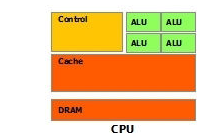
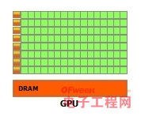

<!-- TOC -->

- [1. 背景](#1-背景)
- [2. CPU 简单介绍](#2-cpu-简单介绍)
- [3. GPU 简单介绍](#3-gpu-简单介绍)
- [4. GPU和CPU对比](#4-gpu和cpu对比)

<!-- /TOC -->
# 1. 背景

简单来说，GPU使用来应对简单计算的。CPU是进行逻辑控制的。

# 2. CPU 简单介绍

* 运算单元
* 缓存
* 存储
* 控制单元

CPU主要作用是逻辑控制，所以CPU逻辑结构非常复制。有非常多的时间实在逻辑判断上（流水线能力不能达到极限）。

# 3. GPU 简单介绍

* 绿色：计算单元
* 橙色：存储单元
* 橙黄色：逻辑控制单元

GPU流水线非常长，计算单元非常多，对简单计算能力非常强。

# 4. GPU和CPU对比

* GPU 运算逻辑单元多，非常多的核（一般都是几百个）
* GPU 线程非常多，但是缓存非常少，很多线程会访问相同数据，缓存会合并这些访问，然后再访问DRAM，不像CPU那样提高命中率
* GPU由于线程非常多，寄存器也很多
* GPU 主要是来进行简单计算，CPU主要是进行逻辑控制