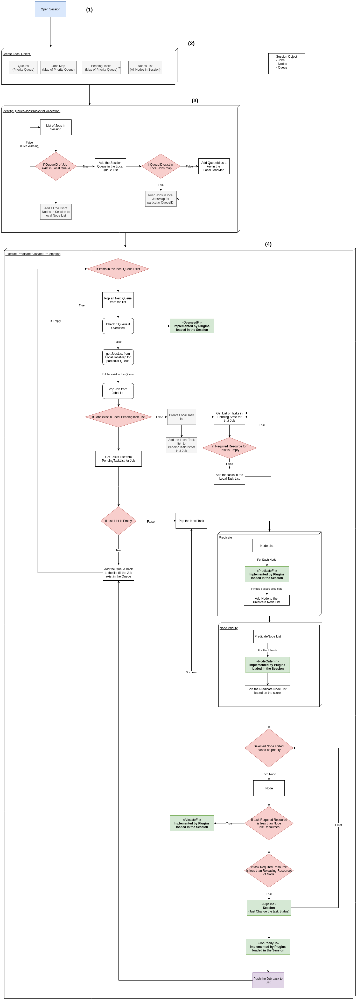

<!-- TOC -->

- [1. 背景](#1-背景)
- [2. 调度过程](#2-调度过程)
    - [2.1 create local object](#21-create-local-object)
    - [2.2 identify queues/jobs/tasks for allocation](#22-identify-queuesjobstasks-for-allocation)
    - [2.3 execute predicate/allocate/pre-emption](#23-execute-predicateallocatepre-emption)
        - [2.3.1 预处理](#231-预处理)
        - [2.3.2 predicate](#232-predicate)
        - [2.3.3 allocate](#233-allocate)
        - [2.3.4 pre-emption](#234-pre-emption)
- [3. 流程图如下](#3-流程图如下)
- [4. 疑惑的点](#4-疑惑的点)

<!-- /TOC -->

# 1. 背景
* kube-batch调度器工作的流程是什么
* 流程图中有很多重复判断，是为了在多任务下增强kube-batch健壮性，和之前写过的mpi-controller类似
* 注意pending、InQueue、Ready 三种状态切换

# 2. 调度过程
## 2.1 create local object
* kube-batch调度的四类资源
    * queues
    * jobs map
    * pending tasks
    * node list

## 2.2 identify queues/jobs/tasks for allocation
存在的数据结构
* queue list
* node list
* jobmaps,key是queueID，表示一个队列里面分配的job集合

核心过程
* 确认queueID在queue存在
* 添加job到jobmaps中

## 2.3 execute predicate/allocate/pre-emption
### 2.3.1 预处理
核心过程
* 在此确认queue存在
* 确认job在jobmaps中存在，如果不存在，创建job
* 确认job存在对应的pending task。显然，调度的基本单位是task，job存在多个task

### 2.3.2 predicate
核心过程
* predicateFn 过滤不满足task条件的node节点，返回predicate node list
* orderNodeFn 对所有的predicate node list进行优先级排序
* 选择最优的node节点

### 2.3.3 allocate
核心过程
* 再次确认选择的node节点满足task的资源要求
* allocateFn将任务分配在node节点上

### 2.3.4 pre-emption
核心过程
* 再次确认task 资源少于node节点剩余资源
* 改变task状态
* 加载task
* 循环下去，使job中的task调度完毕。

# 3. 流程图如下

# 4. 疑惑的点
* 没有创建queue重新分配queue资源过程（下面一节）
* 没有看到剔除task过程（下面一节）

