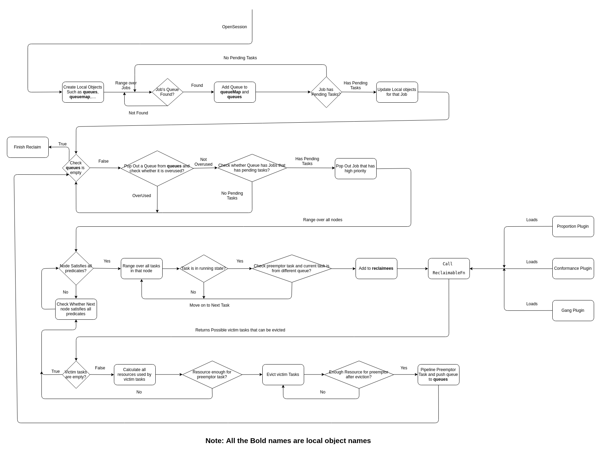

<!-- TOC -->

- [1. 背景](#1-背景)
- [2. reclaim过程](#2-reclaim过程)
    - [2.1 创建资源](#21-创建资源)
    - [2.2 遍历job，将job中queue入队](#22-遍历job将job中queue入队)
    - [2.3 遍历queue，挑选job中的preemptor task](#23-遍历queue挑选job中的preemptor-task)
    - [2.4 遍历node list，为preemptor task分配node](#24-遍历node-list为preemptor-task分配node)
    - [2.5 确定被抢占任务](#25-确定被抢占任务)
    - [2.6 再次确认选择的node是否满足要求](#26-再次确认选择的node是否满足要求)
    - [2.7 踢出被强占任务](#27-踢出被强占任务)
    - [2.8 循环执行](#28-循环执行)
- [3. 流程图如下](#3-流程图如下)

<!-- /TOC -->

# 1. 背景
* reclaim 是kube-batch非常重要的一个过程

# 2. reclaim过程
## 2.1 创建资源
* In every session, local copies of objects(queues, queueMap, preemptorsMap, preemptorTasks) are created.

## 2.2 遍历job，将job中queue入队
* 确认job的queue存在
* 确认pod no pending状态，如果有pending状态，更新job状态
* 将queue入队到queueMap

## 2.3 遍历queue，挑选job中的preemptor task
* 如果queue是空，reclaim过程结束
* 遍历queue确认queue没有被重复使用
* 遍历queue中的job，如果job中有pending状态，挑选出其中的preemptor task（优先task）

## 2.4 遍历node list，为preemptor task分配node
* 确定node满足preemptor task资源需求
* Range over all tasks running that node but from different queue other than preemptor task's queue and find all reclaimees tasks（确定可以被抢占的任务，抢占队列不在挑选的范围）
* 将preemptor task and set of reclaimees task作为参数传入ReclaimableFn（确定被抢占的任务）
## 2.5 确定被抢占任务
* ReclaimableFn returns all possible victim tasks that can be evicted
## 2.6 再次确认选择的node是否满足要求
* 如果该节点没有选出被抢占的任务，就选择下一个节点
* 确认该node节点剩余资源是否满足要求

## 2.7 踢出被强占任务
* resouce requirement of preemptor task is satisfied, then evict tasks from victim tasks one by one until preemptor task can be pipelined

## 2.8 循环执行
* Run this until queues object is empty

# 3. 流程图如下

