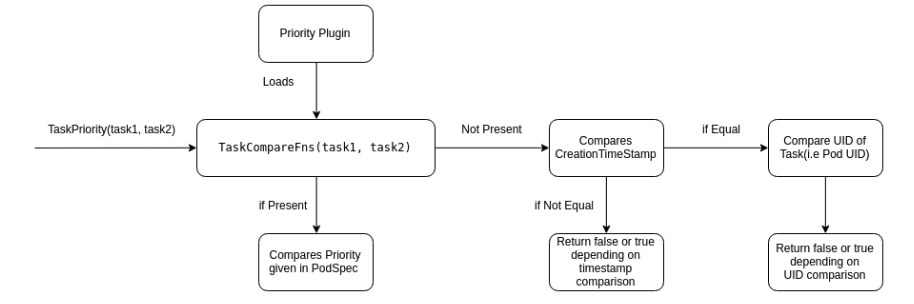
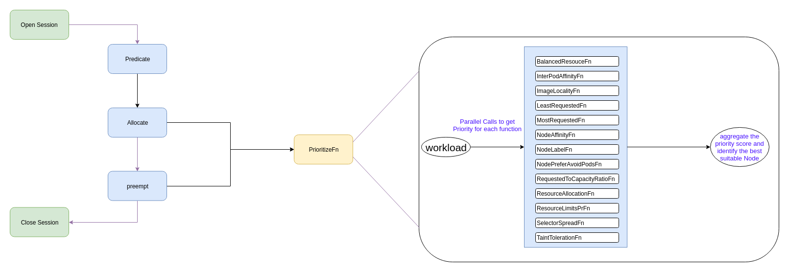
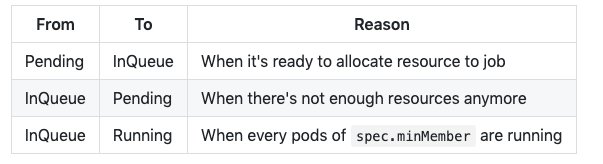

<!-- TOC -->

- [1. 背景](#1-背景)
- [2. 简单例子](#2-简单例子)
    - [2.1 Job优先级设置(优先级设置是在同一个队列)](#21-job优先级设置优先级设置是在同一个队列)
    - [2.2 不同队列如何资源分配（加权平均）](#22-不同队列如何资源分配加权平均)
- [3. action](#3-action)
    - [3.1 Reclaim](#31-reclaim)
        - [3.1.1 TaskOrderFn](#311-taskorderfn)
        - [3.1.2 JobOrderFn](#312-joborderfn)
        - [3.1.3 NodeOrderFn](#313-nodeorderfn)
        - [3.1.4 PredicateFn](#314-predicatefn)
        - [3.1.5 ReclaimableFn](#315-reclaimablefn)
    - [3.2 Preemption](#32-preemption)
        - [3.2.1 TaskOrderFn](#321-taskorderfn)
        - [3.2.2 JobOrderFn](#322-joborderfn)
        - [3.2.3 NodeOrderFn](#323-nodeorderfn)
        - [3.2.4 PredicateFn](#324-predicatefn)
        - [3.2.5 PreemptableFn](#325-preemptablefn)
- [4.plugins](#4plugins)
    - [4.1 Task Priority within Job](#41-task-priority-within-job)
    - [4.2 Node Priority in Kube-Batch](#42-node-priority-in-kube-batch)
- [5. Delay Pod Creation](#5-delay-pod-creation)
    - [5.1 Function Detail](#51-function-detail)
        - [5.1.1 State](#511-state)
        - [5.1.2 Action](#512-action)
        - [5.1.3 Admission Webhook](#513-admission-webhook)
    - [5.2 Feature interaction](#52-feature-interaction)
        - [5.2.1 Queue](#521-queue)
        - [5.2.2 Quota](#522-quota)
- [6.Dynamic Plugins Configuration](#6dynamic-plugins-configuration)
    - [6.1 Function Detail](#61-function-detail)
    - [6.2 Feature Interaction](#62-feature-interaction)
        - [6.2.1  ConfigMap](#621--configmap)
- [7. PodGroup Status Enhancement](#7-podgroup-status-enhancement)
- [8. monitor kube-batch](#8-monitor-kube-batch)

<!-- /TOC -->
# 1. 背景
* kube-batch作为调度使用

By default, scheduler will read following default configuraion as scheduler-conf
```
actions: "allocate, backfill"
tiers:
- plugins:
  - name: priority
  - name: gang
- plugins:
  - name: drf
  - name: predicates
  - name: proportion
  - name: nodeorder
```

* actions：is a list of actions that will be executed by kube-batch in order。In above example, allocate, backfill will be executed in order by kube-batch.

* plugins：is a list of plugins that will be used by related actions。
    * if it fit plugins in high priority tier, the action will not go through the plugins in lower priority tiers.（优先匹配上面的plugins策略）
    * In each tier, it's considered passed if all plugins are fitted in plugins.names.

* multiple tiers for plugins is introduced into kube-batch, high priority jobs will take all resources it need; if priority equal, shares resource by DRF.

Currently, kube-batch supports

* actions(调度器执行的动作)
    * allocate
    * backfill
    * preempt
    * reclaim
* plugins(调度器调度策略因数)
    * conformance
    * drf
    * gang
    * nodeorder
    * predicates
    * priority
    * proportion

# 2. 简单例子
```
apiVersion: batch/v1
kind: Job
metadata:
  name: qj-1
spec:
  backoffLimit: 6
  completions: 6
  parallelism: 6
  template:
    metadata:
      annotations:
        scheduling.k8s.io/group-name: qj-1
    spec:
      containers:
      - image: busybox
        imagePullPolicy: IfNotPresent
        name: busybox
        resources:
          requests:
            cpu: "1"
      restartPolicy: Never
      schedulerName: kube-batch
---
apiVersion: scheduling.incubator.k8s.io/v1alpha1
kind: PodGroup
metadata:
  name: qj-1
spec:
  minMember: 6
```
* The yaml file means a Job named qj-01 to create 6 pods(it is specified by parallelism), these pods will be scheduled by scheduler kube-batch
*  kube-batch will watch PodGroup, and the annotation scheduling.k8s.io/group-name identify which group the pod belongs to.
* kube-batch will start .spec.minMember pods for a Job at the same time

## 2.1 Job优先级设置(优先级设置是在同一个队列)
* kube-batch scheduler will start pods by their priority in the same QueueJob, pods with higher priority will start first.
* The pod in same Deployment/RS/Job share the same pod template, so they have the same PriorityClass. To specify a different PriorityClass for pods in same QueueJob, users need to create controllers by themselves.

```
apiVersion: scheduling.k8s.io/v1beta1
kind: PriorityClass
metadata:
  name: high-priority
value: 1000
```

```
apiVersion: v1
kind: Pod
metadata:
  name: pod-ns01-r01
spec:
  containers:
    - name: key-value-store
      image: redis
      resources:
        limits:
          memory: "1Gi"
          cpu: "1"
        requests:
          memory: "1Gi"
          cpu: "1"
      ports:
        - containerPort: 6379
  priorityClassName: high-priority
```

## 2.2 不同队列如何资源分配（加权平均）
* Proportion policy calculates usable resources for all nodes and allocate them to each Queue by Weight and requests according to max-min weighted faireness algorithm. 
    * 分配的是未使用的资源
    * 根据weight分配支援
    * 分配算法采用weight加权平均

```
SchedulerCache Snapshot information:
------------------    ------------------
| Node-1         |    | Node-2         |
|   cpu: 6       |    |   cpu: 3       |
|   memory: 15Gi |    |   memory: 12Gi |
------------------    ------------------
--------------------------    --------------------------
| Queue-1                |    | Queue-2                |
|   Weight: 2            |    |   Weight: 4            |
--------------------------    --------------------------

--------------------------    --------------------------       --------------------------
| PodGroup-1             |    | PodGroup-2             |       | PodGroup-3             |
|   cpu: 5               |    |   cpu: 4               |       |   cpu: 6               |
|   memory: 10           |    |   memory: 12           |       |   memory: 8            |
|   queue: Queue-1       |    |   queue: Queue-2       |       |   queue: QUeue-2       |
--------------------------    --------------------------       --------------------------

 After policy scheduling:
---------------------------    ---------------------------
| Queue-1                 |    | Queue-2                 |
|    Weight: 2            |    |    Weight: 4            |
|    Request: cpu=5       |    |    Request: cpu=10      |
|             memory=10Gi |    |             memory=20Gi |
|                         |    |                         |
|    Deserved:            |    |    Deserved:            |
|      cpu: 3             |    |      cpu: 6             |
|      memory: 9Gi        |    |      memory: 18Gi       |
---------------------------    ---------------------------
```

# 3. action
action 类型
* actions(调度器执行的动作)
    * allocate
    * backfill
    * preempt
    * reclaim


## 3.1 Reclaim
* Reclaim action comes into play when a new queue is created, and new job comes under that queue but there is no resource / less resource in cluster because of change of deserved share for previous present queues.
    * 新的queue创建需要分配资源，因此需要执行reclaim重新分配资源

* Reclaim is basically evicting tasks from other queues so that present queue can make use of it's entire deserved share for creating tasks.

* In Reclaim Action, there are multiple plugin functions that are getting used like,
    * TaskOrderFn(Plugin: Priority),
    * JobOrderFn(Plugin: Priority, DRF, Gang),
    * NodeOrderFn(Plugin: NodeOrder),
    * PredicateFn(Plugin: Predicates),
    * ReclaimableFn(Plugin: Conformance, Gang, Proportion).

### 3.1.1 TaskOrderFn
* Priority：Compares taskPriority set in PodSpec and returns the decision of comparison between two priorities.

### 3.1.2 JobOrderFn
* Priority：Compares jobPriority set in Spec(using PriorityClass) and returns the decision of comparison between two priorities.
* DRF:The job having the lowest share will have higher priority.
* Gang:The job which is not yet ready(i.e. minAvailable number of task is not yet in Bound, Binding, Running, Allocated, Succeeded, Pipelined state) will have high priority.
### 3.1.3 NodeOrderFn
* NodeOrder:NodeOrderFn returns the score of a particular node for a specific task by running through sets of priorities.
### 3.1.4 PredicateFn
* Predicates:PredicateFn returns whether a task can be bounded to a node or not by running through set of predicates.
### 3.1.5 ReclaimableFn
Checks whether a task can be evicted or not, which returns set of tasks that can be evicted so that new task can be created in new queue.
* Conformance:In conformance plugin, it checks whether a task is critical or running in kube-system namespace, so that it can be avoided while computing set of tasks that can be preempted.

* Gang:It checks whether by evicting a task, it affects gang scheduling in kube-batch. It checks whether by evicting particular task, total number of tasks running for a job is going to be less than the minAvailable requirement for gang scheduling requirement.

* It checks whether by evicting a task, that task's queue has allocated resource less than the deserved share. If so, that task is added as a victim task that can be evicted so that resource can be reclaimed.

## 3.2 Preemption

* Preempt action comes into play when a high priority task comes and there is no resource requested by that task is available in the cluster, then few of the tasks should be evicted so that new task will get resource to run.
    * 动作发生条件是高优先级任务进来，但是没有资源分配


* In preempt action, multiple plugin function are getting used like
    *  TaskOrderFn(Plugin: Priority),
    *  JobOrderFn(Plugin: Priority, DRF, Gang),
    *  NodeOrderFn(Plugin: NodeOrder),
    *  PredicateFn(Plugin: Predicates),
    *  PreemptableFn(Plugin: Conformance, Gang, DRF).


### 3.2.1 TaskOrderFn
* Priority:Compares taskPriority set in PodSpec and returns the decision of comparison between two priorities.
### 3.2.2 JobOrderFn
* Priority:Compares jobPriority set in Spec(using PriorityClass) and returns the decision of comparison between two priorities.
* DRF(dominant  resource fairness):The job having the lowest share will have higher priority.
* Gang:The job which is not yet ready(i.e. minAvailable number of task is not yet in Bound, Binding, Running, Allocated, Succeeded, Pipelined state) will have high priority.
### 3.2.3 NodeOrderFn
* NodeOrder:NodeOrderFn returns the score of a particular node for a specific task by running through sets of priorities.
### 3.2.4 PredicateFn
* Predicates:PredicateFn returns whether a task can be bounded to a node or not by running through set of predicates.
### 3.2.5 PreemptableFn
PreemptableFn:Checks whether a task can be preempted or not, which returns set of tasks that can be preempted so that new task can be deployed.

* Conformance:In conformance plugin, it checks whether a task is critical or running in kube-system namespace, so that it can be avoided while computing set of tasks that can be preempted.

* Gang:It checks whether by evicting a task, it affects gang scheduling in kube-batch. It checks whether by evicting particular task, total number of tasks running for a job is going to be less than the minAvailable requirement for gang scheduling requirement.

* DRF:The preemptor can only preempt other tasks only if the share of the preemptor is less than the share of the preemptee after recalculating the resource allocation of the premptor and preemptee.

# 4.plugins

## 4.1 Task Priority within Job
*  look into how Tasks within job are prioritized.

* Task priority in kube-batch is done by using either of following data
    * Task's Priority given in TaskSpec(i.e. PodSpec as defined in the YAML)
    * Task's Creation time
    * Task's UID


## 4.2 Node Priority in Kube-Batch
* A basic flow for the Node priority functions is depicted below


* Node Priority can be introduced in the current flow for Allocate and Preempt function. 
* where we can scheduled the workloads then flow will go through Prioritize function which will do the following things :
    * Run all the priority functions on all the list Nodes which is given by Predicate function in a parallel go-routine.
    * Score the Node based on whether the Priority Rule satisfies the Workload scheduling criteria.
    * Once the scores are returned from all the PriorityFn then aggregate the scoring and identify the Node with highest scoring.
    * Delegate this selected Node in last step to AllocateFn to Bind the workload to the Node.(绑定任务和node节点)


# 5. Delay Pod Creation
* For a batch system, there're always several pending jobs because of limited resources and throughput. 
* Different with other kubernetes type, e.g. Deployment, DaemonSet, it's better to delay pods creation for batch workload to reduce apiserver pressure and speed up scheduling(e.g. less pending pods to consider)

## 5.1 Function Detail
### 5.1.1 State
* A new state, named InQueue, will be introduced to denote the phase that jobs are ready to be allocated.


### 5.1.2 Action
* To support InQueue state, a new action, named enqueue, will be introduced.
* By default, enqueue action will handle PodGroups in FCFS policy; 
* enqueue will go through all PodGroup (by creation timestamp) and update PodGroup's phase to InQueue if:
  * there're enough idle resources for spec.minResources of PodGroup
  * there're enough quota for spec.minResources of PodGroup

* As kube-batch handling PodGroup by spec.minResources, the operator/controller may create more Pods than spec.minResources; in such case, preempt action will be enhanced to evict overused PodGroup to release resources.

### 5.1.3 Admission Webhook
* To guarantee the transaction of spec.minResources, a new MutatingAdmissionWebhook, named PodGroupMinResources, is introduced.
* PodGroupMinResources make sure
  * the summary of all PodGroups' spec.minResources in a namespace not more than Quota
  * if resources are reserved by spec.minResources, the resources can not be used by others


## 5.2 Feature interaction
### 5.2.1 Queue
* The resources will be shared between Queues algorithm, e.g. proportion by default. 
* If the resources can not be fully used because of fragment, backfill action will help on that.
* If Queue used more resources than its deserved, reclaim action will help to balance resources. 
* The Pod can not be evicted currently if eviction will break spec.minMember; it'll be enhanced for job level eviction.（只有job level才能被踢出queue，pod level不行） 

### 5.2.2 Quota
* To delay pod creation, both kube-batch and PodGroupMinResources will watch ResourceQuota to decide which PodGroup should be in queue firstly. 

* The decision maybe invalid because of race condition, e.g. other controllers create Pods. In such case, PodGroupMinResources will reject PodGroup creation and keep InQueue state until kube-batch transform it back to Pending. 

* To avoid race condition, it's better to let kube-batch manage Pod number and resources (e.g. CPU, memory) instead of Quota.（只有调度器管理的单位是resource单元，我们才能确定InQueue转化成pending还是running）


# 6.Dynamic Plugins Configuration
* There are several plugins and actions in kube-batch right now; the users may want to only enable part of plugins and actions. 
## 6.1 Function Detail
```
actions: "list_of_action_in_order"
tiers:
- plugins:
  - name: "plugin_1"
    disableJobOrder: true
  - name: "plugin_2"
- plugins:
  - name: "plugin_3"
    disableJobOrder: true
```
* The options defines the detail behaviour of each plugins, e.g. whether preemption is enabled. If not specific, true is default value. For now, preemptable, jobOrder, taskOrder are supported.

## 6.2 Feature Interaction
### 6.2.1  ConfigMap
kube-batch will read the plugin configuration from command line argument --scheduler-conf; user can use ConfigMap to acesss the volume of kube-batch pod during deployment.(配置信息通过configmap存放)


# 7. PodGroup Status Enhancement
* 不属于调度机制重点内容，主要是查看podgroup状态
* 参考：https://github.com/kubernetes-sigs/kube-batch/blob/master/doc/design/podgroup-status.md

# 8. monitor kube-batch
* 监控kube-batch,并且还没有实现
* 参考：https://github.com/kubernetes-sigs/kube-batch/blob/master/doc/design/metrics.md

