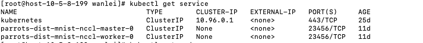

<!-- TOC -->

- [1. 问题描述](#1-问题描述)
- [2. 问题梳理](#2-问题梳理)
    - [2.1 该问题危害](#21-该问题危害)
- [3. 信息收集](#3-信息收集)
    - [3.1 getServer 过程涉及到Issue42639](#31-getserver-过程涉及到issue42639)
        - [3.1.1 kubernetes 垃圾回收](#311-kubernetes-垃圾回收)
            - [3.1.1.1 Owners and dependents](#3111-owners-and-dependents)
            - [3.1.1.2 Controlling how the garbage collector deletes dependents](#3112-controlling-how-the-garbage-collector-deletes-dependents)
        - [3.1.2 该Issue描述的主要问题](#312-该issue描述的主要问题)
        - [3.1.3 社区暂时解决方案](#313-社区暂时解决方案)
        - [3.1.4 ObservedGeneration 根本解决方案](#314-observedgeneration-根本解决方案)
        - [3.1.4 Adopt](#314-adopt)
- [4. 问题定位和分析](#4-问题定位和分析)
- [5. 扩展](#5-扩展)
    - [5.1 service 作用](#51-service-作用)
    - [5.2 打断点 为什么一段时间会崩掉](#52-打断点-为什么一段时间会崩掉)

<!-- /TOC -->
# 1. 问题描述
* controller.go 文件中 services, err := pc.GetServicesForJob(job) 获取service多次出现nil,但是PTJob对应的service应该是存在的
* 打断点定位到controllerRef := metav1.GetControllerOf(obj)，发现返回的经常是nil，Objec是service，预期是server 依赖于PTJob
* kubectl get service -o yaml发现service并没有ownReference内容，但是createServices函数使用了reference
* 打断点非常奇怪现象：第一次运行controller，所有的reference都有ownReference PTjob。第二次进入同步函数之后，所有的ownReference都是nil。尝试第三次进入，查看端点信息，controller崩溃退出。如果没有任何断点，debug会有大量的error：Error creating: services \"parrots-dist-mnist-nccl-master-0\" already exists"

# 2. 问题梳理
* 问什么kubectl get service -o yaml没有发现ownReference信息
* debug 打断点为什么会崩掉，不打端点为什么只是报错，没有崩掉
* 为甚第一次运行的时候，debug能看到ownReference，之后就看不到

## 2.1 该问题危害
* 影响pytorch-operator 的运行逻辑
* err导致每个pyjob都是出队之后立马入队，pyjob很多之后势必会影响性能

# 3. 信息收集
## 3.1 getServer 过程涉及到Issue42639
* Issue提出时间是Mar 7, 2017
https://github.com/kubernetes/kubernetes/issues/42639

### 3.1.1 kubernetes 垃圾回收
https://kubernetes.io/docs/concepts/workloads/controllers/garbage-collection/

* kubernetes 垃圾回收是删除原来有所有者，但是现在没有所有者的kubernetes 对象
* 在kubernetes1.8 以后，很多对象自动设置ownerReference的内容

#### 3.1.1.1 Owners and dependents
以replicaSet为例，replicaSet对象中包含多个pod。那么
* replicaSet是pod的Owner（所有者）
* pod是 replicaSet的从者

#### 3.1.1.2 Controlling how the garbage collector deletes dependents

* Deleting dependents automatically is called cascading deletion. （级联删除）
* There are two modes of cascading deletion: background and foreground（两种方式删除）
* If you delete an object without deleting its dependents automatically, the dependents are said to be orphaned.

* Foreground cascading deletion
    * Once the “deletion in progress” state is set, the garbage collector deletes the object’s dependents. Once the garbage collector has deleted all “blocking” dependents (objects with ownerReference.blockOwnerDeletion=true), it deletes the owner object.
    * Note that in the “foregroundDeletion”, only dependents with ownerReference.blockOwnerDeletion=true block the deletion of the owner object.
    * Kubernetes version 1.7 added an admission controller that controls user access to set blockOwnerDeletion to true based on delete permissions on the owner object, so that unauthorized dependents cannot delay deletion of an owner object.

* Background cascading deletion
    * In background cascading deletion, Kubernetes deletes the owner object immediately and the garbage collector then deletes the dependents in the background.
    * In Kubernetes 1.9, for all kinds in the apps/v1 group version, dependent objects are deleted by default.

### 3.1.2 该Issue描述的主要问题
The GC expects that once it sees a controller with a non-nil
DeletionTimestamp, that controller will not attempt any adoption.
There was a known race condition that could cause a controller to
re-adopt something orphaned by the GC, because the controller is using a
cached value of its own spec from before DeletionTimestamp was set.

我的理解如下：
* 当控制器对象出现删除时间戳时，垃圾回收机制希望控制器不要进行任何adoption dependent objects操作。（因为垃圾回收机制会orphaned dependent objects）
* 但是，控制器使用的是本地cache，在控制器cache同步到DeletionTimestamp之前，控制器会不断的re-adopt dependent objects，而垃圾回收会不停的orphaned dependent objects，这样垃圾回收机制和控制器造成了一种竞争。

### 3.1.3 社区暂时解决方案
This fixes that race by doing an uncached quorum read of the controller
spec just before the first adoption attempt. It's important that this
read occurs after listing potential orphans. Note that this uncached
read is skipped if no adoptions are attempted 

* 首先列出所有潜在的orphans dependent objects
* 在控制器第一次尝试adoption操作时通过非cache 仲裁方式读取字段
* 如果没有adoptions，uncached read操作是不会进行的

### 3.1.4 ObservedGeneration 根本解决方案
* 3.1.3 解决的方式比较简单，但是缺点是基本上行每一个控制器中都需要添加这部分代码，这显然有很强的代码侵入性
* 社区提出更加改进的方案是增加一个ObservedGeneration机制去同步owner和dependent controller
* 社区连接 https://github.com/kubernetes/kubernetes/issues/26120（还没有仔细分析）

### 3.1.4 Adopt
* 上文中多次提到Adopt操作，那么Adopt具体是什么呢？
* 源码连接：https://github.com/kubernetes/kubernetes/blob/master/pkg/controller/controller_ref_manager.go#L310

* Adopt操作分三步：
    * 一是判断dependent对象是否可以被Adopt
    * 而是生成patchBytes，内容是dependent object OwnReference内容
    * 最后是将OwnReference 内容添加到dependent object中
* Adopt就是添加OwnReference内容

# 4. 问题定位和分析
* 通过分析发现：ClaimServices 中controller service label和具体的server label中不匹配，所以执行match（）时总是会返回false
* 让match（）返回false，ClaimObject（）会relsease 掉 service 的Ownreference
* 不匹配的标签是ControllerNameLabel，这是因为tf-operator 最新版本新增了这个标签，pytorch-Operator 也增加了这个标签 https://github.com/kubeflow/tf-operator/issues/1066
* 查看createService源码，发现并没有任何问题
* delete ptjob，然后create，发现Service并没有删除。并且service是就旧版本service，因为新版本service label发生变化，并且worker不再有service

* 测试: 删除service，重新创建PTjon
    * 之前不停创建service错误不再出现，能正常获取service
    * 新的service label和社区同步
    * ownerReference：内容出现，由adopt函数实现
    * 删除PTJob，service被删除，说明0.7 版本server 和PTJob是向后级联删除

# 5. 扩展
## 5.1 service 作用
* service和ip通过label动态绑定
【原理】
## 5.2 打断点 为什么一段时间会崩掉
【待解决】

