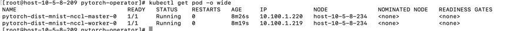
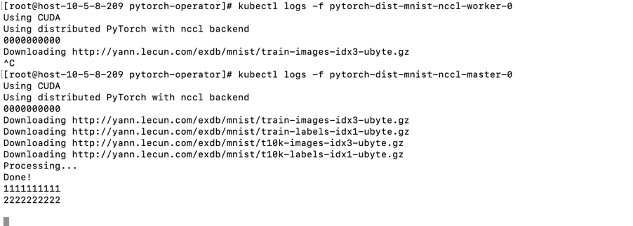
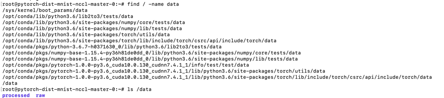
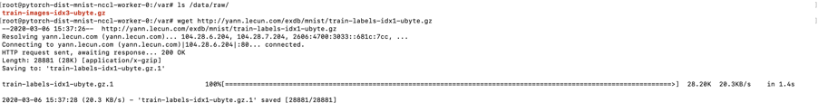
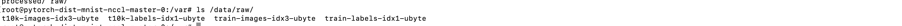

<!-- TOC -->

- [1. 问题描述](#1-问题描述)
    - [1.1 典型问题](#11-典型问题)
- [2. 问题分析](#2-问题分析)
    - [2.1 分析minis代码](#21-分析minis代码)
    - [2.2 问题推测](#22-问题推测)
        - [2.2.1 查看数据集](#221-查看数据集)
- [3. 问题解决](#3-问题解决)
- [4. 创建pytorh-job yaml文件样例](#4-创建pytorh-job-yaml文件样例)

<!-- /TOC -->

# 1. 问题描述
* pytorch-operator 0.7 版本复现mnist 训练
* 网络环境存在限制（github 龟速）
* 训练时而很快成功，时而长时间阻塞
* pod 越多，阻塞的概率越大

## 1.1 典型问题
* 2pod 任务长时间阻塞


# 2. 问题分析
* 出现问题时猜想主要问题应该在mnist训练代码上，因为pod running状态，并且有训练成功情况
## 2.1 分析minis代码
过程如下
* 判断参数是否使用cuda
* 判断是否是分布式训练
* 设置train_loader和test_loader，在线下载训练集
* 向GPU或cpu通信
* 如果是联合训练，就阻塞式等待数据同步
* 训练、测试
* 保存训练模型
```
def main():
.......
    if use_cuda:
        print('Using CUDA')

    writer = SummaryWriter(args.dir)

    torch.manual_seed(args.seed)

    device = torch.device("cuda" if use_cuda else "cpu")

    if should_distribute():
        print('Using distributed PyTorch with {} backend'.format(args.backend))
        dist.init_process_group(backend=args.backend)
    print("0000000000")
    kwargs = {'num_workers': 1, 'pin_memory': True} if use_cuda else {}
    train_loader = torch.utils.data.DataLoader(
        datasets.MNIST('./dataset', train=True, download=True,
                       transform=transforms.Compose([
                           transforms.ToTensor(),
                           transforms.Normalize((0.1307,), (0.3081,))
                       ])),
        batch_size=args.batch_size, shuffle=True, **kwargs)
    test_loader = torch.utils.data.DataLoader(
        datasets.MNIST('./dataset', train=False, transform=transforms.Compose([
                           transforms.ToTensor(),
                           transforms.Normalize((0.1307,), (0.3081,))
                       ])),
        batch_size=args.test_batch_size, shuffle=False, **kwargs)
    print("1111111111")
    model = Net().to(device)
    print("2222222222")

    if is_distributed():
        Distributor = nn.parallel.DistributedDataParallel if use_cuda \
            else nn.parallel.DistributedDataParallelCPU
        model = Distributor(model)

    optimizer = optim.SGD(model.parameters(), lr=args.lr, momentum=args.momentum)
    print("3333333333")
    for epoch in range(1, args.epochs + 1):
        train(args, model, device, train_loader, optimizer, epoch, writer)
        test(args, model, device, test_loader, writer, epoch)
    print("444444444444")
    if (args.save_model):
        torch.save(model.state_dict(),"mnist_cnn.pt")
    print("55555555555")
        
if __name__ == '__main__':
    main()

```
## 2.2 问题推测
* 根据1.1 问题和2.1 代码问题，我们猜想
* worker-0 pod 阻塞是因为download数据集出现问题
* master-0 pod 数据集下载完毕，但是因为等待work-0 同步导致训练阻塞
* 联合训练中，只要一个pod阻塞，导致所有pod阻塞

### 2.2.1 查看数据集
* 由于master-0 pod成功下载数据集，首先find到数据集路径
* 对比master pod，我们发现worker pod 数据集没有下载完毕
* 但是很奇怪我们使用wget很快就下载了数据集，不知道为什么代码下载那么慢，但是这不影响思路





# 3. 问题解决
* 解决基本思路是离线训练
* 修改mnist代码
    * 首先改变数据集路径
    * 然后download设置为False
* 重新build镜像，dataset是我们下载完毕的数据集
```
FROM pytorch/pytorch:1.0-cuda10.0-cudnn7-runtime

RUN pip install tensorboardX==1.6.0
WORKDIR /var
ADD mnist.py /var
ADD dataset /var/dataset

# ENTRYPOINT ["python", "/var/mnist.py"]
```
* 修改job.yaml，创建pytorch job

# 4. 创建pytorh-job yaml文件样例
```
apiVersion: "kubeflow.org/v1"
kind: "PyTorchJob"
metadata:
  name: "pytorch-dist-mnist-nccl"
spec:
  pytorchReplicaSpecs:
    Master:
      replicas: 1
      restartPolicy: OnFailure
      template:
        metadata:
          annotations:
            scheduling.k8s.io/group-name: "parrots-dist-mnist-nccl"
      template:
        schedulerName: sense-rubber
        spec:
          containers:
            - name: pytorch
              image: xiaoluwwwxiaolu/pytorch-operator-nccl:v1.1
              command: ["python"]
              args: ["/var/mnist.py","--backend", "nccl"]
              resources: 
                limits:
                  nvidia.com/gpu: 1
    Worker:
      replicas: 3
      restartPolicy: OnFailure
      template:
        metadata:
          annotations:
            scheduling.k8s.io/group-name: "parrots-dist-mnist-nccl"
      template:
        schedulerName: sense-rubber
        spec:
          containers: 
            - name: pytorch
              image: xiaoluwwwxiaolu/pytorch-operator-nccl:v1.1
              command: ["python"]
              args: ["/var/mnist.py","--backend", "nccl"]
              resources: 
                limits:
                  nvidia.com/gpu: 1
```


