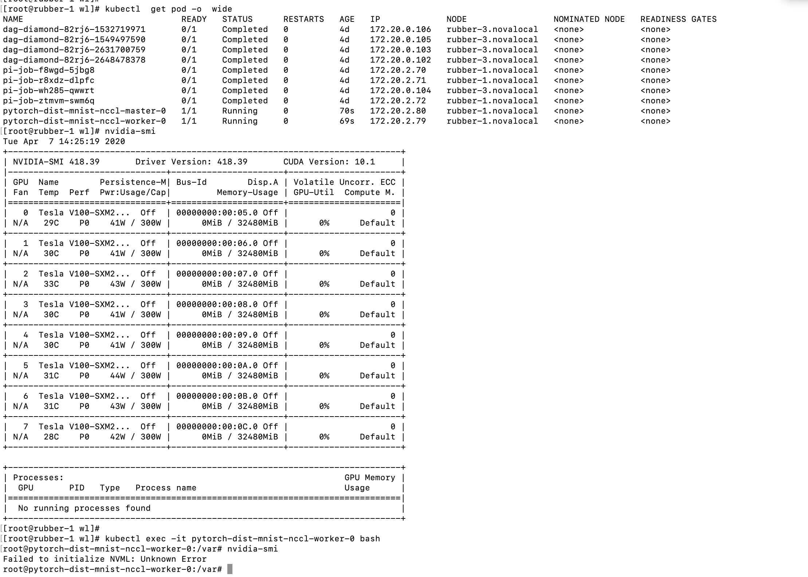

<!-- TOC -->

- [1. 问题描述](#1-问题描述)
    - [1.1 集群](#11-集群)
- [2. 问题分析](#2-问题分析)
    - [2.1 执行过程](#21-执行过程)
    - [2.2 对比gloo和nccl](#22-对比gloo和nccl)
    - [2.3 验证GPU问题](#23-验证gpu问题)

<!-- /TOC -->
# 1. 问题描述
* mnist example 在就集群是可以通过的，但是重新构建集群后发现训练失败

## 1.1 集群
* 分别操作过sense-rubber和pytorch-operator集群

# 2. 问题分析
## 2.1 执行过程
* sense-rubber集群在容器中执行import Torch失败（但是pytorch集群没出现问题）

* issue描述是mkl-dnn bug 导致pytorch 异常。解决方式是升级mkl-dnn或者pytorch
https://github.com/pytorch/pytorch/issues/16183

* 在pytorch集群执行同样的nccl job也异常

* 手动执行nccl，返现cuda device异常

* 查看cuda device，发现无可用的cuda device

## 2.2 对比gloo和nccl
gloo通信成功，但是nccl在执行nn.parallel.DistributedDataParallel同步时失败。
* gloo 主要支持cpu，nccl只支持gpu，因此我们认为GPU通信出现问题

## 2.3 验证GPU问题
* 显然在容器中执行nvml失败，不符合要求

* 同时在集群中没发现nvidia-docker

